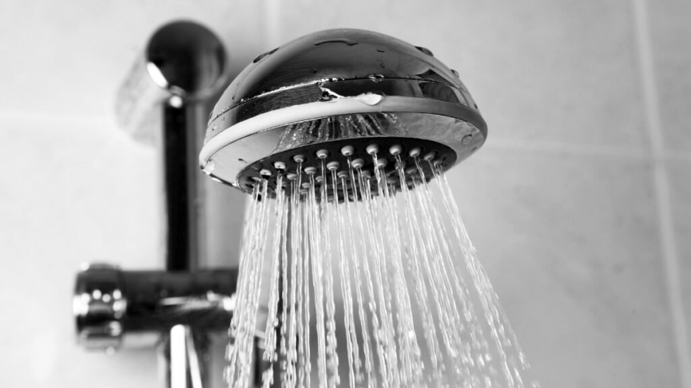

Não existe nada mais restaurador do que chegar em casa após um longo dia e se entregar a um banho quente, com pressão de água perfeita e temperatura constante. Se você ainda sofre com chuveiros que esfriam do nada ou que mal soltam água no inverno, o **aquecedor a gás** pode ser a peça que faltava para transformar seu banheiro em um verdadeiro spa particular.

Aqui no **Irenes**, acreditamos que esses detalhes tecnológicos são, na verdade, ferramentas de bem-estar. Vamos descobrir como escolher o melhor sistema para o seu refúgio?

## **Por que trocar o chuveiro elétrico pelo aquecedor a gás?**

A principal diferença está na **experiência**. Enquanto o chuveiro elétrico limita o volume de água para conseguir aquecê-la, o sistema a gás permite o uso de duchas potentes. Além disso:

-   **Economia na conta de luz:** O chuveiro elétrico é um dos maiores vilões da fatura de energia.
    
-   **Controle Preciso:** Você escolhe a temperatura exata (ex: 38°C) e ela se mantém do início ao fim.
    
-   **Durabilidade:** Um bom aquecedor, bem cuidado, dura muito mais que as resistências elétricas.

## **Digital ou Mecânico: Qual modelo escolher para sua rotina?**

Na hora de comprar, você encontrará dois tipos principais:

1.  **Aquecedores Digitais:** São os mais modernos e práticos. Você ajusta a temperatura no visor, e o aparelho modula a chama automaticamente. É a escolha ideal para quem busca o máximo de conforto e economia, pois ele gasta apenas o gás necessário.
    
2.  **Aquecedores Mecânicos:** São os modelos mais tradicionais, com botões de ajuste manual. Eles costumam ser mais em conta no investimento inicial, mas exigem que você controle a temperatura misturando água fria no registro, o que pode gerar um pequeno desperdício.

## **Segurança em Primeiro Lugar: O que você precisa saber**

Sabemos que o termo "gás" pode gerar insegurança, mas os aparelhos modernos são extremamente seguros se instalados corretamente. A paz no lar depende desse cuidado:

### **A importância da exaustão e ventilação**

Todo aquecedor precisa expelir os gases da combustão. Por isso, ele deve ser instalado em locais com ventilação permanente (geralmente a área de serviço) e possuir o duto de exaustão bem posicionado.

**Nota da Irene:** Nunca, em hipótese alguma, instale o aquecedor dentro do banheiro ou em locais sem circulação de ar. A sua segurança e a da sua família são prioridades inegociáveis.

## **Como calcular a capacidade ideal (Litros/Minuto)**

Para escolher o tamanho do aparelho, pense na sua casa:

-   **7 a 10 Litros:** Ideal para quem tem apenas um banheiro e usa uma ducha por vez.
    
-   **15 a 22 Litros:** Perfeito para apartamentos com dois banheiros onde os chuveiros podem ser usados ao mesmo tempo.
    
-   **Acima de 26 Litros:** Indicado para casas grandes, com várias duchas e até torneiras de cozinha aquecidas.

## **Manutenção Preventiva: O ritual de cuidado**

Assim como cuidamos da nossa pele e da organização da nossa casa, o aquecedor precisa de um "check-up" anual. A **manutenção preventiva** realizada por um técnico especializado em [conserto de aquecedor](https://www.consertodeaquecedor.net/), garante que o aparelho queime o gás de forma limpa (chama azul), evita odores e prolonga a vida útil do equipamento.

## **O banho como um ato de amor próprio**

Mudar para um aquecedor a gás não é apenas sobre hidráulica; é sobre investir no seu momento de desconexão. É poder lavar o cabelo com calma, relaxar os ombros cansados e sentir que sua casa abraça suas necessidades.

Se você busca um lar mais harmônico, funcional e cheio de conforto, olhar para o seu sistema de aquecimento é um excelente começo.

## **Comparativo: As Melhores Marcas de Aquecedor a Gás**

Escolher a marca certa é o primeiro passo para evitar manutenções frequentes que tiram a sua paz. Veja as principais opções no Brasil:

**MarcaPerfilDiferencialRinnaiPremium / Alta Durabilidade**Tecnologia japonesa. São conhecidos como os "tanques" do mercado pela longevidade e baixíssima necessidade de manutenção.**LorenzettiCusto-Benefício / Popular**Líder de mercado. É muito fácil encontrar peças de reposição e assistência técnica em qualquer lugar do Brasil.**KomecoDesign e Tecnologia**Marca brasileira com foco em inovação. Possuem modelos muito bonitos e compactos, ideais para apartamentos menores.**RheemEficiência Energética**Marca americana global. Destacam-se pela alta tecnologia de segurança e economia de gás acima da média.

## **Checklist: O que exigir ao contratar o Instalador**

A instalação de um aquecedor a gás envolve a segurança da sua família. Por isso, não se deixe levar apenas pelo menor preço. Use este guia de "Irene" para avaliar o profissional:

### **1\. Certificação e Norma Técnica**

-   [ ] O técnico possui certificação para trabalhar com gás?
    
-   [ ] Ele segue a norma **NBR 13103** (que dita as regras de instalação de aparelhos a gás no Brasil)?

### **2\. Materiais de Qualidade**

-   [ ] **Duto de Exaustão:** Exija que seja de alumínio corrugado e esteja bem fixado para levar os gases para fora de casa.
    
-   [ ] **Flexíveis de Água e Gás:** Devem ser de malha de aço ou cobre de alta qualidade. Evite plásticos ou materiais frágeis.
    
-   [ ] **Aro de Arremate:** Verifique se ele colocará o acabamento no furo da parede para evitar entrada de insetos ou vento.

### **3\. Testes de Segurança**

-   [ ] **Teste de Estanqueidade:** Ao finalizar, o técnico **precisa** testar se há vazamentos de gás usando uma solução espumante ou detector eletrônico.
    
-   [ ] **Teste de Temperatura:** Ele deve ligar os chuveiros simultaneamente para garantir que o aparelho está dando conta da demanda.

### **4\. Local de Instalação**

-   [ ] O local escolhido tem ventilação permanente (janelas que não fecham totalmente ou cobogós)?
    
-   [ ] O aparelho está longe de produtos inflamáveis?

## **Dica de Ouro da Irene:**

Na dúvida, entre no site da marca que você escolheu (Rinnai, Lorenzetti, etc.) e procure pela lista de **"Assistências Técnicas Autorizadas"**. Contratar alguém da rede oficial garante que a sua garantia de fábrica seja preservada e que o profissional conheça exatamente aquele modelo.
