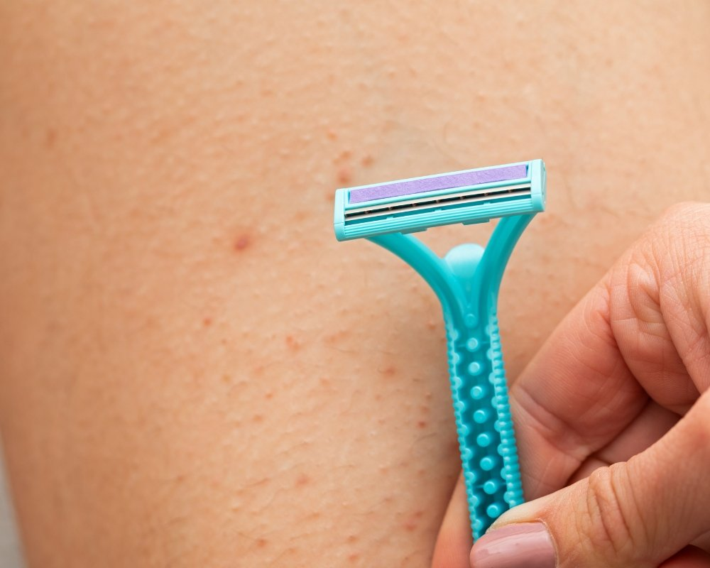

Já imaginou aliviar a coceira e reduzir aquelas bolinhas incômodas sem sair de casa? Sim, autocuidados bem simples e consistentes podem controlar a foliculite e acelerar a melhora: limpeza adequada, compressas mornas, evitar depilação ou barbear agressivo, não compartilhar objetos pessoais e usar calmantes naturais como babosa são medidas práticas que realmente funcionam.

Entender por que a foliculite aparece e reconhecer os sinais ajuda você a agir rápido e evitar piora ou contagio; nas próximas seções você vai aprender como aplicar cada uma dessas 5 dicas passo a passo, quando procurar um profissional e como prevenir recidivas para manter a pele mais saudável.

## 1\. Higiene e autocuidado diário: controle da pele para prevenir recidivas

Autocuidados para foliculite começam com uma rotina diária simples: limpeza suave, secagem cuidadosa e a escolha de produtos não comedogênicos. Curiosamente, pequenas atitudes diminuem a inflamação e ajudam a evitar novas lesões em peles mais sensíveis.

### Rotina prática que protege a pele todo dia

Lavar a área afetada com sabonete neutro duas vezes ao dia, sem esfregar, é a base. Deve-se usar toalhas limpas e reduzir o toque ao mínimo; isso limita a proliferação de Staphylococcus e outros microrganismos na superfície. Aplicar compressas mornas por 5–10 minutos, duas vezes ao dia, alivia a coceira e pode acelerar a drenagem quando a foliculite é superficial.

Secar bem a região e preferir roupas de algodão folgadas reduz fricção e irritação. Trocar roupas íntimas diariamente também ajuda. No caso de foliculite mais profunda, esses cuidados mantêm a pele menos propensa a novas lesões enquanto se aguarda avaliação médica. Por outro lado, evite produtos com fragrância, que muitas vezes provocam desconforto.

Higiene constante diminui chances de recidiva e facilita eficácia do tratamento adequado.

Pequenas mudanças no dia a dia previnem piora, aliviam o incômodo e preservam o bem-estar entre consultas; são hábitos simples, fáceis de incorporar e com impacto real na recuperação.

## 2\. Evitar depilação agressiva na região: técnicas e alternativas para a virilha e áreas sensíveis

A depilação agressiva costuma ser um gatilho frequente; optar por métodos menos traumáticos ajuda a preservar o folículo e reduz a chance de foliculite na virilha e em outras áreas sensíveis.

### Escolhas que protegem sem perder o resultado

Evitar lâminas comuns e cera quente na região da virilha diminui as microlesões que provocam inflamação, e por consequência, reduzem a probabilidade de o Staphylococcus aureus se aproveitar da pele comprometida. Uma alternativa simples é aparar com tesoura ou usar aparadores elétricos, que provocam menos dano; cremes depilatórios também podem ser testados, sempre antes em uma pequena área para checar reação.

Se a lâmina for a única opção, é importante hidratar bem a pele e trocar as lâminas com frequência para limitar a presença de bactérias. Curiosamente, procedimentos realizados por profissionais, como a depilação a laser, são indicados para quem sofre com foliculite recorrente, o tratamento adequado, sob orientação, costuma reduzir episódios de foliculite mais profundos ao longo do tempo. Após qualquer depilação, recomenda-se aplicar um antisséptico suave e evitar roupas muito justas por cerca de 24 horas para reduzir irritação e desconforto.

-   Aparador elétrico: menor trauma
    
-   Cremes depilatórios: testar antes
    
-   Laser: opção para recorrência

Em resumo, moderar a frequência das depilações e escolher técnicas menos agressivas protege os folículos e diminui a chance de novas lesões, por outro lado, cada pele reage de um jeito, então o acompanhamento especializado é sempre bem-vindo.

## 3\. Tratamentos tópicos e quando procurar o dermatologista: tratamento adequado e orientado

Tratamentos tópicos bem aplicados costumam aliviar os sintomas e controlar a infecção; curiosamente, saber quando é hora de buscar um dermatologista garante diagnóstico correto e o tratamento mais adequado para foliculite persistente.

### Quando o cuidado caseiro não basta

Em quadros leves de foliculite, produtos com peróxido de benzoíla ou clorexidina tendem a reduzir a carga bacteriana; cremes contendo ácido salicílico ajudam a desobstruir o folículo. Use conforme instrução e observe melhora em 5–7 dias. Evitar corticóides tópicos sem orientação é importante, pois eles podem mascarar a infecção.

Se a foliculite for profunda, aparecer uma lesão dolorosa, surgir febre ou houver recidiva frequente, é hora de procurar um dermatologista: pode ser necessário antibiótico oral, cultura para identificar Staphylococcus aureus ou terapias específicas. O especialista orienta sobre o tratamento mais eficaz e estratégias de prevenção a longo prazo para proteger a pele.

Melhora rápida em dias indica eficácia; ausência de resposta exige avaliação para tratar causas persistentes.

Combinar autocuidados tópicos com avaliação médica, por outro lado, garante controle mais seguro e redução do desconforto, além de diminuir o risco de complicações futuras.

## 4\. Identificar e manejar infecções por bactérias e fungos: Staphylococcus e outras causas microbianas

Distinguir se a foliculite tem origem bacteriana ou fúngica orienta o tipo de tratamento, pois **Staphylococcus** e microrganismos fúngicos pedem estratégias diferentes para curar e evitar recaídas.

### Como entender quem causa a lesão

Quando o agente é Staphylococcus aureus as lesões costumam aparecer como pústulas agrupadas e dolorosas; uma cultura da secreção confirma a presença da bactéria. Em geral, aplicam-se antibióticos tópicos ou orais conforme a gravidade e o perfil de resistência local, e enquanto isso a higiene adequada, compressas mornas e evitar mexer na área ajudam no alívio.

Já a foliculite de origem fúngica frequentemente provoca coceira e placas que podem expandir; muitos casos respondem bem a antifúngicos tópicos. Curiosamente, bactérias e fungos podem coexistir na mesma lesão, por isso às vezes é preciso combinar tratamentos, o que reforça a importância da avaliação clínica completa. Fatores como uso prévio de antibióticos, umidade persistente e fricção na região da virilha favorecem o desequilíbrio microbiano e facilitam essas infecções.

Cultura e exame clínico definem terapia específica para tratar agente correto e reduzir recidiva.

Identificar o agente possibilita direcionar a terapia com precisão, reduzir a inflamação e preservar a saúde da pele, além de diminuir o risco de novos surtos no futuro.

## 5\. Estratégias de prevenção a longo prazo: hábitos, roupas e medidas que melhoram o bem-estar

Prevenir novas crises passa por hábitos duradouros: escolher roupas adequadas, cuidar da higiene de forma estratégica e ajustar pequenos detalhes do cotidiano para proteger os folículos e melhorar o bem-estar geral.

### Pequenas atitudes, grande impacto

Prefere-se roupas íntimas de algodão e tecidos que permitam a pele respirar; por outro lado, evitar permanecer com peças molhadas por longos períodos é essencial. Trocar a roupa após exercício físico reduz a umidade local e o risco de irritação, e lavar as peças com água quente quando há lesões ajuda a eliminar microrganismos.

Controlar o peso, diminuir o atrito nas áreas sensíveis e manter a pele seca são medidas simples que reduzem a chance de foliculite profunda e outras lesões recorrentes. Curiosamente, ajustes pequenos, como escolher tecidos mais soltos, podem ter impacto significativo ao longo do tempo.

Incluir autocuidado na rotina faz diferença: hidratação leve da pele, esfoliação suave uma vez por semana e evitar cremes oclusivos na virilha são recomendações úteis. Para quem experimenta episódios frequentes, é aconselhável consultar um dermatologista, para avaliar medidas adicionais e discutir tratamentos preventivos quando necessário.

Consistência nas medidas de prevenção reduz recidivas e melhora bem-estar a longo prazo.

-   Tecido respirável
    
-   Trocar após exercício
    
-   Higiene suave

Adotar hábitos simples protege os folículos, reduz irritação e contribui para menos episódios ao longo do tempo, e manter essa disciplina é o que garante resultados mais duradouros.

## Conclusão

Autocuidados para foliculite reúnem higiene adequada, escolhas menos agressivas na depilação, tratamentos tópicos e medidas preventivas de longo prazo para reduzir sintomas, lesões e desconforto de modo prático e sustentável.

Rotinas diárias simples, como limpeza gentil e técnicas de depilação que diminuem a fricção, já baixam bastante a frequência das lesões; curioso é que pequenas mudanças trazem resultados visíveis em poucas semanas.

É importante diferenciar causas bacterianas, por exemplo Staphylococcus aureus, de infecções fúngicas, porque o tratamento correto evita progressão para foliculite profunda e complicações maiores.

Quando as medidas caseiras não apresentam melhora, a orientação de um dermatologista garante terapias adequadas e estratégias personalizadas, e assim o quadro é tratado de forma mais eficiente.

A combinação de autocuidado e orientação médica é chave para prevenir recidivas e proteger a pele.

Por fim, acompanhar sinais de alerta, manter hábitos que minimizam irritação e seguir as recomendações de cuidados melhora bastante o bem-estar; ao perceber piora ou retorno das lesões consulte um especialista sem demora.

## Perguntas Frequentes

### O que são autocuidados para foliculite e por que eles ajudam?

Autocuidados para foliculite são medidas simples que a pessoa pode adotar em casa para aliviar a inflamação dos folículos capilares, reduzir desconforto e acelerar a cicatrização. Essas práticas incluem higiene adequada, compressas mornas e evitar fricção na área afetada.

Eles ajudam porque controlam fatores que pioram a foliculite, como acúmulo de sujeira, suor e irritação por roupas, e diminuem a chance de infecção secundária. Caso os sintomas piorem ou persistam, é recomendado buscar avaliação médica para tratamento com antibióticos tópicos ou orais.

### Quais são as 5 dicas de autocuidados mais eficazes para foliculite?

As cinco dicas mais eficazes incluem: manter a área limpa com sabonete neutro, aplicar compressas mornas por 10–15 minutos várias vezes ao dia, evitar depilação e roupas apertadas, usar hidratantes leves sem óleo e não espremer as lesões. Essas medidas reduzem inflamação e irritação.

Complementar com produtos com ação anti-inflamatória suave ou tópicos prescritos por um médico pode ser necessário em casos persistentes. Se houver pus, dor intensa ou febre, procurar atendimento médico é fundamental.

### Como cuidar da higiene sem irritar a pele com foliculite?

Manter a pele limpa com sabonetes suaves e água morna é essencial; evitar esfregar com força ou usar esfoliantes agressivos que podem agravar a inflamação. Secar a área com batidinhas e escolher roupas de algodão que permitam ventilação ajuda a reduzir suor e fricção.

Também é recomendado trocar toalhas e roupas íntimas com frequência e evitar compartilhar objetos pessoais. Em ambientes de suor intenso, tomar banho logo após a atividade física diminui o risco de piora da foliculite.

### Quando os autocuidados para foliculite não são suficientes e é preciso procurar um médico?

Deve-se procurar um médico se as lesões não melhorarem após uma semana de autocuidados, se houver aumento de dor, presença de pus abundante, febre ou caroços grandes e dolorosos. Esses sinais podem indicar infecção mais profunda que exige tratamento com antibióticos ou drenagem.

Pacientes com diabetes, sistema imunológico comprometido ou episódios recorrentes de foliculite devem buscar avaliação precoce, pois têm maior risco de complicações e podem necessitar de terapias específicas.

### É seguro usar remédios caseiros ou óleos para tratar foliculite?

Alguns remédios caseiros suaves, como compressas mornas e limpeza com soluções salinas, podem ser úteis para aliviar sintomas. Óleos essenciais (por exemplo, óleo de tea tree) têm propriedades antimicrobianas, mas podem causar alergia ou irritação em peles sensíveis, por isso devem ser usados com cautela e diluídos.

É importante evitar remédios que aumentem oleosidade ou obstruam os poros. Em caso de dúvida, consultar um dermatologista evita tratamentos ineficazes ou lesões agravadas por uso indevido de produtos caseiros.

### Como prevenir recidivas de foliculite após os primeiros cuidados?

Prevenção inclui manter boa higiene, evitar depilar a área afetada até a recuperação completa, usar roupas folgadas e trocar regularmente roupas de ginástica e toalhas. Hidratar a pele com produtos não [comedogênicos](https://www.laroche-posay.pt/article/o-que-significa-comedogenico) e evitar cremes muito oleosos reduz a obstrução dos folículos.

Para quem tem episódios recorrentes, mudanças como melhorar o controle glicêmico (em diabéticos), revisar medicamentos que podem influenciar a pele e consultar um dermatologista para opções preventivas, como antibióticos tópicos intermitentes ou tratamentos a laser, podem ser recomendadas.

