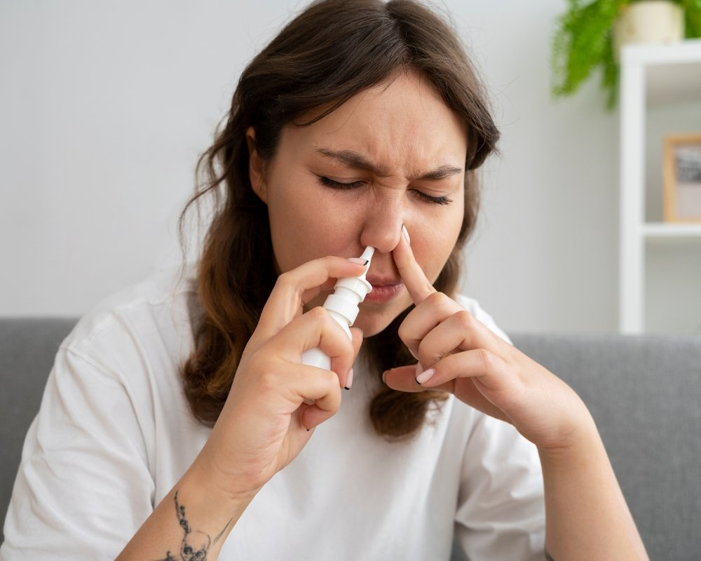

## Um guia didático de autocuidados para sinusite, explicando por que cada método alivia os sintomas e quais sinais exigem atendimento médico

Se a congestão nasal, a pressão no rosto e a dor de cabeça não dão trégua, apostar em **autocuidados para sinusite** pode ser a diferença entre um dia produtivo e um dia arrastado. Neste guia reunimos **tratamentos naturais e domésticos para sinusite** com explicações simples sobre o *mecanismo de ação* de cada estratégia, além de sinais de alerta para procurar ajuda médica. O objetivo é oferecer um roteiro confiável e acolhedor para aliviar os sintomas de forma segura. A sinusite, também chamada de rinossinusite, costuma surgir após resfriados, alergias ou exposição a irritantes. A mucosa dos **seios da face** inflama, produz mais muco e os canais de drenagem incham, o que dificulta a ventilação. O resultado é sensação de peso facial, nariz entupido, secreção e cansaço. Entender isso ajuda a escolher os melhores autocuidados.

### Sinusite em linguagem clara, por que a congestão aperta e o rosto dói

Quando vírus, alérgenos ou poluentes irritam o revestimento nasal, os cílios que varrem o muco ficam lentos e a passagem das secreções trava. O muco espesso se acumula nos seios da face, a pressão interna aumenta e surgem a dor facial e a cefaleia. O ar seco piora a inflamação, já a umidade adequada e a lavagem com **soro fisiológico** favorecem a drenagem e reduzem o inchaço. Por isso, os **autocuidados para sinusite** mais eficazes são os que **diluem o muco**, **reidratam a mucosa** e **desobstruem as vias de drenagem**. A meta é criar um ambiente nas cavidades nasais que facilite o trabalho do corpo, reduzindo a pressão e a dor.

### Autocuidados que funcionam, como fazer e por que ajudam

**Irrigação nasal com soro fisiológico 0,9%**: é a base dos **tratamentos naturais e domésticos para sinusite**. O soro lava alérgenos e partículas, reduz mediadores inflamatórios e melhora o batimento ciliar, facilitando a saída do muco. Na prática, use **soro estéril** ou **água fervida e resfriada** com sal na concentração correta, duas a três vezes ao dia. Incline a cabeça, injete suavemente em uma narina e deixe sair pela outra. A solução pode estar levemente morna para maior conforto. **Inalação de vapor**: o vapor hidrata a mucosa, **fluidifica o muco** e diminui a sensação de entupimento. Faça banho morno com vapor ou respire o vapor de uma tigela de água quente por 10 minutos, mantendo distância segura para evitar queimaduras. Se usar nebulizador, a nebulização com soro ajuda a hidratar sem medicamentos. Evite óleos essenciais concentrados, que podem irritar e não devem ser usados em crianças sem orientação. **Compressas mornas no rosto**: o calor local promove vasodilatação, diminui a pressão nos seios da face e alivia a dor. Aplique sobre a testa e as bochechas por 10 a 15 minutos, três a quatro vezes ao dia. O efeito é analgésico e relaxante, especialmente quando combinado com irrigação nasal. **Hidratação e umidade do ar**: beber água ao longo do dia torna o muco menos viscoso, o que facilita a drenagem. Em casa, umidificadores podem manter a umidade entre **40% e 60%**, patamar que reduz a irritação sem favorecer mofo. Limpe o aparelho com frequência. Chás quentes como gengibre ou camomila confortam, e o **mel** pode aliviar a irritação da garganta, porém não deve ser oferecido a crianças menores de um ano. **Sono e posição**: dormir com a cabeça um pouco elevada auxilia a drenagem, reduz o acúmulo de secreções e melhora a respiração noturna. Priorize descanso, já que o corpo se recupera melhor com sono adequado. **Evitar irritantes**: fumaça de cigarro, perfumes fortes e poeira agravam a inflamação. Ventile os ambientes, faça limpeza úmida e lave as mãos com frequência para reduzir vírus e alérgenos. Quem tem rinite se beneficia do controle de pó e ácaros no quarto. **Sprays nasais e descongestionantes**: soluções salinas isotônicas ou hipertônicas ajudam a desobstruir. Descongestionantes vasoconstritores tópicos proporcionam alívio rápido, porém o uso deve ser *curto*, por até três dias, devido ao risco de rinite medicamentosa. Sprays com corticoide intranasal podem ser úteis em casos alérgicos, mas o uso ideal é com orientação médica.

### Quando parar o caseiro e procurar atendimento

Os **autocuidados para sinusite** são seguros para quadros leves a moderados, mas alguns sinais pedem avaliação clínica. Procure um médico se os sintomas durarem mais de **10 dias** sem melhora, se houver piora após uma melhora inicial, febre alta persistente, dor facial intensa ou assimétrica, secreção espessa com mau cheiro por vários dias ou dor de dente superior que não passa. Outros alertas incluem inchaço ao redor dos olhos, alteração visual, rigidez de nuca, confusão, vômitos recorrentes, sangramento nasal frequente, crises de asma ou se você tem condições que aumentam o risco de complicações, como gestação, imunossupressão ou doenças pulmonares. Crianças pequenas devem ser avaliadas mais cedo. Em casos suspeitos de infecção bacteriana, apenas o profissional de saúde pode indicar antibiótico. Para o dia a dia, combinar **irrigação nasal**, **vapor**, **compressa morna**, **hidratação** e controle de irritantes compõe um plano sólido de **tratamentos naturais e domésticos para sinusite**. Com constância, esses cuidados reduzem a pressão nos seios da face, melhoram a respiração e aumentam o conforto, enquanto você monitora sinais que indiquem a necessidade de atendimento médico.

## Conclusão

O guia de autocuidados para sinusite oferece um **roteiro prático e seguro** para aliviar a congestão, a pressão facial e a dor de cabeça, que são sintomas resultantes da inflamação da mucosa e do acúmulo de muco nos seios da face. A chave para o alívio está em estratégias que visam **diluir o muco, hidratar a mucosa e desobstruir as vias de drenagem**. Os métodos mais eficazes incluem a [**irrigação nasal com soro fisiológico**](https://www.cuf.pt/mais-saude/como-fazer-corretamente-uma-lavagem-nasal) (a base do tratamento), a **inalação de vapor**, as **compressas mornas** e a **hidratação sistêmica**, combinados com o controle de irritantes e a elevação da cabeça ao dormir. Adotar esses **tratamentos naturais e domésticos para sinusite** de forma consistente reduz a pressão e melhora a respiração. É fundamental, contudo, manter a atenção aos **sinais de alerta** que exigem avaliação médica, como sintomas que persistem por mais de 10 dias, febre alta, dor intensa ou assimétrica, piora após melhora inicial, ou complicações como inchaço nos olhos. A combinação de autocuidado atento e monitoramento responsável garante um manejo eficaz e seguro da rinossinusite.
