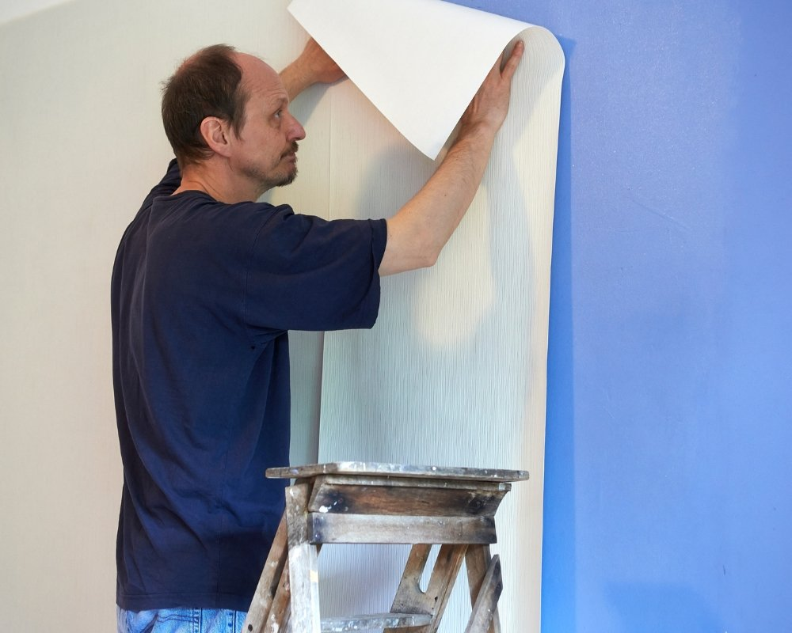
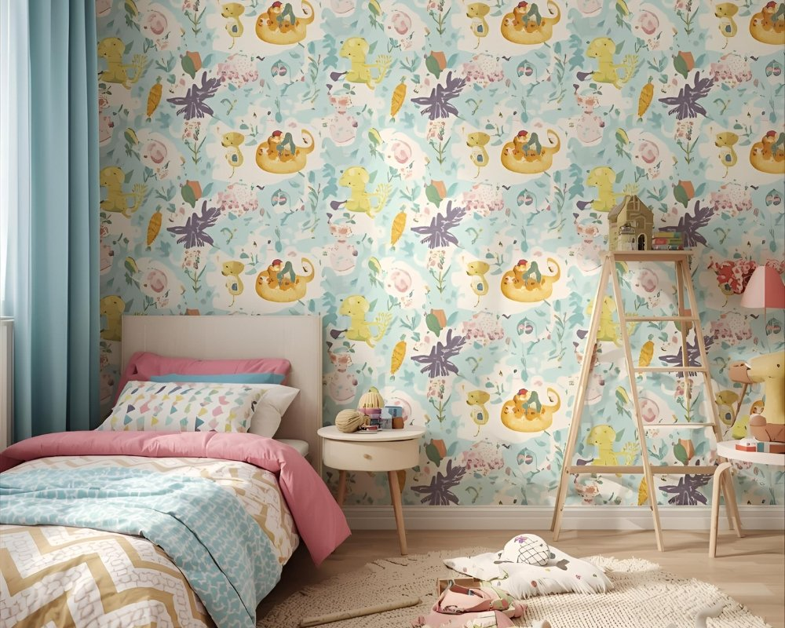

Quer transformar uma parede sem esforço em poucos minutos e sem bagunça? Aplicar papel de parede adesivo é simples: limpe bem a superfície, posicione e fixe a peça removendo a película enquanto alisa com uma espátula, e faça os acabamentos em cantos e encontros para um resultado profissional, tudo em 3 passos. Esse processo reduz retrabalhos, evita bolhas e garante que o padrão fique alinhado; nas próximas seções você verá exatamente como preparar a parede, quais ferramentas usar e truques práticos para aplicar cada faixa e resolver problemas comuns em cantos, texturas e junções.

## 1\. Preparação da superfície: Limpeza, verificação e escolha do material

Antes de aplicar o papel de parede adesivo, convém preparar bem a área: limpar, secar e avaliar se a parede é lisa ou tem textura. Esse cuidado inicial evita bolhas e problemas com umidade que podem comprometer a instalação.

### Início sem surpresas: limpeza e checagem rápida

Começa-se limpando com um pano úmido para tirar poeira, gordura e resíduos de cola ou fitas antigas; em seguida, inspeciona-se a superfície em busca de umidade, trincas ou azulejos soltos. Paredes úmidas precisam secar totalmente antes de aplicar o produto, caso contrário, a aderência será prejudicada. Para cozinhas e banheiros, por outro lado, é mais prudente escolher papéis e materiais com impressão digital impermeável, curiosamente isso faz diferença na durabilidade. Escolha o material pensando na textura: parede lisa geralmente aceita o adesivo direto, já superfícies porosas pedem um selante antes da aplicação. Meça a área com atenção e compare com o rendimento informado pelo fabricante para não comprar menos do que o necessário. Uma dica prática: teste um pequeno pedaço primeiro, assim confirma-se o acabamento e a cor antes da instalação definitiva.

### Verificar umidade e textura salva tempo: papel aplicado sobre umidade falhará mesmo com produto de qualidade.

-   Limpeza com pano úmido
-   Verificação de umidade
-   Selante para superfícies porosas
-   Medir antes de comprar

Preparar corretamente garante um acabamento firme e duradouro; atenção agora evita retrabalho caro e aborrecimentos com conserto.

## 2\. Corte e posicionamento: Medição, alinhamento e técnicas para evitar bolhas

 O segundo passo para aplicar papel de parede adesivo envolve cortar e posicionar com cuidado: é preciso medir, marcar e alinhar os padrões antes de colar, assim garante-se um acabamento liso e sem bolhas. Primeiro, marque a parede com o nível e use uma régua para alinhar o painel inicial; este é crucial para toda a instalação. Corte com cerca de 3 cm a mais nas extremidades para poder ajustar em cantos ou ao redor de móveis. Em papéis estampados, por outro lado, atenção à correspondência de padrões, repita o traçado antes de cortar o rolo seguinte pra não errar. Ao posicionar, retire parte do liner e cole do topo para baixo, alisando com uma espátula macia em movimentos firmes para expulsar o ar. Evite puxar demais o material; caso apareça uma bolha, levante suavemente e reaplique. Curiosamente, um pequeno furo com agulha funciona bem pra liberar o ar e depois basta pressionar com pano úmido. Medição precisa e técnica no posicionamento reduzem desperdício de material; um corte bem feito e o alinhamento correto fazem com que o papel pareça aplicado por profissional. Se algo não ficou perfeito, pode-se ajustar antes que a cola seque totalmente, assim diminui retrabalho mais tarde.

## 3\. Aplicação e acabamento: Colagem, alisamento e cuidados finais

No terceiro passo, a recomendação é focar na colagem contínua e no acabamento cuidadoso ao redor de janelas, azulejos e móveis, para que o resultado fique realmente limpo e integrado ao ambiente. Curiosamente, pequenas atenções nessa etapa fazem grande diferença no visual final. Avance colando aos poucos, retirando o liner em seções e alisando com uma espátula para minimizar bolhas. Deve-se cortar o excesso com estilete e régua metálica junto a rodapés e cantos; para áreas atrás de móveis, meça as aberturas e deixe uma folga mínima, nossos testes indicam que 5 mm a mais facilita o ajuste sem comprometer o acabamento. Se for necessário reposicionar, levante delicadamente a borda e reaplique, evitando puxões bruscos. O acabamento em torno de azulejos pede atenção extra: use selante para vedar as bordas contra umidade e proteger as emendas. Limpe resíduos imediatamente com pano úmido e, depois, pressione com um rolo macio para garantir aderência total. Em papéis infantis, por outro lado, é preferível escolher versões laváveis; essa escolha aumenta a durabilidade e reduz riscos de descolamento precoce. Alisar e selar são passos que asseguram um aspecto profissional; poucos cuidados finais, como limpeza com pano úmido e aplicação de selante onde necessário, ajudam a evitar problemas futuros e a preservar o papel por mais tempo.

## Conclusão

Seguir os três passos, preparação, corte e posicionamento, e aplicação com acabamento, facilita bastante o aprendizado sobre como aplicar papel de parede adesivo, proporcionando um resultado com aparência profissional e sem sustos no final. Na fase de preparação, recomenda-se limpar a superfície com pano úmido e corrigir imperfeições com selante quando necessário; isso previne problemas decorrentes de umidade ou texturas irregulares. Curiosamente, uma superfície bem tratada reduz muito a chance de bolhas ou descolamentos posteriores, então vale caprichar aqui. Durante o corte e o posicionamento, a medição precisa é essencial e um bom alinhamento do primeiro painel faz toda a diferença; quem aplica deve checar o nível e marcar guias antes de colar. Por outro lado, trabalhar devagar ao posicionar cada tira ajuda a evitar erros e desperdício de material, e pequenas correções são sempre mais fáceis de fazer nos primeiros painéis. Na aplicação final, recomenda-se alisar com ferramenta adequada e, em seguida, proteger bordas próximas a azulejos e móveis com selante para maior durabilidade. Use um rolo ou espátula para garantir contato uniforme, e limpe imediatamente resíduos com pano úmido para não comprometer o acabamento. Esses cuidados diminuem retrabalhos, economizam produto e mantêm a qualidade do revestimento por mais tempo. Para cozinhas ou quartos infantis, por exemplo, o ideal é optar por modelos específicos, seguir cada etapa com atenção e assim obter um acabamento liso, protegido e de alto padrão.

## Perguntas Frequentes

### Como aplicar papel de parede adesivo sem erro em paredes lisas?

Para aplicar papel de parede adesivo em paredes lisas, primeiro limpe a superfície com pano úmido e deixe secar completamente. Remova imperfeições com massa corrida e lixe levemente para garantir que o adesivo fixe bem. Meça e marque guias verticais com nível, alinhe a tira pelo topo e vá desenrolando enquanto pressiona com uma espátula ou rodo para evitar bolhas. Produtos como papel de parede autoadesivo e adesivo vinílico seguem o mesmo procedimento básico.

### Como aplicar papel de parede adesivo em cantos e ao redor de interruptores?

No caso de cantos, alinhe a tira de modo que sobre uma pequena margem e pressione firme, fazendo um recorte diagonal no excesso para ajustar. Para interruptores e tomadas, desligue a energia, remova as placas de acabamento e recorte o papel com estilete para encaixe limpo. Use uma régua metálica para cortar reto e uma espátula para alisar próximo às bordas. Se for papel vinílico, tenha cuidado ao aquecer levemente com um secador para moldar melhor sem danificar o material.

### Quais ferramentas são necessárias para aplicar papel de parede adesivo corretamente?

As ferramentas básicas incluem uma fita métrica, nível, estilete afiado, régua metálica, espátula ou rodo e um pano limpo. Para acabamentos, recomenda-se também um secador de cabelo e uma tesoura para recortes finos. Para tipos específicos como o papel de parede autoadesivo ou adesivo vinílico, uma espátula de feltro ajuda a evitar riscos e uma régua curva facilita contornar superfícies irregulares.

### Quanto tempo leva para aplicar papel de parede adesivo em um cômodo médio?

O tempo varia conforme a experiência: uma pessoa com prática pode concluir um cômodo médio (10–12 m²) em 2 a 4 horas. Iniciantes devem considerar de 4 a 6 horas para medir, preparar a parede e aplicar as tiras com calma. Preparação da superfície e cortes em torno de portas e interruptores aumentam o tempo. Trabalhar em etapas e seguir as instruções do fabricante do papel, seja vinílico ou autoadesivo, reduz retrabalhos.

### Como aplicar papel de parede adesivo sem deixar bolhas e com boa durabilidade?

Para evitar bolhas, comece colando pela parte superior e alise lentamente para baixo com uma espátula, eliminando ar em direção às bordas. Se surgirem bolhas pequenas, fure com agulha fina e pressione o ar para fora antes de alisar novamente. Garantir que a parede esteja limpa, seca e sem pó aumenta a durabilidade. Evitar superfícies muito porosas ou úmidas e seguir recomendações do fabricante sobre ambiente (temperatura e umidade) prolonga a vida útil do papel adesivo.

### É possível reaplicar ou remover o papel de parede adesivo sem danificar a parede?

Muitos papéis de parede autoadesivos são reposicionáveis e removíveis, mas a facilidade depende do adesivo e da [preparação da parede](https://www.suvinil.com.br/blog/saiba-como-preparar-a-parede-para-pintura). Ao remover, puxe devagar em ângulo baixo e, se necessário, use um secador para amolecer a cola e evitar arrancar a pintura. Se a parede tiver sido mal preparada ou pintada com tinta sensível, pode haver pequenas marcas que exigirão retoques com massa e pintura. Testar em uma área discreta antes da aplicação completa ajuda a prever o resultado.
