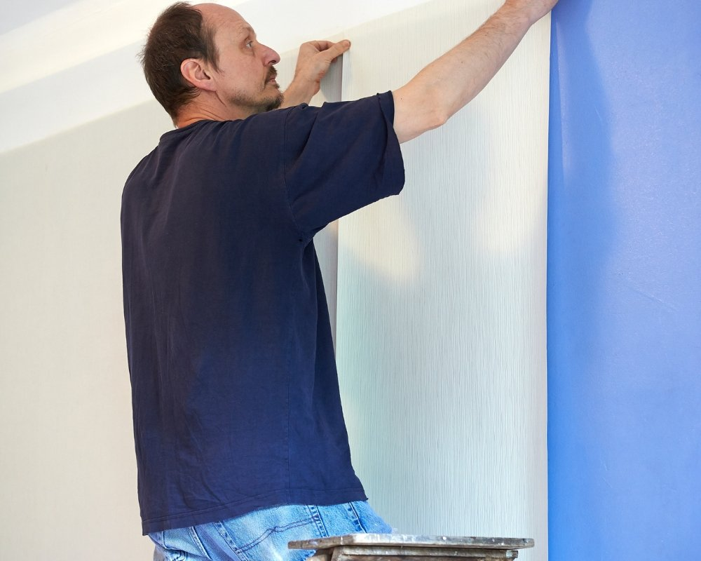

**Resposta rápida: 1 rolo de papel de parede cobre quantos metros?**

Em média, **1 rolo padrão de papel de parede cobre cerca de 5 a 5,3 m²** (medida usual: 0,53 m de largura × 10 m de comprimento). Para papéis com estampa de grande repetição, considere um rendimento útil de aproximadamente **4 a 4,5 m² por rolo**, já descontando emendas. Para o cálculo: divida a área total da parede (em m²) pelo rendimento do rolo e some 10% de margem de segurança.

Quer saber exatamente quanto papel de parede comprar sem desperdício ou surpresas? Calcular papel de parede é simples: meça a largura e a altura das paredes para obter a área total, divida pela área coberta por um rolo (ajustando para estampas e recortes) e some uma margem de segurança, pronto, você tem a quantidade necessária.

Saber fazer essa conta evita compras a mais, economiza tempo e dinheiro e garante que o padrão bata certinho na instalação; nas próximas seções você verá passo a passo como medir, como ajustar para emendas e estampas, e dicas práticas para escolher a quantidade certa para qualquer ambiente.

## Medir e entender as medidas da sua parede: fundamentos para calcular papel de parede

Antes de comprar, é importante medir com cuidado: a largura e a altura da parede são o ponto de partida para calcular papel de parede com precisão e evitar tanto desperdício quanto falta de material.

### Comece pelo básico e ganhe tempo

Ao calcular papel de parede, primeiro meça largura e altura em metros e anote os valores; em seguida multiplique uma medida pela outra para chegar aos metros quadrados. Se a parede tiver rodapé, sancas ou nichos, inclua essas áreas na conta, pois isso evita surpresas na hora da aplicação. Uma fita métrica de 5 metros e um nível simples costumam ser suficientes para garantir medidas confiáveis.

Registre portas e janelas separadamente para depois descontar, e confirme o tamanho do padrão (repetição) e a altura do rolo, já que ambos influenciam diretamente o rendimento. Mesmo em paredes pequenas é recomendável medir duas vezes e comparar os resultados: medir novamente reduz bastante a chance de erro.

Medir duas vezes reduz 80% dos erros comuns ao calcular papel de parede.

Tenha sempre à mão fita, bloco de notas e a medida do padrão; assim a base para calcular papel de parede fica simples e precisa, e o processo se torna bem menos estressante.

## Calcular a quantidade de papel de parede e descontar portas janelas: passo a passo prático

Calcular a quantidade certa começa por somar os metros quadrados de todas as paredes e depois subtrair as áreas de portas e janelas; esse procedimento simples evita compras exageradas e garante mais economia e eficiência no projeto.

### Subtrair sem medo: método direto

Primeiro some a área total das paredes que receberão o papel de parede. Em seguida, calcule cada abertura multiplicando altura × largura e subtraia essas áreas do total. Curiosamente, muitos fabricantes orientam a não descontar janelinhas pequenas; por outro lado, descontar portas e janelas grandes costuma reduzir bastante a quantidade necessária e, consequentemente, o custo.

Depois de ajustar pelas portas e janelas, divida o resultado pela cobertura de um rolo, lembrando de considerar perdas por causa do padrão. Usar uma calculadora ou uma planilha para inserir medidas e o rendimento do rolo acelera bastante o processo e evita sobras desnecessárias, fluxo simples e prático que facilita a compra.

Descontar portas janelas grandes reduz o custo total sem comprometer aplicação.

-   Meça todas as paredes e some os metros quadradosCalcule a área de portas e janelasSubtraia as aberturas e aplique o rendimento do rolo
    
-   Meça todas as paredes e some os metros quadrados
    
-   Calcule a área de portas e janelas
    
-   Subtraia as aberturas e aplique o rendimento do rolo

Com medidas bem feitas e descontos aplicados de forma prática, chega-se à quantidade ideal e evita-se tanto sobra quanto falta na hora da instalação, mesmo em projetos menores.

## Rolos e tamanhos: como usar a calculadora e entender o rendimento do rolo

Entender quanto cada rolo rende é fundamental para que o responsável pelo projeto compre a quantidade certa, sem surpresas nem desperdício.

### Rendimento explicado em números

Os rolos costumam ter medidas padrão, por exemplo 0,53 m × 10 m, e basta multiplicar largura por comprimento para obter os metros quadrados por rolo; depois, ajuste conforme o padrão do papel, pois isso influencia bastante o aproveitamento.

Quando o papel tem padrão, é preciso dividir a altura da parede pelo comprimento do motivo para saber quantos cortes serão necessários; esse cálculo demonstra como o padrão reduz o rendimento efetivo do rolo e, consequentemente, altera a quantidade a comprar.

Curiosamente, inserir no cálculo o tamanho do rolo, a metragem total das paredes e uma margem de perda, geralmente entre 10–15%, evita erros comuns; seja usando uma calculadora online ou uma planilha, o processo fica bem mais ágil e confiável.

Sempre aplique 10–15% a mais para perdas por padrão e emendas ao calcular rolo.

Com o rendimento do rolo claramente definido e a calculadora à mão, a compra fica precisa e o cronograma do projeto segue sem imprevistos, por outro lado caso ignore esse ajuste corre-se o risco de faltar material no último momento.

## Papel de parede infantil e para bebê: cuidados, medidas e aplicação específica

Ao calcular papel de parede infantil ou para bebê, é importante levar em conta padrões repetitivos, alturas reduzidas e a segurança do ambiente para que a aplicação fique adequada e charmosa.

### Medidas seguras para quartos pequenos

Quartos infantis geralmente têm móveis encostados nas paredes e alturas menores, por isso medir com atenção é essencial. Para calcular papel de parede infantil, anota-se a medida da parede até a altura do berço ou do móvel usado, e muitas vezes optar por meia parede ou por uma faixa evita desperdício e cai bem esteticamente.

Escolher materiais laváveis e sem odores fortes é uma regra prática; ao calcular papel de parede para bebê, inclua sempre uma margem extra para reposição, já que manchas ou pequenos danos acontecem. Curiosamente, comprar um rolo adicional pode resolver problemas de lote e garantir que a cor fique uniforme em todo o quarto.

Para quartos de bebê, um rolo extra evita problemas de lote e garante segurança estética.

-   Meça até a altura real usada no quarto
    
-   Considere meia parede ou faixa para economizar
    
-   Compre um rolo extra para combinar lotes

Medidas específicas, materiais adequados e planejamento tornam a aplicação infantil mais segura, econômica e visualmente consistente, por outro lado, descuidos com o padrão podem aumentar o número de cortes por rolo e gerar mais desperdício.

## Aplicação parcial, faixas e atenção com portas janelas: ajustes na quantidade

Aplicações parciais e faixas mudam a conta: medir só áreas selecionadas pede cuidado especial para calcular o papel de parede corretamente.

### Economize sem perder acabamento

Quando a escolha recai sobre uma faixa ou painel, o ideal é primeiro delimitar com precisão a porção que será coberta e calcular os metros quadrados dessa área. É preciso descontar portas e janelas que cruzam a faixa, porque esse método diminui a quantidade a comprar, mas exige precisão nas medidas e nos cortes, cortes verticais, por exemplo, precisam casar com os padrões das paredes vizinhas.

Para fazer o cálculo neste cenário, recomenda-se usar a calculadora somando apenas as faixas desejadas e acrescentando desperdício para os cortes; curiosamente, o passo que parece mais simples costuma ser o que traz mais erros. A medida deve levar em conta a proximidade de cantos e esquadrias, pois esse cuidado evita comprar material a menos e interromper o trabalho no meio do serviço.

Aplicacao parcial exige medição milimétrica para evitar falta de material no acabamento.

-   Defina a área da faixa e meça altura × larguraDesconte portas janelas incluídas na faixaAdicione desperdício para cortes
    
-   Defina a área da faixa e meça altura × largura
    
-   Desconte portas janelas incluídas na faixa
    
-   Adicione desperdício para cortes

Com faixas bem medidas e ajustes precisos o resultado fica mais econômico sem comprometer a qualidade final.

## Dicas práticas, erros comuns e checklist final para não errar ao calcular papel de parede

Checklist rápido: medir com calma, conferir o padrão, descontar portas e janelas e calcular o rendimento do rolo evitam os erros mais frequentes ao estimar papel de parede.

### Evite erros que custam dinheiro

Os equívocos mais comuns são fáceis de listar: não medir duas vezes, ignorar a repetição do padrão e esquecer de descontar portas ou janelas grandes. Para fazer a conta com segurança, registre as medidas em metros, use uma calculadora e inclua **10–15%** de perda. Curiosamente, seguir esse fluxo, mesmo que pareça repetitivo, diminui bastante o retrabalho e melhora o acabamento final.

O procedimento prático passa por etapas claras: medir largura e altura, somar metros quadrados, descontar portas e janelas, conferir o rendimento do rolo e levar um ou dois rolos extras. Se houver dúvida, tirar fotos das paredes e consultar a calculadora do fabricante resolve muitos impasses. Por outro lado, anotar tudo evita surpresas na decoração.

Seguir um checklist reduz retrabalho e garante que a quantidade comprada seja a correta.

-   Meça duas vezes e registre em metrosVerifique padrão e repetiçãoDesconte portas e janelas grandesAdicione **10–15%** para perdas
    
-   Meça duas vezes e registre em metros
    
-   Verifique padrão e repetição
    
-   Desconte portas e janelas grandes
    
-   Adicione **10–15%** para perdas

Use a lista e a calculadora antes da compra; com esses passos simples o trabalho fica pronto pra aplicação sem percalços.

## Conclusão

Calcular a quantidade de papel de parede vira algo simples quando a pessoa tem as medidas certas, subtrai portas janelas e considera o rendimento do rolo; seguindo esses passos evita-se desperdício e garante um acabamento bem feito.

É importante reforçar o hábito de medir duas vezes, e anotar em metros, antes de qualquer compra. Em seguida, combinar a área total em metros quadrados com as especificações do rolo e deixar uma margem para perdas garante precisão; curiosamente, esse cuidado pequeno costuma poupar tempo e dinheiro depois.

Se pintar dúvida, o ideal é pedir indicação de um instalador ou recorrer à calculadora online do fabricante. Por outro lado, comprar todos os rolos do mesmo lote e reservar um rolo extra minimiza diferenças de tonalidade e assegura que a parede fique com aparência uniforme e profissional.

Medidas precisas e um rolo extra são a melhor proteção contra imprevistos na aplicação.

Ao aplicar as medições e usar a calculadora, a pessoa consegue fazer uma compra certeira e obter um resultado duradouro, e se algo parecer incerto, nada impede de tirar fotos do ambiente e consultar um especialista.

## Perguntas Frequentes

### Como calcular papel de parede para um cômodo?

Para calcular papel de parede, meça a altura e o perímetro da parede (soma das larguras das paredes a cobrir). Multiplique a altura pelo perímetro para obter a área total em metros quadrados. Esse é o ponto de partida para saber quantos rolos serão necessários.

Em seguida, verifique a metragem útil por rolo (informação do fabricante) e considere a repetição do padrão e uma margem de desperdício de 5% a 15% para cortes e alinhamento. Assim obtém-se um número de rolos mais realista.

### Quais medidas são essenciais ao aprender como calcular papel de parede?

As medidas essenciais são a altura da parede, a largura de cada parede a ser coberta e a largura do rolo de papel de parede. Também é importante anotar a metragem por rolo e a repetição do padrão (match), pois influenciam diretamente no aproveitamento.

Ao registrar essas medidas, anota-se portas e janelas para subtrair da área quando for o caso, e adiciona-se uma margem extra para cortes. Essa rotina ajuda a evitar falta de material e a reduzir sobras desnecessárias.

### Como calcular quantos rolos de papel de parede serão necessários?

Divida a altura da parede pela altura útil de um rolo (quantos metros cada rolo permite em tiras) para saber quantas tiras cabem por rolo. Depois, calcule quantas tiras são necessárias para cobrir o perímetro usando a largura do rolo. Por fim, divida o número de tiras necessárias pelo número de tiras por rolo para obter a quantidade de rolos.

Não esqueça de ajustar pelo padrão do papel: se houver correspondência de desenho (match), poderá haver sobras maiores por tira. Incluir 5% a 15% de sobra é uma prática comum para compensar erros de corte e alinhamento.

### Qual a diferença entre largura do rolo e metragem útil do rolo?

A largura do rolo é a medida horizontal do papel (por exemplo, 52 cm ou 70 cm) e determina quantas tiras serão necessárias para cobrir a parede. Já a metragem útil é o comprimento total do rolo em metros que pode ser usado para cortar tiras com a altura da parede.

Ao calcular papel de parede, ambos os valores são fundamentais: a largura impacts diretamente no número de tiras e a metragem útil define quantas tiras podem ser obtidas por rolo. Verificar essas informações no rótulo do produto evita surpresas na instalação.

### Como considerar portas, janelas e cantos ao calcular papel de parede?

Ao calcular a área total, subtraia a área de portas e janelas se for cobrir apenas as superfícies sólidas. No entanto, em muitos projetos recomenda-se não subtrair pequenas aberturas e, em vez disso, manter a margem de desperdício para cortes e emendas, o que simplifica a logística da instalação.

Para cantos, vãos e paredes com muitos recortes, é prudente adicionar uma porcentagem extra de material. Isso cobre cortes complexos e evita ter que comprar um rolo adicional no meio da obra.

### Que dicas práticas ajudam quem quer aprender como calcular papel de parede sem erros?

Use uma planilha ou [calculadora online](https://www.calculadoraonline.com.br/basica) para registrar altura, perímetro, largura do rolo, metragem por rolo e repetição do padrão; isso reduz erros de conta. Sempre compre pelo menos um rolo extra do mesmo lote para garantir uniformidade de cor, caso precise de retoques futuros.

Mantenha as medidas anotadas em cada etapa, confira as especificações do fabricante e, se houver dúvida, consulte um instalador profissional. Essas ações simples tornam o cálculo mais confiável e economizam tempo e dinheiro na hora da aplicação.

## Perguntas Frequentes sobre Cálculo de Papel de Parede

### 1 rolo de papel de parede cobre quantos metros?

Um rolo padrão de papel de parede (0,53 m de largura × 10 m de comprimento) cobre em média **5 a 5,3 m²** de parede. Para papéis com estampas grandes ou de repetição (rapport), o rendimento útil cai para cerca de **4 a 4,5 m²** por rolo, devido às emendas necessárias para alinhar o desenho.

### Como calcular papel de parede com estampa?

Para papéis estampados, primeiro descubra o **rapport** (altura da repetição do desenho), informado na embalagem. Em seguida, some o rapport à altura da parede para obter a "altura útil" de cada tira. Calcule quantas tiras de 0,53 m cabem na largura da parede, multiplique pela altura útil e divida pelos 10 m do rolo. Adicione **15% a 20% de margem** (em vez dos 10% padrão) para compensar emendas e desperdício.

### Quantos rolos de papel de parede preciso para um quarto de 12m²?

Um quarto de 12 m² de piso costuma ter cerca de **32 a 36 m² de parede** (considerando pé-direito de 2,7 m e descontando portas e janelas). Dividindo por 5 m² por rolo, você precisará de aproximadamente **7 a 8 rolos de papel liso**, ou **9 a 10 rolos** se o papel for estampado com rapport médio. Sempre arredonde para cima e adicione 1 rolo extra de segurança.

### Preciso descontar portas e janelas no cálculo?

Sim, mas com cautela. Desconte apenas **aberturas grandes** (portas inteiras, janelas amplas acima de 1 m²). Pequenas aberturas devem ser ignoradas, é melhor ter sobra do que faltar material no meio da instalação, já que o lote pode mudar e gerar diferença de tonalidade.

### Por que devo somar 10% de margem ao cálculo?

A margem de 10% (ou até 20% para estampados) cobre **cortes, emendas, erros de aplicação e reparos futuros**. Comprar do mesmo lote garante que, se houver dano em um trecho, você terá material idêntico para reparo, papéis comprados depois podem ter variações de cor mesmo na mesma referência.
