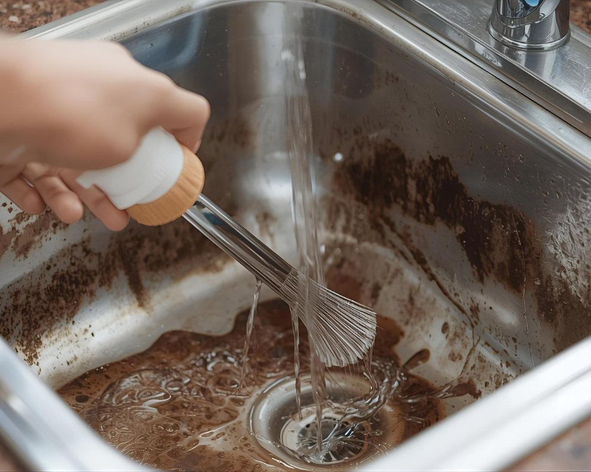

Quem nunca passou pela situação de lavar a louça e, de repente, perceber que a água não está indo embora? A pia entupida é um verdadeiro pesadelo na cozinha. Mas calma! Não precisa entrar em pânico nem chamar o encanador imediatamente.

Neste post, vamos te mostrar dicas práticas para desentupir sua pia com soluções rápidas e eficazes. Prepare-se para se tornar o expert em resolver esse problema sem estresse. Afinal, uma cozinha funcional é essencial para manter as receitas fluindo! Vamos lá?

## Quais são os sinais de que a pia da cozinha está entupida?

Você já se deparou com uma drenagem lenta na pia? Esse é um dos primeiros sinais de que algo não vai bem. A água leva mais tempo do que o normal para descer, e isso pode ser um grande incômodo durante o preparo das refeições.  
  
Outro alerta são os cheiros desagradáveis que surgem. Se a sua cozinha começa a ter aroma forte e enjoativo, é hora de investigar! Fique atento também aos gorgolejos estranhos quando você liga a torneira; eles podem indicar uma obstrução à vista.

### Drenagem Lenta

Você já percebeu que a água da pia demora para descer? Pode ser um sinal claro de entupimento. A drenagem lenta é como um aviso do encanamento, pedindo socorro. Isso pode ocorrer por restos de comida ou gordura acumulada.  
  
Se não agir rapidamente, esse pequeno problema pode se transformar em uma verdadeira dor de cabeça. Afinal, quem gosta de esperar a água escorregar lentamente? Melhor intervir antes que o caos tome conta da sua cozinha!

### Água Retornando

Você está lavando a louça e, de repente, a água começa a voltar? Um verdadeiro pesadelo! Isso indica que há algo obstruindo o fluxo no encanamento. O retorno da água é um sinal claro de entupimento.  
  
Não ignore esse alerta! Além de ser desagradável, pode causar infiltrações e até danos à sua pia. Portanto, fique atento aos sinais e não deixe que essa situação se agrave. A hora de agir é agora!

### Cheiro Desagradável

Um dos sinais mais incômodos de que a pia da cozinha está entupida é o cheiro desagradável que invade o ambiente. É uma mistura de restos de alimentos, gordura e umidade, formando um verdadeiro “perfume” indesejado.  
  
Esse aroma pode ser tão forte que parece ter vida própria! Se você perceber esse odor esquisito, é hora de agir. Não deixe essa situação se agravar; sua cozinha merece estar livre desse "aroma especial" que ninguém quer respirar.

### Gorgolejos

Os gorgolejos são como um alerta sonoro de que algo não vai bem na sua pia. Esse barulho estranho, parecido com bolhas ou assobios, surge quando a água encontra um obstáculo no encanamento. É o sinal perfeito para você agir antes que a situação piore.  
  
Se você ouvir esses sons indesejados, preste atenção! Ignorar os gorgolejos pode levar a entupimentos mais sérios e até mesmo vazamentos. Não deixe a música desafinada da pia tocar por muito tempo!

### Vazamentos

Se você perceber água acumulando sob a pia ou pingos caindo de algum lugar, atenção redobrada! Vazamentos podem ser sinais claros de entupimentos. Além do desconforto visual, eles podem causar danos sérios à sua cozinha e até gerar mofo.  
  
E quem gosta daquele cheiro de umidade? Ninguém! Portanto, fique atento aos pequenos detalhes. Um vazamento pode parecer inofensivo, mas se deixado sem tratamento, pode transformar-se em um grande problema. É hora de agir antes que a situação piore!

### Problemas no Ralo

Se você já se deparou com água acumulada em sua pia, pode ser um sinal claro de problemas no ralo. Isso acontece quando sujeira, restos de comida e até cabelo se acumulam, criando uma barreira indesejada.  
  
Nessa hora, a frustração começa a surgir. Você tenta drenar a água e nada parece funcionar! É fundamental ficar atento a esses sinais para agir rapidamente antes que o entupimento fique ainda mais sério. Desentupir agora é melhor do que esperar por um verdadeiro desastre na cozinha!

## Como posso prevenir entupimentos na pia da cozinha?

Prevenir entupimentos na pia da cozinha é mais fácil do que parece. Uma dica simples é nunca despejar restos de comida ou gordura no ralo. Use um coador para filtrar os resíduos sólidos, assim você evita futuros problemas.  
  
Outra prática essencial é a limpeza regular do sifão e dos canos. Com uma manutenção periódica, você garante que tudo flua bem. Além disso, evite jogar produtos químicos agressivos direto na pia; eles podem causar danos ao encanamento a longo prazo!

## Métodos caseiros são eficazes para desentupir a pia

Desentupir a pia da cozinha pode ser mais fácil do que você imagina. Com métodos caseiros, você pode dar adeus aos entupimentos sem gastar muito. Água quente é um truque simples e eficaz; jogue-a na pia e veja como os resíduos se dissolvem.  
  
Outra combinação poderosa é o bicarbonato de sódio com vinagre. Assim que misturá-los, prepare-se para uma reação efervescente! Essa dupla faz milagres ao desobstruir tubos, deixando sua pia limpa e livre de odores desagradáveis.

### Água Quente

Às vezes, a solução mais simples é também a mais eficaz. A água quente pode ser sua aliada na luta contra o entupimento da pia. Basta ferver um pouco de água e despejá-la lentamente pela drainagem. Essa ação ajuda a dissolver gorduras acumuladas e outras obstruções.  
  
Experimente fazer isso regularmente para evitar problemas futuros. É uma técnica rápida e prática que pode salvar seu dia, tornando o processo de desentupir menos complicado do que parece!

### Bicarbonato de Sódio e Vinagre

O bicarbonato de sódio e o vinagre formam uma dupla dinâmica poderosa na luta contra entupimentos. Ao misturá-los, você cria uma reação efervescente que ajuda a soltar resíduos acumulados nos canos. É quase como um pequeno espetáculo químico na sua pia!  
  
Para usar essa combinação mágica, despeje meia xícara de bicarbonato no ralo e siga com meia xícara de vinagre. Depois é só esperar uns minutinhos e enxaguar com água quente. Pronto! Sua pia agradece a limpeza natural.

### Sal e Bicarbonato de Sódio

O sal e o bicarbonato de sódio são uma dupla imbatível contra o entupimento da pia. Misture uma colher de sopa de cada um em meio litro de água quente. Esse remédio caseiro faz maravilhas!  
  
Ao despejar a mistura na pia, você verá como ela começa a agir rapidamente. As bolhas que se formam são sinal de que os resíduos estão sendo dissolvidos e o fluxo deve melhorar logo. Simples e eficaz!

### Desentupidor

O desentupidor é um verdadeiro herói na batalha contra pias entupidas. Com seu design simples e funcional, ele transforma o trabalho em algo quase divertido. A pressão que você faz com a alça gera uma força incrível, capaz de desalojar qualquer sujeira teimosa.  
  
Usá-lo pode ser uma experiência até catártica! Basta pressionar e puxar, enquanto imagina aquele resíduo indesejado sendo expulso para longe da sua pia. É como dar um novo fôlego à sua cozinha!

### Mistura de Sal e Vinagre

Se você procura uma solução simples e caseira para desentupir a pia, a mistura de sal e vinagre é um verdadeiro aliado. Misture meia xícara de sal com meia xícara de vinagre em um recipiente. Essa dupla poderosa vai efervescer e agir como um detergente natural.  
  
Despeje essa mistura diretamente no ralo da pia e deixe agir por cerca de 30 minutos. Depois, finalize jogando água quente para enxaguar. É eficaz, fácil e ainda ajuda a eliminar odores indesejados!

### Cloro ou Água Sanitária

O cloro e a água sanitária são verdadeiros aliados na batalha contra o entupimento da pia. Eles não apenas ajudam a desinfetar, mas também podem dissolver resíduos que grudam nas paredes do cano. Basta misturar um pouco com água quente e despejar na pia.  
  
Cuidado: use luvas para proteger suas mãos! O cheiro é forte, mas isso significa que está funcionando. Após alguns minutos, enxágue bem com água corrente e veja sua pia voltar a funcionar como nova!

### Cabo de Vassoura

Quem diria que um simples cabo de vassoura poderia se tornar seu aliado na luta contra o entupimento da pia? É verdade! Com um pouco de criatividade, você pode usar a parte de trás do cabo para desobstruir tubos. Basta inseri-lo com cuidado e fazer movimentos suaves.  
  
Essa técnica é especialmente útil em casos mais leves de entupimentos. E ainda por cima, é uma solução econômica e rápida! Então, antes de correr para o mercado, experimente essa dica caseira divertida.

### Soda Cáustica

A soda cáustica é uma aliada poderosa no combate aos entupimentos. Quando misturada com água, ela se torna um desentupidor imbatível. É como mágica! Você despeja a solução na pia e assiste enquanto os resíduos teimosos desaparecem.  
  
Mas atenção: manuseie com cuidado! Use luvas e óculos de proteção, pois essa substância é corrosiva. Lembre-se de que segurança vem em primeiro lugar, mesmo quando estamos enfrentando um encanamento rebelde. A cautela garante resultados sem sustos!

### Água de Limão e Bicarbonato de Sódio

A mistura de água de limão e bicarbonato de sódio é uma verdadeira aliada na hora de desentupir a pia. O ácido do limão, combinado com o poder efervescente do bicarbonato, cria uma reação que pode ajudar a soltar sujeiras acumuladas.  
  
Basta despejar meia xícara de cada um pela drenagem e deixar agir por alguns minutos. Depois, enxágue com água quente. É uma solução natural que ainda deixa um cheirinho refrescante! Uma maneira prática e econômica para lidar com entupimentos no dia a dia.

### Água e Detergente

Uma das soluções mais simples e eficazes para [desentupir a pia de cozinha](https://www.universoambiental.eco.br/) é usar água quente com detergente. Essa combinação poderosa ajuda a dissolver graxas e restos de alimentos que possam estar acumulados no encanamento.  
  
Basta ferver um pouco de água, adicionar uma boa quantidade de detergente e despejar na pia. O calor da água ativa o detergente, permitindo que ele faça sua mágica! Em minutos, você pode ver a drenagem melhorando rapidamente. É prático e sempre à mão!

## Como limpar a pia da cozinha adequadamente

Manter a pia da cozinha limpa é essencial para o bem-estar e a higiene do lar. Comece retirando todos os objetos, como esponjas e detergentes. Use água morna com sabão neutro para limpar as superfícies, garantindo que não fique nenhum resíduo.  
  
Depois, enxágue bem com água corrente e seque com um pano limpo ou papel toalha. Para um toque extra de frescor, você pode aplicar uma solução de vinagre e água para desinfetar. Sua pia vai brilhar!

## Conclusão

A vida é cheia de imprevistos, e um entupimento na pia da cozinha pode ser um dos mais inconvenientes. Porém, com as dicas que você aprendeu aqui, desentupir a pia não precisa ser um bicho de sete cabeças. Lembre-se sempre de observar os sinais precoces e adotar medidas preventivas para evitar futuros problemas.  
  
Use métodos caseiros quando precisar e mantenha sua pia limpa regularmente para garantir que ela funcione perfeitamente. E se tudo falhar, não hesite em chamar um profissional! Afinal, uma cozinha funcional é o coração do lar. Mãos à obra e boa sorte nos seus desafios culinários!
