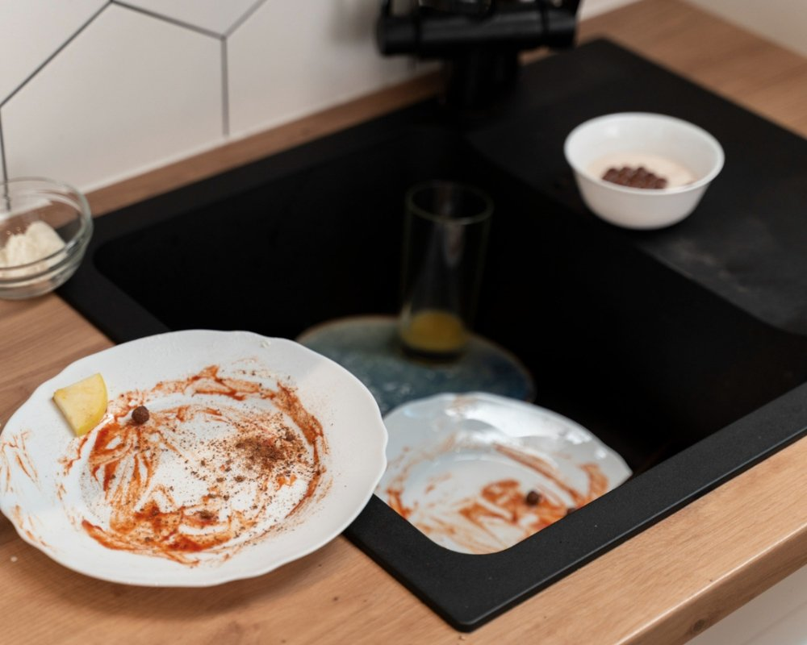

Você já se deparou com um problema desagradável na sua cozinha, como o entupimento da caixa de gordura? Esse é um desafio comum que muitos enfrentam e pode causar dor de cabeça. A boa notícia é que existem maneiras práticas e eficientes para resolver essa situação sem precisar chamar um profissional.

Neste post, vamos compartilhar dicas valiosas sobre como desentupir caixa de gordura, além de cuidados importantes para evitar esse tipo de transtorno no futuro. Prepare-se para manter a sua casa livre desse incômodo!

## Qual é a função da caixa de gordura?

A caixa de gordura desempenha um papel crucial na cozinha. Sua principal função é separar a gordura e os resíduos sólidos do esgoto, evitando que esses materiais entupam os canos.  
  
Além disso, ela ajuda a manter o sistema de encanamento livre de obstruções e previne odores desagradáveis. Sem essa proteção, sua tubulação poderia sofrer danos sérios ao longo do tempo.

### Como desentupir caixa de gordura?

Desentupir a caixa de gordura pode ser mais simples do que você imagina. Comece despejando água quente, isso ajuda a soltar os resíduos acumulados. Se necessário, utilize uma escova para remover as camadas mais grossas.  
  
Outra dica é usar bicarbonato de sódio seguido de vinagre branco. Essa combinação gera efervescência e facilita a limpeza, desintegrando o acúmulo de gordura com eficácia e segurança.

### Modelos com cesto

Os modelos de caixa de gordura com cesto são bastante práticos. Eles possuem um compartimento onde a gordura e os resíduos se acumulam, facilitando a limpeza. Com esse sistema, você pode simplesmente retirar o cesto e descartar os detritos acumulados.  
  
Além disso, esses modelos ajudam na manutenção da tubulação da sua casa. Ao evitar que grandes quantidades de gordura cheguem ao encanamento, eles garantem menos entupimentos e problemas futuros.

### Opções sem cesto

Se a sua caixa de gordura não possui cesto, existem outras soluções práticas para o desentupimento. Uma opção é utilizar um cabo de vassoura ou uma mangueira flexível para remover os resíduos acumulados. Essa abordagem permite alcançar áreas mais profundas e difíceis.  
  
Outra alternativa é usar produtos químicos apropriados que se dissolvem na gordura, facilitando a limpeza. Lembre-se sempre de seguir as instruções do fabricante para garantir eficácia e segurança durante o processo.

## Melhores produtos para limpar caixa de gordura

Para limpar a caixa de gordura de forma eficiente, alguns produtos se destacam. A água quente é uma ótima opção para dissolver resíduos acumulados. Além disso, o bicarbonato de sódio combinado com vinagre branco gera uma reação poderosa que ajuda na limpeza.  
  
Outras alternativas incluem detergentes desengordurantes e desengordurantes alcalinos industriais, que são eficazes em remover a gordura mais resistente. As enzimas biodegradáveis também são excelentes para manter a caixa limpa e livre de odores.

## Água quente

A água quente é uma aliada poderosa no processo de desentupimento da caixa de gordura. Ao aquecer a água, você ajuda a dissolver a gordura acumulada, tornando mais fácil sua remoção.  
  
Despeje lentamente a água quente na caixa e observe como ela age nas obstruções. Esse método simples pode ser bastante eficaz e não requer produtos químicos agressivos, garantindo um ambiente mais seguro para todos.

### Bicarbonato de sódio + vinagre branco

Uma combinação poderosa para desentupir a caixa de gordura é o bicarbonato de sódio com vinagre branco. Comece despejando meia xícara de bicarbonato na caixa, seguido por uma xícara de vinagre. A reação efervescente ajuda a soltar as obstruções.  
  
Após alguns minutos, enxágue com água quente. Essa mistura não só limpa como também elimina odores desagradáveis, deixando sua caixa pronta para uso novamente e sem produtos químicos agressivos.

### Detergente desengordurante

O detergente desengordurante é uma excelente opção para quem busca praticidade e eficiência na limpeza da caixa de gordura. Ele age rapidamente, dissolvendo a gordura acumulada e facilitando o processo.  
  
Basta aplicar uma quantidade generosa do produto na área afetada e deixar agir por alguns minutos. Em seguida, enxágue com água quente para garantir que toda a sujeira seja removida. É um aliado poderoso contra obstruções!

### Desengordurantes alcalinos industriais

Os desengordurantes alcalinos industriais são uma ótima opção para quem busca eficiência na limpeza da caixa de gordura. Eles atuam dissolvendo a gordura acumulada, facilitando o processo de desentupimento.  
  
Além disso, esses produtos são bastante versáteis e podem ser usados em diversas superfícies. Lembre-se sempre de seguir as instruções do fabricante para garantir um uso seguro e eficaz.

### Enzimas biodegradáveis

As enzimas biodegradáveis são uma excelente opção para desentupir a caixa de gordura. Elas atuam quebrando as moléculas de gorduras e resíduos orgânicos, tornando a limpeza mais eficaz. Além disso, são amigáveis ao meio ambiente.  
  
Esses produtos não geram poluição e podem ser utilizados com segurança em tubulações. Ao optar por enzimas biodegradáveis, você garante um método sustentável e eficiente para manter sua caixa de gordura sempre limpa.

### Desentupidores químicos

Os desentupidores químicos são uma opção rápida e eficaz para resolver entupimentos na caixa de gordura. Eles agem dissolvendo a gordura acumulada, facilitando o fluxo normal da água. Contudo, é importante usar com cautela.  
  
Siga sempre as instruções do fabricante e proteja-se com luvas e óculos de proteção. Embora sejam práticos, evite abusar desses produtos para não danificar tubulações ou causar reações indesejadas.

Caso não consiga resolver, opte sempre por chamar a ajuda de uma profissional, uma [desentupidora](https://limpafossa.tec.br/desentupidora/) com experiência e boas referências como por exempo, a [Limpa Fossa](https://desentupidoramenorvalor.com.br/limpa-fossa-com-menor-valor-a-partir-de-r-8000-tel-11-91362-8000/) Tec.

### Produtos específicos para esta finalidade

Existem produtos específicos no mercado que são formulados para desentupir a caixa de gordura. Esses itens são bastante eficazes, pois atuam diretamente na dissolução da gordura acumulada. Muitos deles contêm ingredientes ativos que facilitam a limpeza sem danificar os canos.  
  
Ao escolher um produto, busque aqueles com boas avaliações e que sejam seguros para o meio ambiente. Lembre-se de seguir as instruções do fabricante para obter melhores resultados!

### Use um desentupidor

Usar um desentupidor pode ser uma solução prática e rápida para desobstruir a caixa de gordura. Ao aplicar pressão, você ajuda a soltar o que está causando o entupimento. É uma ferramenta simples que todo mundo deveria ter em casa.  
  
Certifique-se de usar o modelo adequado, com ventosas grandes e resistentes. A técnica é fácil: faça movimentos firmes para cima e para baixo, sempre respeitando a força do material ao redor.

## Onde fica a caixa de gordura?

A caixa de gordura é um componente essencial do sistema de esgoto da sua casa. Geralmente, ela está instalada no subsolo ou na área externa, perto do encanamento da cozinha.  
  
Sua localização pode variar dependendo da construção, mas é comum encontrá-la sob a pia ou em uma área acessível para manutenção. Verifique sempre se o local está livre e visível para facilitar qualquer intervenção quando necessário.

## O que entope a caixa de gordura e como identificar se estiver entupida?

A caixa de gordura pode entupir devido ao acúmulo de restos de alimentos, óleos e gorduras. Esses elementos se solidificam e criam obstruções, dificultando o escoamento da água.  
  
Para identificar um entupimento, fique atento a sinais como refluxo de água ou odores desagradáveis. Se a pia começar a drenar lentamente, é hora de verificar a caixa com urgência antes que o problema se agrave.

## Quando é necessário chamar um profissional para desentupir a caixa de gordura?

Se você já tentou métodos caseiros e a caixa de gordura continua entupida, pode ser hora de chamar um profissional. A persistência do problema indica que o entupimento é mais sério do que parece.  
  
Além disso, se perceber odores fortes ou retorno de água nas pias, não hesite em buscar ajuda especializada. Profissionais têm ferramentas adequadas para resolver situações complexas sem causar danos à sua instalação.

## Como prevenir o entupimento da caixa de gordura?

Para prevenir o entupimento da caixa de gordura, é fundamental descartar corretamente os resíduos. Evite jogar restos de comida ou óleo diretamente no ralo. Use um recipiente para armazenar a gordura e descarte-o em local apropriado.  
  
Outra dica valiosa é realizar limpezas periódicas na caixa. Assim, você evita o acúmulo excessivo de gordura e mantém o sistema funcionando adequadamente. Manter hábitos saudáveis na cozinha faz toda a diferença!

## Onde jogar a gordura da caixa de gordura?

A gordura acumulada na caixa de gordura não deve ser descartada no ralo ou na pia. Isso pode causar entupimentos e danos ao sistema de esgoto. O ideal é armazená-la em um recipiente fechado.  
  
Depois, você pode levar esse resíduo a locais específicos para descarte, como unidades de coleta de óleo usado ou centros de reciclagem. Muitas cidades têm programas que aceitam essa gordura para reutilização em biodiesel.

## O que não usar para limpar a caixa de gordura?

Evite usar soda cáustica em excesso, pois pode danificar as tubulações e causar reações indesejadas. Além disso, ácidos fortes ou corrosivos também são prejudiciais e podem comprometer a estrutura da caixa de gordura.  
  
Água sanitária ou cloro puro é outro grande erro, já que não resolvem o problema de forma eficaz. Detergentes perfumados e com corantes podem deixar resíduos que dificultam a limpeza.

### Soda cáustica em excesso

A soda cáustica é um produto potente e, quando usada em excesso, pode causar danos sérios à sua caixa de gordura. Além de corroer as paredes do equipamento, ela pode gerar vapores tóxicos que são prejudiciais à saúde.  
  
Se a ideia é desentupir sem riscos, o ideal é usar com moderação ou optar por alternativas mais seguras. A prevenção deve sempre ser a melhor abordagem para evitar problemas maiores no futuro.

### Ácidos fortes ou corrosivos

O uso de ácidos fortes ou corrosivos na limpeza da caixa de gordura é extremamente arriscado. Esses produtos podem danificar não apenas a estrutura do equipamento, mas também os canos e o meio ambiente. Além disso, são perigosos para a saúde se não forem manuseados corretamente.  
  
Ao buscar soluções para desentupir sua caixa de gordura, evite essas substâncias. Opte por alternativas mais seguras e eficazes que protejam seu sistema hidráulico.

### Água sanitária ou cloro puro

A água sanitária e o cloro puro são produtos muito utilizados para limpeza, mas devem ser evitados na caixa de gordura. Esses itens podem causar danos ao sistema e gerar vapores tóxicos.  
  
Além disso, eles não resolvem o problema do entupimento de forma eficaz. É melhor optar por soluções mais seguras e específicas para desentupir sua caixa sem riscos à saúde ou ao meio ambiente.

### Detergentes perfumados e com corantes

Os detergentes perfumados e com corantes podem parecer uma opção atraente para limpar a caixa de gordura, mas na verdade, eles podem causar mais problemas do que soluções. Esses produtos costumam deixar resíduos que se acumulam, contribuindo para entupimentos futuros.  
  
Além disso, os perfumes e corantes não têm efeito desengordurante real. O melhor é optar por produtos específicos ou naturais que tratem efetivamente o problema sem complicações adicionais.

### Misturas caseiras sem critério técnico

Usar misturas caseiras para limpar a caixa de gordura pode parecer uma boa ideia, mas é preciso ter cuidado. Muitas vezes, essas combinações não são testadas e podem causar danos ao sistema de encanamento.  
  
Misturar produtos sem critério técnico pode resultar em reações indesejadas ou até mesmo agravar o entupimento. O ideal é optar por soluções comprovadas e seguras para garantir um resultado eficaz na limpeza da sua caixa de gordura.

## De quanto em quanto tempo devo limpar a caixa de gordura?

A limpeza da caixa de gordura deve ser feita, em média, a cada seis meses. No entanto, isso pode variar dependendo do uso e da quantidade de gordura gerada na sua cozinha.  
  
Se você costuma cozinhar com frequência ou fritar alimentos, pode ser necessário realizar a limpeza com mais regularidade. Fique atento aos sinais de entupimento para garantir o bom funcionamento do sistema.

## Conclusão

Manter a caixa de gordura sempre limpa e livre de entupimentos é essencial para o bom funcionamento do sistema hidráulico da sua casa. Com as dicas práticas que vimos, você pode desentupi-la facilmente, utilizando produtos caseiros ou específicos. Lembre-se também de fazer a limpeza regularmente e evitar descartes inadequados. Assim, você garante um ambiente mais saudável e evita dores de cabeça no futuro. Cuide bem da sua caixa de gordura!
