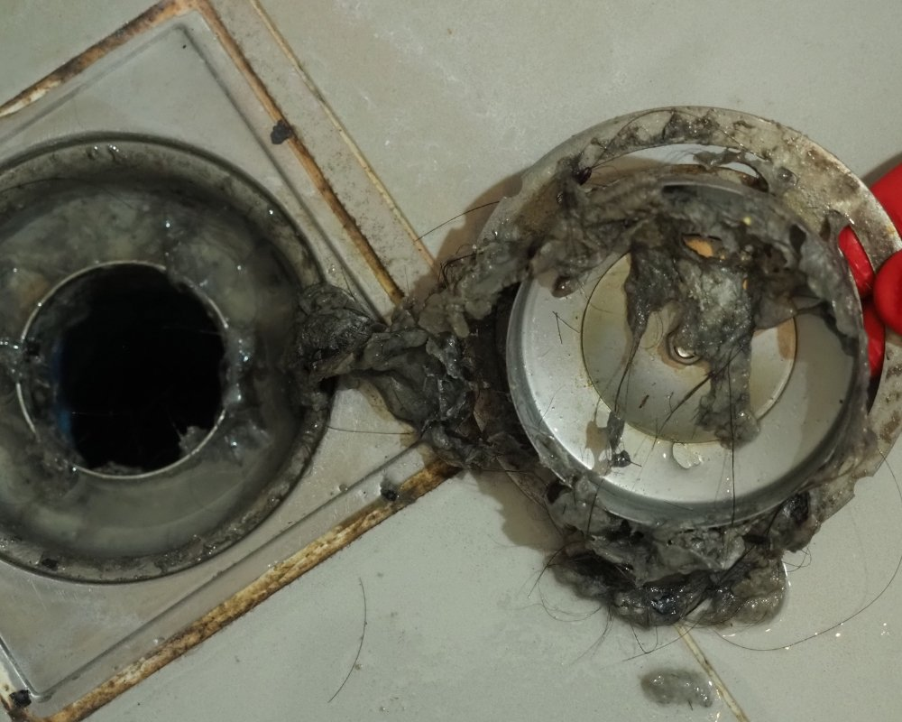

Você já passou pelo sufoco de um ralo entupido no banheiro? É uma situação frustrante e, muitas vezes, parece que a água nunca vai descer. Mas calma! Antes de chamar o encanador ou recorrer a produtos químicos agressivos, que tal tentar soluções naturais e simples? Além de serem eficazes, esses métodos são sustentáveis e fáceis de encontrar em casa.

Neste post, vamos compartilhar dicas valiosas sobre como desentupir o ralo do banheiro usando ingredientes naturais. Prepare-se para resgatar seu ralo da obstrução com alternativas práticas e ecológicas!

## Causas Comuns de Entupimento no Ralo do Banheiro

Você sabia que o ralo do banheiro é um verdadeiro imã de sujeira? Entre pelos, restos de sabonete e até papel higiênico, a mistura pode criar um bloqueio indesejado. É como se seu banheiro estivesse tentando organizar uma festa da bagunça!  
  
Outra causa comum são os produtos de higiene pessoal. Isso mesmo! Fraldas, absorventes ou lenços umedecidos jogados no vaso podem causar entupimentos sérios. Então, cuidado com o que vai pelo ralo; ele não é uma lixeira!

## Métodos Eficientes para Desentupir o Ralo do Banheiro Com Ingredientes Naturais

Desentupir o ralo do banheiro pode ser uma tarefa simples e ecológica! Com ingredientes naturais que você provavelmente já tem em casa, como sal, vinagre e água quente, é possível fazer milagres. A mistura destes três componentes cria uma reação efervescente capaz de dissolver a sujeira acumulada.  
  
Outra opção eficaz é usar bicarbonato de sódio seguido do vinagre. Essa dupla poderosa faz maravilhas na limpeza! Não subestime também o uso criativo de um arame para desobstruir os resíduos mais teimosos.

### Desentupimento com Sal, Vinagre e Água Quente

Uma das formas mais simples e eficazes de desentupir o ralo do banheiro é com uma mistura mágica de sal, vinagre e água quente. Primeiro, despeje meia xícara de sal no ralo. Em seguida, adicione a mesma quantidade de vinagre. O resultado? Uma efervescência que vai fazer você se sentir um verdadeiro químico!  
  
Depois disso, coloque água quente para ajudar a dissolver os resíduos acumulados. Essa combinação poderosa não só desobstrui como também limpa seu ralo naturalmente!

### Uso de Bicarbonato de Sódio e Vinagre

O bicarbonato de sódio e o vinagre são verdadeiros aliados na luta contra entupimentos. Quando combinados, eles reagem, criando uma efervescência que ajuda a soltar a sujeira acumulada no ralo. É quase como um mini vulcão em sua pia!  
  
Para usar essa dupla poderosa, despeje meia xícara de bicarbonato seguido por meia xícara de vinagre. Aguarde cerca de 30 minutos para que a mágica aconteça e finalize com água quente para enxaguar tudo! Uma solução simples e eficaz sem química agressiva.

### Desobstrução com Arame

Desobstruir o ralo do banheiro com um pedaço de arame pode ser uma solução simples e eficaz. Pegue um cabide velho ou um arame grosso, molde-o em forma de gancho e insira no ralo. Com cuidado, vá puxando o que estiver obstruindo.  
  
Essa técnica é ótima para retirar cabelos e outros detritos acumulados. E o melhor: você não precisa gastar nada! Além de ser prático, é uma maneira sustentável de resolver problemas sem produtos químicos. mãos à obra!

### Utilização de Mangueira

Se você tem uma mangueira em casa, pode usá-la de forma criativa para desentupir o ralo do banheiro. Basta conectar a mangueira na torneira e direcionar o jato d'água diretamente no ralo. A pressão fará com que os resíduos se soltem.  
  
Esse método é especialmente eficaz para entupimentos mais persistentes. É como ter um superpoder contra sujeiras! Além disso, é uma solução ecológica, já que utiliza apenas água e não produtos químicos agressivos. Experimente essa técnica e veja a mágica acontecer!

### Limpeza de Ralo com Areia

A limpeza do ralo com areia pode parecer inusitada, mas é uma solução eficaz e natural. Comece despejando uma quantidade moderada de areia diretamente no ralo entupido. A textura da areia ajuda a desobstruir os detritos que se acumularam ao longo do tempo.  
  
Depois disso, jogue água quente para ajudar a dissolver qualquer resíduo restante. Em poucos minutos, o fluxo deve voltar ao normal. Além de ser um método sustentável, você ainda dá um novo uso à areia que poderia estar jogada em algum canto!

## Dicas Extras para Evitar Entupimentos Futuros

Manter o ralo do banheiro livre de entupimentos é mais fácil do que parece. Evite jogar resíduos, como cabelos e restos de sabonete, diretamente no ralo. Use uma tela protetora para capturar esses detritos.  
  
Outra dica esperta é realizar limpezas regulares com água quente ou misturas naturais. Isso ajuda a dissolver qualquer acúmulo antes que se torne um problema maior. Pequenas ações diárias podem fazer toda a diferença na saúde do seu encanamento!

## Recomendações Gerais e Cuidados

Manter o ralo do banheiro em bom estado é mais simples do que parece. Uma boa dica é evitar jogar cabelos, restos de sabonete ou produtos menstruais pelo esgoto. Esses vilões podem causar entupimentos sérios!  
  
Outra recomendação valiosa é realizar uma limpeza regular. Use água quente semanalmente para ajudar a dissolver qualquer resíduo acumulado e evite problemas maiores no futuro. Com pequenos cuidados diários, você garante um ralo sempre livre!

## Produtos Naturais Recomendados

Quando se trata de desentupir o ralo do banheiro, alguns produtos naturais são verdadeiros aliados. O vinagre é um campeão nessa missão, ajudando a dissolver resíduos e odores indesejados. Junto com ele, o bicarbonato de sódio se destaca; essa dupla forma uma reação efervescente que pode eliminar bloqueios.  
  
Outra opção poderosa é o sal grosso. Ele age como abrasivo suave, removendo sujeiras acumuladas sem danificar os canos. Teste essas soluções e veja seu ralo voltar a funcionar como novo!

## Técnicas Precaucionais para Manutenção do Ralo do Banheiro

Manter o ralo do banheiro em boas condições é mais fácil do que você imagina. Uma dica simples é evitar jogar cabelo e resíduos sólidos no ralo. Use um coletor para capturar essas sujeiras antes que elas se acumulem.  
  
Outra técnica eficaz é fazer uma limpeza regular com água quente e vinagre. Essa mistura ajuda a dissolver qualquer gordura ou sujeira acumulada, evitando entupimentos futuros. Assim, seu banheiro fica sempre limpo e cheiroso!

## Outros Métodos Criativos e Sustentáveis para Limpeza

Se você gosta de soluções criativas, que tal usar uma mistura de suco de limão e água quente? O ácido cítrico do limão ajuda a dissolver a gordura acumulada. Além disso, o cheiro fresco deixa seu banheiro com um aroma agradável.  
  
Outra opção é recorrer ao café moído. Após preparar seu café, jogue os restos no ralo! Eles atuam como esfoliante natural, ajudando a remover sujeiras e odores indesejados. Uma maneira simples e sustentável de manter seu espaço sempre limpo.

## Conclusão

Desentupir o ralo do banheiro pode parecer uma tarefa complicada, mas com os métodos naturais que abordamos, você já tem tudo para enfrentar esse desafio de forma prática e eficiente. Além disso, ao optar por soluções caseiras, você não só ajuda a desobstruir como também cuida do meio ambiente.  
  
Lembre-se de sempre tomar precauções para evitar futuros entupimentos e mantenha seu banheiro em ordem. Com um pouco de criatividade e esses ingredientes à mão, sua casa estará livre dos incômodos entupimentos. Agora é hora de colocar as dicas em prática e deixar o ralo do seu banheiro funcionando perfeitamente!

Claro, em situações extremas sempre é bom contar com a ajuda de profissionais gabaritados, portanto, procure empresas como essa [Desentupidora em Curitiba](https://desentupidoracentral.com.br/).
