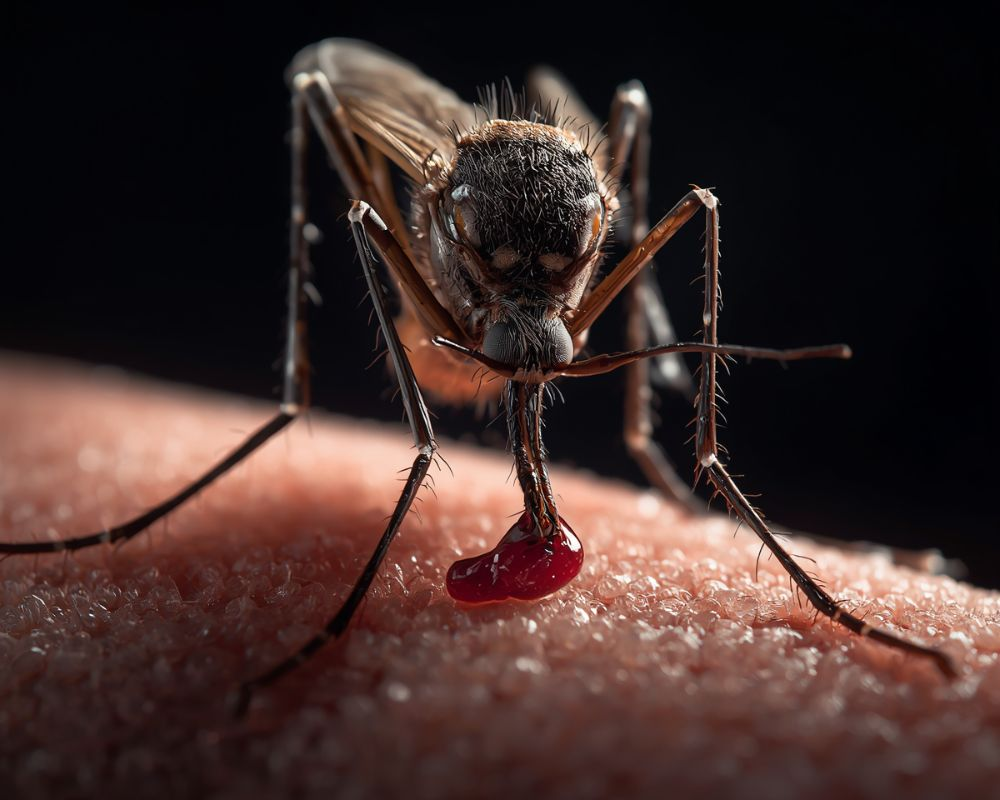

**Resposta rápida: Como eliminar pernilongos?**

Para **eliminar pernilongos** de forma eficaz, combine a eliminação de focos de água parada, o uso de barreiras físicas como telas e mosquiteiros, e a aplicação de repelentes naturais ou químicos. Soluções como plantas repelentes, armadilhas caseiras e inseticidas estratégicos também são cruciais para manter sua casa um santuário de paz.

Ah, a busca pela paz e harmonia em nosso lar! No Irenes, sabemos que essa jornada começa com o cuidado de si e do ambiente. Mas, sejamos sinceras, é difícil encontrar serenidade quando um zumbido insistente perturba o silêncio da noite, não é mesmo? Os pernilongos, esses pequenos invasores, podem transformar um momento de relaxamento em uma batalha contra picadas e coceiras.

Como sua amiga especialista em bem-estar e lar, estou aqui para compartilhar um guia completo sobre **como eliminar pernilongos** e, mais importante, como prevenir sua indesejada presença. Prepare-se para transformar sua casa em um verdadeiro refúgio, onde a beleza encontra a paz do lar, livre de zumbidos e picadas. Vamos juntas nessa missão por noites tranquilas e dias serenos!

## Por Que os Pernilongos São um Problema e Como Eles se Proliferam?

Antes de combater um inimigo, precisamos conhecê-lo, certo? Os pernilongos não são apenas irritantes; eles representam um risco real para a nossa saúde, sendo vetores de doenças como dengue, zika, chikungunya e febre amarela. Entender seu ciclo de vida é o primeiro passo para um combate eficaz e duradouro.

### O Ciclo de Vida do Pernilongo: Do Ovo ao Adulto

A vida de um pernilongo começa na água. As fêmeas depositam seus ovos em locais com água parada – pode ser um pequeno acúmulo em um vaso de planta, uma calha entupida ou até mesmo um pratinho de xícara esquecido. Em poucos dias, os ovos eclodem em larvas, que vivem na água e se alimentam de matéria orgânica. As larvas se transformam em pupas e, finalmente, em pernilongos adultos, prontos para voar e, no caso das fêmeas, procurar sangue para maturar seus próximos ovos.

É por isso que a eliminação da água parada é a nossa principal arma. Sem água, não há reprodução, e sem reprodução, não há pernilongos!

### O Que Atrai os Pernilongos para o Nosso Lar?

-   **Dióxido de Carbono (CO2):** Nós o exalamos o tempo todo, e é um dos principais atrativos.
    
-   **Calor Corporal:** Pernilongos são atraídos pelo calor.
    
-   **Ácido Lático:** Liberado pelo suor, também é um chamariz.
    
-   **Cheiros Específicos:** Alguns perfumes, loções e até odores corporais podem ser atrativos.
    
-   **Cores Escuras:** Eles tendem a ser atraídos por cores mais escuras em roupas e ambientes.
    
-   **Luz:** Embora não seja o principal fator, a luz noturna pode desorientá-los e atraí-los para dentro de casa.

Compreender esses fatores nos ajuda a criar estratégias de defesa mais inteligentes e a manter nosso santuário de paz verdadeiramente protegido.

## Prevenção é a Chave: Eliminando os Focos de Proliferação

No Irenes, acreditamos que a organização do lar é um pilar fundamental para o bem-estar. E quando falamos em [**eliminar pernilongos**](https://dedetizadoraem.eco.br/), a organização e a manutenção do seu espaço são, sem dúvida, as estratégias mais importantes. A prevenção é sempre mais eficaz do que a remediação!

### Não Dê Chance à Água Parada: Onde os Pernilongos se Escondem

Este é o mandamento número um! A fêmea do pernilongo precisa de água parada para depositar seus ovos. E acredite, basta uma pequena quantidade para que centenas de novos insetos nasçam. Aqui estão os pontos críticos que você deve verificar regularmente:

-   **Vasos de Plantas:** Elimine os pratinhos ou preencha-os com areia. Se tiver água, troque-a diariamente e esfregue as bordas.
    
-   **Calhas e Lajes:** Verifique se estão limpas e desobstruídas, sem acúmulo de água da chuva.
    
-   **Pneus Velhos, Garrafas e Latas:** Descarte corretamente ou guarde em local coberto e virado para baixo.
    
-   **Bebedouros de Animais:** Lave e troque a água diariamente.
    
-   **Caixas d'Água:** Mantenha-as sempre bem vedadas.
    
-   **Ralos e Vasos Sanitários Pouco Usados:** Mantenha-os vedados ou adicione uma pequena quantidade de água sanitária de vez em quando.
    
-   **Plantas que Acumulam Água:** Bromélias e outras plantas podem acumular água. Regue na terra e evite acumular água nas folhas.

Faça dessa inspeção uma rotina semanal. É um pequeno esforço para uma grande recompensa: um lar mais seguro e tranquilo.

### Jardim e Quintal: Transformando em um Espaço Repelente

Seu jardim pode ser um aliado na luta contra os pernilongos. Além de cuidar da água parada, algumas escolhas estratégicas de plantas podem fazer a diferença:

-   **Plantas Repelentes Naturais:** Citronela, lavanda, alecrim, manjericão, hortelã e cravo-da-índia são conhecidas por suas propriedades repelentes. Plante-as em vasos próximos a portas e janelas, ou em canteiros estratégicos.
    
-   **Manutenção do Gramado:** Mantenha a grama aparada e o jardim limpo. Folhas secas e entulho podem acumular água ou servir de abrigo para os pernilongos.
    
-   **Fontes e Lagos Ornamentais:** Se você tem uma fonte ou lago, considere adicionar peixes que se alimentam de larvas de pernilongo, como o guppy. Mantenha a água em movimento constante.

Um jardim bem cuidado não só embeleza seu lar, mas também se torna uma barreira natural contra esses insetos.

## Soluções Naturais e Caseiras para Espantar Pernilongos

Para quem busca uma abordagem mais suave e alinhada com a natureza, existem diversas opções para **eliminar pernilongos** e mantê-los afastados usando ingredientes que você provavelmente já tem em casa ou encontra facilmente.

### Óleos Essenciais e Velas de Citronela: A Fragrância da Proteção

A aromaterapia pode ser uma poderosa aliada. Óleos essenciais, além de perfumarem o ambiente, podem ser excelentes repelentes:

-   **Óleo Essencial de Citronela:** É o mais famoso. Use em difusores elétricos, em velas ou misture algumas gotas em água para borrifar no ambiente (cuidado com superfícies delicadas).
    
-   **Óleo Essencial de Lavanda:** Além de acalmar, seu aroma é desagradável para os pernilongos.
    
-   **Óleo Essencial de Eucalipto ou Hortelã-Pimenta:** Fortes e eficazes, podem ser usados da mesma forma que a citronela.

**Dica Irenes:** Para um repelente corporal natural, misture algumas gotas do seu óleo essencial preferido (citronela, lavanda) em um óleo vegetal neutro (como óleo de coco ou amêndoas) e aplique na pele. Faça um teste em uma pequena área antes para evitar reações alérgicas.

### Armadilhas Caseiras Simples e Eficazes

Você pode criar suas próprias armadilhas para capturar pernilongos:

1.  **Armadilha de Garrafa Pet:** Corte uma garrafa pet ao meio. Na parte de baixo, coloque água morna, açúcar e um pouco de fermento biológico (o fermento, ao reagir, libera CO2, que atrai os mosquitos). Encaixe a parte de cima da garrafa invertida (como um funil) na parte de baixo, vedando as bordas. Os pernilongos serão atraídos, entrarão e terão dificuldade para sair.
    
2.  **Cravo-da-Índia e Limão:** Corte um limão ao meio e espete vários cravos-da-índia em cada metade. Coloque em locais estratégicos, como mesinhas de cabeceira ou parapeitos de janela. O aroma é agradável para nós e detestável para os pernilongos.
    
3.  **Café:** Borra de café ou café em pó pode ser espalhada em vasos de plantas ou em locais com água parada para inibir a deposição de ovos e matar larvas. Queime um pouco de pó de café em um recipiente à prova de fogo para criar uma fumaça que espanta os insetos.

### Outros Remédios Caseiros para Pernilongo

-   **Vinagre de Maçã:** Misture partes iguais de vinagre de maçã e água em um borrifador e use para limpar superfícies ou borrifar no ambiente.
    
-   **Alho:** O cheiro forte do alho pode afastar pernilongos. Considere consumir mais alho ou deixar dentes de alho esmagados em locais estratégicos.
    
-   **Folhas de Eucalipto:** Ferva folhas de eucalipto em água. Coe e use o líquido em um borrifador para o ambiente.

Lembre-se que as soluções naturais podem ser menos potentes que as químicas, exigindo aplicação mais frequente e combinada para melhores resultados.

## Barreiras Físicas e Proteção Pessoal Eficaz

Além de eliminar os focos e usar repelentes naturais, criar barreiras físicas é uma das formas mais seguras e eficientes de garantir que os pernilongos não entrem em seu lar, preservando sua paz e seu sono.

### Telas de Proteção: Seu Escudo Contra Invasores

As telas em janelas e portas são verdadeiros escudos que permitem a circulação do ar sem a entrada de pernilongos. Invista em telas de boa qualidade e certifique-se de que não há rasgos ou frestas por onde os insetos possam passar. Esta é uma solução duradoura e que vale o investimento, especialmente em regiões com alta incidência de mosquitos.

**Dica Irenes:** Se você não puder instalar telas em todas as janelas, priorize as do quarto e das áreas de maior permanência. Verifique também as telas das portas, principalmente as que dão acesso ao jardim ou quintal.

### Mosquiteiros: Noites de Sono Tranquilas e Seguras

Para o quarto, especialmente para berços e camas de crianças, o mosquiteiro é uma barreira física insubstituível. Ele cria um ambiente protegido e aconchegante, garantindo noites de sono ininterruptas. Escolha mosquiteiros com trama fina e certifique-se de que estão bem vedados ao redor da cama, sem deixar aberturas.

Além de funcional, um mosquiteiro pode adicionar um toque de charme e romantismo à decoração do quarto, transformando-o em um verdadeiro santuário de descanso.

### Repelentes Pessoais: Proteção Direta para a Pele

Quando estamos fora de casa ou em áreas onde a presença de pernilongos é inevitável, o repelente pessoal é seu melhor amigo. Existem diversas opções no mercado:

-   **Repelentes com DEET:** São os mais eficazes e de longa duração, recomendados pela OMS em áreas de risco de doenças transmitidas por mosquitos.
    
-   **Repelentes com Icaridina:** Outra opção muito eficaz, com longa duração e menos irritante para a pele que o DEET para algumas pessoas.
    
-   **Repelentes Naturais:** À base de óleos essenciais (citronela, andiroba, neem), ideais para quem busca uma alternativa mais suave, mas exigem reaplicação mais frequente.

**Importante:** Siga sempre as instruções do fabricante, especialmente ao aplicar em crianças. Evite aplicar no rosto e nas mãos de bebês, e sempre lave as mãos após a aplicação.

## Recursos Químicos e Tecnológicos para o Combate

Em situações onde a infestação é maior ou as soluções naturais não são suficientes, podemos recorrer a métodos químicos e tecnológicos. Use-os com consciência e seguindo as orientações de segurança para proteger a saúde da sua família e do meio ambiente.

### Inseticidas e Aerossóis: Ação Rápida e Pontual

Os inseticidas em spray são eficazes para eliminar pernilongos adultos que já estão dentro de casa. Eles oferecem uma ação rápida, mas são soluções pontuais e temporárias. Lembre-se:

-   **Use com Moderação:** Aplique em ambientes fechados e, após alguns minutos, ventile o local.
    
-   **Segurança em Primeiro Lugar:** Mantenha crianças e animais de estimação afastados durante e logo após a aplicação.
    
-   **Não Substituem a Prevenção:** Eles não eliminam os ovos ou larvas, portanto, a limpeza e eliminação de focos continuam sendo essenciais.

Existem também inseticidas de tomada (pastilhas ou líquidos) que liberam substâncias repelentes ou inseticidas de forma contínua por algumas horas. São práticos para usar no quarto antes de dormir.

### Armadilhas Elétricas e Luminosas: Tecnologia a Seu Favor

A tecnologia oferece algumas opções interessantes para o controle de pernilongos:

-   **Armadilhas Luminosas com Grade Elétrica:** Atraem os insetos com luz UV e os eletrocutam ao contato com uma grade energizada. São eficazes, mas podem fazer barulho e deixar resíduos.
    
-   **Armadilhas de Sucção com Luz UV:** Atraem os pernilongos com luz e os sugam para um compartimento onde morrem por desidratação. São mais silenciosas e limpas.
    
-   **Raquetes Elétricas:** Ótimas para um combate direto e satisfatório. Permitem eliminar os pernilongos que estão voando no ambiente de forma manual e eficaz.

Ao escolher, considere o tamanho do ambiente e se o barulho ou a limpeza são um problema para você.

### Fumigação e Dedetização Profissional: Para Casos Extremos

Em casos de infestações muito severas ou em áreas de alto risco, a dedetização profissional pode ser necessária. Empresas especializadas utilizam produtos e técnicas mais potentes, com um plano de ação para controle de pragas. Esta é uma medida mais drástica e deve ser considerada como último recurso, sempre priorizando a segurança e seguindo as recomendações de profissionais.

## Dicas Extras para Manter seu Lar Livre de Pernilongos

A busca por um lar harmonioso e livre de pernilongos é contínua. Pequenos hábitos e ajustes podem fazer uma grande diferença no seu dia a dia.

### Limpeza e Organização Constante

Um lar organizado é um lar menos propenso a abrigar pernilongos. A limpeza regular de calhas, ralos e a eliminação de qualquer recipiente que possa acumular água são práticas que devem ser incorporadas à sua rotina de cuidados com a casa. Pense na organização como uma forma de autocuidado para o seu ambiente.

### Roupas Claras e Cheiros Neutros

Lembre-se que pernilongos são atraídos por cores escuras e certos odores. Opte por roupas claras, especialmente no final da tarde e à noite, e evite perfumes muito doces ou florais quando estiver em áreas com muitos insetos.

### Circulação de Ar e Ambientes Frescos

Pernilongos não gostam de vento. Mantenha ventiladores e ar-condicionado ligados, pois o fluxo de ar dificulta o voo deles e o ambiente mais frio não é favorável. Isso também ajuda a dispersar o CO2 e o calor que nos atrai.

### Atenção aos Horários de Pico

Os pernilongos são mais ativos ao amanhecer e ao entardecer. Redobre a atenção nesses horários: feche janelas e portas, use repelentes e acenda as velas de citronela. Se possível, evite atividades ao ar livre nesses períodos.

### Educação e Conscientização

Compartilhe o conhecimento! Converse com seus vizinhos sobre a importância de eliminar focos de água parada. A luta contra o pernilongo é uma responsabilidade coletiva, e um bairro engajado faz toda a diferença.

Com essas dicas, você estará mais do que preparada para **eliminar pernilongos** e cultivar um ambiente de paz e bem-estar em seu lar. No Irenes, celebramos a mulher que cuida de si, do seu espaço e busca a harmonia em cada detalhe. Que suas noites sejam tranquilas e seus dias, cheios de serenidade!

## Perguntas Frequentes sobre Como Eliminar Pernilongos

### Qual o melhor repelente natural para pernilongos?

O melhor repelente natural para pernilongos geralmente contém **óleo essencial de citronela**, lavanda ou eucalipto. Estes óleos podem ser usados em difusores, velas, ou diluídos em um óleo vegetal para aplicação na pele. O cravo-da-índia espetado em limão também é uma opção eficaz para o ambiente.

### Como acabar com pernilongos dentro de casa?

Para acabar com pernilongos dentro de casa, comece eliminando focos de água parada, usando telas nas janelas e portas, e mosquiteiros nas camas. Complemente com repelentes de tomada, difusores de óleos essenciais ou armadilhas caseiras, e utilize inseticidas em spray para eliminar os insetos adultos de forma pontual.

### O que atrai os pernilongos?

Pernilongos são atraídos principalmente pelo **dióxido de carbono (CO2)** que exalamos, pelo calor corporal, pelo ácido lático presente no suor e por certos odores corporais. Cores escuras e a luz noturna também podem atraí-los para o ambiente.

### Café realmente espanta pernilongos?

Sim, o **café pode ajudar a espantar pernilongos**. A borra de café ou o pó de café podem ser espalhados em vasos de plantas ou locais com água parada para inibir a deposição de ovos e matar larvas. Queimar pó de café também cria uma fumaça que pode afastar os insetos adultos do ambiente.

### Com que frequência devo limpar os vasos de plantas para evitar pernilongos?

Para evitar pernilongos, você deve **limpar os pratinhos dos vasos de plantas e trocar a água diariamente**, se houver. O ideal é eliminar os pratinhos ou preenchê-los com areia, que mantém a umidade sem acumular água parada. Esfregue as bordas dos vasos e pratinhos para remover possíveis ovos.

### Pernilongos podem transmitir doenças no Brasil?

Sim, no Brasil, pernilongos são vetores importantes de diversas doenças. O **Aedes aegypti**, por exemplo, é responsável pela transmissão da dengue, zika e chikungunya, enquanto outros tipos de pernilongos podem transmitir outras enfermidades, como a febre amarela em algumas regiões. A prevenção é crucial para a saúde pública.
