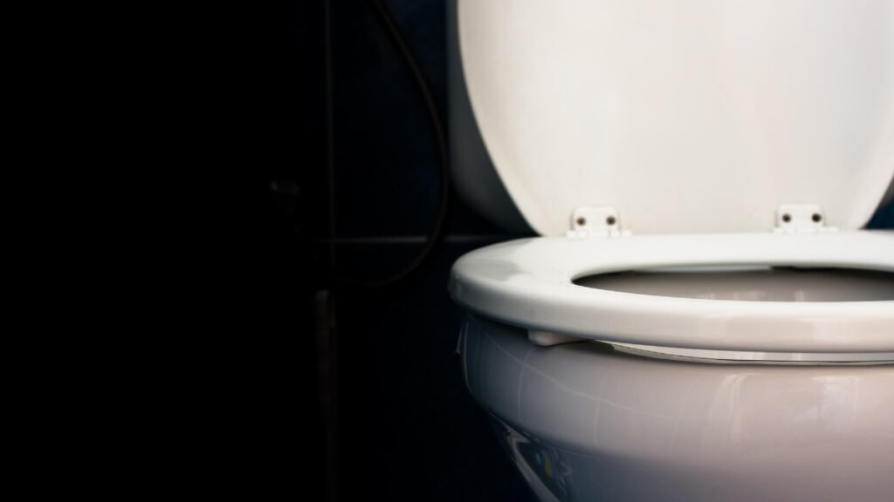

O banheiro é um dos espaços mais íntimos e importantes da nossa casa. É lá que começamos e terminamos o dia, buscando momentos de renovação. No **Irenes**, acreditamos que cada detalhe desse ambiente deve contribuir para a sua paz de espírito. Por isso, escolher o vaso sanitário ideal não é apenas uma questão técnica, mas um passo essencial para criar um santuário de harmonia e funcionalidade.

Se você está reformando ou construindo, este guia completo vai te ajudar a entender qual modelo melhor se adapta à sua rotina, garantindo beleza e praticidade.

## **Os Modelos de Vasos Sanitários: Qual Combina com seu Estilo?**

Existem diversas opções no mercado, e entender a diferença entre elas é o primeiro passo para uma escolha consciente.

### **1\. Vaso Sanitário com Caixa Acoplada**

Este é o modelo mais popular no Brasil. Sua principal vantagem é a **facilidade de manutenção**, já que o mecanismo de descarga fica acessível dentro da caixa. Além disso, costumam ser mais econômicos no consumo de água devido ao sistema de duplo acionamento (3 litros para líquidos e 6 litros para sólidos).

-   *Dica da Irene:* Ideal para quem busca praticidade e quer evitar quebra-quebra na parede no futuro.

### **2\. Vaso Sanitário Convencional (com Válvula de Parede)**

É aquele modelo onde a descarga fica embutida na parede. Ele ocupa menos espaço físico, sendo excelente para **banheiros pequenos ou lavabos**. A estética é mais limpa, porém, a instalação e manutenção da válvula exigem um cuidado maior com a tubulação.

### **3\. Vaso Monobloco (One Piece)**

Se você busca o ápice da elegância, o vaso monobloco é a escolha certa. Nele, a bacia e a caixa formam uma única peça fundida. Além do design sofisticado, eles são **mais fáceis de limpar**, pois não possuem fendas ou emendas onde a sujeira possa se acumular.

### **4\. Vaso Sanitário Suspenso**

Moderno e minimalista, este modelo é fixado na parede e não toca o chão. É a escolha favorita de arquitetos para projetos de alto padrão. Além do visual flutuante, ele permite a limpeza total do piso do banheiro, promovendo uma higiene impecável.

## **O Que Considerar Antes de Comprar? (Checklist de Especialista)**

Para garantir que a paz reine na sua instalação, observe estes pontos:

-   **Medidas do Ambiente:** Meça a distância entre a parede e o centro do cano de esgoto. O padrão brasileiro costuma ser de 30 cm.
    
-   **Conforto (**[**Ergonomia**](https://beecorp.com.br/ergonomia/)**):** Existem vasos com alturas diferentes. Para pessoas mais altas ou com dificuldade de locomoção, modelos "confort" (mais altos) são essenciais.
    
-   **Cor e Acabamento:** O branco é atemporal e traz sensação de limpeza. Cores como cinza matte ou preto fosco trazem modernidade, mas exigem uma limpeza mais frequente para não marcar.

## **Sustentabilidade: O Equilíbrio com o Planeta**

Cuidar da casa é também cuidar do mundo. Opte sempre por bacias que possuam o **sistema de descarga dual**. Essa pequena escolha pode reduzir o consumo de água da sua residência em até 60%, trazendo alívio para o meio ambiente e para o seu orçamento.

## **Transforme seu Banheiro em um Refúgio de Paz**

Escolher o vaso sanitário certo é o alicerce para um banheiro funcional e bonito. Quando unimos a técnica com o cuidado estético, transformamos um item utilitário em parte da nossa decoração afetiva.

**Gostou dessas dicas?** Aqui no Irenes, queremos que você se sinta empoderada para fazer as melhores escolhas para o seu lar.

**Dúvida rápida:** Você prefere a praticidade da caixa acoplada ou o visual moderno do vaso suspenso? Conte para nós nos comentários e vamos trocar experiências!
