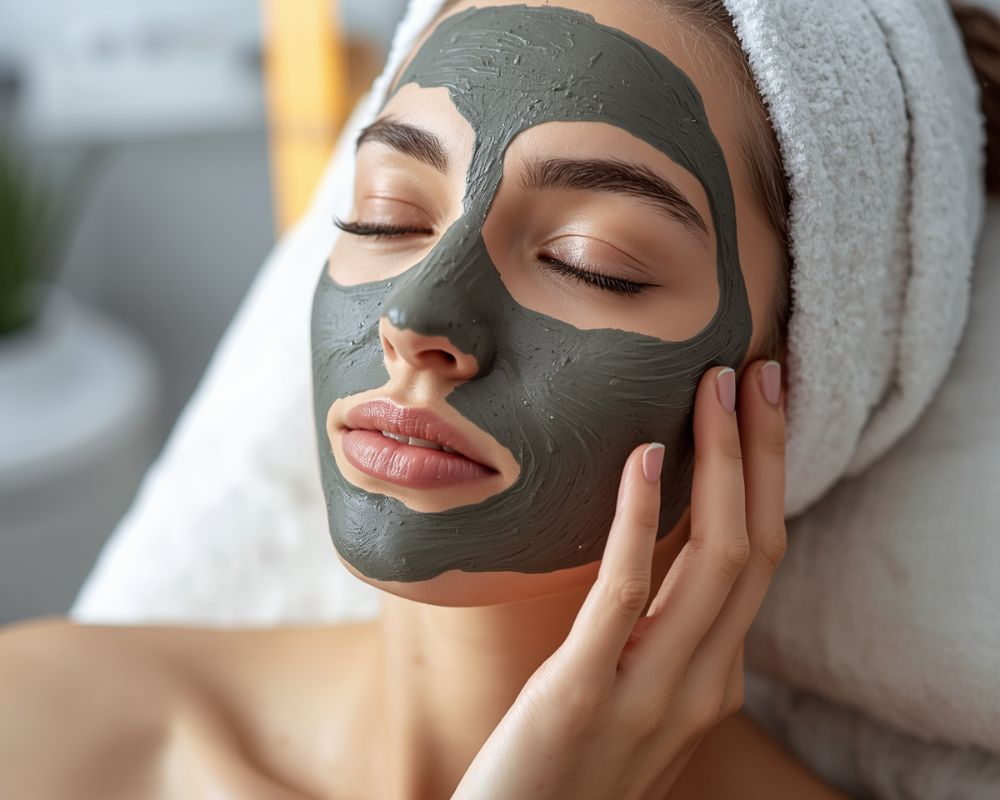
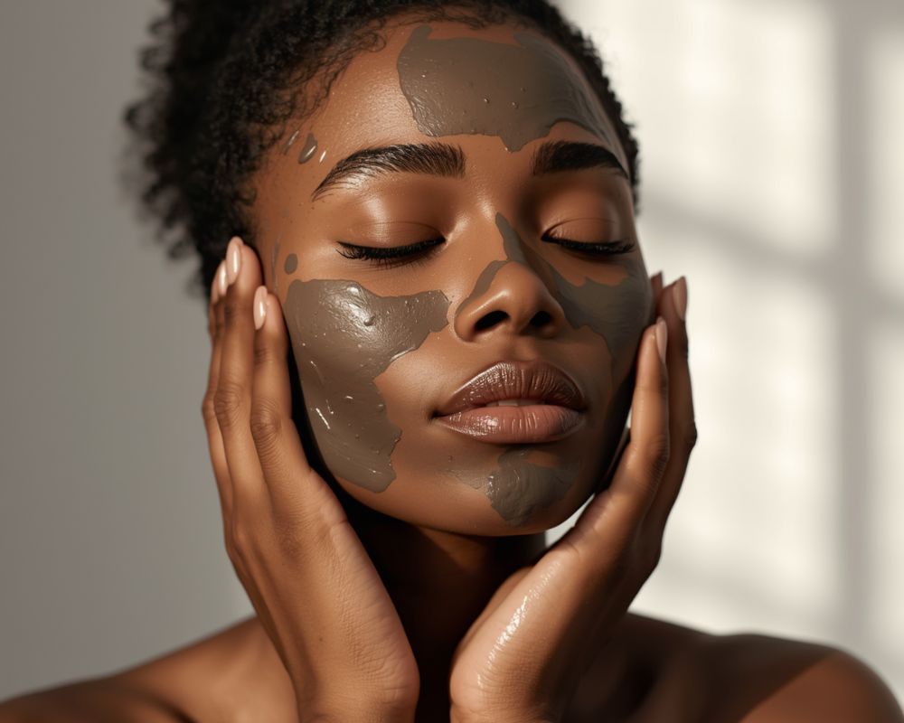

**Resposta rápida: Como fazer limpeza de pele em casa?**

Para fazer limpeza de pele em casa de forma eficaz e segura, siga um roteiro que inclui **limpeza, esfoliação, vaporização para abrir os poros, aplicação de máscara, tonificação e hidratação**. É fundamental escolher produtos adequados ao seu tipo de pele e realizar cada etapa com suavidade e atenção, evitando extrações agressivas que possam danificar a pele.

Ah, a sensação de uma pele limpa, fresca e radiante! Quem não ama? Em nosso ritmo de vida agitado, encontrar tempo para ir a uma esteticista pode ser um desafio. Mas e se eu te dissesse que você pode trazer essa sensação de spa para o conforto do seu lar, cultivando sua própria rotina de bem-estar? Aqui no Irenes, acreditamos que a paz e a beleza começam de dentro para fora, e cuidar da sua pele é um dos pilares desse equilíbrio.

A limpeza de pele em casa não é apenas um tratamento estético; é um ritual de autocuidado que nutre não só a sua pele, mas também a sua alma. É um momento para você se reconectar, respirar fundo e investir na sua saúde e confiança. Como sua amiga especialista em beleza e bem-estar, preparei um guia completo e detalhado para você dominar a arte da limpeza de pele caseira, transformando sua casa em um verdadeiro santuário de beleza e paz.

Vamos juntas descobrir os segredos para uma pele luminosa, purificada e saudável, usando apenas o que você tem ou pode adquirir facilmente. Prepare-se para uma experiência de renovação que vai além da superfície, refletindo-se em seu bem-estar geral!

## Benefícios da limpeza de pele caseira

Antes de mergulharmos no passo a passo, vamos entender por que dedicar um tempo à limpeza de pele em casa é tão valioso. Mais do que um capricho, é um investimento na saúde e na beleza da sua pele, com benefícios que se estendem ao seu bem-estar geral:

-   **Remoção Profunda de Impurezas:** Ao longo do dia, nossa pele acumula poluição, maquiagem, oleosidade e células mortas. A limpeza profunda remove essas impurezas que os sabonetes comuns não alcançam totalmente, prevenindo o entupimento dos poros.
    
-   **Prevenção de Cravos e Espinhas:** Com os poros limpos e desobstruídos, a chance de surgirem cravos e espinhas diminui significativamente.
    
-   **Melhora da Absorção de Produtos:** Uma pele limpa e esfoliada absorve muito melhor os cremes, séruns e hidratantes, potencializando seus efeitos.
    
-   **Renovação Celular:** A esfoliação regular estimula a renovação das células da pele, revelando uma camada mais jovem e saudável por baixo.
    
-   **Pele Mais Luminosa e Uniforme:** Ao remover células mortas e impurezas, a pele ganha mais viço, brilho natural e um tom mais uniforme.
    
-   **Estimula a Circulação:** Massagens faciais durante a limpeza podem melhorar a circulação sanguínea, trazendo mais nutrientes e oxigênio para a pele.
    
-   **Momento de Autocuidado e Relaxamento:** Mais do que um tratamento, é um ritual de paz. Dedicar-se à sua pele em casa é uma forma poderosa de aliviar o estresse e se reconectar consigo mesma, alinhando-se à nossa filosofia de bem-estar.
    
-   **Economia e Conveniência:** Realizar a limpeza em casa permite que você cuide da sua pele no seu tempo, sem agendamentos e com um custo muito mais acessível.

Viu como os benefícios vão muito além da estética? Uma pele bem cuidada reflete uma mulher que se ama e que busca harmonia em cada detalhe da sua vida.

## O que separar antes de começar

Para criar seu próprio spa em casa, você precisará de alguns itens essenciais. Não se preocupe, a maioria deles você já deve ter ou pode encontrar facilmente em farmácias e lojas de cosméticos. O segredo é escolher produtos adequados ao seu tipo de pele.

-   **Faixa de Cabelo ou Touca:** Para manter o cabelo afastado do rosto.
    
-   **Demaquilante ou Água Micelar:** Para remover maquiagem e impurezas superficiais.
    
-   **Sabonete Facial:** Específico para o seu tipo de pele (oleosa, seca, mista, sensível).
    
-   **Esfoliante Facial Suave:** Pode ser físico (com microesferas delicadas) ou químico (com ácidos suaves, como AHA ou BHA, se você já tiver experiência).
    
-   **Panos Macios ou Toalhas Pequenas:** Para compressas quentes e secar o rosto.
    
-   **Bacia com Água Quente (ou Vaporizador Facial):** Para abrir os poros.
    
-   **Máscara Facial:** Escolha uma que atenda às suas necessidades (argila para oleosidade, hidratante para ressecamento, calmante para sensibilidade).
    
-   **Tônico Facial:** Para equilibrar o pH da pele e fechar os poros.
    
-   **Hidratante Facial:** Leve para peles oleosas, mais denso para peles secas.
    
-   **Protetor Solar:** Indispensável para finalizar.
    
-   **Algodão ou Discos de Algodão:** Para aplicar produtos.
    
-   **Luvas Descartáveis (Opcional):** Se for fazer alguma extração muito superficial.

Com tudo à mão, você está pronta para iniciar seu ritual de beleza e paz!

## Passo a passo da limpeza caseira

Agora, vamos ao coração do nosso guia. Siga estes passos com carinho e atenção, e sinta a diferença em sua pele e em seu estado de espírito.

### Passo 1: Limpeza Profunda (Remoção da Maquiagem e Lavagem)

Comece removendo toda a maquiagem e as impurezas superficiais do seu rosto. Use um demaquilante bifásico para a região dos olhos e lábios, e uma água micelar ou demaquilante leve para o restante do rosto. Em seguida, lave o rosto com um sabonete facial adequado ao seu tipo de pele, massageando suavemente com as pontas dos dedos em movimentos circulares. Enxágue abundantemente com água fria ou morna e seque o rosto delicadamente com uma toalha limpa, sem esfregar.

### Passo 2: Esfoliação Suave para Renovação Celular

A esfoliação é crucial para remover as células mortas e desobstruir os poros, preparando a pele para os próximos passos. Aplique um esfoliante facial suave, massageando com movimentos circulares e leves, especialmente nas áreas mais oleosas como testa, nariz e queixo (zona T). Evite a área dos olhos e não aplique força excessiva, pois isso pode irritar a pele. Enxágue bem com água morna até remover todo o produto. Para peles sensíveis, um esfoliante enzimático (sem grânulos) pode ser uma ótima opção.

### Passo 3: Vaporização Facial para Abertura dos Poros

Este é o segredo para facilitar a remoção de impurezas. Ferva cerca de 1 litro de água em uma panela. Com a panela fora do fogo, posicione o rosto sobre o vapor, cobrindo a cabeça com uma toalha para concentrar o vapor. Mantenha uma distância segura para não queimar a pele (cerca de 20-30 cm). Permaneça assim por 5 a 10 minutos. O vapor ajudará a dilatar os poros, amolecendo cravos e facilitando a limpeza. Se tiver um vaporizador facial, siga as instruções do aparelho. Adicionar algumas gotas de óleo essencial de lavanda ou camomila na água pode potencializar o relaxamento.

### Passo 4: Extração Cautelosa de Cravos (Se Necessário e com Cuidado)

**ATENÇÃO: Este passo exige o máximo de cuidado.** A extração caseira deve ser feita apenas em cravos pretos (comedões abertos) que estejam superficiais e prontos para sair. **Nunca tente extrair espinhas inflamadas ou cravos profundos**, pois isso pode causar lesões, infecções e cicatrizes. Enrole os dedos indicadores em gazes ou algodão limpo e pressione suavemente as laterais do cravo, de baixo para cima. Se ele não sair com facilidade, não insista! É melhor deixar para um profissional. Após a extração, limpe a área com um algodão embebido em tônico ou água termal para acalmar a pele.

### Passo 5: Máscara Facial: Nutrição e Calma para Sua Pele

Com os poros limpos e abertos, este é o momento perfeito para nutrir sua pele. Aplique uma máscara facial de sua preferência. Máscaras de argila verde são ótimas para peles oleosas e com acne, argila branca para peles sensíveis e secas, e máscaras hidratantes para todos os tipos de pele. Deixe agir pelo tempo indicado na embalagem (geralmente 10-20 minutos). Aproveite este momento para relaxar, meditar ou simplesmente desfrutar do silêncio. Retire a máscara com água morna e uma esponja macia ou algodão.

### Passo 6: Tonificação para Equilibrar o pH

Após a máscara, a pele pode ter seu pH alterado. O tônico facial entra para reequilibrar, fechar os poros e remover qualquer resíduo restante. Aplique o tônico com um algodão, dando leves batidinhas por todo o rosto, exceto na área dos olhos. Escolha um tônico sem álcool para evitar ressecamento e irritação.

### Passo 7: Hidratação Intensa para Finalizar

A hidratação é a etapa final e essencial para selar todos os benefícios da limpeza. Aplique um hidratante facial adequado ao seu tipo de pele, massageando suavemente até completa absorção. A hidratação restaura a barreira protetora da pele, deixando-a macia, luminosa e protegida.

### Passo 8: Proteção Solar Essencial

Se você realizar a limpeza durante o dia, finalize com um bom protetor solar. A pele recém-limpa e esfoliada está mais sensível aos raios UV, e a proteção solar é fundamental para prevenir manchas, envelhecimento precoce e garantir a saúde da sua pele.

## Cuidados Específicos para Cada Tipo de Pele na Limpeza Caseira

A beleza da limpeza de pele em casa é que você pode personalizá-la. Lembre-se, cada Irene tem suas particularidades!

-   **Pele Oleosa/Acneica:** Priorize produtos com controle de oleosidade e ingredientes como ácido salicílico. Máscaras de argila verde são excelentes. Evite produtos muito oleosos ou comedogênicos. Seja ainda mais cautelosa com extrações para não espalhar bactérias.
    
-   **Pele Seca/Sensível:** Opte por produtos suaves, sem álcool e fragrâncias. Esfoliantes enzimáticos são melhores que os físicos. Máscaras hidratantes e nutritivas são ideais. Reduza o tempo de vaporização e evite qualquer tipo de extração.
    
-   **Pele Mista:** Você pode usar produtos diferentes para cada área do rosto (zona T oleosa, bochechas secas). Uma máscara de argila na zona T e uma hidratante nas bochechas é uma boa estratégia.
    
-   **Pele Madura:** Foque em produtos que promovam hidratação e firmeza. Esfoliantes suaves e máscaras ricas em antioxidantes são ótimos.

## Erros Comuns a Evitar na Limpeza de Pele em Casa

Para garantir que sua experiência seja sempre positiva e benéfica, fique atenta a esses pontos:

-   **Excesso de Força na Esfoliação:** Esfregar demais pode irritar a pele e causar microlesões. Seja suave.
    
-   **Extração Inadequada:** Como já mencionamos, não tente extrair cravos ou espinhas que não estejam prontos. Isso pode levar a cicatrizes e infecções.
    
-   **Uso de Produtos Agressivos:** Ingredientes muito fortes, como álcool em excesso, podem ressecar e sensibilizar a pele.
    
-   **Não Hidratar a Pele Após a Limpeza:** A hidratação é fundamental para restaurar a barreira cutânea e evitar o efeito rebote (produção excessiva de oleosidade).
    
-   **Frequência Exagerada:** Fazer a limpeza de pele com muita frequência pode desequilibrar a pele.
    
-   **Compartilhar Utensílios:** Garanta que todos os itens que tocam seu rosto estejam limpos e sejam de uso pessoal.

## Frequência Ideal e Manutenção dos Resultados

A frequência ideal para a limpeza de pele em casa varia de acordo com seu tipo de pele e suas necessidades. Em geral, recomenda-se realizar uma limpeza profunda a cada **15 a 30 dias**. Peles mais oleosas podem se beneficiar de uma frequência maior (a cada 15 dias), enquanto peles secas e sensíveis podem fazê-lo mensalmente.

Para manter os resultados entre uma limpeza e outra, adote uma rotina diária de cuidados:

-   **Limpeza diária:** Lave o rosto duas vezes ao dia com um sabonete suave.
    
-   **Tonificação:** Use um tônico para equilibrar a pele.
    
-   **Hidratação:** Hidrate a pele diariamente, mesmo que seja oleosa.
    
-   **Proteção Solar:** Use protetor solar todos os dias, faça chuva ou faça sol.
    
-   **Alimentação e Água:** Uma dieta equilibrada e a ingestão adequada de água se refletem na saúde da sua pele.

Cuidar de você é um ato de amor, e sua pele é um reflexo desse carinho. Ao incorporar a limpeza de pele em casa na sua rotina, você não está apenas melhorando a aparência, mas também cultivando um momento de paz e conexão consigo mesma. Essa é a essência do Irenes: encontrar a beleza na harmonia e no autocuidado. Sinta-se radiante, sinta-se em paz!

## Perguntas Frequentes sobre Limpeza de Pele em Casa

### Sequência para fazer limpeza de pele em casa

A melhor sequência para fazer limpeza de pele em casa envolve oito passos essenciais: 1. Limpeza profunda (demaquilar e lavar), 2. Esfoliação suave, 3. Vaporização facial para abrir os poros, 4. Extração cautelosa de cravos (se necessário), 5. Aplicação de máscara facial, 6. Tonificação para equilibrar o pH, 7. Hidratação intensa, e 8. Proteção solar (se for dia).

### Quais produtos usar na limpeza

Para uma limpeza de pele em casa, você precisará de demaquilante ou água micelar, sabonete facial, esfoliante suave, máscara facial (argila, hidratante), tônico facial, hidratante e protetor solar. É fundamental escolher produtos específicos para o seu tipo de pele para otimizar os resultados e evitar irritações.

### Pode fazer limpeza de pele caseira toda semana?

Não é recomendado fazer uma limpeza de pele caseira completa toda semana, pois isso pode agredir e desequilibrar a barreira natural da sua pele. A frequência ideal varia de 15 a 30 dias, dependendo do seu tipo de pele. Peles oleosas podem se beneficiar de um intervalo menor, enquanto peles secas e sensíveis devem manter um intervalo maior.

### Como abrir os poros para fazer limpeza de pele?

A forma mais eficaz de abrir os poros para fazer limpeza de pele é através da vaporização facial. Ferva água em uma panela, retire do fogo e posicione o rosto sobre o vapor por 5 a 10 minutos, cobrindo a cabeça com uma toalha. O calor e a umidade dilatam os poros, amolecendo as impurezas e facilitando a remoção.

### É seguro fazer extração de cravos em casa?

A extração de cravos em casa é segura apenas se feita com extrema cautela e em cravos superficiais (pretos) que saiam facilmente. Nunca tente extrair espinhas inflamadas ou cravos profundos, pois isso pode causar infecções, inflamações, manchas e cicatrizes. Se houver dificuldade, é melhor não insistir e procurar um profissional.

### Qual a importância da hidratação após a limpeza de pele?

A hidratação após a limpeza de pele é de suma importância para restaurar a barreira cutânea, repor a umidade perdida e acalmar a pele. Ela ajuda a selar os benefícios dos passos anteriores, prevenindo o ressecamento, a irritação e o efeito rebote de oleosidade, deixando a pele macia, protegida e luminosa.
