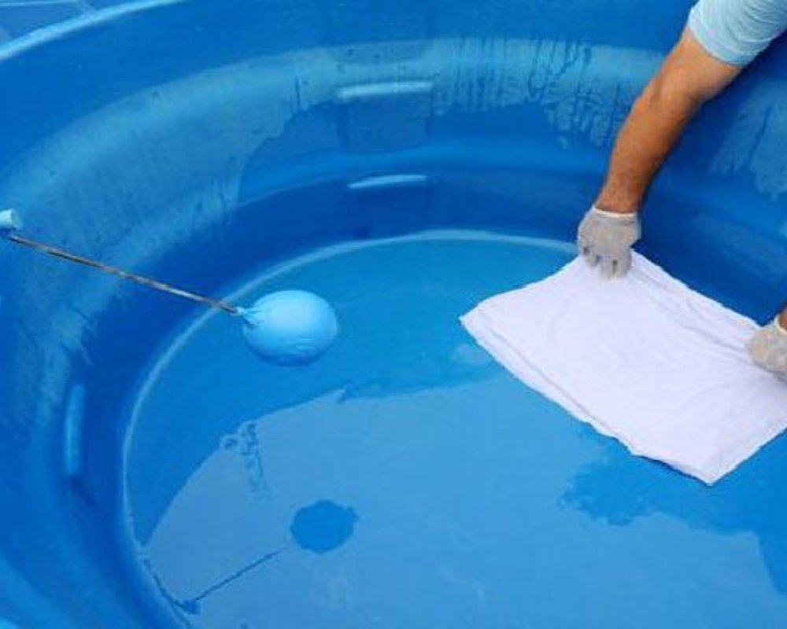

Você já parou para pensar na importância da limpeza de caixa d'água? Se a sua resposta for não, é melhor você prestar atenção! Essa tarefa pode parecer chata e sem graça, mas é fundamental para garantir que a água que chega até você seja saudável e livre de impurezas. Imagina só tomar um copo d'água turva ou cheia de sujeira? Não dá, né?

Neste artigo, vamos te mostrar um passo a passo simples e eficiente para deixar sua caixa d'água brilhando. Prepare-se para transformar essa tarefa em algo prático e até divertido! Vamos nessa?

## Limpeza de Caixas D'água

A limpeza de caixas d'água é um assunto sério que merece nossa atenção. Esse espaço, muitas vezes esquecido, pode se tornar um celeiro de bactérias e sujeira se não receber os cuidados necessários. Afinal, a água armazenada ali é o que consumimos diariamente.  
  
Desapegar da ideia de que isso é apenas mais uma tarefa doméstica chata pode ser libertador! Com algumas dicas simples e práticas, você transforma essa obrigação em um ritual saudável para toda a família. Vamos descobrir como fazer isso?

## Principais Riscos da Limpeza Tradicional

A limpeza tradicional da caixa d'água pode parecer simples, mas esconde riscos que muitos ignoram. Usar produtos inadequados ou técnicas erradas pode contaminar a água, colocando em risco a saúde da família. Imagine abrir uma torneira e ver água suja saindo!  
  
Além disso, não tomar os devidos cuidados durante o processo pode resultar em acidentes. Escorregões e quedas são comuns quando se trabalha sem atenção nas alturas! Limpar é essencial, mas é preciso fazer isso com responsabilidade e segurança para evitar problemas maiores no futuro.

## Benefícios do Serviço de Limpeza de Caixas D'água

Quando falamos sobre a [limpeza de caixas d'água](https://limpezadecaixasdagua.eco.br/d/), os benefícios vão muito além da estética. Um serviço bem feito garante água limpa e saudável para toda a família. Isso significa menos risco de doenças e uma qualidade de vida melhor.  
  
Além disso, ao optar por profissionais, você evita surpresas desagradáveis durante o processo. Eles têm equipamentos adequados e técnicas especializadas que garantem eficiência. Assim, sua caixa d'água fica impecável sem dores de cabeça! É tudo pelo bem-estar do lar!

## Qualidade da Água e Limpeza da Caixa D'água

A qualidade da água que consumimos está diretamente ligada à limpeza da nossa caixa d'água. Muitas vezes, esquecemos que esse espaço pode acumular sujeira e impurezas, comprometendo a saúde de toda a família. Ninguém quer beber água com gosto de barro!  
  
Além disso, uma caixa suja pode ser o lar perfeito para bactérias. Isso mesmo! Para garantir um líquido fresco e saudável, é fundamental manter essa área em dia. Uma pequena atitude pode fazer toda a diferença na sua hidratação diária!

## 10 Passos Simples para a Limpeza da Caixa D'água

Limpar a caixa d'água pode parecer um desafio, mas com esses 10 passos simples, você vai tirar de letra! Comece preparando o material necessário: baldes, esponjas e água sanitária. Feche a entrada de água e esvazie parcialmente a caixa para facilitar.  
  
Agora é hora da ação! Bloqueie a saída para tubulação e lave bem as paredes internas. Remova toda sujeira acumulada antes de adicionar água misturada com cloro. Assim, sua caixa ficará brilhando e pronta para abastecer sua casa com água limpa!

### 1 - Prepare o material

Antes de mergulhar na limpeza da sua caixa d'água, é essencial reunir todo o material necessário. Afinal, a preparação é a chave para um trabalho bem-feito! Você vai precisar de escova com cerdas macias, balde, água sanitária e luvas. As luvas vão proteger suas mãos de produtos químicos e sujeira.  
  
E não se esqueça dos panos ou esponjas! Eles são ótimos aliados para remover aquele lodo indesejado que insiste em ficar grudado. Com tudo em mãos, você estará pronto para transformar sua caixa em um local limpo e seguro novamente.

### 2 - Feche a entrada de água

Antes de começar a limpeza, é crucial fechar a entrada de água da caixa d'água. Imagine só, você lá com as mãos na massa e um jato inesperado te surpreendendo! Para evitar esse tipo de situação embaraçosa, pegue sua chave ou alavanca e feche o registro.  
  
Lembre-se: essa etapa pode parecer simples, mas garante que você não vire uma "chuva interna" enquanto tenta limpar. Com tudo em ordem, agora sim podemos seguir para o próximo passo dessa missão essencial!

### 3 - Esvazie parcialmente a caixa

Esvaziar parcialmente a caixa d'água é um passo crucial na limpeza. Isso não significa que você precisa jogar toda a água fora, mas sim reduzir o nível para facilitar o trabalho. Com isso, fica mais fácil alcançar todos os cantinhos e eliminar sujeiras acumuladas.  
  
Use uma bomba ou balde para retirar essa quantidade de água. Lembre-se: quanto menos água tiver, mais eficaz será sua limpeza! E não se esqueça de guardar essa água limpa em algum recipiente, aproveitando-a para regar plantas ou outras utilidades.

### 4 - Bloqueie a saída para a tubulação

Antes de começar a limpeza, é fundamental bloquear a saída da tubulação. Isso evita que toda a sujeira e os detritos que você vai remover voltem para as torneiras da sua casa. Imagine abrir uma torneira e ver aquele “café com leite” saindo!  
  
Use um pano ou fita adesiva para vedar bem essa saída. É uma tarefa simples, mas crucial para garantir que sua limpeza seja eficaz. Afinal, ninguém quer passar pelo trabalho todo e depois ser surpreendido por água contaminada!

### 5 - Lave a caixa

Agora que você já esvaziou parcialmente a caixa d'água, é hora de entrar em ação! Use uma vassoura ou escova com cabo longo para alcançar todos os cantinhos. Não tenha medo de colocar as mãos na massa e se divertir um pouco nessa limpeza.  
  
Enquanto isso, aproveite para cantar sua música favorita. A lavagem da caixa não precisa ser chata! Uma boa esfregada vai ajudar a remover sujeiras e resíduos acumulados ao longo do tempo, deixando tudo pronto para o próximo passo.

### 6 - Remova a sujeira

Agora que você lavou a caixa d'água, é hora de colocar a mão na massa e remover a sujeira acumulada. Use uma escova de cerdas macias ou um pano limpo para alcançar os cantinhos mais difíceis. Não tenha medo de encarar aquela camada grudenta!  
  
Enquanto limpa, aproveite para sentir o poder da água fresca e pura. Imagine como será incrível beber essa água depois de todo esse trabalho duro! Quanto mais caprichar nessa etapa, melhor será sua saúde hídrica.

### 7 - Encha a caixa com 1/3 de água e adicione água sanitária

Agora que sua caixa d'água está limpinha, é hora de prepará-la para o próximo passo! Encha a caixa com um terço de água. Isso vai ajudar na diluição da água sanitária e facilitar a desinfecção.  
  
Adicione uma quantidade adequada de água sanitária. Não precisa exagerar, mas também não pode ser pouco! Misture bem e deixe agir por pelo menos 30 minutos. Assim, você garante que seu reservatório fique livre de bactérias indesejadas e pronto para abastecer sua casa com segurança.

### 8 - Desinfete (água clorada)

Agora é hora de entrar na parte divertida: a desinfecção! Com a água clorada, você dá um passo crucial na limpeza da sua caixa d'água. Misture bem e espalhe essa solução mágica por toda a caixa.  
  
Deixe agir por pelo menos 30 minutos. Isso garante que as bactérias e fungos não tenham chance de sobreviver. Pense nisso como uma festa para os germes, mas eles não estão convidados! Ao final do tempo, o ambiente estará seguro para receber a água limpa novamente.

### 9 - Desinfete a tubulação

Após desinfetar a caixa d'água, é hora de dar atenção à tubulação. Afinal, de que adianta uma água limpa se o caminho dela estiver sujo? Utilize água sanitária diluída para garantir que todas as impurezas sejam eliminadas.  
  
Despeje essa solução pela entrada do cano e deixe agir por um tempo. É como dar um banho refrescante na sua tubulação! Assim, você assegura que a água chegue até sua torneira livre de bactérias e sujeiras indesejadas. Um cuidado simples que faz toda a diferença!

### 10 - Encha novamente e tampe

Depois de todo esse trabalho, é hora de encher a caixa d'água novamente. Com cuidado, abra a entrada e veja a água fresca entrar. É um momento gratificante! Você fez o serviço direito e agora pode relaxar enquanto observa tudo se acomodar.  
  
Enquanto isso, não esqueça de tampar bem a caixa assim que estiver cheia. Isso evita contaminações futuras e mantém sua água limpa por mais tempo. Agora você está pronto para desfrutar da pureza da sua água tratada!

## Conclusão

Manter a limpeza da sua caixa d'água é essencial para garantir água de qualidade e saúde para você e sua família. Ao seguir os passos simples que apresentamos, você transforma uma tarefa que pode parecer complicada em algo rápido e eficiente.  
  
Lembre-se de realizar essa limpeza regularmente, pois isso evita problemas maiores no futuro. Se preferir, considere contratar um serviço especializado para garantir que tudo seja feito com segurança e eficácia. Com essas dicas em mente, agora é hora de mãos à obra! Água limpa traz vida saudável!
