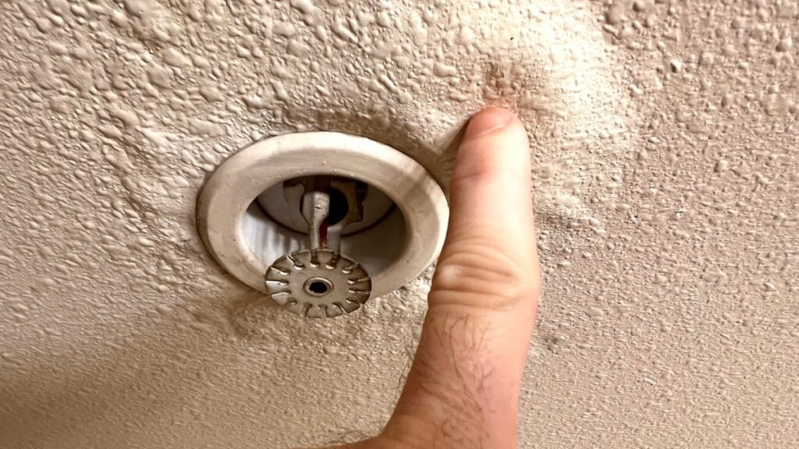

Ei, Irenes! A gente ama falar sobre como deixar a casa linda, organizada e com aquela *vibe* de paz que a gente tanto merece, certo? Mas e quando um inimigo invisível ameaça tudo isso? Estamos falando dele: o **vazamento de água**.

Parece um detalhe, mas acredite: um vazamento oculto é tipo um *vilão silencioso* que rouba seu dinheiro, sua paciência e a harmonia do seu lar.

Vem descobrir por que acionar um serviço de **Caça Vazamentos** não é só manutenção, é um verdadeiro **autocuidado inteligente** com a sua casa e com o seu bolso!

## O Pesadelo na Fatura: Seu Dinheiro Indo Pelo Ralo!

Você abriu a fatura da água e o valor fez você cair para trás? Se não houve festas, piscina ou maratona de banhos demorados, seu problema tem nome e sobrenome: **vazamento de água**.

Mas o buraco é mais embaixo (literalmente!):

-   **A Fatura Assustadora:** É o sintoma mais claro do roubo. Você paga por uma água que nem usou, e isso é estresse financeiro na veia.
-   **A Tensão da Reforma:** Vazamento gera mofo, bolor e destrói aquela parede que você pintou com tanto carinho. Ter que quebrar tudo na correria? **Estresse nível máximo!**
-   **A Vibe Estragada:** Cheiro de umidade, pisos estragados... Tchau, decoração harmoniosa! A casa vira um campo de batalha, e a paz some rapidinho.

**Resumo da Ópera:** Um vazamento não é só um cano furado. É o ladrão da sua **paz financeira** e da sua organização!

## Detetive do Lar: 5 Sinais de Que a Água Não Está Amigável

Você não precisa de superpoderes para desconfiar. O segredo da **Organização Inteligente** é a observação! Fique de olho nestes "pistas" que a casa dá antes de um desastre:

| Pista de Vazamento | O Que Observar |
| --- | --- |
| A Conta Que Não Bate | Aumento absurdo sem explicação. Faça o teste do hidrômetro! (Pesquise no Google como fazer, é rápido!) |
| Manchas e Mofo Atrevidos | Aparecimento súbito de umidade ou mofo em lugares que nunca foram úmidos (perto do chão, rodapés). |
| Barulhinho de Mistério | Escuta um “pssss” ou um “tic-tic-tic” constante, mesmo de madrugada, com tudo desligado? |
| Paredes e Pisos Estufados | A pintura cria bolhas ou o rejunte do piso escurece ou se solta, mostrando que tem água por baixo. |
| O Chão Sempre Frio/Molhado | Uma área do piso que está sempre mais gelada ou úmida que o resto. |

## O Super-Herói da Hidráulica: **Caça Vazamentos**

Chegou a hora de chamar o reforço! Antigamente, procurar um vazamento era sinônimo de "chamar o pedreiro e quebrar metade da casa". Mas hoje, o serviço de **Caça Vazamentos** é pura tecnologia e inteligência!

É o melhor atalho para **restaurar rapidamente a paz do lar** e poupar seu dinheiro.

### Por que o **Caça Vazamentos** é Autocuidado?

Os profissionais usam ferramentas futuristas (tipo ultrassom e geofones) para *escutar* e *enxergar* o vazamento atrás da parede, **sem quebrar nada antes de ter certeza**.

Para garantir que você tenha acesso a essa tecnologia de ponta e resolva o problema de forma definitiva, é essencial buscar empresas de serviços de confiança. Se você está em busca de especialistas que aliam tecnologia e agilidade, você pode, por exemplo, procurar uma excelente [Desentupidora Curitiba](https://desentupidoradecuritiba.eco.br/) ou um serviço de manutenção residencial de excelência na sua região.

**Isso significa:**

1.  **Zero Estresse de Quebra-Quebra:** O reparo é pontual. Apenas um pequeno remendo em vez de uma grande obra.
2.  **Economia Real e Imediata:** Você para de desperdiçar água e o valor da fatura volta ao normal. Seu orçamento agradece!
3.  **Saúde do Lar:** Acabando com a fonte de umidade, você elimina o mofo e garante um ar mais puro, cumprindo o seu **autocuidado consciente**.

**Moral da história:** Um vazamento é um problema que não melhora com o tempo, só piora. Agir rápido e de forma inteligente com um **Caça Vazamentos** é o maior gesto de amor e organização que você pode ter pelo seu lar. Mantenha a casa zen, o bolso tranquilo e a vida em harmonia!
