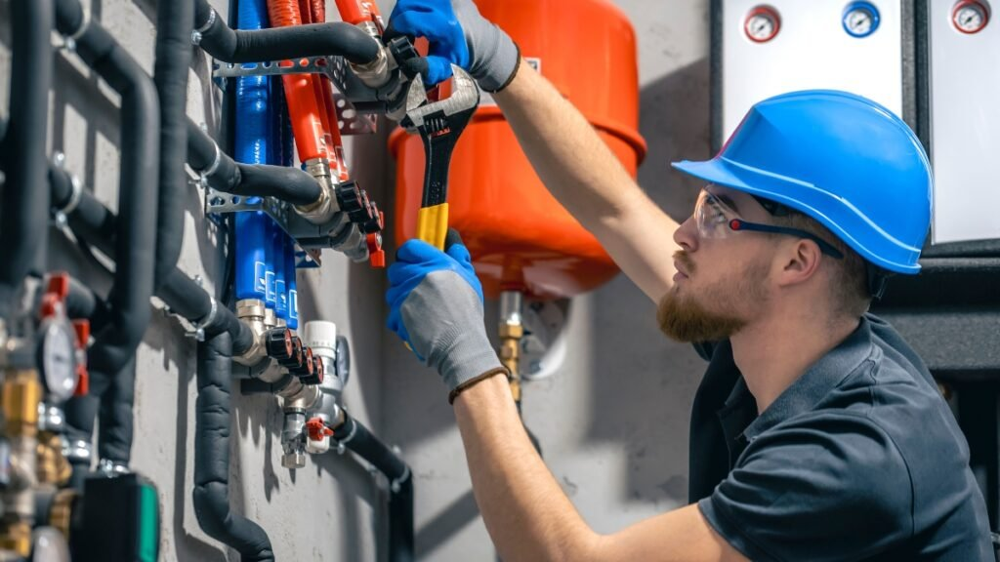

Manter a paz no lar vai muito além de uma decoração bonita ou uma rotina de skincare relaxante. Existe uma "beleza invisível" que garante que tudo flua em harmonia: o bom funcionamento das **estruturas hídricas**.

Seja a caixa d'água, as tubulações ou a cisterna, esses elementos são as artérias da nossa casa. Quando negligenciamos sua manutenção, abrimos porta para estresses desnecessários, como infiltrações, desperdício de água e até riscos à saúde. Neste guia, vamos te mostrar como cuidar desses itens para que durem muito mais e tragam tranquilidade para o seu dia a dia.

## **Por que a manutenção das estruturas hídricas é um ato de cuidado?**

Imagine acordar para um momento de autocuidado e descobrir uma mancha de umidade na parede ou um chuveiro com pouca pressão. Frustrante, não é? Cuidar das estruturas que transportam e armazenam água é preservar o seu **patrimônio** e a saúde de quem você ama.

Estruturas bem cuidadas evitam o crescimento de fungos e bactérias, além de impedir que a deterioração precoce de materiais (como o concreto de cisternas ou o PVC de canos) exija reformas caras e barulhentas.

## **Dicas Práticas para Preservar Caixas d'Água e Tubulações**

Para prolongar a vida útil do sistema hidráulico, a palavra de ordem é **prevenção**. Confira três pilares fundamentais:

### **1\. Limpeza Periódica: A base da saúde hídrica**

A recomendação padrão é que a caixa d'água seja limpa a cada **6 meses**. O acúmulo de sedimentos no fundo do tanque pode causar corrosão em conexões metálicas e entupimentos. Além disso, uma caixa bem vedada impede a entrada de insetos e detritos, mantendo a água, e a estrutura, limpas por mais tempo.

### **2\. Atenção aos Vazamentos Invisíveis**

Pequenos gotejamentos podem parecer inofensivos, mas a pressão constante da água em locais indevidos acelera a degradação de paredes e pisos.

-   **Dica Irenes:** Faça o teste do relógio de água (hidrômetro). Feche todas as torneiras e veja se o ponteiro continua girando. Detectar um problema cedo economiza dinheiro e evita o desgaste estrutural.

### **3\. Proteção Contra Agentes Externos (Impermeabilização)**

Estruturas de concreto, como cisternas ou caixas d'água em prédios, precisam de impermeabilização de qualidade. Com o tempo, a água pode infiltrar na armadura de ferro do concreto, causando oxidação. Reaplicar o impermeabilizante conforme a recomendação técnica é o que garante que a estrutura dure décadas.

## **Sinais de que sua casa precisa de atenção profissional**

Ficar atenta aos sinais que a casa dá é essencial para manter a harmonia. Procure ajuda se notar:

-   **Queda súbita na pressão da água:** Pode indicar obstruções ou furos na tubulação.
    
-   **Manchas escuras ou bolhas na pintura:** Sinais claros de infiltração ativa.
    
-   **Água com coloração ou odor:** Indica que o reservatório pode estar comprometido ou contaminado.

**Importante:** Assim como cuidamos da nossa pele com produtos específicos, as tubulações também sofrem com produtos químicos agressivos. Evite o uso excessivo de desentupidores corrosivos, que podem "derreter" canos antigos de PVC.

## **Conclusão: Harmonia e Segurança no seu Santuário**

Prolongar a vida útil das estruturas hídricas é, em essência, garantir que a **paz** (ou a "Irene") do seu lar não seja interrompida. Com inspeções simples e limpezas regulares, você transforma sua casa em um ambiente mais sustentável, econômico e seguro.

Afinal, uma casa em harmonia é aquela onde tudo, inclusive o que não vemos, funciona com fluidez e leveza. Mas lembre-se, se precisar contratar uma empresa especializada em estruturas hídricas, busque referências, com a [Universo Ambiental](https://www.universoambiental.eco.br/), para evitar dores de cabeça desnecessárias.
