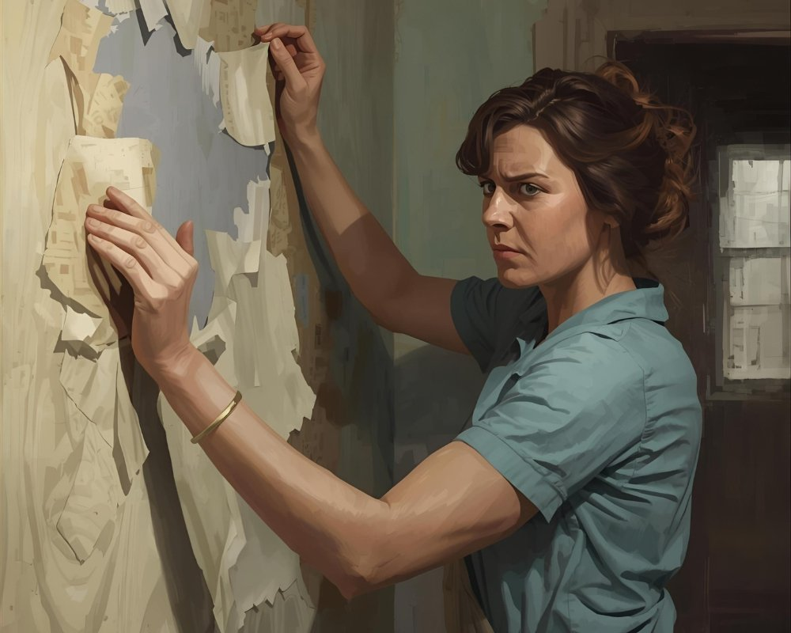
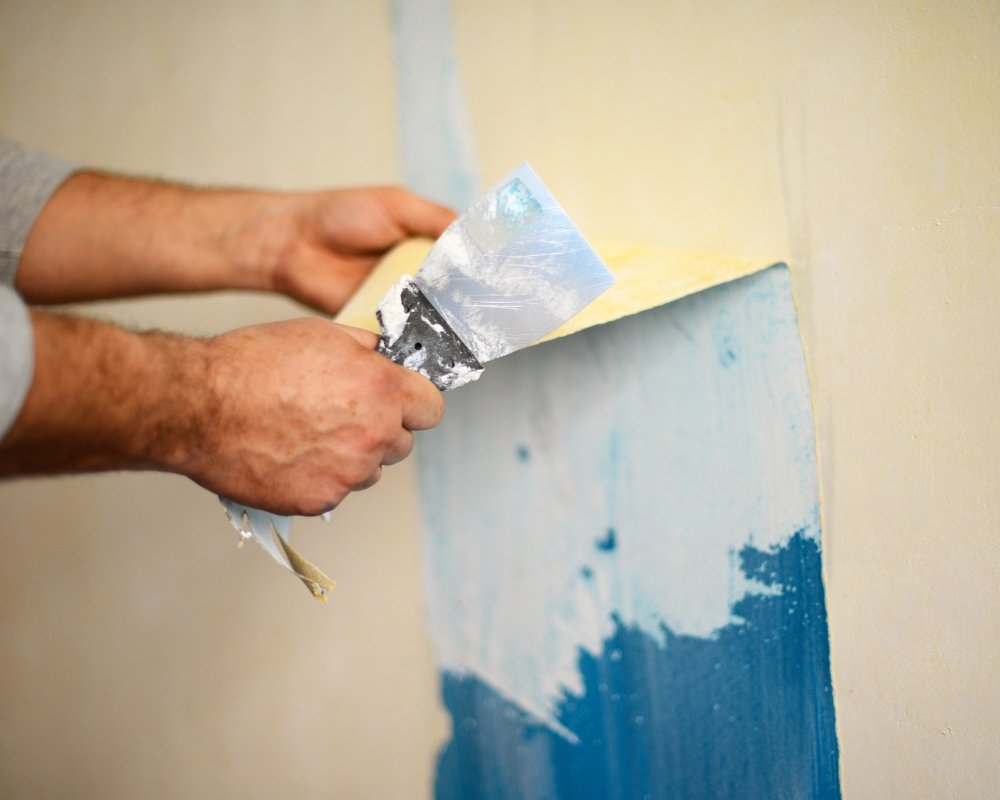

Quer dar adeus ao papel de parede sem transformar a parede num pesadelo de reformas? É possível, e mais simples do que você imagina, seguindo cinco passos práticos: preparar o ambiente, identificar o tipo de papel, usar as ferramentas e soluções certas, remover cuidadosamente sem danificar a superfície e limpar os resíduos para deixar a parede pronta para o próximo acabamento.

Saber como tirar papel de parede com calma e técnica evita prejuízos, economiza tempo e dinheiro e reduz o risco de estragar a pintura; nas próximas seções você aprenderá em detalhes o que proteger antes de começar, como reconhecer o material, quais produtos e ferramentas usar, o passo a passo de remoção e as melhores soluções para lidar com cola e pequenos reparos.

## 1\. Preparar o ambiente: Proteção, avaliação e escolha do método

Antes de começar a remover papel de parede, é importante organizar o local: os móveis devem ser afastados, rodapés e piso cobertos com lona e fita; assim evita-se sujeira e possíveis danos. Deve-se também avaliar o tipo de revestimento presente na parede para escolher a técnica adequada, evitando estragos desnecessários.

### Checklist prático para iniciar sem sustos

Primeiro, inspeciona-se a superfície para identificar o tipo de papel, vinílico, tecido ou papel comum, e verificar se há tinta por baixo. Essa análise indica se será necessário usar água morna, removedor químico ou amaciante. Enquanto isso, recomenda-se preparar o ambiente para reduzir poeira e proteger tomadas, bases elétricas e móveis.

Em seguida, reúne-se as ferramentas essenciais: espátula, rolo perfurador, balde, escova e panos. Para evitar acidentes, é melhor desligar tomadas e cobrir interruptores. Essa etapa garante que o processo de remoção seja mais eficiente, seguro e que a superfície fique pronta para os próximos passos.

Prepare o ambiente: proteger a base evita retrabalhos e facilita remover papel com menos esforço.

-   Retirar móveis e objetos do ambiente
    
-   Proteger pisos e rodapés com lona e fita
    
-   Identificar o tipo de papel e a presença de tinta
    
-   Reunir ferramentas: espátula, rolo perfurador, balde, escova e panos

Com o espaço devidamente preparado e a técnica escolhida, inicia o procedimento para tirar o papel de parede com mais segurança e sem tantas surpresas, curioso que pareça algumas superfícies pedem mesmo um cuidado a mais.

## 2\. Soltar o papel: Técnicas iniciais com água morna e perfuração

Começa-se molhando o papel com água morna: passe o rolo embebido e, em seguida, perfure levemente com um raspador para que a umidade penetre melhor. Curiosamente, essa etapa inicial costuma tornar o restante do trabalho muito mais simples.

Faça uma mistura de água morna no balde e aplique de forma generosa; aguarde alguns minutos antes de puxar as tiras. Para papéis mais difíceis de soltar, use um rolo perfurador para que a água alcance a cola com mais eficiência. Em muitos casos isso reduz bastante a necessidade de recorrer a removedores químicos.

Ao puxar o papel, mantenha a espátula em um ângulo baixo e trabalhe em faixas, tirando pequenas porções de cada vez. Se houver resistência reaplique água morna e espere mais alguns minutos antes de tentar novamente; assim diminui-se o risco de rasgar a camada de base e evita-se danos desnecessários.

Deixe agir alguns minutos depois da aplicação de agua morna para que a cola facilitar o desprendimento.

Quando o papel sair com facilidade, o resto do processo flui mais rápido e a possibilidade de estragar a parede cai consideravelmente.

## 3\. Aplicar removedores: Vinagre, amaciante, gel ou removedor químico

Se a água morna não der conta, pode-se recorrer a soluções específicas: vinagre quente diluído, amaciante diluído ou um removedor químico mais forte; a escolha depende do tipo de papel e dos cuidados necessários para proteger a base.

Uma opção caseira bastante utilizada mistura partes iguais de água morna e amaciante, ou água morna com vinagre quente; aplica-se na área, espera-se alguns minutos e só então raspa-se com cuidado. Curiosamente, essa combinação costuma amolecer bastante a cola e evita o recurso imediato a produtos agressivos, sempre lembrando de testar antes em um cantinho.

Quando o papel estiver muito resistente, recomenda-se o uso de um gel removedor específico, aplique conforme a instrução do fabricante e aguarde o tempo indicado antes de remover. Por outro lado, é essencial proteger a área e manter o ambiente ventilado; seguir corretamente a instrução reduz riscos e facilita retirar o papel sem comprometer a base.

Siga a instrução do produto químico e faça teste: isso evita problemas sérios na base.

-   Vinagre quente (diluído) Amaciante (diluído) Gel removedor ou produtos químicos
    
-   Vinagre quente (diluído)
    
-   Amaciante (diluído)
    
-   Gel removedor ou produtos químicos

Com a solução adequada e tempo suficiente de ação, a cola tende a se soltar mais facilmente, o que diminui a necessidade de raspagens agressivas e preserva melhor a superfície.

## 4\. Retirar restos de cola e limpar: Espátula, raspagem e limpeza rápida

Depois de tirar o papel, vem a fase de eliminar os resíduos de cola: recomenda-se trabalhar com uma espátula e raspagem suaves, combinando com solução de água morna para limpar a superfície com rapidez. Curiosamente, movimentos firmes, porém delicados, costumam dar melhor resultado.

Passe a espátula com o ângulo correto e aplique água morna, ou amaciante diluído, para amolecer as áreas mais teimosas; aguarde alguns minutos antes de raspar. Essa sequência, aplicar, aguardar e raspar, costuma ser repetida até que a base fique livre de acúmulo, evitando que a cola comprometa o acabamento.

Se surgir cola muito resistente, pode-se intercalar reaplicações e raspagens leves; esse procedimento é eficaz e minimiza danos à superfície. Por outro lado, fritar a área com força só vai aumentar o trabalho depois.

Use lixa fina apenas quando necessário, para nivelar pequenas imperfeições, sempre checando a integridade da base. Limpe com pano úmido e deixe secar naturalmente, sem pressa, pois uma secagem adequada facilita a etapa seguinte.

Remover cola residual agora reduz retrabalho futuro e garante boa aderência da base.

Com a cola retirada e a limpeza concluída, a base ficará pronta para secar e receber o acabamento desejado, sem surpresas no caminho.

## 5\. Acabamento e reparos: Lixar, corrigir base e preparar para pintura ou revestimento

Finalize corrigindo a base: lixe as imperfeições, aplique [massa corrida](https://www.madeiramadeira.com.br/central-de-dicas/artigos/como-passar-massa-corrida-na-parede?utm_source=google&utm_medium=cpc&utm_content=&utm_term=&utm_id=1739546055&gad_source=1&gad_campaignid=1739546055&gbraid=0AAAAADr4g_GS_eetsSgcAG0ppdlpA7yAf&gclid=Cj0KCQjw9obIBhCAARIsAGHm1mSWWJHGjZXBlwQCVc2gsvmW2A1cj8n_QACmoQmHNXcLlJ_4dZOOvesaAjcQEALw_wcB) onde for preciso e deixe tudo secar antes de pintar ou instalar o novo revestimento, são passos que garantem um acabamento com cara de profissional.

Primeiro, lixa-se com movimentos suaves para nivelar restos de cola e pequenos relevos; em seguida limpa-se o pó e aplica-se massa nas falhas, seguindo a instrução do fabricante. Deixe o produto secar o tempo indicado antes de lixar novamente, isso assegura uma superfície uniforme e evita surpresas depois da pintura.

Depois da primeira lixada e do preenchimento, limpe-se a área com pano úmido e espere a secagem completa. Prepare as tintas ou o revestimento conforme as recomendações do fabricante, e verifique a consistência antes da aplicação; curiosamente, esse cuidado simples faz muita diferença na aderência final.

Boa preparação da base é essencial para evitar danos posteriores e garantir aderência do acabamento.

Com a base seca e nivelada, a pessoa responsável pode pintar ou aplicar o novo revestimento com mais confiança, obtendo maior durabilidade e um visual mais homogêneo. Por outro lado, pular etapas tende a resultar em retrabalhos e acabamento comprometido.

## Conclusão

Remover papel de parede tende a ficar bem mais simples quando se segue uma rotina prática: preparar o espaço, soltar o revestimento, aplicar removedor adequado, eliminar resíduos de cola e, por fim, deixar a superfície pronta para pintura ou novo revestimento.

Muitas pessoas confirmaram a eficácia desse passo a passo ao seguir instruções claras e tomar cuidados para não danificar a parede. Com as ferramentas corretas e um pouco de paciência, retirar o papel vira uma tarefa previsível; saber quando usar água morna, quanto tempo deixar o produto agir e como trabalhar com a espátula muda tudo.

Curiosamente, pequenos detalhes fazem diferença: testar o removedor numa área discreta, proteger rodapés e tomadas e trabalhar em tiras facilita o processo. Por outro lado, apressar a remoção ou puxar o papel de maneira agressiva pode arrancar o reboco, então é melhor ir devagar, observando o comportamento do material.

Se aparecer alguma dúvida, relatar nos comentários costuma ajudar outras pessoas que enfrentam o mesmo problema; dicas práticas e a instrução correta reduzem riscos e aceleram o trabalho. Essa sequência prática contribui para que a base fique adequada, evitando retrabalhos e complicações na etapa seguinte.

Seguir cada instrucao reduz riscos e facilita remover papel com sucesso.

Aplicando esses cinco passos simples, a superfície ficará pronta e livre de problemas para o acabamento seguinte, permitindo trabalhar com mais confiança e menos surpresas no final.

## Perguntas Frequentes

### Como tirar papel de parede sem danificar a parede?

Para evitar danos, recomenda-se começar testando uma pequena área. Primeiro, afrouxe o papel com uma espátula e aplique água morna ou uma solução de removedor de papel de parede para amolecer a cola. Trabalhe sempre de cima para baixo e use uma espátula larga com cuidado para não marcar a superfície.

Após a remoção, limpe a parede com água e detergente neutro para tirar resíduos de cola. Se houver buracos ou imperfeições, lixe levemente e aplique massa corrida antes de pintar ou aplicar novo revestimento.

### Em quanto tempo é possível tirar papel de parede de um cômodo médio?

O tempo varia conforme o tipo de papel e o estado da cola: papéis vinílicos ou com camada protetora podem levar mais, enquanto papéis lavabo removíveis saem com mais facilidade. Em geral, um cômodo de 12 m² pode levar entre 3 a 8 horas para ser totalmente removido por uma pessoa com ferramentas básicas.

Usar ferramentas adequadas como removedor de papel de parede, vaporizador ou uma solução química apropriada e trabalhar em equipe reduz o tempo. Sempre considerar o tempo extra para limpeza e reparos na parede antes do acabamento.

### Quais são os melhores métodos para remover cola e resíduos depois de tirar papel de parede?

Depois de retirar o papel, a cola pode ser removida com água morna e sabão neutro, raspando suavemente com uma espátula ou usando um removedor específico para adesivos. Para resíduos mais persistentes, um diluente à base de amido ou um produto comercial para remoção de cola ajuda a soltar o material sem agredir a parede.

Evite produtos muito agressivos que prejudiquem o reboco; sempre faça um teste em área pequena. Conclua com enxágue e secagem completa antes de aplicar massa corrida, lixa ou tinta.

### Como tirar papel de parede antigo que foi colado diretamente na alvenaria?

Quando o papel está direto na alvenaria, pode ser necessário um método mais agressivo: umedecer bem a superfície, usar um vaporizador ou removedor químico e raspar com espátula resistente. Em casos de aderência muito forte, um lixamento leve pode ser preciso após a remoção para nivelar a parede.

É importante proteger pisos e móveis da poeira e usar máscara e óculos de proteção. Após a retirada, aplicar selador ou primer antes de massa corrida e pintura para garantir melhor acabamento.

### Como tirar papel de parede sem usar produtos químicos fortes?

### Como tirar papel de parede sem usar produtos químicos fortes?

Uma alternativa sem químicos é usar vapor: aparelhos vaporizadores domésticos amolecem a cola com água quente, facilitando a remoção manual com espátula. Outra opção é aplicar água morna repetidas vezes com uma esponja e deixar agir antes de raspar.

Esses métodos são mais seguros para quem tem sensibilidade a cheiros e reduzem riscos ao meio ambiente, porém normalmente demandam mais tempo e esforço físico. Sempre proteger tomadas e evitar excesso de umidade em paredes sensíveis.

### Qual a melhor preparação da parede após tirar papel de parede para pintar novamente?

Depois de remover o papel e a cola, lavar a parede e deixá-la secar completamente. Em seguida, nivelar imperfeições com massa corrida e lixar suavemente. Aplicar um primer ou selador é essencial para uniformizar a absorção antes da pintura, garantindo aderência e acabamento uniforme.

Se houver manchas ou áreas muito porosas, pode ser necessário repetir o selador. Para um resultado duradouro, escolher tinta adequada ao ambiente (ex.: tinta acrílica para áreas internas) e seguir o tempo de secagem entre demãos.
