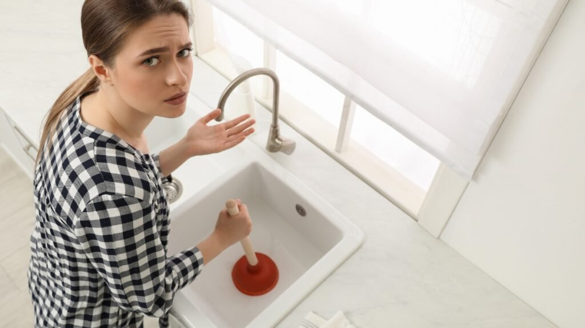

Você já se deparou com um vaso sanitário entupido ou uma pia que simplesmente não deságua? A frustração é real! Mas calma, a solução pode estar mais perto do que você imagina. O desentupidor, esse aliado muitas vezes ignorado, pode ser o seu grande salvador em momentos críticos.

Neste guia prático e divertido, vamos desvendar os segredos para usar um desentupidor da forma correta e eficaz. Prepare-se para deixar os canos livres e sua casa livre de imprevistos! Vamos nessa?

## O Essencial: Como o Desentupidor Funciona

O desentupidor é uma ferramenta simples, mas poderosa. Ele funciona com o princípio da pressão e sucção. Quando você empurra a borracha contra a abertura do vaso ou pia, cria-se uma vedação perfeita. É aí que a mágica acontece!  
  
Ao puxar para cima e depois empurrar novamente, você gera um movimento de pressão que ajuda a deslocar o bloqueio. Esse vai e vem é como uma dança entre você e o desentupidor, onde cada movimento conta!  
  
Existem diferentes tipos de desentupidores: os tradicionais, mais comuns nas casas, e os elétricos para situações extremas. Conhecer como cada um funciona pode fazer toda a diferença na hora da ação. Pronto para se tornar um mestre no uso dessa ferramenta?

### Tipos de Desentupidores

Quando o assunto é desentupir, existem diferentes tipos de desentupidores que podem ser seus aliados. O modelo mais clássico é o desentupidor de borracha, conhecido por sua eficácia em vasos sanitários. Ele cria uma vedação perfeita e ajuda a empurrar os resíduos para longe.  
  
Tem também o famoso desentupidor de cabo flexível, ideal para pias e ralos. Com um fio metálico revestido, esse tipo se adapta às curvas dos canos e consegue alcançar obstruções mais profundas que outros modelos não conseguem.  
  
E não podemos esquecer do potente desentupidor pneumático! Esse aparelho utiliza pressão de ar comprimido para desalojar bloqueios rapidamente. É uma solução prática quando você enfrenta problemas sérios na tubulação da casa. Escolha o seu favorito e fique preparado!

## Guia Passo a Passo 1: Desentupindo o Vaso Sanitário

Desentupir um vaso sanitário pode parecer uma missão impossível, mas com as técnicas certas, você se tornará o herói da casa. Primeiro, certifique-se de ter seu desentupidor em mãos e que ele esteja limpo. Para começar a operação, posicione a ventosa na abertura do vaso e faça pressão para criar um vácuo eficiente.  
  
A mágica acontece quando você empurra e puxa o desentupidor. O movimento deve ser firme, mas controlado. Preste atenção: não é só força bruta! É preciso vedar bem a borda do vaso para garantir que toda a pressão seja utilizada no bloqueio da obstrução.  
  
Se tudo correr bem, após algumas tentativas, você verá o nível da água baixar lentamente. Se ainda estiver entupido, repita os passos até conseguir liberar o fluxo novamente. A sensação de sucesso é incrível!

### Desentupir Vaso Sanitário: A Técnica da Vedação Perfeita

Desentupir um vaso sanitário pode parecer uma tarefa assustadora, mas com a técnica certa, você se tornará um verdadeiro mestre da vedação. O primeiro passo é garantir que o desentupidor esteja bem posicionado na abertura do vaso. A vedação perfeita é crucial para criar pressão e fazer magia acontecer.  
  
Pressione firmemente o desentupidor contra a borda do vaso, garantindo que não haja vazamentos de ar. Isso cria uma espécie de "sucção" poderosa! Agora, faça movimentos firmes para cima e para baixo. Lembre-se: a chave aqui é manter esse contato firme enquanto você trabalha.  
  
Se tudo correr bem, após algumas tentativas vigorosas, você sentirá o alívio ao ver a água começar a descer novamente. E quem diria que essa simples ferramenta poderia ser tão eficaz? É hora de mostrar suas habilidades!

## Guia Passo a Passo 2: Desentupindo Pias e Ralos

Desentupir pias e ralos pode parecer um desafio, mas com as técnicas certas, você se tornará um verdadeiro expert! Antes de tudo, é fundamental verificar o que está causando a obstrução. Muitas vezes, restos de comida ou cabelos são os vilões. Prepare-se para a batalha!  
  
Uma dica indispensável é usar água quente antes do desentupidor. Isso ajuda a amolecer a sujeira acumulada. Com o desentupidor em mãos, faça movimentos firmes e rápidos. Lembre-se: a vedação perfeita é essencial! Pressione bem ao redor da abertura para criar sucção.  
  
E não se esqueça do "ladrão"! Esse pequeno orifício na pia também precisa estar limpo para evitar novos entupimentos. Uma simples limpeza pode fazer maravilhas no fluxo da água e garantir que sua pia funcione como nova novamente!

### Desentupir Pias e Ralos: Não Se Esqueça do 'Ladrão'!

Desentupir pias e ralos pode ser uma verdadeira aventura. Mas, antes de mergulhar nessa missão, não esqueça de um pequeno aliado: o ladrão! Esse componente é fundamental para evitar que a água transborde durante o processo.  
  
Comece com a vedação correta. Coloque um pano ou fita adesiva ao redor do ladrão para garantir que toda a pressão gerada pelo desentupidor se concentre onde realmente importa. Isso ajuda muito na hora de soltar aquela obstrução teimosa!  
  
Depois da vedação, aplique movimentos firmes e constantes. Lembre-se, paciência é a chave! O ladrão vai ajudar a manter tudo sob controle enquanto você faz sua mágica. E quem sabe, em breve você estará celebrando mais um ralo livre e feliz na sua casa!

## Dicas de Ouro e Erros Comuns

Desentupir pode parecer uma tarefa simples, mas alguns detalhes fazem toda a diferença. Uma dica de ouro é sempre usar um desentupidor adequado para cada situação. Por exemplo, o modelo de borracha larga é ideal para vasos sanitários, enquanto o tipo com ponta fina funciona melhor em pias e ralos.  
  
Evite erros comuns como não vedar corretamente. Isso significa que você deve pressionar bem o desentupidor contra a superfície antes de começar a movimentá-lo. Se ficar deixando ar entrar durante o processo, suas tentativas podem ser em vão!  
  
E lembre-se: nunca utilize produtos químicos fortes logo após usar um desentupidor! A mistura pode causar reações perigosas e até danificar os canos. Fique atento e siga essas dicas para garantir resultados eficazes sem surpresas desagradáveis!

### Dicas Essenciais para o Sucesso

Desentupir não precisa ser um pesadelo! Para garantir que você tenha sucesso, comece sempre com um desentupidor de qualidade. A borracha deve estar em bom estado e encaixar perfeitamente na abertura do vaso ou da pia. Se tiver dúvidas sobre a escolha, opte por um modelo padrão; ele é versátil e atende bem à maioria das situações.  
  
Outra dica crucial é a posição do corpo. Fique com os pés firmes no chão e use seu peso para empurrar o cabo do desentupidor para baixo. Isso ajuda a criar uma pressão maior, essencial para eliminar obstruções teimosas.  
  
Por último, tenha paciência! Às vezes, pode levar algumas tentativas até que tudo funcione como deveria. Não desista facilmente; afinal, cada movimento conta nessa batalha contra os entupimentos indesejados!

Lembre-se, em casos extremos não deixe de recorrer a empresas especializadas, com certeza ai na sua cidade tem uma empresa [desentupidora](https://desentupidoraguarulhos.com.br/) para lhe socorrer.

## Conclusão

Chegamos ao final desta jornada pelo mundo dos desentupidores. Agora que você aprendeu como usar um desentupidor corretamente, pode se sentir mais confiante para enfrentar emergências em casa. Lembre-se de que a prática leva à perfeição: quanto mais você usar as técnicas certas, melhor será o seu desempenho.  
  
Não esqueça das dicas valiosas e evite os erros comuns para garantir um resultado eficaz na hora do aperto. Com essas orientações, você está pronto para transformar qualquer situação complicada em uma tarefa simples e rápida.  
  
E quem diria que um utensílio tão básico poderia ser o herói da sua rotina? Continue explorando seus superpoderes e mantenha sua casa sempre livre de entupimentos indesejados. Agora é com você!
