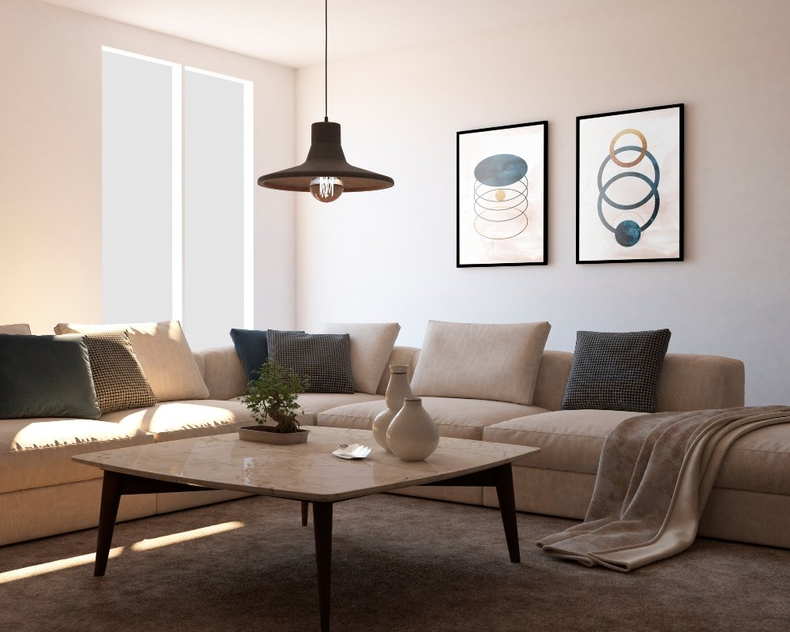

## Como aplicar princípios de design, iluminação, mobiliário e texturas para uma decoração de interiores funcional e acessível

A **decoração de interiores** vai muito além de estética, ela é a linguagem que organiza espaços, define rotinas e promove bem-estar. Ao planejar a transformação de um cômodo, é fundamental considerar a **paleta de cores**, a **iluminação**, o **mobiliário**, as **texturas** e a funcionalidade. Esses elementos, combinados com bom **planejamento de espaços** e controle de **orçamento**, tornam qualquer projeto viável e duradouro.

Comece pela análise do ambiente, identificando fluxo de circulação, pontos de luz natural e necessidades de cada morador. A **decoração de interiores** eficiente prioriza conforto e praticidade, sem abrir mão da personalidade. Mesmo em apartamentos compactos, pequenas escolhas, como a paleta e o tipo de iluminação, têm impacto direto na sensação de amplitude e acolhimento.

### Paleta de cores e texturas: escolher a base certa

A escolha da **paleta de cores** define o tom emocional do espaço. Tons neutros ampliam visualmente ambientes, enquanto cores saturadas criam pontos de destaque. Combine uma cor dominante suave com duas de apoio e uma cor de destaque para equilibrar o conjunto. As **texturas** complementam as cores, trazendo profundidade: tecidos naturais, tapetes felpudos, e acabamentos em madeira adicionam calor, enquanto superfícies lisas e metálicas entregam modernidade.

Para quem busca uma decoração atemporal, invista em peças-chave em tons neutros e atualize o visual com mantas, almofadas e objetos coloridos. Essa estratégia reduz custos no longo prazo, porque renova o ambiente sem exigir grandes investimentos em mobiliário.

### Iluminação e funcionalidade: projetar para usar e sentir

A **iluminação** é um dos pilares da **decoração de interiores**, pois define a atmosfera e a usabilidade dos espaços. Uma combinação de luz geral, focal e decorativa permite adequar cada ambiente às atividades cotidianas. Cozinhas e escritórios exigem iluminação funcional e direta, enquanto salas de estar e quartos se beneficiam de luzes mais quentes e difusas para criar conforto.

Planejar pontos de luz próximos a áreas de leitura, mesas de trabalho e bancadas reduz o cansaço visual e aumenta a produtividade. Aposte em dimmers para controlar intensidade, e em lâmpadas com bom índice de reprodução de cor para valorizar cores e texturas. A iluminação natural deve ser explorada ao máximo, ajustando cortinas e persianas para modular entrada de luz e privacidade.

### Mobiliário, conforto e orçamento: priorizar o essencial

O mobiliário precisa atender à rotina, priorizando ergonomia e durabilidade. Em projetos enxutos, prefira peças multifuncionais, como mesas extensíveis, sofás-cama e estantes que também organizam objetos. A **decoração de interiores** inteligente equilibra conforto com funcionalidade, garantindo circulação e superfícies úteis.

Definir um **orçamento** realista é uma etapa decisiva. Liste prioridades e separe o gasto entre estruturas fixas, pisos, iluminação e pintura, e itens decorativos, que podem ser renovados com menor frequência. Comprar peças clássicas de qualidade para uso diário e investir em acessórios acessíveis para atualizações sazonais é uma maneira eficiente de otimizar recursos.

As tendências servem como inspiração, mas não devem ditar escolhas permanentes. Adapte o que é passageiro ao seu estilo e às limitações do espaço, mantendo foco em conforto e funcionalidade. A consultoria de um profissional de design de interiores pode acelerar decisões, mas muitos resultados impactantes surgem de planejamento cuidadoso e escolhas bem pensadas.

Em síntese, a **decoração de interiores** é uma combinação de estética, técnica e [empatia](https://alana.org.br/glossario/empatia/). Ao alinhar paleta de cores, iluminação, mobiliário, texturas e orçamento, é possível transformar qualquer lar em um lugar mais bonito, prático e acolhedor. Com planejamento e criatividade, pequenos ajustes tornam-se grandes mudanças na qualidade de vida dentro de casa.
