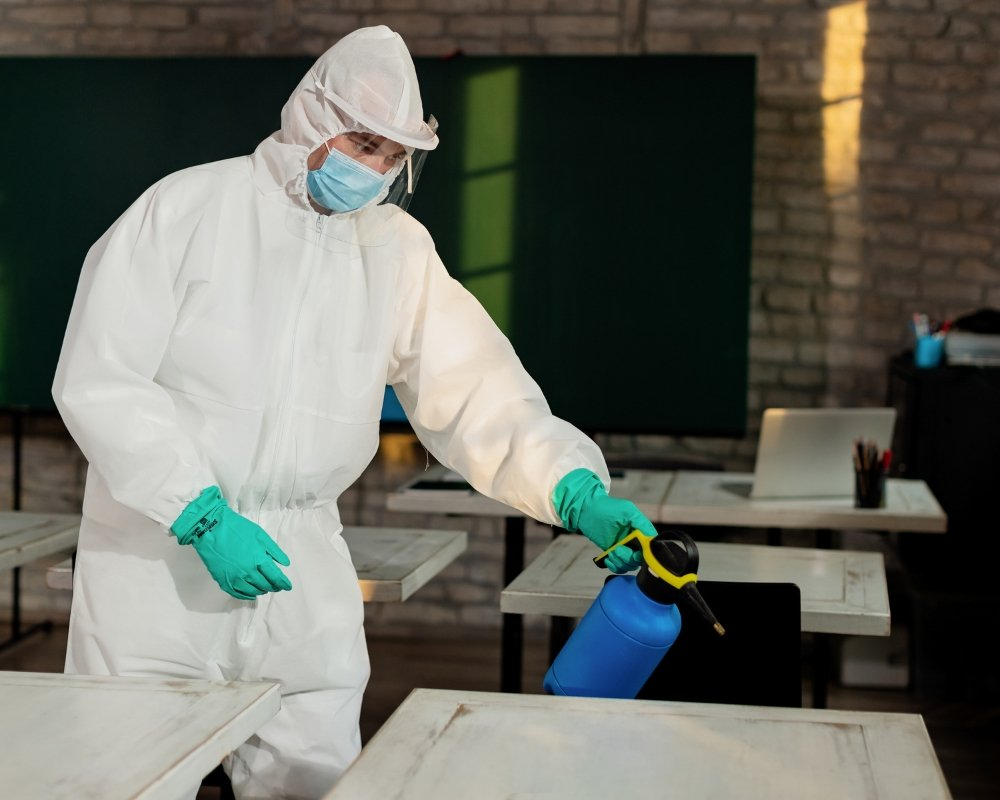

Você já se deparou com um rato correndo pela sua casa e sentiu aquele frio na barriga? A infecção por roedores é mais comum do que você imagina, e a desratização é o caminho para se livrar desse problema. Mas o que é desratização, afinal? Neste artigo, vamos desvendar esse mistério! Vamos explorar como funciona esse processo, os métodos disponíveis e dicas valiosas para evitar a presença indesejada desses visitantes. Prepare-se para entender tudo sobre desratização de forma leve e descontraída!

## O que é desratização

Desratização é o processo de controle e eliminação de ratos e camundongos que podem invadir sua casa ou estabelecimento. Esses roedores não são apenas incômodos, mas também transmitem doenças e danificam estruturas. Por isso, entender o que é desratização é crucial.  
  
Essencialmente, a desratização envolve técnicas específicas para reduzir a população desses animais indesejados. Isso pode incluir iscas químicas, armadilhas adesivas ou métodos mais tradicionais como gaiolas. Cada abordagem visa garantir um ambiente livre de pragas.  
  
Além disso, a desratização deve ser feita com segurança e responsabilidade. É fundamental contar com profissionais qualificados para evitar riscos à saúde humana e ao meio ambiente enquanto mantemos os ratos bem longe!

## Como funciona a desratização

A desratização é um processo que exige planejamento e técnica. O primeiro passo envolve uma investigação minuciosa do ambiente, onde profissionais identificam os pontos de entrada e esconderijos dos roedores. Isso ajuda a entender o comportamento deles, essencial para a eficácia do tratamento.  
  
Após essa análise, as iscas são instaladas em locais estratégicos. Essas iscas podem ser químicas ou adesivas, dependendo da situação. Elas atraem os ratos e garantem que eles sejam eliminados com segurança.  
  
Outro aspecto crucial é o mapeamento da área afetada. Isso permite monitorar o progresso do serviço e avaliar se outras medidas precisam ser tomadas para garantir que os roedores não voltem a invadir o espaço tratado.

### Investigação técnica

A investigação técnica é o primeiro passo crucial na desratização. Esse processo envolve uma análise detalhada do ambiente para identificar a presença de ratos. Profissionais especializados utilizam equipamentos modernos e técnicas precisas, como armadilhas e monitores.  
  
Além disso, eles observam os hábitos dos roedores: quais caminhos costumam percorrer e onde se escondem. Isso ajuda a traçar um diagnóstico eficaz da infestação.  
  
O que muitos não sabem é que essa fase também serve para entender as condições do local. Fatores como sujeira, entulho ou infiltrações podem facilitar a vida dos indesejados visitantes peludos! Portanto, cuidar do ambiente é essencial nessa batalha contra os ratos.

### Instalação das iscas

A instalação das iscas é uma etapa crucial na desratização. É onde a estratégia ganha vida e os rodentídeos começam a sentir o cheirinho irresistível. Esse momento exige cuidado, pois as iscas devem ser posicionadas em locais estratégicos, como cantos escuros e áreas de passagem dos ratos.  
  
É importante garantir que as iscas estejam fora do alcance de crianças e pets. A segurança deve sempre vir em primeiro lugar, mesmo quando o foco está no combate aos roedores.  
  
Uma vez instaladas, as iscas precisam ser monitoradas regularmente para que sua eficácia seja mantida. Assim, você garante um ambiente livre desses visitantes indesejados!

### Mapeamento da área

O mapeamento da área é uma etapa crucial na desratização. Antes de qualquer ação, é preciso entender onde os ratos costumam se esconder e transitar. Esse conhecimento permite um planejamento mais eficaz.  
  
Os técnicos realizam uma inspeção detalhada do local, observando buracos, frestas e outros possíveis pontos de entrada. Cada detalhe conta! É como montar um quebra-cabeça para identificar as rotas dos roedores.  
  
Além disso, a análise do ambiente ajuda a descobrir fontes potenciais de alimento e abrigo. Com essas informações em mãos, fica muito mais fácil desenvolver estratégias específicas para eliminar a infestação de forma eficiente e segura. Isso garante resultados satisfatórios no combate aos indesejados visitantes!

## Métodos de desratização variam conforme a necessidade

Os métodos de [desratização](https://dedetizadoraemguarulhos.eco.br/d/) são como um guarda-roupa: você escolhe a roupa certa para cada ocasião. Cada infestação exige uma abordagem específica, dependendo do ambiente e da gravidade do problema. É importante entender as necessidades antes de agir.  
  
A isca química é uma opção poderosa, mas deve ser usada com cautela em áreas onde crianças ou animais estão presentes. Já a isca adesiva pode ser mais discreta, pegando os roedores sem causar muito alarde.  
  
Para quem busca soluções menos invasivas, as gaiolas permitem capturar ratos vivos, facilitando o transporte deles para longe da sua casa. Cada método tem suas vantagens e desvantagens; escolher sabiamente faz toda a diferença!

### Isca química

A isca química é uma das soluções mais populares na desratização. Composta por substâncias atrativas para os roedores, ela age de forma eficaz e rápida. Quando os ratos consomem a isca, o efeito acontece gradualmente, levando-os à morte.  
  
Esse método exige cuidado na sua aplicação. É fundamental seguir as instruções do fabricante para garantir que a isca seja utilizada corretamente e com segurança. Além disso, deve-se evitar o contato com crianças e animais de estimação.  
  
Um ponto interessante da isca química é que existem várias opções disponíveis no mercado. Algumas são formuladas especificamente para ambientes internos, enquanto outras são ideais para áreas externas. Assim, você pode escolher a opção mais adequada ao seu problema!

### Isca adesiva

A isca adesiva é uma solução prática e eficaz para o combate a roedores. Ela funciona como um verdadeiro armadilha, atraindo os ratos com iscas saborosas e prendendo-os em sua superfície adesiva. E o melhor de tudo: não usa produtos químicos que possam ser perigosos para pets ou crianças.  
  
Por serem discretas, as iscas adesivas podem ser colocadas em diversos locais da casa, como atrás de móveis ou dentro de armários. Assim, você consegue capturar esses visitantes indesejados sem chamar muito a atenção.  
  
Além disso, esse método facilita a visualização dos roedores capturados. Isso ajuda você a ter noção do tamanho da infestação e planejar medidas adicionais se necessário!

### Isca de jardim

A isca de jardim é uma alternativa natural e efetiva para combater ratos sem agredir o meio ambiente. Feita com ingredientes que atraem esses roedores, ela pode ser uma solução prática para quem deseja evitar o uso de produtos químicos.  
  
Além disso, a isca de jardim se integra bem ao espaço externo. Você pode colocá-la em lugares estratégicos, como perto de plantas ou compostagens, onde os ratos costumam frequentar. Isso ajuda a criar um ambiente menos convidativo para esses hóspedes indesejados.  
  
Outro ponto positivo é que essa opção não oferece riscos à saúde dos pets e das crianças quando utilizada adequadamente. Uma escolha inteligente e segura!

### Gaiola

A gaiola é uma alternativa interessante e eficaz na desratização. Ao invés de usar venenos, ela captura os roedores vivos, permitindo que sejam removidos sem causar sofrimento. É uma abordagem mais ética para quem se preocupa com o bem-estar animal.  
  
Esse método pode ser utilizado em várias situações. A instalação da gaiola deve ser feita em locais estratégicos onde há sinais de atividade dos ratos, como fezes ou marcas. Uma isca atrativa dentro da gaiola aumenta as chances de sucesso.  
  
Além disso, a facilidade de uso é um ponto positivo. Após a captura, basta levar os roedores para longe da sua casa e soltar em um local seguro, garantindo que seu ambiente fique livre desses visitantes indesejados!

## Como evitar infestação por ratos

Manter sua casa livre de ratos é mais fácil do que você imagina. Primeiro, faça uma inspeção completa nos cantos e frestas. Ratos conseguem passar por buracos pequenos, então vedar essas aberturas é essencial.  
  
Além disso, evite deixar comida exposta. Guarde alimentos em recipientes herméticos e mantenha a cozinha sempre limpa. O cheiro dos restos pode ser um convite para esses intrusos indesejados.  
  
Outra dica valiosa é cuidar da área externa da sua casa. Mantenha o jardim podado e livre de entulhos que possam servir de abrigo para roedores. Com pequenas mudanças no seu dia a dia, você pode manter os ratos bem longe!

## Conclusão

A desratização é um tema sério, mas isso não significa que não podemos abordá-lo de forma leve. Entender o que é desratização e como funciona pode ser a chave para manter sua casa livre de roedores indesejados. Ao aplicar métodos adequados e realizar uma investigação técnica eficaz, você garante um ambiente mais saudável.  
  
Lembre-se sempre da importância da prevenção: mantenha seu espaço limpo e livre de alimentos expostos. Com essas dicas em mente, você poderá viver tranquilo, sabendo que está no controle! Não deixe os ratos tomarem conta; faça da desratização uma prioridade na manutenção do seu lar.
