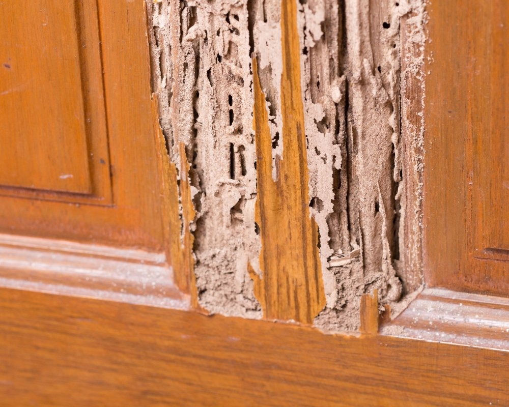

**Resposta rápida: Água quente mata cupim?**

**Sim, água fervente mata cupins por contato**, o calor extremo desnatura as proteínas e desidrata os insetos instantaneamente. Porém, este método tem **eficácia muito limitada**: só elimina os cupins que a água atinge diretamente na superfície da madeira, sem alcançar a colônia interna nem a rainha. Além disso, oferece **riscos reais**: pode empenar e manchar a madeira, danificar o verniz, soltar colas de móveis e causar queimaduras graves no aplicador. **Não é recomendado como solução definitiva**, use os métodos abaixo para uma eliminação completa e segura.

Você já ouviu aquele barulho suspeito na madeira da sua casa? Ou notou um móvel que parece ter "perdido a vida"? Se você respondeu sim, pode ser que os temidos cupins tenham decidido fazer uma visita! Esses pequenos insetos podem causar grandes estragos em seu lar. Mas não se preocupe!

Neste post, vamos compartilhar 8 dicas infalíveis sobre como acabar com cupim de maneira eficaz e segura. Prepare-se para dar adeus a esses invasores e recuperar o controle do seu espaço! Vamos nessa?

## O que é bom para acabar de vez com cupim?

Para acabar de vez com os cupins, você precisa investir em soluções eficazes. Produtos químicos específicos podem ser sua melhor arma. Além disso, fumigadores de líquidos e gases são ótimos aliados na luta contra esses invasores indesejados.  
  
Outra alternativa é o uso de iscas que atraem os cupins até a morte certa. O importante é agir rápido antes que eles causem danos irreparáveis à sua casa. Com as ferramentas certas em mãos, você vai se livrar desse problema facilmente!

## Qual o veneno para matar cupim?

Quando falamos em venenos para matar cupim, o mercado oferece uma infinidade de opções. Um dos mais populares é o inseticida à base de fipronil, que ataca diretamente o sistema nervoso desses invasores indesejados. Outra alternativa eficaz são os produtos com imidacloprido, que também têm mostrado resultados promissores.  
  
Além disso, existem fumos e sprays específicos para esses pequenos destruidores de madeira. Lembre-se sempre de seguir as instruções do fabricante e tomar as precauções necessárias ao aplicar qualquer produto químico em sua casa.

### Usar fumigadores de líquidos

Os fumigadores de líquidos são uma solução poderosa contra cupins. Eles penetram nas madeiras e oferecem um combate eficaz às pragas que se escondem em lugares difíceis de alcançar. É como dar um banho químico nos invasores, eliminando-os sem piedade!  
  
Além disso, a aplicação é simples e direta. Basta seguir as instruções do fabricante para garantir que cada canto da sua casa seja tratado corretamente. Assim, você cria uma barreira protetora e ainda pode respirar aliviado sabendo que os cupins estão com os dias contados!

### Usar fumigadores de gases

Se você está lidando com a presença indesejada de cupins, os fumigadores de gases podem ser uma solução poderosa. Eles liberam um gás que penetra em todos os cantos da casa, alcançando até aqueles buracos mais difíceis. É como um super-herói contra esses insetos!  
  
Além disso, esse método é eficaz para eliminar tanto as larvas quanto os adultos. Vale lembrar que o uso deve ser feito com cuidado e seguindo todas as instruções do fabricante para garantir a segurança da sua família e dos pets.

## Primeiro passo: localização da infestação dos cupins

Encontrar a localização dos cupins é o primeiro passo para derrotá-los. Esses pequenos invasores costumam se esconder em lugares estratégicos, como madeira úmida e móveis antigos. Fique atento a sinais como buracos na madeira e sujeira parecida com serragem.  
  
Use uma lanterna e faça uma inspeção detalhada nos cantos da casa, principalmente no porão ou em armários pouco utilizados. Quanto mais cedo você descobrir onde eles estão, mais fácil será acabar com essa praga incômoda que ameaça seu lar.

## Como acabar com cupim naturalmente?

Se você está em busca de alternativas naturais para acabar com os cupins, a boa notícia é que existem várias opções eficazes! Um exemplo interessante é o uso do cravo-da-índia. O cheiro forte desse tempero pode repelir esses pequenos invasores e ainda deixar sua casa perfumada.  
  
Outra opção poderosa é o alho. Além de ser um excelente ingrediente na culinária, suas propriedades antiparasitárias ajudam a afastar os cupins. Experimente fazer uma pasta de alho e aplicar nas áreas afetadas; você ficará surpreso com o resultado!

## Soluções caseiras e o Meio Ambiente

Usar soluções caseiras para combater cupins é uma escolha não só inteligente, mas também amiga do meio ambiente. Ao optar por ingredientes naturais, você evita a liberação de produtos químicos nocivos que podem prejudicar a saúde da sua família e o planeta.  
  
Além disso, muitos desses remédios são fáceis de preparar e muito acessíveis. Por exemplo, cravo-da-índia ou bicarbonato podem ser verdadeiros aliados na luta contra esses insetos indesejados sem agredir a natureza. É uma vitória dupla!

### Água quente

Uma das formas mais simples e eficazes de combater os cupins é com água quente. Isso mesmo! Eles não suportam temperaturas elevadas, então uma jarra fervente pode ser a solução mágica que você precisa. Basta direcionar o líquido para as áreas afetadas.  
  
Além de ser um método natural e barato, você ainda dá uma ajudinha ao meio ambiente. Use essa dica na sua rotina de combate aos invasores e diga adeus aos danadinhos sem precisar recorrer a produtos químicos pesados.

### Como acabar com cupom com Bicarbonato

O bicarbonato de sódio é um aliado poderoso na luta contra os cupins. Para usar, basta misturar com açúcar em partes iguais e espalhar onde você suspeita que eles estejam se escondendo. Os cupins são atraídos pelo doce e acabam ingerindo a mistura letal.  
  
Além disso, o bicarbonato desidrata esses pequenos invasores. É uma solução simples e barata que pode fazer toda a diferença! Experimente essa técnica e diga adeus aos danadinhos sem complicações.

### Cravo-da-índia

O cravo-da-índia é uma especiaria poderosa e cheia de surpresas! Além de dar um sabor incrível às receitas, ele também pode ser seu aliado contra os indesejáveis cupins. Seu aroma forte e propriedades naturais tornam essa erva uma opção eficiente para repelir esses insetos.  
  
Para utilizá-lo, basta triturar alguns cravos e espalhá-los em áreas afetadas pela infestação. O cheiro intenso vai afastar os cupins, permitindo que você recupere a tranquilidade em sua casa sem precisar recorrer a produtos químicos pesados.

### Alho

O alho é um super-herói na luta contra os cupins! Além de temperar seus pratos favoritos, ele possui propriedades que afastam esses insetos indesejados. Basta triturar alguns dentes e espalhar nas áreas afetadas para ver a mágica acontecer.  
  
Esses pequenos invasores não suportam o cheiro forte do alho. Enquanto você aprecia uma deliciosa receita, eles estarão fugindo da sua casa. Então, aproveite esse aliado natural e dê adeus aos cupins sem precisar usar produtos químicos pesados!

## O que é bom para matar cupim de madeira?

Matar cupim de madeira é um desafio, mas existem soluções eficazes. Produtos químicos como inseticidas específicos para madeiras são uma opção poderosa. Eles penetram nas fibras e atacam esses vilões silenciosos sem dó.  
  
Outra abordagem interessante são as iscas de cupins. Essas armadilhas atraem os insetos e liberam substâncias que exterminam toda a colônia. Com essas estratégias, você pode proteger sua casa e garantir que suas madeiras fiquem seguras contra danos indesejados!

### Soluções Químicas para cupim

As soluções químicas para combater cupins são eficazes e rápidas. Existem produtos específicos no mercado, como inseticidas em spray ou pós que penetram na madeira infestado. A aplicação correta é essencial, então siga sempre as instruções do rótulo.  
  
Outra opção são os tratamentos com termiticidas líquidos, que criam barreiras no solo assim evitando a reinfestação. Esses venenos atuam de maneira direta nos insetos e asseguram uma proteção duradoura contra esses vilões da madeira!

### Iscas de cupins

As iscas de cupins são uma verdadeira armadilha para esses pequenos invasores. Elas atraem os cupins com um sabor irresistível e, ao mesmo tempo, contêm venenos que eliminam toda a colônia. É como oferecer um banquete mortal!  
  
Colocá-las nos locais estratégicos pode ser fundamental na batalha contra essa praga. Você precisa ficar atento e checar as iscas regularmente. Com paciência e estratégia, você estará no caminho certo para dizer adeus aos cupins de forma eficaz e prática!

### Fumigadores

Os fumigadores são aliados poderosos na batalha contra os cupins! Eles liberam substâncias que penetram nas madeiras e nos esconderijos desses insetos traiçoeiros. Você só precisa escolher entre os líquidos ou gases, dependendo da gravidade da infestação.  
  
A aplicação é simples, mas requer cuidados. Siga as instruções do fabricante para garantir a eficácia e manter sua casa segura. Com um bom fumigador, você pode transformar o seu lar em uma fortaleza livre de cupins. É hora de agir!

## Como acabar com cupim com dedetização

A [dedetização](https://cupim.eco.br/) é uma das maneiras mais eficazes de eliminar cupins. Profissionais especializados utilizam produtos químicos que atacam diretamente esses insetos indesejados, garantindo que eles não voltem a incomodar. Além disso, o processo é rápido e pode ser feito sem causar grandes transtornos na sua rotina.  
  
Após a aplicação do veneno, você poderá perceber resultados em poucos dias. Vale lembrar que essa técnica deve ser feita periodicamente para evitar novas infestações. E quem não quer viver livre desses pequenos destrutores?

## Limpeza Profissional

Quando o assunto é eliminar cupins, contar com uma limpeza profissional pode ser a solução mais eficaz. Esses especialistas possuem equipamentos e produtos específicos que garantem resultados duradouros. Afinal, quem quer lidar com esses invasores em casa?  
  
Além de exterminar os cupins, eles também ajudam a identificar focos de infestação que você talvez não perceba. Assim, sua casa fica livre dessas pragas indesejadas e você pode se livrar daquela preocupação constante sobre possíveis danos à madeira!

## Conclusão

Os cupins podem ser um verdadeiro pesadelo para quem deseja manter a casa em ótimo estado. Com as dicas que apresentamos, você já pode dar o primeiro passo rumo à liberação do seu lar desses pequenos invasores. Lembre-se de que a prevenção é fundamental: mantenha sua casa limpa e livre de umidade.  
  
Seja utilizando métodos naturais ou químicos, o importante é agir rapidamente ao perceber indícios da infestação. Se necessário, não hesite em contar com profissionais para uma dedetização eficaz. Agora que você está armado com informações valiosas sobre como acabar com cupim, coloque-as em prática e livre-se desse problema. Sua casa merece estar protegida!

## Soluções Caseiras para Acabar com Cupim em Casa

Quando o objetivo é **acabar com cupim em casa** sem recorrer imediatamente a uma dedetizadora, algumas soluções domésticas podem conter o problema nos estágios iniciais. Veja as mais eficazes por cômodo e tipo de mobília.

### Como Acabar com Cupim no Guarda-Roupa

O guarda-roupa é um dos alvos prediletos dos cupins de madeira seca. Para eliminá-los: **esvazie completamente o móvel**, aspire todas as frestas e furinhos (onde se acumula o pó de madeira característico), aplique **óleo de neem** ou **solução de bórax diluída em água morna** com pincel em todas as superfícies internas, e injete inseticida específico para cupins nos pequenos furos visíveis usando uma seringa. Deixe o móvel ventilando ao sol por algumas horas antes de devolver as roupas.

### Como Eliminar Cupim em Móveis de Madeira

Para mesas, cadeiras, estantes e cômodas atacados, os métodos mais eficazes em casa são: **exposição direta ao sol** por 6 a 8 horas (o calor e a luz UV matam larvas superficiais), aplicação de **vinagre branco puro** ou **óleo essencial de cravo** nos pontos infestados, e uso de **cupinicida líquido** injetado nos furos. Para infestações grandes, considere **fumigação localizada** com produto profissional ou contrate uma dedetizadora.

### Como Acabar com Cupim na Madeira da Estrutura da Casa

Cupins subterrâneos atacam vigas, batentes, rodapés e estruturas de madeira da casa, esse caso é mais grave e exige **tratamento profissional com isca cupinicida** ou **injeção de produto químico no solo**. Como medida caseira preventiva, mantenha a madeira sempre seca, vede rachaduras com massa epóxi e aplique **verniz com inseticida** a cada 2 anos.

## Perguntas Frequentes sobre Como Acabar com Cupim em Casa

### Qual é a forma mais rápida de acabar com cupim em casa?

A forma mais rápida e eficaz é a **aplicação de cupinicida líquido injetado diretamente nos furos** com seringa, combinada com a exposição do móvel ao sol. Para infestações grandes ou em estruturas da casa, contratar uma dedetizadora profissional é a única solução verdadeiramente definitiva, métodos caseiros funcionam apenas para focos pequenos e iniciais.

### Vinagre mata cupim?

Sim, o **vinagre branco puro mata cupins por contato** graças à sua acidez (pH baixo desidrata os insetos). Aplique com borrifador ou pincel diretamente nos furos e na superfície da madeira. Porém, assim como a água quente, o vinagre **não atinge a colônia interna**, sua eficácia é limitada à superfície tratada.

### Como saber se ainda tem cupim depois do tratamento?

Após o tratamento, observe por **30 a 60 dias** se aparecem novos sinais: **pó fino marrom** embaixo dos móveis, **asas transparentes** caídas (revoadas), pequenos **furos novos** ou ruído de mastigação noturno. Se nenhum desses sinais aparecer, o tratamento foi bem-sucedido. Se surgirem, repita o processo ou chame um profissional.

### Cupim pode voltar depois de eliminado?

Sim, infelizmente. Se a colônia-mãe não for destruída ou se houver **focos próximos** (vizinho, terreno baldio, árvore morta), os cupins podem voltar em meses. Por isso, além de eliminar a infestação visível, é essencial **tratar a madeira preventivamente** com verniz cupinicida e **controlar a umidade** da casa, já que ambientes úmidos atraem cupins subterrâneos.
