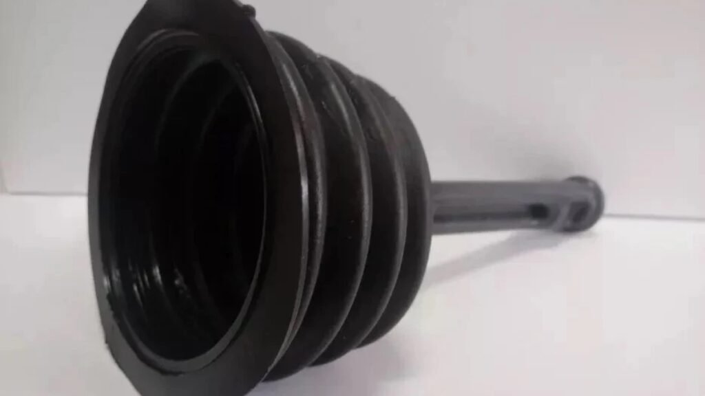

Olá, guardiã da beleza e da paz!

Em **Irenes.com.br**, celebramos o equilíbrio. E sejamos honestas: poucas coisas destroem a harmonia da nossa casa mais rápido do que um **esgoto entupido**. Aquele cheiro desagradável, a água que não desce, o estresse repentino... tudo isso vai contra a nossa missão de ter um lar funcional e livre de tensões.

É por isso que, neste guia prático, vamos desmistificar o problema do entupimento de esgoto. Nosso objetivo não é só te ajudar a resolver o problema *agora*, mas te dar as ferramentas para que ele *nunca mais* aconteça. Vamos focar na **prevenção** e no **conhecimento**, porque uma casa bem organizada é um refúgio de paz!

Pronta para eliminar o estresse do encanamento?

## **Antes do Caos: Entenda os Sinais de que o Esgoto Pode Estar Entupindo**

Cuidar do lar significa prestar atenção aos pequenos detalhes. Muitas vezes, o sistema de esgoto nos dá avisos claros antes de colapsar. Reconhecer esses sinais é o primeiro passo para evitar uma emergência e o custo de uma **[desentupidora de esgoto](https://www.osascenter.com.br/)**.

### **Os 4 Sinais de Alerta que Sua Casa Está Dando**

1.  **Água Lenta (ou Preguiçosa):** É o sinal mais comum. A água da pia ou do ralo do box está demorando mais do que o normal para descer. Isso indica que a gordura ou o cabelo já formaram um obstáculo parcial.
2.  **Barulhos Estranhos:** Se você ouve sons de borbulhamento, gorgolejo ou sucção vindo dos ralos após usar a pia ou a descarga, o ar está sendo preso no encanamento.
3.  **Mau Cheiro Constante:** Se a sua casa começa a ter um odor desagradável, semelhante a ovo podre, é provável que gases do esgoto estejam retornando. Isso pode indicar uma obstrução séria no sistema de ventilação ou na tubulação principal.
4.  **Retorno da Água:** Se a água usada em um ponto (como o tanque) retorna pelo ralo mais baixo (como o do banheiro), o entupimento é grave e provavelmente está na rede principal da casa.

### **Os Vilões Mais Comuns do Entupimento**

-   **Gordura e Óleo de Cozinha:** O principal inimigo! Quando o óleo esfria, ele solidifica dentro dos canos, formando blocos de gordura que grudam todos os outros detritos.
-   **Cabelo e Sabão:** No banheiro, o cabelo se junta ao sabão e ao condicionador, formando bolas densas e difíceis de dissolver.
-   **Objetos Estranhos:** Desde hastes flexíveis (cotonetes) até pequenos brinquedos ou excesso de papel higiênico no vaso.

## **SOS Imediato: 3 Soluções Caseiras e Seguras para Tentativas Rápidas**

Se o entupimento é leve, você mesma pode restaurar a paz no encanamento, mas sempre com métodos seguros. **Nosso foco aqui é proteger você e seus canos!**

### **O Poder da Combinação Bicarbonato + Vinagre**

Esta dupla é perfeita para desentupimentos leves e, principalmente, para a manutenção mensal.

1.  **Modo de Usar:** Despeje 1/2 copo de bicarbonato de sódio no ralo entupido.
2.  **O Efeito:** Em seguida, derrame 1 copo de vinagre branco.
3.  **Aguarde:** A efervescência acontece! Tampe o ralo e deixe a mistura agir por cerca de 30 minutos, ou idealmente, durante a noite.
4.  **Enxágue:** Despeje água quente (não fervendo) para eliminar os resíduos soltos.

### **Água Quente com Detergente (Para Gordura)**

Se o problema for na pia da cozinha, gordura é o foco.

-   **Instruções:** Dissolva 1/2 copo de detergente em um balde de água bem quente. Despeje lentamente no ralo. O calor e a ação desengordurante do detergente ajudam a derreter e deslocar a gordura.

### **Desentupidor de Borracha Tradicional (O Clássico que Não Falha)**

Use-o para criar o vácuo perfeito. Encha a área com água suficiente para cobrir a cúpula do desentupidor e faça movimentos firmes e rápidos para cima e para baixo. A pressão vai desalojar a obstrução.

Alerta da Irene: Por Que NUNCA Usar Soda Cáustica

A soda cáustica é corrosiva e extremamente perigosa. Ela pode causar queimaduras graves na pele e nos olhos e, pior, muitas vezes ela apenas cozinha o material orgânico, transformando a obstrução em um bloco sólido, o que torna o desentupimento profissional ainda mais caro e difícil. Mantenha a segurança e a integridade dos seus canos!

## **Quando o Problema é Grave: Como Contratar a Desentupidora de Esgoto Certa**

Se os métodos caseiros falharam após duas tentativas, o entupimento está além do seu alcance. Chegou a hora de chamar a ajuda especializada.

### **O Entupimento Não Cedeu: Qual é o Próximo Passo?**

O problema provavelmente está na coluna principal de esgoto, ou em um ponto de difícil acesso. A **desentupidora de esgoto profissional** utiliza equipamentos como o *Roto-Rooter* (cabos giratórios que quebram e removem a obstrução) ou o *Jato de Hidrojateamento* (água de altíssima pressão) para limpar o cano por completo.

### **Guia de Confiança: O Que Perguntar Antes de Contratar uma Desentupidora**

Para que o processo seja livre de estresse (e de surpresas na conta), faça essas perguntas antes de fechar o serviço:

| O Que Perguntar | Por Que é Importante |
| --- | --- |
| A empresa possui Licença/Alvará? | Garante que ela opera legalmente e segue as normas de segurança. |
| A visita técnica é cobrada? | Muitas empresas sérias oferecem a visita e o orçamento gratuitos. |
| O preço é cobrado por metro desentupido ou por serviço? | Entender a forma de cobrança evita surpresas e garante transparência. |
| O serviço tem garantia? | Uma boa empresa oferece garantia de que o entupimento não retornará em um período específico (ex: 30 a 90 dias). |
| Qual a tecnologia usada? | Empresas modernas usam métodos que não quebram pisos (como o hidrojateamento), o que é ideal para a manutenção da sua casa. |

## **Manutenção é Paz: Dicas da Irene para Nunca Mais Ter Esgoto Entupido**

Nosso maior desejo é que você use este guia apenas para prevenção. O verdadeiro cuidado com o lar reside na manutenção constante, que transforma a rotina em tranquilidade.

-   **Recicle o Óleo de Cozinha:** Nunca despeje óleo ou gordura na pia! Guarde-os em uma garrafa PET e entregue em postos de coleta.
-   **Protetores de Ralo:** Use protetores de silicone ou telas nos ralos da pia e do box para capturar fios de cabelo antes que eles entrem no encanamento.
-   **Cuidado com o Vaso:** O vaso sanitário deve ser usado **apenas** para dejetos e papel higiênico. Lixo, absorventes, fio dental e cotonetes devem ir para a lixeira.
-   **Rotina de Limpeza Preventiva:** Uma vez por mês, despeje a mistura de bicarbonato e vinagre nos ralos da sua casa. É uma manutenção simples que evita a formação de pequenos acúmulos.

Com conhecimento, você transforma um problema de encanamento em uma simples rotina de autocuidado com o lar. Mantenha a sua casa organizada e funcional, e a paz reinará!

Com carinho.
