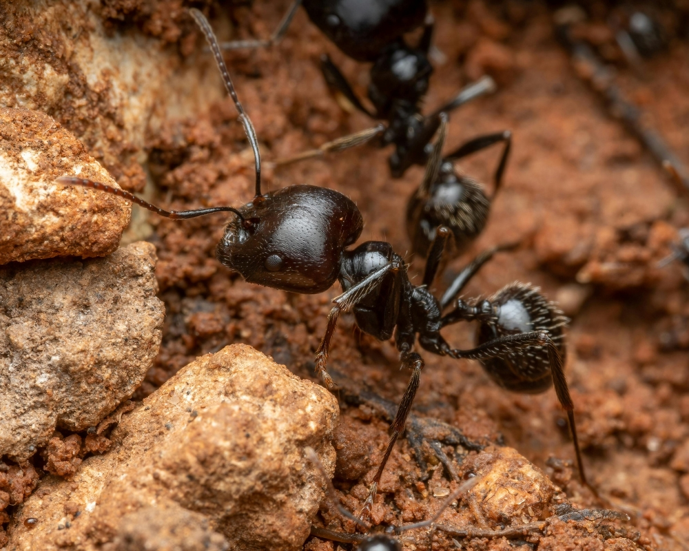

## Compreendendo o Papel das Formigas no Jardim

As formigas são frequentemente vistas como pragas, mas elas desempenham um papel importante no ecossistema do jardim. Elas ajudam na polinização e na aeração do solo, além de controlarem outras pragas. No entanto, quando sua população cresce descontroladamente, pode ser necessário intervir.

## Por Que as Formigas Podem Ser Problemáticas?

Embora úteis, as formigas podem se tornar um problema quando começam a cultivar pulgões ou outros insetos sugadores de seiva, que prejudicam as plantas. Além disso, algumas espécies constroem ninhos que podem danificar raízes e causar instabilidade no solo.

## Identificando as Formigas no Seu Jardim

Antes de tomar qualquer ação, é importante identificar que tipo de formiga está presente. As formigas cortadeiras, por exemplo, são notórias por destruir folhas e flores. Já as formigas domésticas podem ser mais inofensivas, mas ainda assim indesejadas em grande número.

## Métodos Naturais para Controlar as Formigas

### 1\. Atrair Predadores Naturais

Incentive a presença de predadores naturais, como joaninhas e pássaros, que podem ajudar a controlar a população de formigas.

### 2\. Usar Produtos Caseiros

Sprays caseiros feitos com vinagre ou uma mistura de água e sabão podem ser eficazes para afastar as formigas. Pulverize nas áreas afetadas, mas evite o contato direto com as plantas. **Lembre-se de testar em uma pequena área primeiro.**

### 3\. Plantas Repelentes

Algumas plantas, como hortelã e alecrim, são conhecidas por repelir formigas. Considere plantá-las ao redor do jardim para um efeito natural e contínuo.

### 4\. Barreiras Físicas

Criar barreiras com materiais como pó de café ou cinzas de madeira ao redor das plantas pode impedir que as formigas alcancem as áreas mais sensíveis do jardim.

## Quando Procurar Ajuda Profissional?

Se os métodos naturais não resolverem o problema, ou se as formigas estiverem causando danos significativos, pode ser hora de consultar um especialista em [controle de pragas](https://biosolucoes.app.br/). Eles podem oferecer soluções mais robustas e seguras para o ambiente.

## Mantenha a Harmonia no Seu Jardim

Um jardim equilibrado é um reflexo de um espaço bem cuidado e harmônico. Ao lidar com formigas, busque métodos que respeitem o ecossistema geral do seu jardim. Assim, você não só preserva a beleza do seu espaço verde, mas também contribui para um ambiente mais saudável e sustentável.

## Perguntas Frequentes

### Como posso saber se as formigas estão prejudicando minhas plantas?

Observe sinais de estresse nas plantas, como folhas amareladas ou murchas, que podem indicar danos nas raízes ou presença de pulgões.

### Os produtos químicos são seguros para usar no jardim?

Embora eficazes, os produtos químicos podem prejudicar o solo e outras formas de vida. Use-os apenas como último recurso e siga as instruções cuidadosamente.
