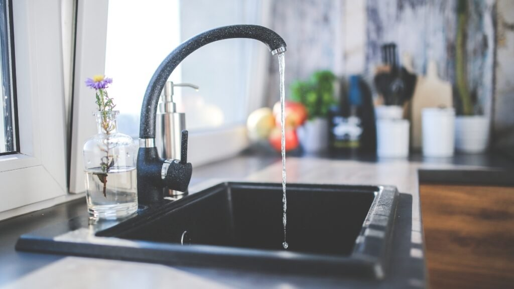

O lar é o nosso santuário, e a cozinha é, sem dúvida, o coração da casa. Ela é o centro da nutrição e do convívio. Mas, convenhamos, basta um dia de correria para que aquele temido problema apareça e roube toda a nossa tranquilidade: o acúmulo de **restos de comida que caem na pia** e, inevitavelmente, causam um entupimento.

Aquela sensação de pia parada, de água que não desce, é a antítese da harmonia que buscamos em **Irenes**.

A boa notícia é que, como guardiãs da paz, podemos resolver esse problema com inteligência, organização e um toque de carinho. Neste guia, você descobrirá como prevenir que os restos cheguem ao ralo e, caso a emergência aconteça, terá as soluções caseiras mais eficazes para restaurar rapidamente a paz na sua cozinha.

### **Por Que os Restos de Comida são Inimigos da Harmonia na Sua Pia?**

Para prevenir, precisamos entender o inimigo. Muitos de nós acreditamos que o que desce pelo ralo some, mas na verdade, os restos de comida estão armando uma grande cilada no encanamento.

**O Problema Invisível: Gordura e Borra de Café**

O vilão mais perigoso não é o pedaço de macarrão, mas sim o invisível: a **gordura**. Mesmo quando ela está líquida e quente, ao esfriar dentro dos canos, ela se solidifica, criando uma "cola" que agarra qualquer partícula que passar.

-   **A "Cola":** Ela se une à borra de café, flocos de aveia e a pequenos pedacinhos de arroz (que incham com a água), formando um bloco duro e resistente ao longo do tempo.
    
-   **O Inchaço:** Cascas de ovo, cascas de batata e farinha também absorvem água, expandindo-se dentro do cano e acelerando o bloqueio.

**O Mal-Estar do Mau Cheiro**

Além do entupimento, o acúmulo de restos em decomposição no ralo e no sifão é a principal causa daquele cheiro azedo e desagradável. É impossível sentir paz em um ambiente onde há mau cheiro, não é mesmo? A organização e a limpeza regular são os únicos caminhos para manter a casa leve.

### **O Segredo da Organização: Prevenção é a Chave da Paz**

Em **Irenes**, acreditamos que a paz se constrói com bons hábitos. Evitar que os restos cheguem ao ralo é muito mais fácil e relaxante do que desentupir depois.

**A Regra de Ouro do Descarte (Passo a Passo Irenes)**

Adote essa rotina para manter seu encanamento livre de estresse:

1.  **Rastreie e Raspe TUDO:** Antes de colocar o prato na pia, raspe todos os restos (o máximo possível!) diretamente no lixo orgânico ou em uma lixeira de bancada. Utilize uma espátula de silicone, que é muito mais eficiente do que o garfo.
    
2.  **Filtro:** Invista em um **protetor de ralo** de qualidade. As versões de silicone ou as telas de metal finas são excelentes para capturar até as menores partículas que você deixou passar.
    
3.  **Água Quente (O Ritual Semanal):** Uma vez por semana, depois de usar a pia, ferva uma chaleira de água e despeje lentamente pelo ralo. A água quente ajuda a dissolver qualquer gordura que esteja começando a se acumular nas paredes do cano.

**Ferramentas Simples para o Seu Ralo**

A organização da pia não precisa de tecnologia de ponta, apenas de funcionalidade:

-   **Peneira de Pia:** Se você ainda não tem, compre uma que se encaixe perfeitamente. A vedação é crucial para que os restos não passem pelas laterais.
    
-   **Lixeira de Bancada:** Ter uma lixeira pequena, charmosa e de fácil acesso na bancada elimina a desculpa de "dar preguiça" de ir até a lixeira grande.

### **SOS Entupimento: Soluções Caseiras para Salvar o Seu Ralo**

Se, mesmo com toda a prevenção, a água insistir em não descer, não entre em pânico! Não há necessidade de produtos químicos agressivos que prejudicam o meio ambiente e a sua saúde. Podemos resolver isso com o poder de ingredientes que você já tem em casa.

**O Poder da Dupla: Bicarbonato e Vinagre (O Desentupidor Ecológico)**

Este é o nosso método favorito, porque é seguro, eficaz e alinha-se perfeitamente com o cuidado que temos com o lar e o planeta.

**Passo a Passo Irenes:**

1.  Despeje **meia xícara (100g) de Bicarbonato de Sódio** seco diretamente no ralo.
    
2.  Despeje **meia xícara de Vinagre Branco** (o vinagre de álcool).
    
3.  Imediatamente, a mistura irá borbulhar (é a reação química que está soltando a sujeira). Tampe o ralo (com um pano ou a própria rolha) para que a pressão da espuma aja para baixo.
    
4.  Deixe a dupla agir por, no mínimo, **30 minutos**.
    
5.  Despeje, por fim, uma chaleira de **Água Fervente** para enxaguar e limpar o cano.

**O Método do Desentupidor (Paciência e Pressão)**

Se o bloqueio for físico e superficial, o desentupidor de borracha pode ser seu maior aliado:

-   **Vedação:** Certifique-se de que a borracha do desentupidor cubra totalmente o ralo.
    
-   **Ação:** Encha um pouco a pia com água e faça movimentos vigorosos para cima e para baixo. A pressão da água irá desalojar o material bloqueador.

### **Descarte Consciente: Transformando Restos em Bem-Estar**

Em nossa busca por uma vida equilibrada, o cuidado com o planeta anda de mãos dadas com a organização da nossa casa.

-   **Compostagem para a Vida:** Considere a compostagem doméstica para restos de frutas, verduras e borra de café. Você transforma o que seria lixo em adubo rico para suas plantinhas, levando a harmonia da sua casa para a natureza.
    
-   **Atenção ao Óleo:** Jamais descarte óleo de cozinha usado na pia! Ele é um dos principais causadores de entupimentos e de poluição hídrica. Guarde-o em uma garrafa PET e leve a um ponto de coleta seletiva na sua cidade.

Cuidar do ralo da pia é mais um pequeno ato de amor-próprio e de cuidado com o lar. É um passo simples na rotina de organização que garante um ambiente mais leve, perfumado e, acima de tudo, em **paz**.

E lembre-se, se precisar contratar um especialista, busque por empresas renomadas como essa [desentupidora em Jundiaí](https://desentupidoraemjundiai.com.br/d/desentupidora-em-jundiai/).

**Qual é a sua dica secreta para manter o ralo da pia livre? Compartilhe nos comentários e inspire outras Irenes!**
