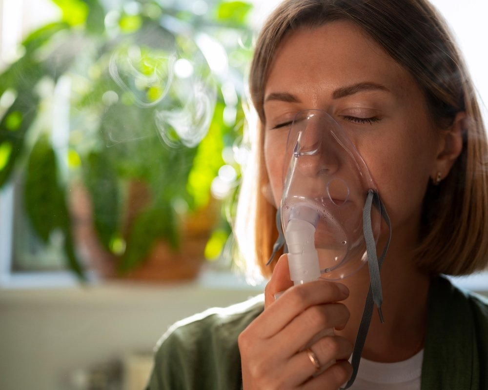

## Como a inalação de vapor para sinusite desobstrui o nariz, reduz a pressão facial e quais cuidados adotar em casa

Quando a congestão trava a respiração e a cabeça pesa, a **inalação de vapor para sinusite** surge como um recurso simples e acessível. A técnica, usada há décadas no autocuidado, ajuda a umedecer as vias aéreas superiores, favorece a eliminação do muco espesso e traz sensação rápida de alívio. Em casa, com poucos itens, é possível obter resultados consistentes, desde que alguns cuidados de **segurança** sejam observados e que a prática seja feita do jeito certo. Além de ser um dos *tratamentos naturais* mais populares, a **inalação de vapor para sinusite** combina bem com outros hábitos que protegem a saúde respiratória, como a hidratação adequada, o uso de *solução salina* e o descanso. Para quem sofre com **rinossinusite** recorrente, entender o passo a passo, a ciência por trás do vapor e as situações em que a técnica deve ser evitada é essencial para aproveitar os benefícios e reduzir riscos.

### Como fazer a inalação de vapor para sinusite passo a passo

Comece aquecendo água até que ela esteja **quente, mas não fervente**. A água deve soltar vapor visível sem borbulhar intensamente, o que reduz o risco de queimaduras. Despeje a água em uma tigela resistente ao calor, coloque a tigela sobre uma superfície firme e estável e sente-se confortavelmente. Posicione o rosto a uma distância segura do vapor, cerca de 30 a 40 centímetros, e cubra a cabeça com uma toalha para formar uma cúpula. Inspire pelo nariz e expire pela boca, de forma lenta e contínua, por **10 a 15 minutos**. Se sentir calor excessivo, afaste o rosto por alguns segundos e retorne em seguida. A técnica pode ser repetida **2 a 3 vezes ao dia**, especialmente nos períodos de maior congestão. Quem preferir pode realizar a **inalação de vapor para sinusite** durante um *banho quente*, mantendo o ambiente úmido, ou usar um *inalador elétrico* ou um *umidificador*. Para potencializar o conforto, faça uma **lavagem nasal com solução salina** antes ou depois da inalação, o que ajuda a remover secreções e impurezas.

### Por que o vapor ajuda, o que diz a ciência

 O vapor quente e úmido promove a **hidratação da mucosa nasal**, reduz a viscosidade do muco e facilita a sua mobilização. Com o muco mais fluido, os cílios presentes na mucosa dos seios da face trabalham melhor, favorecendo a **depuração mucociliar**, mecanismo natural responsável por varrer partículas e micro-organismos para fora das vias aéreas. Esse processo diminui a sensação de bloqueio, alivia a **pressão facial** e pode reduzir a dor associada à **sinusite**. Outro efeito desejado é o aquecimento suave das cavidades nasais, que melhora o fluxo sanguíneo local e pode contribuir para a redução do edema da mucosa inflamada. Embora a **inalação de vapor para sinusite** não trate a causa da infecção bacteriana quando ela existe, ela auxilia a criar condições mais favoráveis para a drenagem das secreções, o que costuma resultar em melhora do conforto respiratório e do bem-estar geral. Na prática clínica, a umidificação do ar é frequentemente recomendada como medida de suporte, integrada a outras abordagens, como *analgésicos*, *anti-inflamatórios* e *soluções salinas*. Vale ressaltar que a resposta varia de pessoa para pessoa. Em alguns casos, o alívio é perceptível em minutos, em outros, o benefício aparece após sessões regulares ao longo do dia. Por isso, a técnica deve ser vista como um **complemento** dentro de um plano de cuidados mais amplo, especialmente em períodos de crises de **rinossinusite** ou de alergias respiratórias.

### Segurança, aditivos naturais e quando evitar

A regra de ouro é evitar o risco de queimaduras. Nunca manipule água fervente próxima ao rosto, mantenha a tigela em superfície firme e não faça inalação com toalha em **crianças**. Para os pequenos, prefira **banho morno com vapor no banheiro** ou um **umidificador** no quarto, sempre com supervisão. Gestantes, pessoas com **asma**, DPOC ou com pele sensível devem conversar com um profissional de saúde antes de testar aditivos. Quanto aos aditivos naturais, algumas opções podem tornar a experiência mais confortável, embora o principal agente terapêutico continue sendo o **vapor de água**. Uma xícara de *infusão de camomila* adicionada à tigela confere aroma suave e sensação calmante. Folhas de *eucalipto* ou uma gota de óleo essencial na água fria antes do aquecimento podem liberar compostos aromáticos, porém use com parcimônia, já que fragrâncias intensas podem irritar a mucosa e piorar sintomas em pessoas sensíveis. Para minimizar riscos, evite **altas concentrações de óleos essenciais** e nunca aplique óleo puro diretamente na pele ou nas narinas. Interrompa a **inalação de vapor para sinusite** se surgir tontura, piora da falta de ar, zumbido, dor intensa ou irritação importante. Procure avaliação médica se os sintomas persistirem por mais de 7 a 10 dias, se houver **febre alta**, secreção amarelada com odor forte, dor ao redor dos olhos, inchaço facial, rigidez na nuca ou se você tiver histórico de sinusite crônica sem melhora. Nessas situações, pode ser necessário investigar e adotar tratamento específico. Feita com cuidado e regularidade, a **inalação de vapor para sinusite** é uma estratégia prática para aliviar a congestão, reduzir a pressão nos seios da face e melhorar a respiração. Integrada a hábitos como boa hidratação, repouso e higiene nasal com solução salina, ela pode acelerar a recuperação, mantendo o foco no conforto, na segurança e no uso consciente de aditivos naturais.

## Conclusão

A inalação de vapor é um **recurso de autocuidado simples e acessível** que se estabelece como uma estratégia eficaz no alívio imediato da congestão e da pressão facial causadas pela sinusite. Seu mecanismo de ação reside na capacidade do vapor quente e úmido de [**hidratar a mucosa nasal**](https://avidaplena.com.br/respiratoria/cuidados-respiratorios/prevencao/hidratacao-nasal/), reduzir a viscosidade do muco e, consequentemente, facilitar sua eliminação pelo mecanismo natural de depuração mucociliar. Para aproveitar os benefícios de forma segura, a **regra de ouro é evitar queimaduras**, utilizando água quente, mas nunca fervente, e mantendo uma distância segura do rosto. Embora aditivos naturais possam ser usados com moderação, o vapor de água é o agente terapêutico principal. Em conclusão, a inalação de vapor deve ser integrada a um **plano de cuidados mais amplo**, que inclui hidratação adequada, repouso e higiene nasal com solução salina, potencializando o conforto respiratório e o bem-estar geral. É fundamental **buscar avaliação médica** se os sintomas persistirem por mais de 7 a 10 dias ou se surgirem sinais de alerta, como febre alta ou dor intensa.
