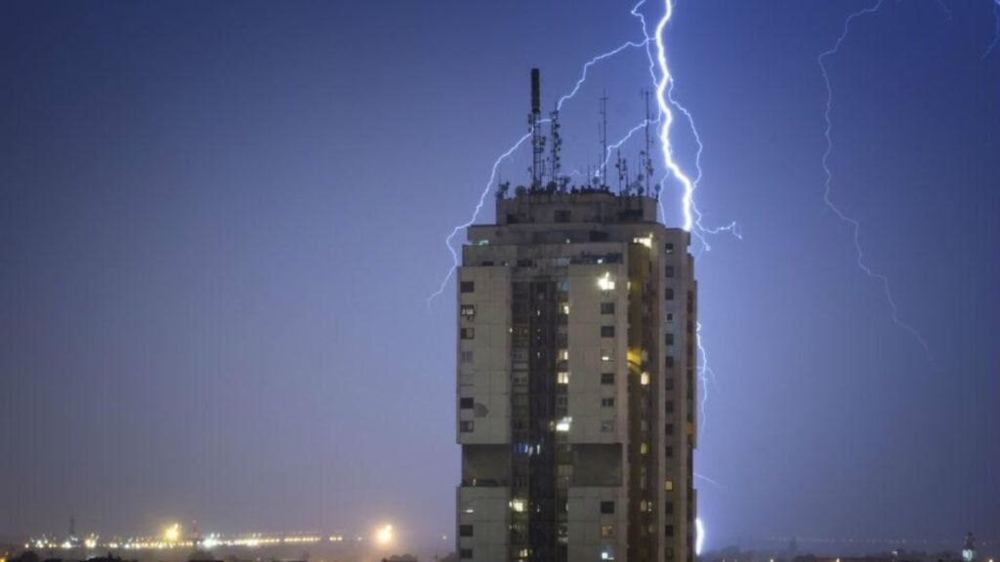

Você já sentiu aquele frio na barriga durante uma tempestade forte, quando os trovões parecem tremer as janelas? No **Irenes**, acreditamos que a sua casa deve ser o seu santuário de paz. E para que essa harmonia seja completa, a segurança técnica é fundamental para que você possa relaxar, sabendo que quem você ama está protegido.

Hoje vamos falar sobre um cuidado essencial: o **Laudo SPDA e aterramento**, um conjunto técnico que pode parecer complexo pelo nome, mas que é, na verdade, o certificado de que o seu lar está preparado para lidar com um dos fenômenos mais poderosos da natureza: os raios.

## **O que é o Laudo SPDA e por que ele é o "anjo da guarda" da sua casa?**

O SPDA (Sistema de Proteção contra Descargas Atmosféricas) é o que popularmente chamamos de para-raios. No entanto, o sistema não funciona sozinho. Para que ele seja eficiente, é necessário que o **Laudo SPDA e aterramento** esteja em conformidade com as normas técnicas.

Enquanto o para-raios "recebe" a descarga no topo do prédio, o **aterramento** é a parte que conduz essa energia para o fundo da terra de forma controlada. O laudo é o documento emitido por um engenheiro que atesta que toda essa estrutura, do topo ao chão, está em perfeitas condições de uso.

## **Para que serve essa inspeção na prática?**

Viver em paz significa não ter preocupações invisíveis. Veja como manter esse laudo em dia protege o seu dia a dia:

1.  **Proteção da Família:** O objetivo principal é evitar que a descarga elétrica atinja as pessoas dentro ou ao redor da edificação.
    
2.  **Preservação do Patrimônio:** Raios podem causar incêndios e danos estruturais. O laudo confirma que as "rotas de fuga" da eletricidade estão desobstruídas.
    
3.  **Segurança dos seus Eletrônicos:** Um sistema bem aterrado minimiza os surtos de tensão que queimam TVs, computadores e eletrodomésticos que tanto amamos.
    
4.  **Exigência do Seguro:** Muitas seguradoras se recusam a pagar indenizações por danos elétricos se o laudo não estiver atualizado.

## **Quando e quem deve fazer a inspeção?**

De acordo com a norma **NBR 5419**, a inspeção deve ser feita por um Engenheiro Eletricista habilitado. No **Irenes**, valorizamos a especialidade; por isso, sempre recomendamos profissionais certificados.

-   **Periodicidade:** Geralmente, uma inspeção visual deve ser feita anualmente e uma medição completa a cada 3 anos (ou anualmente em estruturas com risco de explosão ou locais com alta incidência de raios).
    
-   **O "Sinal de Alerta":** Se o seu prédio passou por reformas recentes ou se houve queda de raios próxima, chame um especialista para validar o sistema.

## **Onde a Beleza Encontra a Segurança**

Cuidar do lar é um ato de amor. Assim como escolhemos a melhor cor para a parede ou o aroma mais suave para a sala, garantir que o sistema de [**Laudo SPDA e aterramento**](https://insp-therm.com.br/) esteja em dia é uma forma de cultivar a paz profunda e o cuidado com a vida.

Se você mora em condomínio, converse com o seu síndico. Pergunte se o laudo está dentro da validade. Essa pequena atitude de "Irene", a pacificadora, garante que, mesmo nas noites de chuva mais intensa, o seu lar continue sendo um refúgio de absoluta serenidade.

## Conclusão: O Cuidado que se Transforma em Paz

No final do dia, a verdadeira harmonia de um lar vai muito além da decoração impecável ou de uma rotina de autocuidado bem estabelecida. Ela reside na certeza de que estamos seguras e de que fizemos o melhor para proteger quem amamos e o espaço que construímos com tanto carinho.

O **Laudo SPDA e aterramento** não é apenas uma burocracia técnica, mas uma camada invisível de proteção que permite que você durma tranquila, mesmo nas noites de tempestade. Afinal, ser uma "Irene", uma pacificadora, também significa antecipar cuidados e garantir que o seu refúgio permaneça intacto, seguro e sereno.

Que tal conferir hoje mesmo como está a segurança do seu prédio ou residência? Transformar o medo em prevenção é o primeiro passo para uma vida com muito mais leveza.
