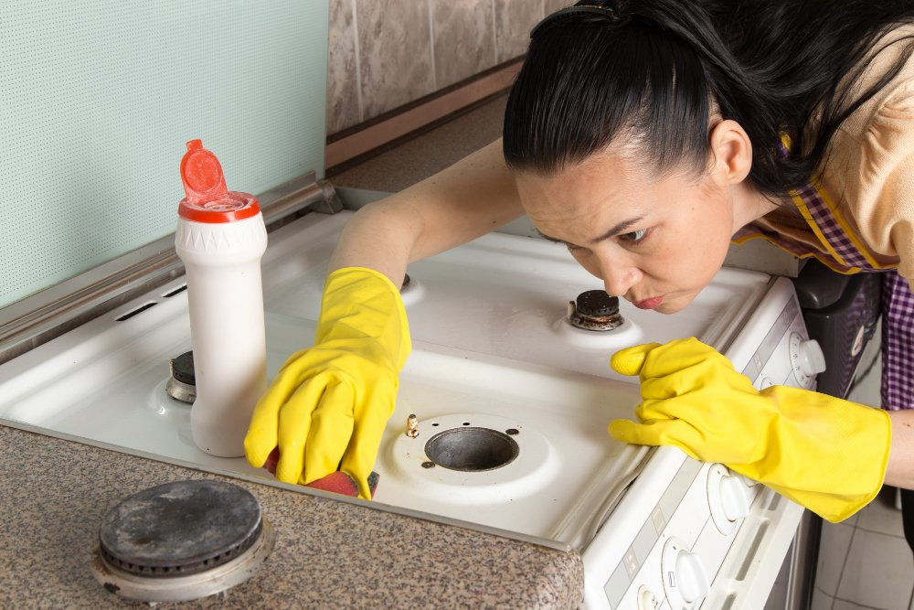
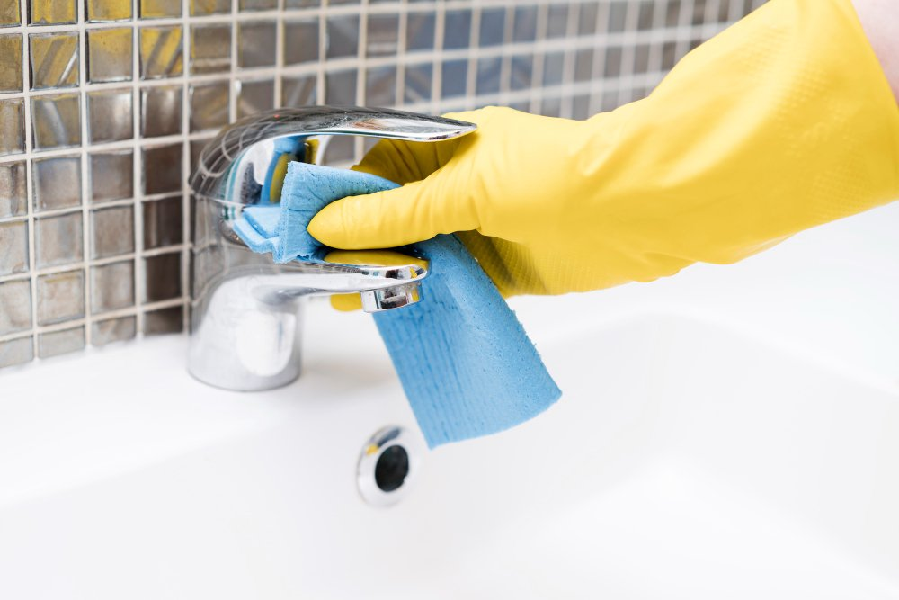

A cozinha é o coração da casa, mas também pode ser um verdadeiro campo de batalha contra a gordura e os odores indesejados. Quem nunca se deparou com aquele cheirinho persistente que parece ter tomado conta do ambiente após uma fritura? Calma! A sabedoria popular tem seus truques infalíveis para deixar sua cozinha limpa e fresquinha sem muito esforço. Vamos explorar juntos as melhores dicas e segredos da vovó para tornar essa tarefa bem mais leve. Prepare-se para transformar seu espaço em um lugar acolhedor novamente!

## Quais produtos necessários para limpar a cozinha?

Para uma limpeza eficiente da cozinha, você vai precisar de alguns produtos essenciais que fazem toda a diferença. O detergente neutro é um grande aliado para remover a gordura das superfícies. Se quiser dar um up na limpeza, o vinagre branco entra em cena como um poderoso desinfetante natural.  
  
E não podemos esquecer do bicarbonato de sódio! Ele ajuda a eliminar odores e pode ser usado em várias áreas. Com esses itens à mão, sua faxina será mais fácil e rápida. Vamos lá?

## Faxina na cozinha: por onde começar?

A faxina na cozinha pode parecer uma tarefa cansativa, mas com um plano em mente, tudo fica mais fácil. Comece varrendo a sujeira do chão para se livrar dos restos de comida e da poeira acumulada. Sinta-se como um verdadeiro detetive da limpeza, procurando cada pedacinho que precisa de atenção.  
  
Depois, organize os objetos e utensílios que estão espalhados pela bancada. Ao guardar tudo no seu devido lugar, você vai notar como o ambiente já parece mais leve e arejado. É hora de colocar a mão na massa!

### Comece varrendo a sujeira

Começar a faxina pela varrição é como dar o primeiro passo em uma dança! Com a vassoura na mão, você remove as migalhas e sujeiras acumuladas no chão. Esse gesto simples já traz uma sensação de alívio e organização.  
  
Enquanto varre, aproveite para colocar sua música favorita. A atividade se torna mais leve e divertida! Além disso, ao ver o chão limpinho, dá aquela motivação extra para continuar com a limpeza da cozinha. É um ótimo começo para deixar tudo brilhando novamente!

### Guarde os objetos e utensílios limpos

Depois de dar uma bela limpada, é hora de organizar! Guarde os objetos e utensílios usados na cozinha em seus devidos lugares. Acredite, um ambiente arrumado faz toda a diferença.  
  
Que tal criar categorias? Panelas juntas, copos alinhados e talheres organizados trazem harmonia ao espaço. E não esqueça: quanto mais acessíveis estiverem as coisas que você usa com frequência, mais prazeroso será cozinhar!

### Limpe superficialmente a pia

A pia é o coração da cozinha, sempre recebendo água e pratos. Para dar aquele trato rápido, comece enxaguando bem com água morna. Isso ajuda a soltar qualquer sujeirinha grudada.  
  
Depois, use um pano limpo ou uma esponja macia com detergente neutro para fazer uma limpeza leve na superfície. Não esqueça de prestar atenção nas bordas e no ralo! Assim, você garante que sua pia não só fique limpa, mas também cheirosa e pronta para as próximas aventuras culinárias.

### Esvazie a lixeira

Esvaziar a lixeira pode parecer uma tarefa simples, mas é fundamental para manter a cozinha livre de odores indesejados. Afinal, quem gosta daquela mistura de cheiros que se acumula? Pegue um saco novo e faça essa limpeza com alegria!  
  
Enquanto você está nessa missão, aproveite para observar o que realmente precisa ser descartado. Aproveite e organize: itens recicláveis podem ir para um canto especial. Assim, sua lixeira ficará mais leve e sua cozinha muito mais convidativa!

### Armários e gavetas

Abrir os armários e gavetas da cozinha pode ser uma verdadeira viagem no tempo. Você encontra coisas que nem lembrava que existiam, como aquela panela de pressão antiga ou um utensílio que prometia revolucionar suas receitas. Mas é hora de dar uma nova vida a esses espaços!  
  
Comece retirando tudo e limpando o interior. Descarte itens quebrados ou pouco usados. Organize seus utensílios por categoria: panelas com panelas, talheres com talheres. Dessa forma, além de limpar, você torna sua rotina na cozinha muito mais prática e divertida!

### Azulejos

Os azulejos são os grandes aliados da sua cozinha, mas também acumulam sujeira e gordura. Para limpá-los sem esforço, você pode usar uma mistura de água morna com vinagre. Aplique a solução com um pano macio e veja a mágica acontecer! Os azulejos brancos vão brilhar como novos.  
  
Se as manchas insistirem em ficar, experimente bicarbonato de sódio. Faça uma pasta e esfregue suavemente. Em poucos minutos, eles estarão impecáveis novamente. Um toque especial para deixar sua cozinha ainda mais convidativa!

### Bancada

A bancada é o coração da cozinha. É lá que cortamos, misturamos e criamos nossas delícias culinárias. Por isso, mantê-la limpa e organizada é fundamental! Comece retirando tudo que está em cima dela: panelas, temperos e utensílios. Um espaço livre facilita a limpeza.  
  
Use um pano úmido com detergente neutro para remover manchas de gordura ou resíduos de alimentos. Se precisar de uma força extra, a mistura de vinagre e bicarbonato pode ser sua aliada! Isso vai deixar sua bancada brilhando como nova, pronta para mais aventuras gastronômicas.

### Pia e torneira

A pia e a torneira são os verdadeiros protagonistas da cozinha. Elas enfrentam diariamente restos de comida, gordura e até água em excesso. Para deixar esse duo brilhando, comece esfregando com um detergente suave e uma esponja macia. Não esqueça dos cantinhos!  
  
Após a limpeza, seque tudo com um pano limpo para evitar manchas d'água. Um truque é passar um pouco de vinagre na torneira para dar aquele brilho extra. Sua pia vai ficar tão reluzente que você vai querer exibi-la como uma obra de arte!

### Utensílios e panelas

Utensílios e panelas são os verdadeiros heróis da cozinha. São eles que enfrentam o dia a dia, misturando sabores e criando pratos deliciosos. Mas quem disse que eles não merecem um carinho? Uma lavagem caprichada ajuda a manter sua qualidade e prolonga a vida útil.  
  
Na hora de limpar, use água morna com detergente neutro para tirar toda aquela gordura grudenta. Um truque é mergulhar as panelas em água quente antes de esfregar. Assim, você economiza esforço e garante uma limpeza eficaz!

### Piso

O piso da cozinha muitas vezes acumula manchas e gordura, mesmo quando menos percebemos. Para deixá-lo impecável, comece varrendo bem a área. Isso ajuda a remover a sujeira solta que pode se tornar um verdadeiro desafio durante a limpeza.  
  
Depois de varrer, utilize um bom detergente diluído em água quente. Passe um pano ou esfregão com essa mistura e veja como o brilho volta! Um toque final com vinagre ajuda na desinfecção e deixa seu piso livre de odores indesejados.

### Desinfete a lixeira

Desinfetar a lixeira é uma etapa essencial para manter a cozinha livre de odores indesejados. Comece retirando o saco de lixo e dê uma boa lavada na parte interna com água quente e detergente. Para um toque extra, adicione vinagre ou bicarbonato de sódio, que ajudam a eliminar bactérias.  
  
Depois da limpeza, enxágue bem e seque com um pano limpo. Se você quiser ainda mais frescor, coloque algumas folhas secas de louro ou cascas de frutas no fundo antes de colocar um novo saco. Sua lixeira merece esse carinho!

## Como limpar fogão

Limpar o fogão pode ser uma tarefa simples e até divertida. Comece retirando as grelhas e os queimadores, se possível. Mergulhe-os em água quente com detergente por alguns minutos para soltar a sujeira grudada.  
  
Enquanto isso, use um pano úmido com vinagre ou bicarbonato de sódio para limpar a superfície do fogão. Esses ingredientes naturais são poderosos na remoção de manchas sem agredir o material. Para finalizar, enxágue tudo bem e coloque os itens no lugar. Fogão limpinho pronto para novas aventuras culinárias!

## Como limpar geladeira

Para limpar a geladeira, comece esvaziando tudo. Retire os alimentos e aproveite para verificar as datas de validade. Jogue fora o que não serve mais! Em seguida, use uma solução de água morna com vinagre ou bicarbonato para desinfetar as prateleiras.  
  
Com um pano macio, limpe cada canto e lembre-se das gaxetas da porta, que acumulam sujeira. Se houver manchas teimosas, um pouco de óleo mineral pode ajudar a removê-las. Assim sua geladeira ficará brilhante e livre de odores indesejados!

## Como limpar micro-ondas

Limpar o micro-ondas pode ser uma tarefa rápida e fácil. Comece colocando um recipiente com água e algumas fatias de limão dentro. Ligue por 5 minutos na potência alta. O vapor vai soltar a sujeira grudada, facilitando a limpeza.  
  
Depois, retire o recipiente (cuidado com o calor!) e passe um pano úmido nas paredes internas. Não esqueça do prato giratório: lave-o como qualquer outro utensílio! Pronto, sua cozinha estará livre dos vestígios das refeições anteriores em poucos minutos!

## Como limpar forno elétrico

Limpar o forno elétrico pode parecer uma tarefa difícil, mas com algumas dicas práticas, você vai ver que é mais fácil do que parece. Comece retirando as grelhas e bandejas. Deixe-as de molho em água quente com detergente enquanto cuida do interior.  
  
Para a limpeza da parte interna, misture bicarbonato de sódio com água até formar uma pasta. Espalhe essa mistura nas superfícies sujas e deixe agir por algumas horas. Depois, passe um pano úmido e admire seu forno brilhante!

## Como limpar filtro de água

Limpar o filtro de água é mais fácil do que você imagina. Comece retirando o filtro e enxaguando-o em água corrente para remover impurezas. Se houver resíduos acumulados, use uma escova macia com detergente neutro.  
  
Depois de limpar, enxágue bem até não sentir cheiro de sabão. Deixe secar completamente antes de colocá-lo de volta no lugar. Assim, você garante que a água esteja sempre fresquinha e livre das sujeiras indesejadas! Uma cozinha limpa começa pela água pura!

## Como tirar cheiro de queimado da cozinha?

O cheiro de queimado pode ser um verdadeiro pesadelo na cozinha. Para combatê-lo, comece abrindo as janelas e deixando o ar fresco entrar. A ventilação é essencial! Em seguida, coloque uma panela com água e rodelas de limão para ferver. O vapor vai ajudar a neutralizar os odores indesejados.  
  
Outra dica infalível é usar vinagre branco. Coloque um recipiente com vinagre em um canto da cozinha por algumas horas. Ele absorve cheiros rapidamente, fazendo sua casa voltar a ter aquele aroma agradável de lar doce lar!

## Como limpar armário de cozinha de 5 jeitos diferentes

Limpar o armário da cozinha pode ser mais divertido do que você imagina. Primeiro, experimente a mistura de água e vinagre, que remove manchas e deixa um cheirinho bom. Outra dica é usar bicarbonato de sódio para as áreas mais difíceis; ele é poderoso na hora da limpeza!  
  
Se preferir algo natural, limão com sal também faz milagres. E não se esqueça dos panos microfibra: eles são ótimos para alcançar os cantinhos! Com essas dicas simples, seu armário ficará brilhando em pouco tempo.

## Conclusão

Manter a limpeza da cozinha é essencial para um [ambiente saudável e agradável](https://empresas.einstein.br/gestao-de-saude/ambiente-de-trabalho-saudavel/). Com as dicas que compartilhamos, você pode transformar sua rotina de faxina em algo mais simples e até divertido. Lembre-se: o segredo de vó está na combinação dos produtos certos e daquele carinho especial ao cuidar do seu espaço.  
  
Agora é hora de colocar as mãos à obra! Coloque suas músicas favoritas para tocar, reúna os materiais necessários e aproveite esse momento como uma pausa relaxante no seu dia a dia. Uma cozinha limpa não só traz frescor, mas também inspira novas receitas e momentos saborosos com quem você ama. Então, arregaçe as mangas e deixe sua cozinha brilhando!
