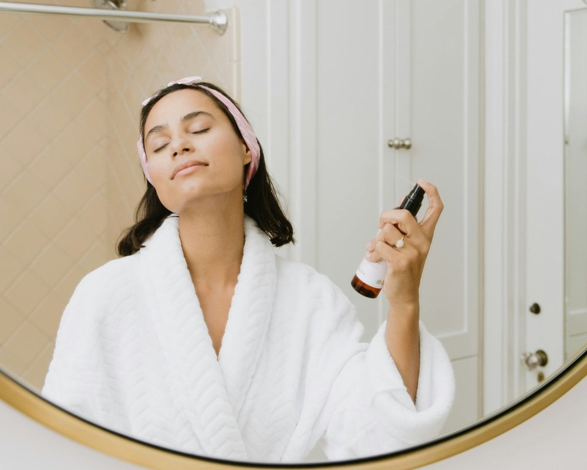
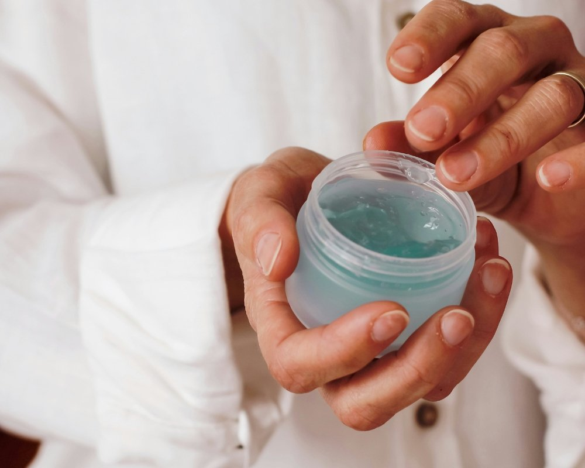

Você já parou para pensar na importância de cuidar da sua pele? A rotina de skincare não é apenas uma moda passageira, mas sim um verdadeiro ritual de amor próprio. Imagine acordar todos os dias com a pele radiante e saudável! Neste guia, vamos te levar por um passeio pelo maravilhoso mundo dos cuidados com a pele.

Se você deseja conquistar aquele brilho natural ou até mesmo resolver questões específicas, este post é feito sob medida para você. Prepare-se para desvendar segredos que vão transformar sua rotina de beleza e deixar seu rosto impecável!

## O que é skincare?

Skincare é muito mais do que simplesmente aplicar cremes. É uma verdadeira arte de cuidar da sua pele, envolvendo limpeza, hidratação e proteção. Essa prática milenar ganhou destaque nos últimos anos, com todo mundo buscando aquela aparência saudável e radiante.  
  
Além disso, skincare vai além da estética; trata-se de autoestima e bem-estar. Cada produto tem um propósito especial, atuando em diferentes necessidades para deixar sua pele linda e equilibrada. Então, se joga nessa rotina deliciosa e descubra o poder dos cuidados diários!

## Por que ter uma rotina skincare adequada?

Ter uma rotina de skincare adequada é essencial para manter a pele saudável e radiante. Ela ajuda a prevenir problemas como acne, manchas e o envelhecimento precoce, além de garantir que sua pele fique sempre hidratada e nutrida.  
  
Quando você se dedica aos cuidados com a pele, não só melhora sua aparência, mas também promove um momento de autocuidado. Isso traz bem-estar mental e emocional, transformando esses minutos em um ritual relaxante no seu dia-a-dia. Quem não ama se sentir bonito?

## Quais produtos utilizar para skincare?

Escolher os produtos certos para a sua rotina de skincare é fundamental. Comece com um bom cleanser para remover as impurezas do dia a dia. Em seguida, não esqueça do tônico, que ajuda a equilibrar o pH da pele e prepara-a para absorver melhor os próximos passos.  
  
Depois vem o hidratante, que deve ser escolhido conforme seu tipo de pele. Se você busca uma dose extra de energia, aposte em séruns com ingredientes poderosos como ácido hialurônico ou retinol!

### Itens essenciais no skincare

Para uma rotina de skincare eficaz, alguns itens são indispensáveis. Comece com um bom cleanser para remover impurezas e maquiagem do rosto. Depois, o tônico ajuda a equilibrar o pH da pele e prepara-a para os próximos passos.  
  
Não esqueça do hidratante! Ele é crucial para manter a pele macia e saudável. E claro, não podemos deixar de lado o protetor solar: seu melhor amigo na luta contra os danos solares e envelhecimento precoce. Com esses produtos em mãos, sua pele vai agradecer!

### Ordem correta dos produtos de skincare

Para uma rotina de skincare eficaz, a ordem dos produtos é essencial. Comece sempre com o limpador facial para remover impurezas e preparar a pele. Em seguida, aplique tônicos ou essências que ajudam na hidratação e no equilíbrio da pele.  
  
Depois, é hora dos tratamentos específicos como séruns e cremes anti-idade. Finalize com um bom hidratante para selar tudo isso. E não esqueça do protetor solar durante o dia! Cada passo tem seu lugar para garantir resultados incríveis na sua rotina de skincare.

## Guia de skincare por tipo de pele e necessidade

Cada tipo de pele tem suas particularidades e necessidades. Para as peles maduras com sinais de flacidez, invista em cremes firmadores e hidratantes ricos. Já as peles jovens devem priorizar produtos leves, como géis e loções que não obstruem os poros.  
  
Se você possui uma pele oleosa, busque itens oil-free para controlar a produção excessiva de sebo. Peles desvitalizadas com manchas pedem clareadores específicos. Conhecer sua pele é o primeiro passo para uma rotina de skincare eficaz e personalizada!

### Peles maduras com sinais de flacidez

Peles maduras que enfrentam os desafios da flacidez merecem uma atenção especial. Com o tempo, a produção de colágeno diminui e a elasticidade se perde. Para combater isso, produtos com ativos como retinol e peptídeos são ótimos aliados.  
  
Além disso, não subestime o poder da hidratação! Cremes nutritivos ajudam a dar firmeza à pele, enquanto máscaras faciais podem fornecer um boost extra. A rotina de skincare deve ser um momento prazeroso e revitalizante para você!

### Peles jovens e desvitalizadas

Pele jovem e desvitalizada pode parecer um paradoxo, mas é mais comum do que você imagina. Fatores como estresse, má alimentação e falta de sono podem deixar sua pele sem vida. A boa notícia é que com os cuidados certos, dá para reverter essa situação.  
  
Invista em produtos ricos em hidratação e antioxidantes. Um bom sérum facial com vitamina C ajuda a iluminar e revitalizar a pele. Não esqueça da importância de beber água! Hidratação de dentro para fora faz toda a diferença na sua rotina de skincare.

### Peles maduras e desvitalizadas

Peles maduras e desvitalizadas merecem um cuidado especial. Com o passar do tempo, a produção de colágeno diminui, deixando a pele mais fina e sem viço. Para revitalizar esse tipo de pele, invista em hidratantes potentes e séruns com ingredientes como ácido hialurônico.  
  
Além disso, não subestime o poder da vitamina C! Esse antioxidante incrível ajuda a iluminar e uniformizar o tom da pele. Experimente incorporar esses produtos à sua rotina e sinta a diferença na textura e na luminosidade da sua pele.

### Peles jovens e oleosas

Se você tem pele jovem e oleosa, sabe que a luta contra o brilho excessivo é real. A boa notícia é que existem soluções específicas para manter sua pele saudável e com aquele aspecto fresh. Aposte em gel de limpeza facial para remover as impurezas e o excesso de sebo sem agredir.  
  
Após a limpeza, um tônico adstringente pode ser seu melhor amigo. Ele ajuda a minimizar os poros e controla a oleosidade ao longo do dia. Não esqueça da hidratação: escolha produtos oil-free para garantir uma rotina leve e eficaz!

### Peles desvitalizadas com manchas

A pele desvitalizada com manchas pode ser um verdadeiro desafio, mas não se preocupe! Com os produtos certos e uma rotina dedicada, você pode transformar seu visual. Invista em séruns com vitamina C para iluminar a cútis e uniformizar o tom.  
  
Além disso, esfoliações semanais ajudam a remover células mortas e estimulam a renovação celular. Um bom hidratante é essencial para devolver a vitalidade da pele. E lembre-se: sempre finalize com protetor solar para proteger sua beleza do sol!

### Peles jovens que precisam de praticidade

A rotina de skincare para peles jovens que buscam praticidade deve ser simples e eficaz. O ideal é apostar em produtos multifuncionais, como um hidratante com proteção solar ou um sérum que também trate imperfeições. Assim, você economiza tempo e ainda cuida da pele.  
  
Limpeza é fundamental! Um gel de limpeza suave remove impurezas sem agredir a pele. Finalize com um bom hidratante leve e pronto: sua pele radiante está garantida, mesmo nos dias mais corridos!

### Peles maduras que precisam de praticidade

As peles maduras que buscam praticidade merecem atenção especial. Com a correria do dia a dia, optar por produtos multifuncionais é uma ótima estratégia. Um bom hidratante com proteção solar e ingredientes anti-idade pode ser um verdadeiro salvador.  
  
Além disso, escolha séruns concentrados que tratem linhas finas enquanto iluminam a pele. A rotina não precisa ser complicada; o importante é encontrar os aliados certos para manter a luminosidade e firmeza da pele de forma descomplicada e eficiente.

## Skincare Facial

Cuidar do rosto é um ritual mágico que transforma a pele. Um bom tratamento facial pode ser o seu melhor aliado para conquistar aquele glow radiante. Experimente máscaras, esfoliantes e séruns que se encaixem nas suas necessidades.  
  
Dedique alguns minutos do dia para aplicar esses produtos com carinho, massageando suavemente. Essa prática não apenas nutre a pele, mas também proporciona um momento de relaxamento na correria do cotidiano. Afinal, quem não ama se sentir renovado e com a autoestima lá em cima?

## Skincare Corporal

Cuidar da pele do corpo é tão importante quanto o skincare facial. A hidratação diária pode transformar a textura e aparência da sua pele. Usar um bom creme ou loção após o banho ajuda a manter a umidade, deixando tudo mais macio e saudável.  
  
Não se esqueça de esfoliar uma vez por semana! Isso remove as células mortas e revela uma pele radiante. Escolha produtos com ingredientes naturais que nutrem, como óleos essenciais e manteigas vegetais para um toque extra de carinho na sua rotina corporal.

## Skincare Capilar

Cuidar dos cabelos é tão importante quanto a rotina de skincare para o rosto. Afinal, fios saudáveis emolduram nosso rosto e refletem nossa personalidade. Um bom shampoo e condicionador são essenciais, mas não deixe de incluir máscaras hidratantes na sua rotina capilar.  
  
Os óleos nutritivos também são aliados poderosos! Eles ajudam a selar a umidade e combatem o frizz, além de deixar os cabelos com aquele brilho irresistível. Experimente diferentes produtos até encontrar os que funcionam melhor para você e arrase com madeixas deslumbrantes!

## Skincare Proteção Solar

A proteção solar é um dos passos mais importantes na rotina de skincare. Muitas pessoas subestimam os danos que o sol pode causar à pele, mas acredite: essa exposição excessiva pode acelerar o envelhecimento e provocar manchas indesejadas.  
  
Além disso, o uso diário do protetor solar ajuda a prevenir doenças graves, como câncer de pele. Escolha um produto com fator de proteção adequado e aplique generosamente antes da maquiagem ou sair de casa. Sua pele vai agradecer!

## Skincare Anti-idade

O conceito de anti-idade vai muito além do que apenas cremes e loções. É uma verdadeira filosofia de vida! Quando pensamos em envelhecer bem, estamos falando sobre cuidar da pele, mas também da mente e do corpo. Investir em hábitos saudáveis faz toda a diferença.  
  
Os produtos anti-idade são mágicos para combater rugas e flacidez. Ingredientes como retinol e peptídeos ajudam a estimular a produção de colágeno, deixando sua pele mais firme e radiante. Que tal incluir esses aliados na sua rotina?

## Skincare Vitamina C

A vitamina C é a super-heroína da sua rotina de skincare! Ela ilumina a pele, combate os radicais livres e ainda ajuda na produção de colágeno. Com isso, você conquista uma aparência mais jovem e saudável.  
  
Além disso, esse poderoso antioxidante pode ajudar a uniformizar o tom da pele, reduzindo manchas escuras. E quem não quer uma pele radiante? Experimente adicionar um sérum com vitamina C à sua rotina e sinta a diferença logo nas primeiras aplicações.

## Skincare Veganos

Se você é vegano e ama cuidar da pele, boas notícias! O mercado de skincare está cheio de opções livres de crueldade e ingredientes de origem animal. É possível ter uma rotina completa sem abrir mão dos seus princípios.  
  
Busque sempre por produtos que tenham a certificação cruelty-free e sejam veganos. Esses itens não só respeitam os animais, mas muitas vezes são formulados com ingredientes naturais incríveis. Sua pele agradece essa escolha consciente!

## Qual a ordem dos produtos de skincare em uma rotina adequada?

Para garantir que sua rotina de skincare seja eficaz, a ordem dos produtos é fundamental. Comece sempre com um bom cleanser para remover impurezas e deixar a pele limpa. Em seguida, aplique tônicos para equilibrar o pH e preparar a pele para os próximos passos.  
  
Depois do tônico, siga com séruns ricos em ingredientes ativos, como vitamina C ou ácido hialurônico. Finalize com hidratante e protetor solar durante o dia. Essa sequência maximiza os benefícios de cada produto e mantém sua pele radiante!

## Conclusão

Cuidar da pele não é apenas uma questão de estética, mas um ato de amor próprio. Adotar uma rotina de skincare adequada pode transformar a saúde e a aparência da sua pele. Lembre-se: cada tipo de pele tem suas necessidades específicas, e personalizar sua rotina é fundamental para alcançar resultados incríveis.  
  
Seja você adepto dos produtos veganos ou dos clássicos [cosméticos anti-idade](https://amzn.to/3JnmjPU), o importante é encontrar o que funciona melhor para você. Com dedicação e paciência, os efeitos positivos serão visíveis com o tempo.  
  
Agora que você já conhece todos os passos essenciais do skincare, é hora de colocar tudo em prática! Sua pele merece esse cuidado especial. Experimente essa nova abordagem e prepare-se para brilhar por dentro e por fora!
