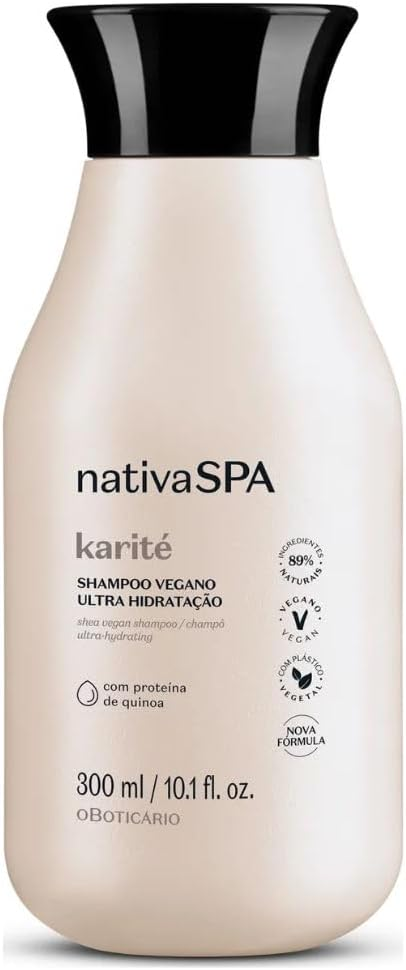
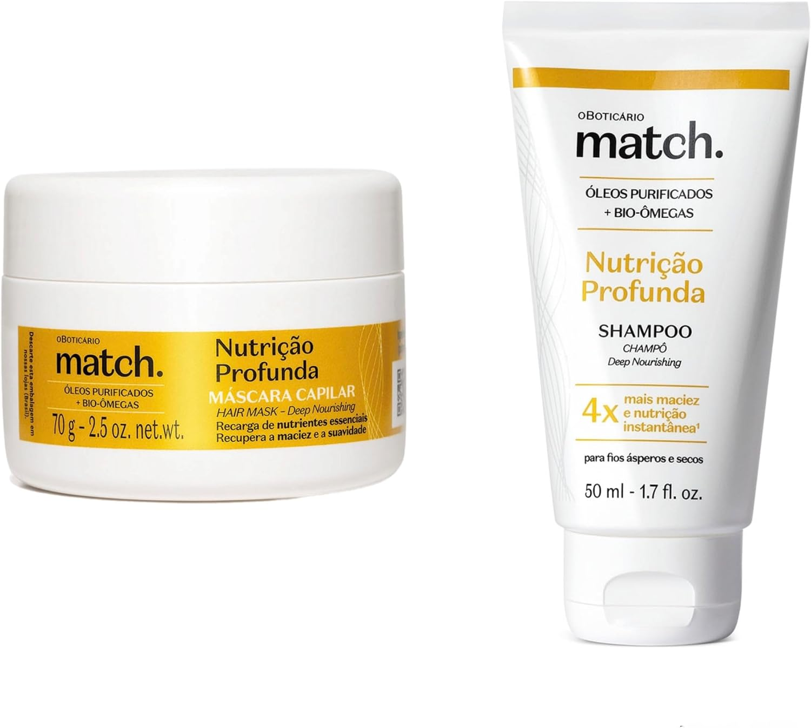
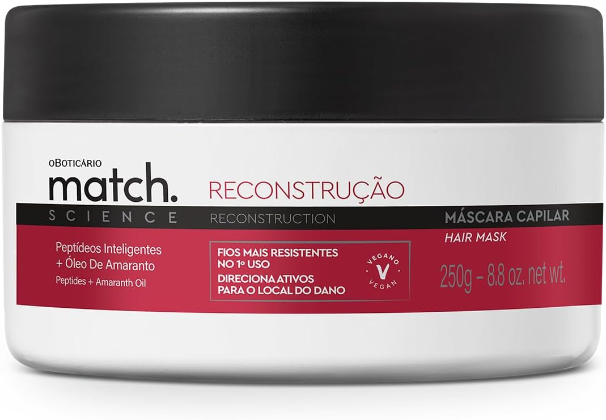

Você já ouviu falar em cronograma capilar? Se ainda não, prepare-se para descobrir o segredo que pode transformar seus fios e devolvê-los a vitalidade! Imagine ter cabelos saudáveis, brilhantes e cheios de vida. Parece um sonho, certo? A verdade é que esse programa de cuidados pode ser seu aliado na batalha contra os danos diários.

Neste artigo, vamos explorar tudo sobre o cronograma capilar: sua importância, etapas e dicas imperdíveis para você arrasar com madeixas deslumbrantes! Vamos lá?

## O que é cronograma capilar?

O cronograma capilar é um plano de cuidados para os cabelos que se baseia em três etapas fundamentais: hidratação, nutrição e reconstrução. Cada fase tem sua função específica e visa tratar diferentes necessidades dos fios. A ideia é reequilibrar a saúde das madeixas, combatendo o ressecamento, a falta de brilho e até mesmo os danos mais profundos.  
  
Com esse ritual personalizado, você pode adaptar os tratamentos às condições do seu cabelo. Seja ele seco, oleoso ou danificado, o cronograma capilar promete resultados incríveis! Pronto para dar aos seus fios toda a atenção que eles merecem?

## Para que serve o cronograma capilar?

O cronograma capilar é um verdadeiro aliado na busca por cabelos saudáveis e deslumbrantes. Ele serve para repor a hidratação, nutrição e reconstrução dos fios, que podem ser danificados pelo uso excessivo de químicos, calor ou até mesmo pela falta de cuidados.  
  
Ao seguir esse planejamento, você garante que cada etapa atenda às necessidades específicas do seu cabelo. Assim, os resultados aparecem em brilho intenso, maciez e força. Prepare-se para transformar suas madeixas em uma verdadeira obra-prima!

## Quais são as etapas do cronograma capilar?

O cronograma capilar é dividido em três etapas essenciais: hidratação, nutrição e reconstrução. Cada uma delas tem um papel importante na saúde dos fios. A hidratação traz água e brilho, enquanto a nutrição fornece lipídios para deixar o cabelo macio e sedoso.  
  
Por outro lado, a reconstrução é como um tratamento de choque. Ela repõe proteínas que fortalecem os cabelos danificados. É fundamental entender essas etapas para tratar os fios da maneira certa e conquistar aquele visual deslumbrante que todos desejam!

### Cronograma Capilar – Etapa de Hidratação

A etapa de hidratação é o verdadeiro abraço que seus fios merecem! Nela, você irá repor a água e os nutrientes essenciais, deixando suas madeixas macias e brilhantes. Usar máscaras hidratantes é fundamental para devolver a umidade perdida, especialmente após processos químicos ou exposições ao sol.  
  
Imagine seu cabelo como uma esponja seca; quando você aplica o produto certo, ele absorve tudo com alegria. Aposte em ingredientes como aloe vera e glicerina para potencializar esse efeito. Seus cabelos vão agradecer com muito mais vida e beleza!

### Cronograma Capilar – Etapa de Nutrição

A etapa de nutrição é o momento em que seu cabelo recebe aquele carinho especial. Aqui, os óleos e manteigas entram em cena para devolver a gordura natural perdida pelos fios. Essa fase é essencial para garantir maciez e brilho, salvando as madeixas do ressecamento.  
  
Ao usar produtos ricos em ingredientes como óleo de argan ou abacate, você vai notar a diferença na textura dos cabelos. Eles ficam mais sedosos e com um toque delicioso! Aproveite esse ritual relaxante e permita que seus fios absorvam todo esse amor nutritivo.

### Cronograma Capilar – Etapa de Reconstrução

A etapa de reconstrução é a verdadeira salvadora dos fios danificados. Aqui, o foco está em repor a proteína perdida e fortalecer as madeixas. Após químicas intensas ou exposições ao sol, essa fase se torna essencial para evitar que os cabelos fiquem quebradiços.  
  
É nesta etapa que você vai usar produtos ricos em queratina e aminoácidos. Eles agem como um verdadeiro banho reparador! Aplicar uma máscara reconstrutora pode fazer toda a diferença, trazendo vida e maciez aos seus cabelos novamente. Prepare-se para ver suas madeixas brilharem com saúde!

### Qual é a etapa mais importante do cronograma capilar?

Quando falamos sobre o cronograma capilar, é fácil se perder nas etapas. Mas vamos combinar: a etapa mais importante é a reconstrução. Esse passo é essencial para repor proteínas perdidas e restaurar a estrutura dos fios danificados. Se seu cabelo está quebradiço ou sem vida, nesta hora ele precisa de um carinho especial.  
  
Mas não esqueça! Hidratação e nutrição também são cruciais para manter os resultados. A mágica acontece quando você encontra o equilíbrio certo entre essas etapas. Afinal, cabelos saudáveis vêm da harmonia entre força e hidratação!

## Como fazer o cronograma capilar

Criar um cronograma capilar é como montar uma playlist perfeita para seus fios. Primeiro, analise seu cabelo: ele está saudável ou precisa de ajuda? Para cabelos pouco danificados, intercale hidratação e nutrição a cada semana. Se os danos são mais evidentes, adicione a etapa de reconstrução.  
  
Para cabelos muito danificados, priorize a reconstrução nas primeiras semanas. Depois, volte à rotina equilibrada com todas as etapas. Lembre-se de respeitar o tempo de ação dos produtos e dar sempre aquele carinho especial aos seus fios!

### Cabelo pouco danificado

Se o seu cabelo está pouco danificado, você está em uma ótima posição para mantê-lo saudável e vibrante! Nessa fase, a rotina de cuidados pode ser mais leve. Invista em hidratação regular para garantir que seus fios se mantenham macios e brilhantes.  
  
Um bom truque é usar máscaras hidratantes uma ou duas vezes por semana. Assim, você vai potencializar a umidade dos fios sem precisar de reparos intensivos. Aposte também em óleos leves como finalizadores, que vão deixar suas madeixas com aquele aspecto sedoso e cheio de vida.

### Cabelo danificado

Cabelo danificado é um verdadeiro desafio, não é mesmo? Aqueles fios quebradiços, sem brilho e cheios de frizz podem deixar qualquer um frustrado. A boa notícia é que existem maneiras eficazes de reverter esse quadro.  
  
Para dar nova vida a essas madeixas sofridas, o cronograma capilar se torna seu melhor amigo. Com as etapas certas de hidratação, nutrição e reconstrução, você pode resgatar a saúde dos seus cabelos. Prepare-se para ver seus fios brilharem novamente e recuperar toda a autoestima!

### Cabelo muito danificado

Cabelos muito danificados merecem atenção especial. Se os seus fios estão quebradiços, secos e sem vida, é hora de agir! Essa condição pode ser resultado de processos químicos intensos ou até mesmo do uso excessivo de ferramentas térmicas. A boa notícia? Existe esperança!  
  
Para restaurar a saúde das suas madeixas, foque na etapa de reconstrução do cronograma capilar. Utilize produtos que contenham queratina e aminoácidos para fortalecer as fibras capilares e devolver o brilho perdido. Assim, você dará um novo fôlego aos seus cabelos!

## Qual a ordem dos tratamentos no cronograma capilar?

A ordem dos tratamentos no cronograma capilar é fundamental para garantir resultados incríveis. Comece sempre pela hidratação, que vai repor a água nos fios e deixá-los mais saudáveis. Depois, siga para a nutrição, onde os óleos e manteigas vão trazer vitalidade e maciez.  
  
Por fim, finalize com a reconstrução. Essa etapa é crucial para cabelos danificados que precisam de força e recuperação. Lembre-se: cada cabelo tem suas necessidades! Ajuste conforme o seu tipo de fio e observe a mágica acontecer ao longo do tempo.

## Sugestões de produtos para cada etapa do cronograma capilar

Para brilhar em cada etapa do cronograma capilar, escolha produtos que se adequem ao seu tipo de cabelo. Para hidratação, aposte em máscaras ricas em aloe vera e glicerina. Elas trazem a umidade necessária para fios sedosos e saudáveis.  
  
Na nutrição, óleos vegetais como o de abacate ou coco são maravilhosos! Eles vão selar a umidade e deixar seus cabelos com aquele aspecto brilhante. E quando chegar a hora da reconstrução, invista em cremes com queratina ou colágeno. Seus fios agradecem!

### Produtos para hidratação

Quando se trata de hidratação, os produtos certos fazem toda a diferença. Procure por máscaras e cremes que contenham ingredientes como aloe vera, pantenol e óleos naturais. Esses componentes ajudam a reter a umidade nos fios e trazem aquele brilho saudável que todos desejamos.  
  
Outra dica é escolher shampoos hidratantes com fórmulas suaves. Eles limpam sem agredir, preparando o cabelo para receber os tratamentos. Quando você combina bons produtos com uma rotina constante, seus fios ficam macios e sedosos. Não subestime o poder da hidratação!

**Shampoo Vegano Ultra Hidratação Nativa Spa Karité**

[Veja Oferta](https://amzn.to/4hng3Ex)

### Produtos para nutrição

Quando falamos em nutrição capilar, a escolha dos produtos certos é fundamental. Aposte em óleos vegetais como o de abacate ou argan, que são ricos em nutrientes e ajudam a manter os fios saudáveis e brilhantes. Máscaras nutritivas também são ótimas aliadas para devolver a vida aos cabelos.  
  
Além disso, procure por cremes leave-in que contenham ingredientes como manteiga de karité ou óleo de coco. Eles não apenas hidratam, mas criam uma barreira protetora contra agressões externas. Experimente diferentes combinações até encontrar os produtos ideais para seus fios!

**KIT MATCH NUTRIÇÃO PROFUNDA: MÁSCARA 70G E SHAMPOO 50ML**

[Veja Oferta](https://amzn.to/4nZlz2x)

### Produtos para reconstrução

Se você está em busca de produtos para reconstrução, a primeira dica é escolher aqueles que contenham queratina. Esse componente poderoso ajuda a repor as proteínas perdidas dos fios e traz força imediata ao cabelo. Máscaras com colágeno também são ótimas opções, pois promovem hidratação intensa e restauram a estrutura capilar.  
  
Outra excelente escolha são os tratamentos com aminoácidos. Eles agem diretamente na fibra capilar, proporcionando uma renovação profunda. Não esqueça de aplicar esses produtos sempre no cabelo úmido, garantindo assim que todos os nutrientes sejam absorvidos da melhor maneira possível!

**Máscara Capilar Match Science Reconstrução 250g**

[Veja Oferta](https://amzn.to/47qmWjT)

## Conclusão

Cuidar dos cabelos não precisa ser um sacrifício. Com o cronograma capilar, você transforma seus fios de maneira simples e eficaz. Ao seguir as etapas de hidratação, nutrição e reconstrução, seu cabelo ganhará vida nova.  
  
O que é cronograma capilar? Uma rotina que traz resultados visíveis em pouco tempo. Escolha os produtos certos para cada etapa e adapte o tratamento às necessidades do seu cabelo. Lembre-se: a beleza está na saúde dos fios.  
  
Agora é hora de colocar em prática tudo o que aprendeu! Prepare-se para desfilar com cabelos incríveis e cheios de brilho. Essa jornada pode se tornar uma experiência divertida e cheia de aprendizado sobre sua própria beleza!
