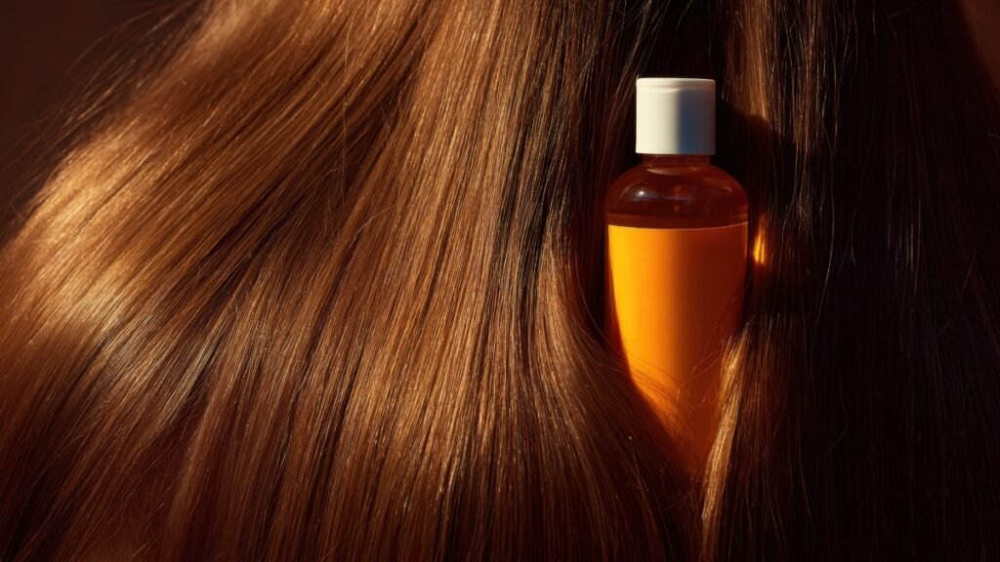

Olá! Seja muito bem-vinda ao Irenes.com.br, o seu refúgio de inspiração onde o autocuidado e a harmonia se encontram.

Assim como nós precisamos de um momento de pausa e um copo d'água para restaurar a paz interior em um dia agitado, nosso cabelo também implora por um **banho de tranquilidade**. É aí que entra a **hidratação capilar**, um tratamento essencial que é muito mais do que estética: é um verdadeiro ato de amor e cuidado que você oferece aos seus fios.

Mas, afinal, o que é hidratação capilar? Por que ela é tão importante? E como transformá-la em um **ritual de paz** em sua rotina?

Neste artigo, vamos mergulhar no universo da hidratação, desvendando seus segredos e ensinando você a cultivar um cabelo macio, leve e radiante, que é o puro reflexo da sua harmonia interna.

## **Bem-Vinda ao Santuário Capilar: Entendendo a Hidratação**

Se pudéssemos resumir o significado de hidratação capilar em uma única palavra, seria **ÁGUA**.

A hidratação é o tratamento responsável por **repor a umidade natural** que os fios perdem diariamente. Pense no seu cabelo como uma plantinha: ele precisa de água para se manter viçoso, flexível e saudável.

### **A Paz da Água: Desvendando a Função da Hidratação**

Nossos fios são feitos de água e proteínas. O calor do secador, a exposição ao sol, a poluição e até mesmo processos químicos retiram essa água essencial, deixando o cabelo ressecado e vulnerável.

A função da hidratação, portanto, é reverter esse quadro, devolvendo a água perdida e fechando levemente as cutículas do cabelo. O resultado? Fios com **brilho espelhado, toque macio** e muito mais **maleabilidade**. Em Irenes, a hidratação é a nossa maneira de garantir que o seu cabelo viva em paz!

### **O Grande Trio: Hidratação, Nutrição e Reconstrução (O Cronograma Perfeito)**

É comum as pessoas se confundirem, mas a hidratação é apenas uma parte de um cuidado mais completo, conhecido como Cronograma Capilar. Para você ter o seu cabelo sempre em harmonia, é importante saber a diferença:

| Tratamento | Principal Foco | O que Repõe | Ativos Comuns |
| --- | --- | --- | --- |
| HIDRATAÇÃO | Combater o ressecamento e o frizz. | Água e Umidade. | Pantenol, Glicerina, Aloe Vera, Extratos de Frutas. |
| NUTRIÇÃO | Combater a porosidade e pontas duplas. | Lipídios (Gordura/Óleo). | Óleos Vegetais (Coco, Argan, Rícino, Oliva) e Manteigas. |
| RECONSTRUÇÃO | Combater a quebra e a elasticidade. | Proteínas e Massa Capilar. | Queratina, Colágeno, Aminoácidos. |

A hidratação é a base, a mais suave e a mais frequente, essencial para todos os tipos de cabelo.

## **Sinais de Alerta: Quando Seu Cabelo Está Pedindo Socorro (e Água!)**

Seu cabelo está conversando com você. Ele está pedindo hidratação quando:

### **Cabelo Áspero e Opaco: Os Sinais de Desidratação Mais Comuns**

-   **Fios Opacos:** O brilho sumiu. O cabelo está "sem vida" porque as cutículas estão abertas, e a luz não consegue refletir.
-   **Frizz Excessivo:** O cabelo, desesperado por umidade, tenta "roubar" a água do ambiente, causando o famoso e indesejado frizz.
-   **Toque Áspero e Embaraço Fácil:** Sabe aquela sensação de palha? Isso é a ausência de água, que torna o fio rígido e difícil de pentear.
-   **Falta de Movimento:** O cabelo parece pesado, mas, na verdade, está rígido e sem a maleabilidade natural de um fio saudável.

### **O Teste de Porosidade: Descubra o que Seu Fio Realmente Precisa**

Quer uma dica prática para saber se a hidratação é a prioridade?

Pegue um fio de cabelo limpo (que tenha caído naturalmente), coloque-o em um copo com [água mineral](https://pt.wikipedia.org/wiki/%C3%81gua_mineral) e observe por 5 minutos:

-   **Flutuou?** (Baixa porosidade): Ótimo! Seus fios precisam de hidratação leve e não absorvem bem óleos.
-   **Ficou no Meio?** (Média porosidade): Seu fio está saudável! Mantenha a rotina equilibrada de hidratação e nutrição.
-   **Afundou?** (Alta porosidade): Seu fio está com as cutículas muito abertas e precisa, urgentemente, de nutrição e reconstrução. Mas a hidratação sempre é bem-vinda na rotina!

## **O Seu Ritual de Paz em Casa: Passo a Passo da Hidratação Capilar**

Transforme o cuidado com o cabelo em um momento de puro autocuidado.

### **Preparação e Limpeza: O Começo de Tudo**

1.  **Lave:** Use um shampoo adequado, focando no couro cabeludo. Para a hidratação penetrar, o fio precisa estar livre de resíduos.
2.  **Retire o Excesso de Água:** Depois de enxaguar bem o shampoo, tire o excesso de água com a toalha, apertando gentilmente. A água em excesso na hora da máscara atrapalha a absorção dos ativos.

### **O Momento da Máscara: Pausa para o Autocuidado**

1.  **Separe e Aplique:** Divida o cabelo e aplique a máscara de hidratação, mecha por mecha, do comprimento para as pontas. **Jamais** aplique na raiz.
2.  **Enluve:** Massageie cada mecha com um movimento suave. O famoso **enluvamento** ajuda os ativos a penetrarem na fibra capilar.
3.  **Tempo de Paz:** Respeite o tempo de pausa indicado na embalagem (geralmente de 5 a 15 minutos). Use este tempo para meditar, ouvir uma música calma ou simplesmente **não fazer nada**. Este é o seu momento!

### **Selando o Tratamento: Finalizando com Chave de Ouro (e Brilho)**

1.  **Enxágue:** Retire toda a máscara com água.
2.  **Condicione:** Aplique o condicionador (apenas no comprimento e pontas). Ele é crucial, pois tem a função de **selar** as cutículas, garantindo que toda a água e os ativos que você colocou fiquem retidos dentro do fio. Sem o condicionador, a hidratação "escapa"!
3.  **Finalize:** Use um leave-in ou protetor térmico para proteger seu cabelo dos agressores externos, mantendo a paz e o brilho por mais tempo.

## **Perguntas que Trazem Harmonia (Frequência e Produtos Ideais)**

### **De Quanto em Quanto Tempo Devo Hidratar? A Frequência Ideal**

A hidratação é o tratamento que você pode e deve fazer com mais frequência. Para a maioria dos cabelos, o ideal é **1 a 2 vezes por semana**.

Se o seu cabelo é muito ressecado ou quimicamente tratado, duas vezes é o ideal. Se ele já é saudável, uma vez por semana é suficiente para manter a umidade em dia. Lembre-se: a constância é a chave para a harmonia capilar!

### **Encontrando Seu Produto de Paz: Ativos Favoritos da Hidratação**

Ao buscar a sua máscara de hidratação ideal, procure por estes "super-hidratantes" no rótulo:

-   **Pantenol (ou Pró-Vitamina B5):** Um dos ativos mais amados para reter água.
-   **Glicerina:** Atrai a umidade do ar para o cabelo, um super-umectante!
-   **Aloe Vera (Babosa):** Calmante e repleto de água e nutrientes.
-   **Colágeno e Ácido Hialurônico:** Ajuda a preencher e reter a água dentro do fio.

## **O Reflexo da Paz: Benefícios de um Cabelo Hidratado**

Ao incorporar a hidratação na sua rotina de autocuidado, você não ganha apenas um cabelo mais bonito, você ganha:

-   **Maciez Aveludada:** Fios fáceis de pentear e deliciosos de tocar.
-   **Adeus, Frizz!:** A umidade reposta reduz a busca do fio por água no ambiente.
-   **Brilho Renovado:** Cutículas seladas refletem a luz como um espelho.

## **Conclusão: Cultive a Paz, Cultive o Brilho**

Chegamos ao fim da nossa jornada sobre a hidratação capilar. Esperamos que agora você veja esse cuidado não como uma obrigação, mas sim como uma preciosa **pausa na rotina** – um verdadeiro ritual de autocuidado que nutre o seu cabelo de dentro para fora.

Lembre-se: o nome **Irene significa Paz**. E a paz, assim como o brilho de um cabelo saudável, é cultivada diariamente através de pequenos e amorosos rituais. Quando você se dedica a repor a umidade dos seus fios, você está garantindo não apenas beleza, mas a **harmonia e a leveza** que seu cabelo (e você!) merecem.

Seja aplicando uma máscara, escolhendo um produto com carinho, ou respeitando o tempo de pausa, cada ato é um passo em direção ao seu **equilíbrio**. Transforme o momento da hidratação em um encontro com você mesma, e veja o brilho e a maciez refletirem a tranquilidade que você está cultivando.

**Junte-se a nós para transformar a sua rotina!**
