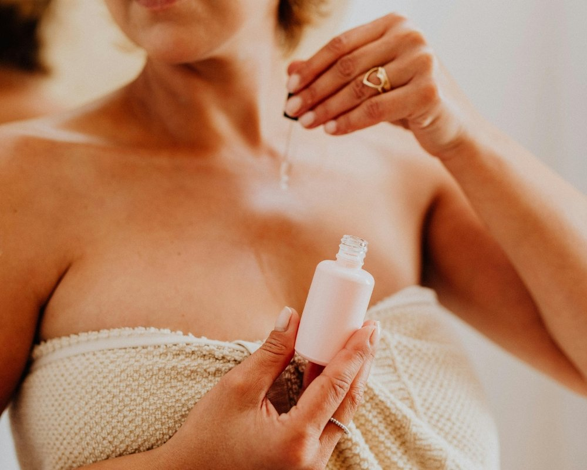
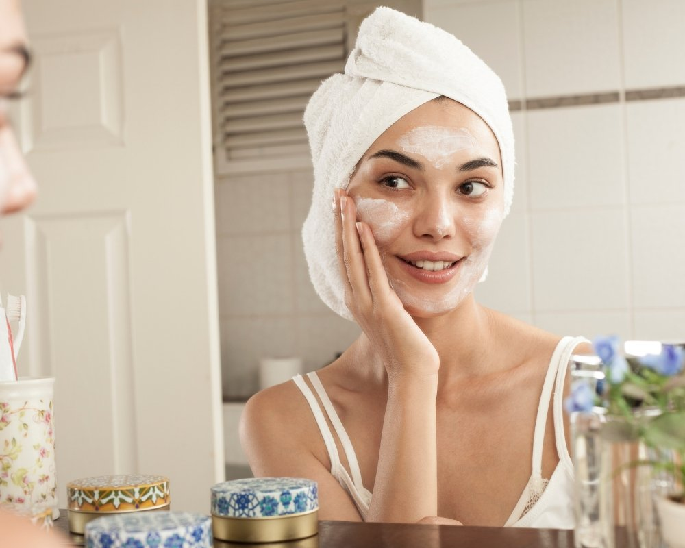

Você já se perguntou por que algumas peles parecem sempre saudáveis, mesmo sem filtro? Skincare é, de forma simples, a prática diária de cuidar da pele com produtos e hábitos que limpam, protegem, hidratam, tratam e previnem problemas, ou seja, é carinho e proteção que evitam ressecamento, acne e sinais de envelhecimento.

Entender isso importa porque uma rotina bem feita melhora a aparência, a textura e a saúde da sua pele a longo prazo; aqui você vai descobrir os cinco passos essenciais, como aplicá-los na prática e quais atitudes dão mais resultado para o seu tipo de pele.

## 1\. Limpeza: remover impurezas e preparar a pele

Limpeza representa a etapa inicial que elimina impurezas, maquiagem e poluição, preparando a pele para receber os tratamentos seguintes; entender o que é skincare passa justamente por perceber como essa higienização influencia a saúde cutânea e a aplicação correta dos produtos.

### Comece com a base certa

Uma limpeza eficaz parte da escolha do produto ideal ao tipo de pele: gel para pele oleosa, creme para pele seca e espuma para peles mistas, e essa adequação evita problemas como acne e brilho excessivo, além de diminuir os efeitos da poluição que ocasiona microlesões.

Curiosamente, a dupla limpeza deve ser reservada para quem usa maquiagem pesada ou protetor solar resistente, pois só assim remove-se totalmente a barreira oleosa inicial e prepara a pele para a segunda etapa sem exageros.

Ao limpar, recomenda-se massagear o rosto por 30 a 60 segundos para estimular a renovação celular sem agredir; evite água muito quente e enxágue até não restar produto, garantindo que o próximo passo da rotina funcione de modo eficiente.

Limpeza bem feita reduz riscos de acne e prepara a pele para absorver ácido hialurônico e outros ativos.

-   Manhã: limpeza leve para retirar suor e poluição
    
-   Noite: limpeza mais profunda para remover maquiagem e protetor solar
    
-   Dupla limpeza: óleo seguida de gel quando houver maquiagem pesada

Controle o excesso sem ressecar: a limpeza correta é a etapa que torna todo o skincare mais eficaz, por outro lado deve respeitar a barreira cutânea para manter a pele saudável.

## 2\. Tonificação e Esfoliação: equilibrar e renovar a pele

A tonificação ajusta o pH enquanto a esfoliação promove a renovação celular, removendo células mortas e facilitando a penetração dos ativos; quando essas etapas são bem dosadas, a pele fica saudável e mais receptiva a tratamentos específicos.

Escolher tônicos sem álcool é recomendação comum para restaurar o equilíbrio e diminuir a sensação de repuxamento. A tonificação também ajuda a remover resíduos remanescentes da limpeza e prepara a pele para a aplicação segura de ácido glicólico ou outros ácidos. Curiosamente, aplicar o tônico com algodão ou com a palma das mãos tende a oferecer resultados semelhantes, mas uma palmada suave costuma minimizar o atrito.

A esfoliação mecânica deve ocorrer com parcimônia para evitar desgaste excessivo; já a esfoliação química com ácido glicólico ou BHA é indicada conforme o tipo de pele. Para peles com tendência à acne, o BHA penetra nos poros e ajuda a desobstruir, enquanto o ácido glicólico se destaca na remoção de manchas e na aceleração da renovação celular. A frequência recomendada é de 1-2 vezes por semana para a maioria das pessoas; ajuste conforme apareça qualquer sinal de irritação.

Esfoliar demais aumenta o surgimento de sensibilidade; menos é mais para preservar a barreira cutânea.

Em síntese, o equilíbrio entre tonificação e esfoliação reduz manchas, controla a acne e potencializa os benefícios dos tratamentos aplicados em seguida, tornando a rotina mais eficiente e segura para a pele.

## 3\. Tratamentos (séruns e ácidos): controlar acne e sinais

Séruns concentrados e ácidos atuam diretamente em questões como acne, hiperpigmentação e sinais de envelhecimento; escolher conforme o tipo de pele é essencial para obter resultados sem irritação.

Ácidos, por exemplo o ácido glicólico, estimulam a renovação celular e auxiliam no clareamento; já os retinoides são eficazes na redução de linhas finas e na prevenção de novos surtos de acne. Para quem enfrenta acne ativa, combinar ácidos com ingredientes anti-inflamatórios costuma ser uma boa estratégia, contudo é importante buscar orientação profissional. Aplicar os ativos de forma gradual, começando em dias alternados, diminui o risco de vermelhidão e sensibilidade.

Séruns à base de ácido hialurônico oferecem hidratação profunda e funcionam muito bem em conjunto com agentes secativos usados contra acne. Devem ser aplicados sobre a pele limpa, antes do hidratante; aguarde a absorção completa antes de seguir para a etapa seguinte. Dica prática: se a pessoa usa maquiagem depois da rotina, é melhor aguardar toda a aplicação para evitar transferência do produto.

Introduza um ativo por vez; isso ajuda a identificar reações e otimizar a aplicação de cada produto.

-   Sérum de niacinamida para controle da oleosidade
    
-   Ácido glicólico à noite para renovação celular
    
-   Ácido hialurônico pela manhã para hidratação

Quando bem selecionados e usados com constância, os tratamentos conseguem controlar a acne, melhorar a textura da pele e proporcionar benefícios visíveis, curiosamente, pequenas mudanças na rotina frequentemente geram grandes diferenças.

## 4\. Hidratação: repor, acalmar e aumentar a barreira cutânea

A hidratação repõe água e lipídios, fortalecendo a barreira cutânea e diminuindo a sensibilidade; cremes com ativos como ácido hialurônico e ceramidas tornam-se importantes aliados para manter a pele saudável no dia a dia.

Para peles mais secas, recomenda-se fórmulas cremosas e densas; já para peles oleosas, um gel‑creme leve costuma funcionar melhor. Curiosamente, hidratar após o uso de ácidos acalma a pele e limita a descamação excessiva.

A aplicação correta faz toda a diferença: o produto deve ser espalhado com movimentos ascendentes e suaves, sem exageros, isso melhora a absorção e evita obstrução dos poros. Por outro lado, pressionar com força não acelera resultados e pode irritar.

Incluir ingredientes reparadores, como ceramidas e pantenol, ajuda a aumentar a resistência da pele à poluição e às agressões diárias; esses componentes favorecem a recuperação da barreira e reduzem a perda de água transepidérmica.

Além disso, a hidratação otimiza o acabamento da maquiagem, proporcionando uma superfície mais uniforme para a aplicação. Se surgir irritação, o ideal é diminuir a frequência e optar por fórmulas sem fragrância, suaves para peles reativas.

Hidratar diariamente é a etapa que garante maior durabilidade dos resultados obtidos com séruns e ácidos.

Uma rotina de hidratação consistente restaura a barreira, reduz o aparecimento de novos problemas e potencializa os benefícios dos demais passos, tornando os tratamentos mais eficazes a longo prazo.

## 5\. Proteção solar: etapa essencial para prevenir dano e envelhecimento

O protetor solar impede danos causados pelo sol, ajuda a prevenir o envelhecimento precoce e diminui o risco de manchas. Sua aplicação correta, junto com reaplicações regulares, torna esse passo essencial na rotina diária.

Recomenda-se escolher um produto de **amplo espectro** com FPS compatível ao estilo de vida: quem passa muito tempo ao ar livre deve reaplicar a cada duas horas. Curiosamente, o protetor também reduz o aparecimento de manchas e preserva os efeitos de tratamentos com ácido glicólico e retinoides.

Use quantidade adequada, cerca de uma colher de chá para o rosto, e aplique depois da hidratação e antes da maquiagem. Mesmo em dias nublados, os raios UV e a poluição continuam a afetar a pele; por isso, o uso diário do protetor é uma defesa simples e muito eficaz contra o fotoenvelhecimento.

Protetor solar é o produto que mais previne envelhecimento visível; não pule a aplicação mesmo com maquiagem.

-   Aplique antes de sair de casa
    
-   Reaplique a cada 2 horas quando estiver ao sol
    
-   Combine com roupas, óculos e chapéu para proteção extra

A proteção solar diária mantém resultados, reduz o surgimento de manchas e é a medida mais eficiente contra danos futuros.

## Conclusão

Skincare, de modo geral, funciona como uma sequência organizada: limpeza, tonificação ou esfoliação, tratamentos, hidratação e por fim proteção solar. Quando seguida com regularidade essa rotina tende a entregar benefícios concretos e sustentar a saúde da pele ao longo do tempo.

É importante ajustar cada etapa ao tipo de pele e às necessidades individuais, por exemplo: oleosa, seca ou sensível, porque uma alteração simples, como reduzir a frequência da esfoliação ou trocar o hidratante, pode mudar bastante o resultado. Curiosamente, registrar como a pele reage e introduzir apenas um ativo por vez facilita identificar reações adversas.

Mais do que investir em rótulos caros, a consistência e a aplicação correta costumam fazer a diferença: usar o protetor diariamente, aplicar ácido hialurônico e ácido glicólico quando indicado e manter a hidratação contínua promovem a maior parte da melhora visível. Por outro lado é útil revisar a rotina periodicamente, ajustando produtos conforme a estação do ano ou a exposição à poluição.

Seguir os cinco passos de forma consistente é a forma mais prática de obter pele saudável agora.

Na prática, pequenas mudanças sustentadas revelam resultados duradouros; portanto que a pessoa implemente essas dicas de maneira gradual e observe as transformações ao longo das semanas.

## Perguntas Frequentes

### O que é skincare e por que é importante para a pele saudável?

Skincare é o conjunto de hábitos e produtos usados para cuidar da pele, incluindo limpeza, hidratação, proteção e tratamentos específicos. Ele visa manter a barreira cutânea, prevenir danos e tratar problemas como acne, ressecamento e envelhecimento.

Adotar uma rotina de skincare adequada ajuda a manter a pele saudável, melhora a aparência e potencializa a eficácia de tratamentos dermatológicos. Além disso, o uso regular de protetor solar e hidratantes reduz o risco de hiperpigmentação e envelhecimento precoce.

### Quais são os 5 passos essenciais da rotina: limpeza, tonificação, tratamento, hidratação e proteção?

Os cinco passos básicos de uma rotina eficaz são: limpeza para remover sujeira e oleosidade; tonificação para equilibrar o pH; tratamento com ativos (como vitamina C ou ácido salicílico) para objetivos específicos; hidratação para repor água e lipídios; e proteção com protetor solar para evitar danos UV.

Esses passos formam a base para uma pele saudável e podem ser ajustados conforme o tipo de pele e necessidades individuais. Produtos como séruns, esfoliantes e máscaras são complementares e devem ser usados com cautela para não comprometer a barreira da pele.

### Com que frequência deve-se esfoliar e quais esfoliantes são mais indicados?

A esfoliação costuma ser indicada de 1 a 3 vezes por semana, dependendo do tipo de pele: peles sensíveis devem exfoliar menos, enquanto peles oleosas podem tolerar mais frequência. O objetivo é remover células mortas e melhorar a textura sem agredir a pele.

Exfoliantes químicos com ácidos (como AHA e BHA) são eficazes para renovar a pele sem fricção, já os físicos (microesferas ou grânulos) exigem cuidado para evitar microlesões. Sempre aplicar hidratação após a esfoliação e usar protetor solar no dia seguinte.

### Como escolher produtos de skincare adequados para cada tipo de pele?

A escolha deve começar pela identificação do tipo de pele (seca, mista, oleosa, sensível) e pelas necessidades específicas, como hidratação, controle de oleosidade ou tratamento de manchas. Ler rótulos e procurar por ativos compatíveis com esses objetivos ajuda a selecionar produtos eficazes.

Para peles sensíveis, priorizar fórmulas suaves e sem fragrância; para pele oleosa, buscar ingredientes não comedogênicos e com ação seborreguladora; para pele seca, dar preferência a fórmulas ricas em emolientes e ceramidas. Testes de contato e acompanhamento dermatológico são recomendados para casos de dúvidas ou reações.

### Qual a importância do protetor solar dentro do conceito de o que é skincare?

O protetor solar é um passo fundamental da rotina de skincare porque protege contra os raios UVA e UVB, principais responsáveis pelo envelhecimento precoce, manchas e risco de câncer de pele. Sem essa proteção, os benefícios de outros produtos são bastante reduzidos.

Recomenda-se aplicar protetor solar diariamente, mesmo em dias nublados, e reaplicar a cada 2 horas quando exposto ao sol. Escolher formulações adequadas ao tipo de pele, como protetores oil-free para pele oleosa, ajuda na adesão ao uso contínuo.

### Quanto tempo demora para ver resultados ao seguir uma rotina de skincare?

Os resultados variam conforme o objetivo e os produtos usados. Mudanças iniciais, como melhora na hidratação e textura, podem aparecer em poucas semanas; já tratamentos para acne, manchas ou sinais de envelhecimento podem levar de 8 a 12 semanas para mostrar resultados consistentes.

Persistência e consistência na rotina, além do uso correto de ativos ([vitamina C](https://www.gsuplementos.com.br/vitamina-c-120-caps-growth-supplements-p985857?srsltid=AfmBOoonrWtp9aRtDogxjpOp5IcsowrgsFAmg_ME4abXXvIRwtU5XERo), retinol, ácidos) e proteção solar, são essenciais para alcançar uma pele saudável a longo prazo. Consultar um dermatologista acelera o diagnóstico e a escolha de tratamentos mais eficazes.
