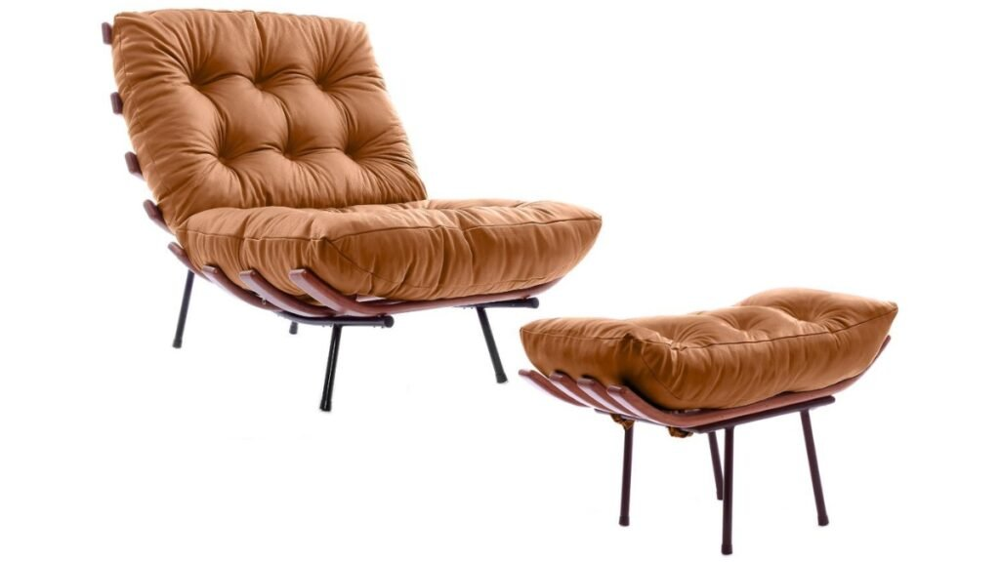

Se você busca transformar um cantinho da sua casa em um verdadeiro refúgio de tranquilidade, provavelmente já se deparou com as linhas curvas e acolhedoras da **Poltrona Costela**. Mas você sabe por que esse item, especialmente na versão com **puff em couro**, tornou-se o desejo de quem não abre mão do equilíbrio entre estética e conforto?

No *Irenes*, acreditamos que a beleza e a paz caminham juntas. Hoje, vamos explorar como essa peça icônica pode ser a protagonista do seu momento de pausa.

## **A Origem de um Clássico: O Design que Abraça**

Criada na década de 50 pelo designer **Martin Eisler**, a Poltrona Costela (ou *Costela de Adão*) é um marco do design moderno. Sua estrutura em ripas de madeira maciça, que lembram o formato de uma vértebra ou costelas, não é apenas visual; ela foi projetada para oferecer um suporte ergonômico impecável.

Ao escolher essa poltrona, você não está apenas comprando um móvel, mas trazendo uma peça de história e autoridade em design para o seu santuário particular.

## **Por que a poltrona costela com puff em couro?**

A escolha do material diz muito sobre a durabilidade e a sensação térmica do seu ambiente. Optar pelo **couro legítimo ou sintético de alta qualidade** traz vantagens que vão além da beleza:

1.  **Toque e Sensação:** O couro adapta-se à temperatura do corpo, proporcionando um acolhimento imediato.
    
2.  **Facilidade na Limpeza:** Essencial para quem busca uma rotina prática e livre de estresse.
    
3.  **Sofisticação Atemporal:** O couro envelhece com dignidade, ganhando personalidade com o passar dos anos.
    
4.  **O Puff como Complemento:** O puff não é um mero acessório. Ele é fundamental para o relaxamento completo, permitindo que o peso das pernas seja distribuído, ideal para meditação ou leitura após um dia longo.

## **Como Decorar: Criando Harmonia nos Ambientes**

A versatilidade da Poltrona Costela permite que ela transite por diversos estilos, do industrial ao escandinavo. Veja como usá-la:

-   **No Cantinho de Leitura:** Posicione-a próxima a uma janela com boa iluminação natural e uma luminária de piso. É o cenário perfeito para cultivar sua paz interior.
    
-   **Na Sala de Estar:** Ela funciona como uma peça de destaque (a famosa *statement piece*). Em cores como caramelo, preto ou pinhão, ela quebra a monotonia de tons neutros.
    
-   **No Quarto:** Substitua a clássica poltrona de amamentação ou de apoio por uma Costela com Puff para um toque extra de modernidade e conforto supremo.

**Dica de Irene:** Combine a poltrona com uma manta de algodão macio e uma almofada de textura natural. O contraste do couro com tecidos leves reforça a sensação de aconchego.

## **Guia de Cuidados: Mantendo a Beleza por Gerações**

Para que sua poltrona continue sendo um símbolo de harmonia, o cuidado é simples:

-   **Evite sol direto:** A luz solar constante pode ressecar e desbotar o couro.
    
-   **Limpeza semanal:** Use apenas um pano de microfibra levemente úmido.
    
-   **Hidratação:** No caso do couro legítimo, use produtos específicos a cada seis meses para manter a flexibilidade e o brilho.

## **Conclusão: O Seu Refúgio Merece esse Cuidado**

Cuidar do lar é, em última análise, cuidar de si mesma. A [**Poltrona Costela com Puff em Couro**](https://osvaldoantiguidades.com.br/produto/poltrona-costela-com-puff-couro/) é mais que um item de decoração; é um convite diário para você sentar, respirar e desfrutar da paz que você mesma construiu.

Aqui no Irenes, celebramos essas escolhas conscientes que trazem mais leveza à rotina. Afinal, toda "Irene" merece um lugar onde a beleza encontra a paz.

**Gostou dessa análise de design e bem-estar?** Deixe um comentário contando: em qual cômodo da sua casa a Poltrona Costela seria o seu refúgio ideal?
