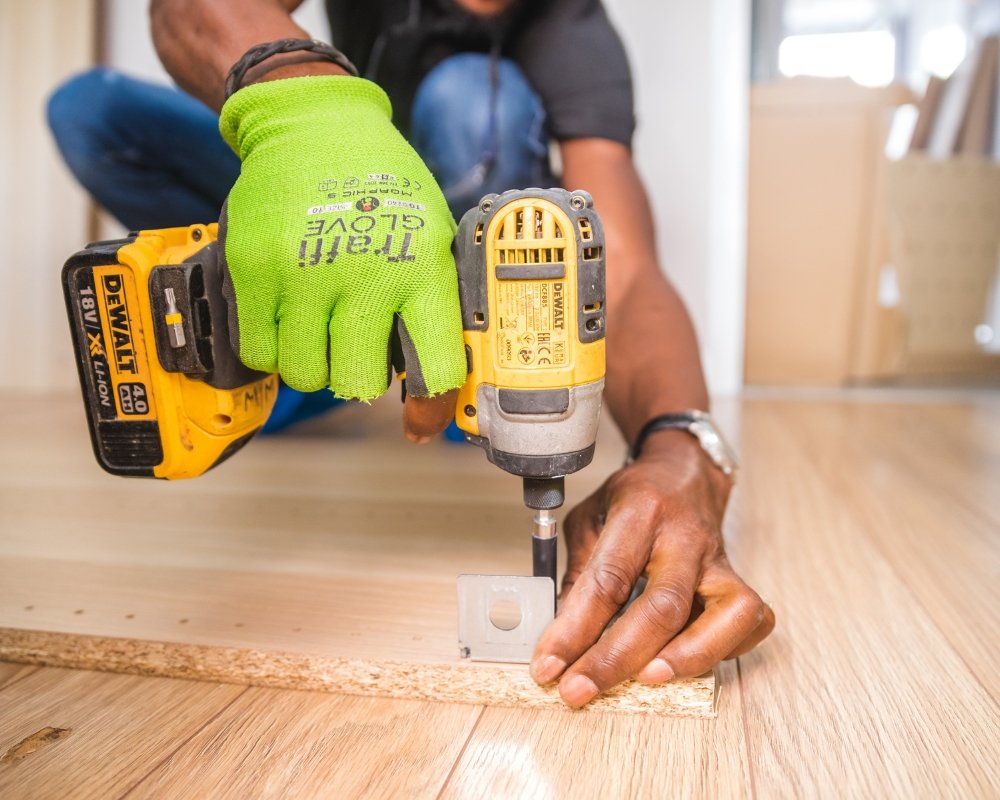
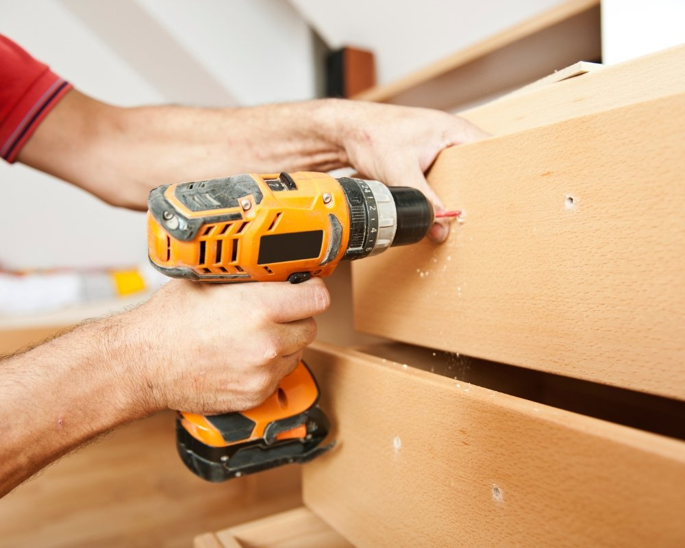

Quer saber se aquele orçamento de montagem vale mesmo a pena ou se você está sendo cobrado demais? Em geral, um montador de móveis no Brasil costuma cobrar entre R$ 50 e R$ 80 por hora, com valores fechados por serviço variando conforme o tipo e tamanho do móvel, por exemplo, guarda‑roupas podem sair entre R$ 150 e R$ 500 e armários menores entre R$ 100 e R$ 200, e serviços extras como desmontagem, transporte ou móveis planejados aumentam o preço; profissionais mais experientes também costumam cobrar mais.

Entender essas faixas é importante para você comparar orçamentos sem medo, saber quais fatores (complexidade, número de profissionais, região e tempo de montagem) estão pesando no valor e identificar quando vale a pena pagar um pouco mais por garantia e qualidade; a seguir você vai ver como calcular o custo esperado para seu caso, quais perguntas fazer ao montador e dicas para economizar sem abrir mão do serviço.

## Visão geral: quanto cobra um montador de móveis e quanto custa esse servico

Resumo prático com números e critérios: quanto um montador de móveis cobra varia conforme a região, o tipo do móvel e a complexidade; a seguir estão faixas típicas, fatores que determinam o custo e formas de o cliente escolher o serviço mais adequado.

### Como preço, tempo e complexidade definem o resultado

Na maior parte das cidades, os valores se concentram em faixas bem definidas: montagens simples, como cadeiras e mesinhas, costumam ficar entre R$ 30–80; já móveis planejados ou itens de maior complexidade podem chegar a R$ 150–500 por peça. O valor normalmente inclui deslocamento, mão de obra e eventuais ferragens, e curiosamente o prazo influencia bastante, serviços express costumam acrescentar de 20% a 40% ao preço básico.

Para comparar preços com segurança, peça orçamentos detalhados contendo horas estimadas e peças incluídas, assim fica possível calcular o custo real do serviço. Por exemplo, um guarda-roupa de três portas pode ser orçado entre R$ 250 e R$ 600; caso sejam necessários ajustes na parede, o montante final tende a subir. Clientes que optam por montagem por projeto recebem garantia contra defeitos e combinam horários para reduzir tempo de espera e possibilitar reembolso em caso de peças danificadas.

Na prática é recomendável priorizar montadores que discriminem etapas do trabalho: desembalagem, conferência, montagem e limpeza. Serviços que trabalham com checklist reduzem retrabalhos e custos adicionais; por outro lado, quando o móvel é modular vale negociar preço por módulo, e em instalações maiores combinar pagamento por etapa. Avalie também seguro contra danos e as avaliações de outros clientes para medir o valor agregado do serviço.

Negocie checklist e garantia: reduzem retrabalho e mantêm o custo previsível.

-   Faixa básica: R$ 30–80 por peça simples
    
-   Móveis complexos: R$ 150–500 ou mais
    
-   Taxa de deslocamento e urgência: +20% a +40%

Em suma, use orçamentos comparativos e checklists para definir quanto cobrar ou quanto pagar por montagem; dessa forma o cliente assegura qualidade, previsibilidade e melhor custo-benefício.

## Fatores que influenciam o preço: tipo de movel, complexidade e trabalho necessário

O preço da montagem varia conforme o tipo de peça, a complexidade das etapas e o trabalho exigido; entender esses fatores ajuda a estimar quanto custa o serviço antes mesmo do montador chegar.

### Como identificar o que encarece a montagem e negociar com clareza

Primeiro, o tipo de móvel faz muita diferença: armário embutido, estante modular ou cama box pedem tratamentos distintos. Um móvel grande costuma demandar mais horas e ajudantes, o que naturalmente eleva o custo por deslocamento e montagem, e quando aparecem detalhes como puxadores internos, trilhos sincronizados ou portas com dobradiças ocultas, o preço sobe proporcionalmente ao tempo e ao equipamento necessário.

A complexidade técnica impacta diretamente o serviço: peças numerosas, necessidade de ajustes finos de alinhamento e acabamentos delicados exigem cuidado extra. Curiosamente, alguns conjuntos trazem peças sobressalentes, outros não; em muitos casos será preciso fazer furações ou encaixes sob medida, e aí o montador pode precisar de ferramentas específicas ou horas adicionais, alterando quanto custa o serviço final ao cliente.

Por outro lado, aspectos logísticos não ficam fora da conta: acesso ao local, necessidade de desmontar móveis antigos e risco de danos influenciam no valor. Montar partes dentro da casa, em cômodos de difícil acesso ou sem elevador, gera mais trabalho e tempo, afetando o orçamento. Ao pedir um orçamento, peça detalhamento por etapa para entender cada custo e evitar surpresas na hora da entrega.

Peça orçamento por etapa: avaliação, montagem, acabamento, isso reduz surpresas e facilita comparar propostas.

-   Avaliação inicial: confira tipo, medidas e instruções do fabricante. Levantamento de complexidade: identifique quantidade de peças e ajustes finos. Logística: verifique acesso, elevadores e necessidade de desmontar móveis antigos. Ferramentas e tempo: estime horas e equipamentos extras antes de fechar preço.
    
-   Avaliação inicial: confira tipo, medidas e instruções do fabricante.
    
-   Levantamento de complexidade: identifique quantidade de peças e ajustes finos.
    
-   Logística: verifique acesso, elevadores e necessidade de desmontar móveis antigos.
    
-   Ferramentas e tempo: estime horas e equipamentos extras antes de fechar preço.

Priorize orçamentos detalhados que especifiquem tipo, complexidade e trabalho necessário para saber exatamente quanto custa o serviço; comparar propostas com esses itens listados facilita negociar prazos, responsabilidades e garantias.

## Tabelas e exemplos práticos: quanto custa e quanto cobra na prática por tipo de servico

Listas rápidas e exemplos práticos que mostram quanto custa e quanto um montador costuma cobrar por serviço: valores por item, variação por deslocamento e o tempo médio para cada móvel montado.

### Comparativo objetivo de preços por tipo de móvel e nível de complexidade

Segue uma tabela operacional: itens simples (mesa, cadeira), médios (armário, estante) e complexos (guarda‑roupa planejado). Para cada categoria indica‑se o tempo médio, o preço base e o acréscimo aplicado em montagens modulares. Curiosamente, esse quadro responde direto quanto custa por peça e ainda permite ajustar valores conforme distância, urgência ou necessidade de desmontagem prévia, essencial para quem calcula quanto cobrar sem subestimar horas.

Exemplos práticos ajudam a visualizar: a montagem de um armário de duas portas costuma levar entre 90 e 120 minutos, e o valor cobrado varia de R$120 a R$250. Montadores que trabalham por hora pedem algo entre R$40 e R$80/h; já os que cobram por peça seguem tabelas fixas. Esses exemplos servem pra comparar preços locais e negociar com o cliente, evitando surpresas quando o móvel exige ferragens especiais ou instalação na parede.

Aplicação imediata: use as tabelas como base para criar um orçamento padrão e um check‑list antes do atendimento. Inclua tempo estimado, peças e ferragens necessárias, fotos do móvel e cláusula sobre desmontagem quando aplicável. Assim estabelece‑se transparência sobre quanto cobra um montador e facilita o ajuste do custo conforme material, dificuldade e risco, reduzindo revisitas e reclamações.

Registre o tempo real no serviço e fotografe antes/depois para justificar o preço e reduzir disputas.

-   Itens simples: mesa/cadeira, 20–40 min, preço fixo baixo; Itens médios: estante/armário, 60–120 min, tabela por peça; Itens complexos: guarda‑roupa planejado, 3–6 horas, orçamento por projeto;
    
-   Itens simples: mesa/cadeira, 20–40 min, preço fixo baixo;
    
-   Itens médios: estante/armário, 60–120 min, tabela por peça;
    
-   Itens complexos: guarda‑roupa planejado, 3–6 horas, orçamento por projeto;

Aplique essas tabelas como padrão mínimo e ajuste o custo do montador por hora ou por peça conforme a complexidade, o material e o deslocamento; isso evita cobranças indevidas e facilita a negociação.

## Quando contratar montador: vantagens de contratar profissional e sinais de que esse servico é necessario

Contratar um montador faz diferença no prazo, no ajuste das peças e na segurança do móvel. Quem busca rapidez e evita retrabalho tem melhor custo-benefício ao optar por um profissional qualificado para montagem residencial.

### Sinais práticos que justificam chamar ajuda especializada

As vantagens, curiosamente, aparecem rápido: um montador experiente costuma reduzir horas de trabalho e impedir refações que consomem material e frete. Ao contratar um profissional, o consumidor minimiza riscos de danos e garante acabamentos mais precisos, isso é especialmente importante em móveis modulados e embalagens com muitas partes. Em média, a montagem profissional economiza até 30% do tempo em comparação com tentativas amadoras, o que acaba reduzindo o custo final.

Por outro lado, alguns sinais são claros de que o serviço é necessário: peças pesadas, painéis de grande formato, portas que exigem folgas mínimas e sistemas com corrediças ou trilhos. Se o projeto se destina a um ambiente residencial com pouca tolerância, chamar um montador evita empenamento e falhas de funcionamento. Mesmo pessoas habilidosas perdem eficiência quando se deparam com ferragens novas ou instruções confusas.

Aplicação imediata: ao receber os móveis, verifique as instruções, avalie as ferramentas necessárias e estime o tempo. Falta de chave específica ou necessidade de perfuração na parede já são sinais para contratar profissional; é a opção mais segura. Além disso, os profissionais costumam oferecer garantia e têm experiência para identificar peças faltantes e negociar conserto com o fornecedor, reduzindo atrito para o consumidor e preservando o valor do móvel.

Montagem profissional reduz retrabalho e protege garantia do móvel; peça referência e prazo antes de confirmar.

-   Peças pesadas ou volumosas, sinal direto para contratar montador
    
-   Móveis com ferragens complexas (corrediças, dobradiças embutidas)
    
-   Falta de ferramentas específicas ou pouco tempo disponível

Priorize contratar profissional quando houver risco de dano, falta de tempo ou complexidade técnica, essa escolha protege o investimento e acelera a entrega funcional do móvel.

## Como escolher montadores e profissionais qualificados: critérios, experiencia e melhores práticas

Contratar montadores e profissionais qualificados reduz erros, retrabalhos e custos; por outro lado, uma escolha inadequada pode gerar atrasos e despesas extras. A recomendação é seguir critérios práticos para avaliar habilidades, confirmar experiência e garantir que o serviço esteja alinhado com o orçamento e o prazo do cliente.

### Checklist rápido para decidir entre orçamentos similares

Primeiro, confirme certificações, referências e portfólio: profissionais sérios costumam documentar montagens anteriores com fotos e depoimentos. Peça comprovação de experiência em móveis semelhantes, por exemplo, cozinhas, guarda-roupas ou estantes modulares, e exija garantia por escrito; também verifique se oferecem seguro para danos, já que esses itens afetam preço e tempo de entrega.

Use avaliações online e grupos da comunidade para checar indicadores de confiança: taxa de retorno, avaliações com fotos e respostas a reclamações ajudam a avaliar postura e solvência técnica. Solicite um orçamento detalhado que discrimine mão de obra, deslocamento e materiais consumíveis; se possível, combine uma visita técnica: um montador experiente vai avaliar desmontagens, adaptações e o tempo real de montagem, reduzindo surpresas no dia combinado.

Ao comparar propostas, valorize comunicação clara, cumprimento de prazo e política de resolução de problemas. Para formalizar a contratação, descreva o escopo por escrito, modelo do móvel, peças incluídas, necessidade de adaptações e horários, e negocie pagamento parcial inicial, com saldo final apenas após vistoria do cliente. Montadores que trazem kits próprios de ferramentas e adotam práticas de proteção do piso costumam cobrar um pouco mais, mas entregam montagens limpas e rápidas, muitas vezes compensando o custo adicional.

Priorize profissionais qualificados que ofereçam garantia, checklist de montagem e comunicação clara antes do serviço.

-   Verificar portfólio com fotos e referências
    
-   Exigir orçamento detalhado e garantia por escrito
    
-   Preferir profissionais com seguro e ferramentas próprias

| Coluna 1 | Coluna 2 |
| --- | --- |
| Indicador relevante | Detalhe explicado |
| Experiência comprovadaQuantidade de montagens semelhantes realizadas no último ano; reduz risco de erro e retrabalho | Experiência comprovada |
| Experiência comprovada | Quantidade de montagens semelhantes realizadas no último ano; reduz risco de erro e retrabalho |
| Avaliações onlineProporção de avaliações 4–5 estrelas com fotos e respostas do profissional | Avaliações online |
| Avaliações online | Proporção de avaliações 4–5 estrelas com fotos e respostas do profissional |

Pequenos investimentos na verificação prévia reduzem retrabalho; por exemplo, exigir documentação, confirmar experiência e registrar termos por escrito diminui riscos e agiliza a entrega. Curiosamente, uma checagem rápida costuma evitar a maior parte dos problemas no dia da montagem.

## Serviços específicos e cotações: montagem de armario, moveis novos e desmontagem

A montagem de um armário depende de medidas, ferragens e tempo disponível. Nesta seção descreve-se quanto costuma custar um montador para um móvel específico, além de desmontagem e instalação de peças novas, com parâmetros práticos e imediatos.

### Cotações conforme escopo e grau de dificuldade

Quando solicitam orçamento para montar um armário, os profissionais avaliam basicamente as dimensões, a complexidade do manual e se há necessidade de adaptações. Um serviço simples, por exemplo, um guarda-roupa padrão, normalmente leva de 1 a 3 horas; projetos com gavetas internas ou mecanismos adicionais demandam mais tempo e peças extras. Ao pedir preço, é recomendável pedir valor por hora e por peça: assim fica claro se algum ajuste de encaixe ou furação está coberto, evitando surpresas na visita técnica.

No caso de móveis novos, montar no local ou em oficina faz diferença no valor. A montagem no domicílio implica deslocamento, nivelamento e descarte das embalagens, o que eleva o custo final. Curiosamente, o mesmo roupeiro montado em um apartamento térreo pode sair mais barato do que no mesmo prédio com elevador pequeno, a dificuldade de acesso aumenta o tempo e, consequentemente, o preço do serviço.

A desmontagem seguida de remontagem para reformas costuma ter tabela própria: desmontar com checagem de parafusos, catalogar peças faltantes e remontar pede checklist e horas adicionais. Para quem combina montagem de móveis novos com desmontagem, negociar um pacote vale a pena: descontos entre 10% e 20% são comuns quando o mesmo montador realiza ambos os serviços. Informe também o tipo de material (MDF, madeira maciça), presença de vidro e se o móvel será instalado em nichos embutidos.

Peça sempre orçamento detalhado por etapas: visita, montagem, deslocamento e garantia de mão de obra.

-   Montagem padrão: preço por hora + taxa mínima
    
-   Desmontagem: verificação de peças e acondicionamento para transporte
    
-   Pacote montagem + desmontagem: desconto aplicado e prazo definido

Solicitar três orçamentos com o mesmo escopo facilita comparar quanto custa o montador e escolher a opção com melhor custo-benefício.

## Orçamento passo a passo: processo, valores finais e como negociar o custo do servico

Guia prático que descreve o processo de orçamento para montagem de móveis, estimando valores finais e oferecendo estratégias objetivas e aplicáveis para negociar o custo do serviço.

### Quebrando o orçamento em etapas que geram economia real

O primeiro passo é o levantamento: listar peças, anotar medidas e informar o endereço residencial; além disso, definir prazo e avaliar necessidade de deslocamento. Curiosamente, pedir pelo menos três cotações ajuda a comparar quanto cada montador cobra, e assim transformar estimativas vagas em um valor final mais confiável. Deve-se também registrar o tempo previsto para a montagem e quaisquer materiais adicionais que possam ser necessários, reduzindo surpresas no dia do serviço.

Depois, vale analisar a composição do preço: identificar claramente valores de mão de obra, deslocamento e eventuais peças substitutas. Por outro lado, negociar descontos por pacote costuma render economia real, por exemplo, montar três armários normalmente sai por unidade mais barato do que montar apenas um, esse é o principal ponto de alavancagem na negociação. Solicitar abatimento por pagamento à vista ou flexibilidade no agendamento pode transformar uma proposta em um valor final mais competitivo.

Antes de aceitar, formalize tudo por escrito: peça orçamento detalhado com prazo, garantia e política para peças danificadas. Se for necessário, inclua cláusula sobre tempo máximo para conclusão e multa por atraso. Use comparativos objetivos entre as cotações para contestar itens superfaturados e prefira profissionais com avaliações que comprovem cumprimento de prazos, equilibrando preço e qualidade na escolha final.

Negociar por pacote reduz custo por unidade; peça sempre desconto por pagamento à vista ou agendamento flexível.

-   Levantamento detalhado: medidas e lista de peças
    
-   Solicitar no mínimo três orçamentos por escrito
    
-   Negociar pacote, prazo e garantia antes do aceite

Um orçamento claro e bem acompanhado transforma incerteza em negociação efetiva: priorize documentação, critérios objetivos de comparação e destaque os itens que realmente impactam o valor final.

## Conclusão

Fechar a leitura com uma orientação prática ajuda o leitor a transformar estimativas em decisão: um resumo objetivo de preços, variáveis e próximos passos para quem precisa montar móveis sem desperdiçar tempo nem dinheiro.

### Fechamento prático para decidir sem erro

Ao avaliar quanto cobra um montador de móveis, o ideal é que o consumidor exija transparência nas cotações e compare itens do serviço: deslocamento, montagem por peça, grau de complexidade e cobertura da garantia. Profissionais experientes normalmente apresentam preço fixo por peça ou por hora; peça sempre uma relação detalhada do que está incluído, assim diminui muito o risco de surpresas. Curiosamente, testar dois orçamentos distintos costuma ser suficiente para tomar uma decisão segura.

Na prática, para entender melhor quanto custa a montagem, vale usar exemplos concretos: um armário padrão costuma variar entre valores A e B conforme painel e ferragens; já uma estante modular pode ficar entre X e Y. Solicitar fotos do móvel e confirmar o tempo estimado para execução é fundamental, e, por outro lado, contratar via plataforma confiável ou por indicação direta aumenta a probabilidade de cumprir prazos e evitar retrabalhos.

Para obter o máximo custo-benefício, compare custo e competência: às vezes compensa pagar um pouco mais por um montador qualificado quando o móvel for de alto valor ou estrutural. Peça nota fiscal, prazo de garantia e imagens do serviço finalizado. Outra dica prática é agrupar a montagem de vários itens num único atendimento, reduzindo deslocamento e conseguindo um valor melhor por peça.

Negociar inclusão de garantia e limpeza no preço reduz retrabalho e custos ocultos.

-   Peça orçamento detalhado: deslocamento, peças, garantia
    
-   Compare 2–3 propostas com fotos e tempo estimado
    
-   Prefira profissionais qualificados para móveis caros ou complexos

No fim, optar com base em orçamentos comparados, referências e garantias transforma a incerteza em uma escolha segura e econômica, permitindo fechar o serviço com clareza e confiança.

## Perguntas Frequentes

### Quanto cobra um montador de móveis?

O valor cobrado por um [montador de móveis RJ](https://montadordemoveisriorj.com.br/), por exemplo varia bastante conforme cidade, experiência e tipo de móvel, mas geralmente fica entre R$ 50 a R$ 250 por serviço. Para peças simples, como uma mesa ou prateleira, o preço tende a ser menor; móveis modulados ou cozinhas planejadas costumam exigir orçamento mais alto.

Além do preço base, o orçamento pode incluir taxa de deslocamento, montagem por peça ou por hora, e custos extras para montagem em locais com difícil acesso. É recomendado pedir um orçamento detalhado antes da contratação.

### Quanto costuma cobrar um montador de móveis por hora versus por peça?

Montadores podem cobrar por hora, geralmente entre R$ 30 a R$ 120/h, ou por peça, com preços que variam conforme complexidade; por exemplo, uma cadeira pode custar pouco, enquanto um armário embutido será mais caro. Cobrança por hora é comum quando há incerteza sobre o tempo de montagem.

Ao optar por preço por peça, o cliente recebe um valor fechado que facilita comparar orçamentos. É importante verificar se o orçamento inclui deslocamento, ferramentas e eventuais ajustes pós-montagem.

### Quais fatores influenciam o preço cobrado por um montador de móveis?

Vários fatores impactam o preço: porte e complexidade do móvel, necessidade de montagem em área estreita ou alta, número de peças, tempo estimado de trabalho e experiência do montador. Móveis de linha branca ou com muitos componentes e ferragens tendem a aumentar o valor.

Localização também conta, capitais e regiões metropolitanas costumam ter preços maiores. Serviços adicionais, como montagem de cozinha planejada, instalação de puxadores ou descarte de embalagem, normalmente geram acréscimos no orçamento.

### Como obter um orçamento justo e evitar surpresas no valor da montagem?

O ideal é solicitar pelo menos três orçamentos detalhados, descrevendo tipo de móvel, número de peças, se o montador precisa levar ferramentas e possíveis taxas de deslocamento. Fotos e medidas do local ajudam a evitar estimativas incorretas.

Verificar referências, avaliações e se o montador oferece garantia ou assistência técnica reduz o risco de problemas. Pedir que itens extras (como montagem de armário, fixação na parede ou troca de ferragens) sejam listados separadamente no orçamento também previne custos inesperados.

### O que está incluído normalmente no serviço de montagem de móveis?

Na maioria dos casos, o serviço inclui a montagem das peças conforme manual, uso de ferramentas básicas, checagem de alinhamento e fixação de ferragens. Alguns montadores também fazem pequenos ajustes, como regulagem de portas e gavetas.

Itens nem sempre inclusos são descarte de embalagem, deslocamento em locais fora da área de atuação, compra de ferragens faltantes ou serviços elétricos/obras. É importante confirmar esses detalhes antes da contratação para evitar cobranças adicionais.

### Como o cliente pode economizar ao contratar um montador de móveis?

Para reduzir custos, o cliente pode agrupar várias montagens em um mesmo chamado, escolher horários com menor demanda e confirmar que todas as peças e parafusos estão presentes antes da chegada do montador. Montar móveis simples por conta própria também é opção quando o cliente tem habilidade e tempo.

Outra estratégia é buscar um montador profissional com boa reputação mas preço competitivo, e negociar um preço fechado quando houver volume de móveis. Comparar orçamentos e pedir desconto para montagem por pacote costuma trazer economia.
