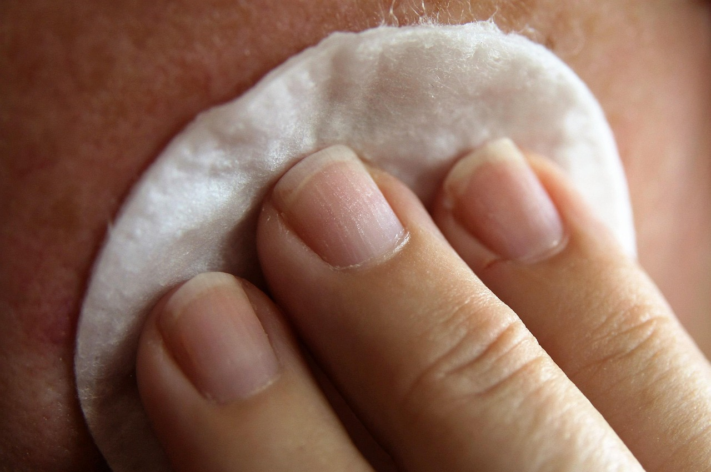

**Resposta rápida: Quanto custa uma limpeza de pele profissional?**

O custo de uma limpeza de pele profissional no Brasil varia geralmente entre **R$ 80 a R$ 350**, dependendo de fatores como a localização do estabelecimento, a qualificação do profissional (esteticista ou dermatologista), o tipo de limpeza e os produtos utilizados. Em grandes centros, ou em clínicas com tecnologias avançadas, o valor pode ultrapassar os R$ 500.

Olá, Irenes! Que bom ter você por aqui, pronta para mais uma dose de autocuidado e bem-estar. No universo da beleza e da saúde da pele, poucos tratamentos são tão falados e desejados quanto a limpeza de pele profissional. Ela promete renovar, purificar e deixar nosso rosto com aquele brilho que a gente tanto ama. Mas, na hora de agendar, surge a dúvida: *quanto custa uma limpeza de pele*, afinal?

Eu sei que essa é uma pergunta que ronda a mente de muitas de nós. E a boa notícia é que, aqui no Irenes, vamos desvendar todos os mistérios por trás dos valores, te ajudar a entender o que influencia o preço e, claro, garantir que você faça a melhor escolha para a sua pele e para o seu bolso.

Mais do que um gasto, encaramos a limpeza de pele como um investimento na sua autoestima e na saúde do seu maior órgão: a pele. É um ritual de paz e renovação que se alinha perfeitamente com a nossa filosofia de cuidar de si para viver em harmonia. Então, prepare-se para mergulhar nesse guia completo e descobrir como conquistar uma pele impecável sem abrir mão do equilíbrio.

## O Preço da Paz na Sua Pele: Afinal, Quanto Custa uma Limpeza de Pele Profissional?

Quando pensamos em uma limpeza de pele, é natural que a primeira pergunta seja sobre o valor. E a verdade é que não existe uma resposta única, um preço fixo que sirva para todas as cidades e todos os estabelecimentos. O custo é bastante variável, e essa variação se deve a uma série de fatores que vamos explorar em detalhes.

De modo geral, no Brasil, você pode esperar pagar entre **R$ 80 a R$ 350** por uma sessão de limpeza de pele. Essa é uma faixa ampla, e dentro dela, você encontrará desde estúdios de estética com preços mais acessíveis até clínicas de dermatologia renomadas com valores mais elevados. Para procedimentos mais avançados, como a limpeza de pele com tecnologias específicas ou em clínicas de alto padrão, o valor pode facilmente ultrapassar os **R$ 500**.

### Preços Médios por Região e Tipo de Estabelecimento

Assim como tudo na vida, o custo de uma limpeza de pele também pode ser influenciado pela geografia. Cidades grandes, como São Paulo, Rio de Janeiro e capitais do Sul, tendem a ter preços mais altos devido ao custo de vida e à maior demanda por serviços especializados. Em cidades menores, é possível encontrar opções mais em conta.

-   **Grandes Centros Urbanos (SP, RJ, BH, Curitiba):** R$ 150 a R$ 500+
    
-   **Cidades Médias e Interiores:** R$ 80 a R$ 250

Além da localização, o tipo de estabelecimento faz toda a diferença:

-   **Clínicas de Estética:** Geralmente oferecem um bom equilíbrio entre custo e benefício. Os preços variam bastante de acordo com a reputação e os serviços adicionais.
    
-   **Spas Urbanos e Salões de Beleza:** Podem ter valores um pouco mais elevados, pois muitas vezes agregam o serviço a uma experiência de relaxamento e bem-estar mais completa.
    
-   **Consultórios Dermatológicos:** Tendem a ser as opções mais caras, mas oferecem a segurança de um acompanhamento médico e, em alguns casos, tratamentos mais específicos para condições de pele.
    
-   **Clínicas de Estética Avançada:** Quando envolvem tecnologias de ponta como Hydrafacial, o custo pode ser significativamente maior, partindo de R$300 e podendo chegar a R$800 ou mais por sessão.

É importante lembrar que o mais barato nem sempre é o melhor, e o mais caro nem sempre é o único caminho. O ideal é buscar um equilíbrio entre a qualidade do serviço, a reputação do local e o valor que cabe no seu orçamento.

## O Que Faz o Preço Variar? Fatores Essenciais a Considerar

Para entender melhor por que os valores são tão diferentes, precisamos olhar para os bastidores. Vários fatores se somam para compor o custo final de uma limpeza de pele. Conhecê-los te ajudará a fazer uma escolha mais consciente e a valorizar o trabalho do profissional.

### Localização e Reputação do Estabelecimento

Como já mencionei, a localização importa. Um centro de estética no coração de um bairro nobre de São Paulo terá custos operacionais mais altos do que um em um bairro mais afastado ou em uma cidade menor. Além disso, a reputação e o renome do estabelecimento também influenciam. Clínicas com anos de mercado, profissionais amplamente reconhecidos e um histórico de satisfação das clientes podem cobrar mais pela sua expertise e pela confiança que transmitem.

### Qualificação do Profissional (Esteticista ou Dermatologista?)

Este é um ponto crucial. Uma limpeza de pele pode ser realizada por uma esteticista (profissional graduada em Estética e Cosmética) ou por um dermatologista (médico especialista em pele). Ambos são habilitados, mas suas abordagens e, consequentemente, seus preços podem ser diferentes.

-   **Esteticista:** Geralmente, os valores são mais acessíveis. A esteticista é treinada para realizar a limpeza de pele com foco na extração de comedões (cravos), pústulas (espinhas) e na melhora geral da textura da pele.
    
-   **Dermatologista:** O valor tende a ser mais alto. Um dermatologista pode indicar a limpeza de pele como parte de um tratamento médico mais amplo para condições como acne severa, rosácea ou outras patologias de pele, realizando o procedimento com uma abordagem clínica.

Para a maioria das pessoas, uma esteticista qualificada é perfeitamente adequada para uma limpeza de pele rotineira. Se você tem alguma condição de pele específica ou dúvidas mais complexas, a consulta com um dermatologista é sempre recomendada.

### Tipos de Limpeza de Pele e Tecnologias Utilizadas

Não existe apenas “um” tipo de limpeza de pele. Existem diversas abordagens e tecnologias que podem ser incorporadas ao procedimento, e cada uma delas impacta no preço.

-   **Limpeza de Pele Clássica/Profunda:** É a mais comum, envolvendo higienização, esfoliação, vapor de ozônio, extração manual, máscaras calmantes e proteção solar. É a base da maioria dos tratamentos.
    
-   **Limpeza de Pele a Vácuo:** Utiliza um aparelho que suga as impurezas, sendo menos invasiva para peles sensíveis.
    
-   **Limpeza de Pele Ultrassônica:** Usa ondas de ultrassom para remover células mortas e impurezas, promovendo uma esfoliação suave e estimulando a renovação celular.
    
-   **Hydrafacial:** Um tratamento multifuncional que limpa, esfolia, extrai e hidrata a pele com séruns especiais. É considerado um procedimento premium e, por isso, tem um custo mais elevado.
    
-   **Limpeza de Pele com Peeling de Diamante/Cristal:** Muitas vezes associada para potencializar a renovação celular e a remoção de células mortas.

Quanto mais tecnologia e produtos específicos envolvidos, maior o custo do procedimento.

### Produtos e Equipamentos Utilizados

A qualidade dos produtos faz toda a diferença no resultado e na segurança da sua pele. Profissionais que utilizam dermocosméticos de marcas reconhecidas, hipoalergênicos e específicos para cada tipo de pele, naturalmente terão um custo operacional maior, o que se reflete no preço final. Equipamentos modernos e esterilizados também são um investimento para o estabelecimento e garantem a segurança e a eficácia do tratamento.

### Duração da Sessão e Protocolo Adicional

Uma limpeza de pele completa geralmente dura entre 60 e 90 minutos. Se o protocolo incluir etapas adicionais, como massagens faciais relaxantes, aplicação de máscaras específicas para o seu tipo de pele (calmantes, hidratantes, clareadoras), alta frequência (para fechar os poros e cicatrizar) ou cromoterapia, o tempo e o custo podem aumentar. Pense nisso como um pacote de mimos para a sua pele!

## Vale a Pena o Investimento? Os Benefícios Inegáveis da Limpeza de Pele

Agora que você já sabe *quanto custa uma limpeza de pele* e o que influencia seu valor, talvez se pergunte: vale a pena o investimento? Como especialista em bem-estar e autocuidado aqui no Irenes, posso te garantir que sim! Os benefícios vão muito além de uma pele bonita no espelho.

### Pele Mais Saudável e Radiante

A limpeza de pele remove impurezas, células mortas, cravos e, em alguns casos, espinhas, que se acumulam diariamente. Com isso, a pele fica mais limpa, oxigenada e com um aspecto muito mais saudável e luminoso. É como se você desse um “reset” no seu rosto, revelando a sua beleza natural.

### Prevenção de Acne e Cravos

Ao remover as obstruções dos poros, a limpeza de pele profissional é uma excelente aliada na prevenção da formação de novos cravos e espinhas. Para quem sofre com acne, ela pode ser parte fundamental de um tratamento contínuo, ajudando a controlar as inflamações e a melhorar a textura da pele.

### Melhor Absorção de Produtos

Pense na sua pele como uma esponja. Se ela está cheia de impurezas e células mortas, não consegue absorver direito os cremes, séruns e hidratantes que você aplica. Depois de uma limpeza profunda, os poros estão desobstruídos e a pele está receptiva, permitindo que seus produtos de skincare ajam com muito mais eficácia. Seus investimentos em bons cosméticos renderão muito mais!

### Um Momento de Autocuidado e Relaxamento

Além dos benefícios estéticos, a limpeza de pele é um verdadeiro ritual de autocuidado. É um tempo dedicado a você, longe das preocupações do dia a dia. A massagem facial, o vapor, o toque profissional... tudo isso contribui para um momento de relaxamento profundo, que acalma a mente e nutre a alma. É a paz que buscamos aqui no Irenes, refletida na sua pele.

## Limpeza de Pele em Casa vs. Profissional: Quando Cada Um é Indicado?

É super comum a dúvida sobre fazer a limpeza de pele em casa ou procurar um profissional. E a verdade é que cada um tem seu lugar na rotina de cuidados, mas não se substituem!

### Limpeza de Pele Caseira: Mitos e Verdades

A limpeza de pele caseira, feita com produtos adequados para o seu tipo de pele (sabonete facial, esfoliante suave, máscara de argila), é essencial para manter a pele limpa no dia a dia. Ela ajuda a remover maquiagem, poluição e oleosidade, preparando a pele para os próximos passos da sua rotina de skincare.

No entanto, a limpeza de pele caseira **não substitui** a profissional. Tentar extrair cravos e espinhas em casa, sem a técnica e a higiene adequadas, pode causar inflamações, manchas, cicatrizes e até espalhar bactérias, piorando a situação. A extração profissional é feita de forma segura, minimizando riscos e maximizando resultados.

### A Importância da Avaliação Profissional

Um profissional qualificado (esteticista ou dermatologista) fará uma avaliação detalhada da sua pele antes de qualquer procedimento. Ele identificará seu tipo de pele, suas necessidades específicas (oleosidade, ressecamento, sensibilidade, acne) e indicará o protocolo mais adequado. Essa personalização é impossível de se obter em casa e é crucial para garantir a eficácia e a segurança do tratamento.

## Como Escolher o Melhor Lugar para Sua Limpeza de Pele?

Com tantas opções e variações de preço, como ter certeza de que você está fazendo a melhor escolha? Aqui vão algumas dicas Irenes para te guiar nessa jornada:

### Pesquise e Peça Recomendações

Comece perguntando a amigas, familiares ou colegas de trabalho se elas têm alguma indicação. Pesquise online (Google, redes sociais) por clínicas e profissionais na sua região. Verifique as avaliações e comentários de outras clientes. A experiência de outras pessoas pode te dar uma boa pista sobre a qualidade do serviço.

### Verifique a Higiene e a Qualidade dos Produtos

Ao visitar o local, observe a limpeza e organização do ambiente. Os instrumentos utilizados devem ser descartáveis ou esterilizados. Pergunte sobre os produtos que serão utilizados – um bom profissional terá prazer em explicar sobre as marcas e os ativos dos cosméticos.

### Converse com o Profissional

Antes de iniciar o tratamento, converse abertamente com a esteticista ou dermatologista. Tire todas as suas dúvidas sobre o procedimento, os produtos, a frequência ideal para a sua pele e os cuidados pós-limpeza. Um bom profissional será atencioso, didático e transmitirá confiança.

## Dicas Irenes para Manter a Pele Impecável entre as Sessões

A limpeza de pele profissional é um passo poderoso, mas a magia continua no seu dia a dia! Para prolongar os efeitos e manter sua pele sempre radiante, adote uma rotina de autocuidado consistente:

-   **Rotina de Skincare Diária:** Limpe, tonifique e hidrate a pele duas vezes ao dia, com produtos adequados para seu tipo de pele.
    
-   **Proteção Solar é Inegociável:** Use protetor solar facial todos os dias, mesmo em dias nublados e dentro de casa. Ele previne manchas, envelhecimento precoce e protege a saúde da sua pele.
    
-   **Hidratação de Dentro para Fora:** Beba bastante água! Uma pele bem hidratada é uma pele feliz.
    
-   **Alimentação Equilibrada:** Uma dieta rica em frutas, vegetais e antioxidantes reflete diretamente na saúde e beleza da sua pele.
    
-   **Não Cutuque!** Resista à tentação de espremer cravos e espinhas em casa. Deixe o trabalho para os profissionais.

Lembre-se, o autocuidado é uma jornada contínua, e cada passo que você dá em direção a uma pele mais saudável é um passo em direção a mais paz e harmonia na sua vida. Aqui no Irenes, celebramos essa busca por uma vida mais plena, onde a beleza e o bem-estar caminham de mãos dadas.

Esperamos que este guia tenha te ajudado a entender melhor *quanto custa uma limpeza de pele* e a valorizar esse momento tão especial. Sua pele merece esse carinho! Invista em você, na sua saúde e na sua beleza. Você é a sua prioridade, sempre.

## Perguntas Frequentes sobre Limpeza de Pele

### Qual o valor médio de uma limpeza de pele profissional?

O valor médio de uma limpeza de pele profissional no Brasil varia de **R$ 80 a R$ 350**, podendo ser mais elevado em grandes centros urbanos ou em clínicas que utilizam tecnologias avançadas, onde pode ultrapassar os R$ 500. A variação depende da localização, qualificação do profissional, tipo de procedimento e produtos utilizados.

### Quanto tempo dura uma sessão de limpeza de pele?

Uma sessão de limpeza de pele profissional geralmente dura entre **60 a 90 minutos**. O tempo pode variar conforme o protocolo específico do estabelecimento, o tipo de pele da cliente e a necessidade de etapas adicionais, como máscaras especiais ou massagens.

### Qual a frequência ideal para fazer limpeza de pele?

A frequência ideal para fazer limpeza de pele varia de pessoa para pessoa e do tipo de pele. Para peles normais a secas, a recomendação é a cada **2 ou 3 meses**. Para peles oleosas ou com tendência a acne, pode ser necessário realizar o procedimento a cada **30 a 45 dias**. É essencial consultar um profissional para uma avaliação personalizada.

### Quais os principais benefícios de uma limpeza de pele?

Os principais benefícios de uma limpeza de pele incluem a remoção de impurezas, células mortas, cravos e espinhas, o que resulta em uma pele mais **saudável, luminosa e macia**. Além disso, melhora a absorção de produtos cosméticos, previne o surgimento de acne e proporciona um momento de relaxamento e autocuidado.

### Quem não pode fazer limpeza de pele?

Pessoas com pele muito sensível, rosácea em crise, herpes ativa, feridas abertas, queimaduras solares recentes, ou que estão em tratamento com ácidos fortes ou isotretinoína (Roacutan) devem evitar a limpeza de pele ou consultar um dermatologista antes. A avaliação profissional é crucial para garantir a segurança do procedimento.

### É normal a pele ficar vermelha depois da limpeza de pele?

Sim, é **completamente normal** que a pele fique um pouco avermelhada e sensível após uma limpeza de pele, especialmente devido às extrações. Essa vermelhidão geralmente diminui em algumas horas, ou no máximo em 24 a 48 horas. O profissional aplicará produtos calmantes para minimizar esse efeito e dará orientações para o pós-procedimento.
