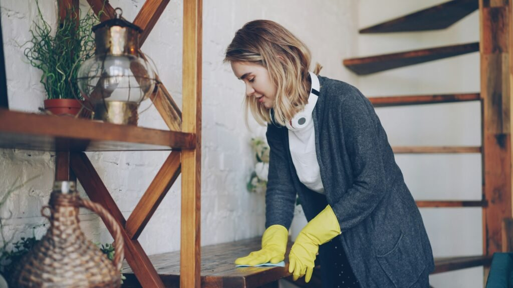
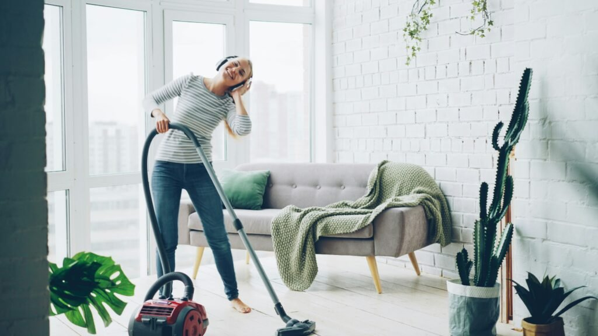

Manter a casa limpa pode parecer uma tarefa monumental, não é mesmo? Com a correria do dia a dia, muitas vezes acabamos deixando de lado aquela faxina que estava na lista de afazeres. Mas e se eu te disser que criar um cronograma de limpeza doméstica pode transformar essa missão em uma atividade muito mais leve? Imagine ter uma rotina organizada e eficiente para deixar cada cantinho da sua casa impecável!  
  
Neste post, vamos explorar o checklist definitivo para montar seu cronograma de limpeza. Vamos falar sobre os produtos indispensáveis, as tarefas semanais e mensais, além das vantagens dessa prática incrível. Prepare-se para descobrir como simples passos podem revolucionar sua rotina de limpeza e trazer mais tranquilidade ao seu lar!

## Como fazer um cronograma de limpeza doméstica?

Criar um cronograma de limpeza doméstica pode ser mais divertido do que você imagina. Primeiro, comece listando todas as tarefas que precisam ser feitas na sua casa. Pense em tudo: desde varrer o chão até organizar os armários. Essa é a hora de colocar a mão na massa e anotar tudo!  
  
Depois de listar, organize essas tarefas por frequência. Algumas coisas podem ser feitas diariamente, como lavar louça e arrumar a cama, enquanto outras podem ficar para uma vez por semana ou mensalmente. O segredo está em equilibrar as atividades para não sobrecarregar um único dia.  
  
Em seguida, defina dias específicos da semana para cada tarefa. Por exemplo, se você prefere limpar o banheiro nas segundas-feiras e passar pano no piso às quintas, faça isso! Um calendário visual pode ajudar bastante; assim fica fácil visualizar o que já foi feito.  
  
Por último, lembre-se de ser flexível! Se algo sair do planejado ou se surgir um compromisso inesperado, adapte seu cronograma sem culpa. O importante é manter a casa limpa e ainda encontrar tempo para relaxar!

## Quais são os produtos necessários para a limpeza da casa?

Produto Função Principal Onde Usar Detergente Neutro Remover gordura e lavar louças. Excelente desengordurante suave. Louças, pia da cozinha, bancadas e até para tirar manchas pontuais. Limpador Multiuso Limpeza rápida de superfícies. Mesas, bancadas, prateleiras, armários e eletrodomésticos. Desinfetante Eliminar germes, bactérias e perfumar. Banheiros (vaso, pia, box) e pisos de áreas molhadas. Água Sanitária (ou Cloro) Alvejante e desinfetante potente. Vaso sanitário (limpeza pesada), clarear panos de chão e desinfetar ralos. Limpa-Vidros Limpar vidros, espelhos e superfícies transparentes. Janelas, espelhos, box do banheiro e tampos de mesa de vidro. Desengordurante Limpeza pesada de gordura concentrada. Fogão, coifa, azulejos da cozinha e armários engordurados. Álcool 70% Desinfecção rápida e secagem imediata. Maçanetas, interruptores, eletrônicos e bancadas que exigem secagem rápida. Sabão/Lava-Roupas Higienizar tecidos. Roupas de uso diário, toalhas, roupas de cama. Limpador Perfumado Finalizar a limpeza, deixando um aroma agradável no ambiente. Pisos, após a desinfecção.

Para manter a casa limpa e cheirosa, é fundamental ter os produtos certos à mão. Comece com o bom e velho detergente multiuso. Ele é um verdadeiro coringa! Limpa superfícies, removes manchas e ainda pode ser usado na cozinha ou no banheiro.  
  
Não esqueça do desinfetante! Esse item é essencial para eliminar germes e bactérias, principalmente em áreas como sanitários. Um ambiente livre de micróbios faz toda a diferença na saúde da família.  
  
Outra estrela do arsenal de limpeza é o limpador de vidros. Janelas brilhantes fazem qualquer espaço parecer mais acolhedor. E quem não ama uma boa luz natural entrando pela janela? Além disso, ele evita aquelas marcas desagradáveis que aparecem após a limpeza.  
  
Por último, mas não menos importante: panos de microfibra! Eles são super eficientes para remover poeira sem deixar fiapos pelo caminho. Com esses aliados ao seu lado, sua rotina de limpeza será bem mais prática e eficiente!

## Cronograma de limpeza da casa

Dia da Semana Rotina Diária (Manutenção) Foco Semanal (Limpeza Pesada) Foco Mensal/Extra Status \*\*Todos os Dias\*\* \*\*Manutenção Essencial:\*\* Lavar louça, arrumar a cama, limpar bancadas da cozinha, retirar lixo, guardar objetos fora do lugar. \*\*Segunda-feira\*\* Manutenção Diária \*\*Roupas e Cozinha:\*\* Lavar e estender a primeira leva de roupas. Limpar a parte externa dos armários da cozinha. \*\*Terça-feira\*\* Manutenção Diária \*\*Quartos:\*\* Tirar pó dos móveis, aspirar o chão/tapetes e passar pano úmido. Trocar a roupa de cama. Limpar o interior do guarda-roupa (rodízio). \*\*Quarta-feira\*\* Manutenção Diária \*\*Banheiros:\*\* Limpeza completa e desinfecção (vaso, box, pia, espelho, piso). Limpar azulejos do box. \*\*Quinta-feira\*\* Manutenção Diária \*\*Sala e Áreas Comuns:\*\* Aspirar sofás, poltronas e tapetes. Tirar pó de estantes e eletrônicos. Passar pano no piso. Limpar portas, batentes e rodapés. \*\*Sexta-feira\*\* Manutenção Diária \*\*Cozinha e Eletros:\*\* Limpeza do fogão/coifa, micro-ondas e área de serviço. Lançar a segunda leva de roupas. Limpar a geladeira por dentro (semanal ou quinzenal, se necessário). \*\*Sábado\*\* Manutenção Básica \*\*Finalização/Extras:\*\* Limpar janelas e vidros. Varrer/lavar áreas externas (quintal, varanda). Passar e guardar as roupas. Limpeza profunda do forno. \*\*Domingo\*\* \*\*Dia de Descanso:\*\* Focar apenas na louça essencial e relaxar! \*\*Revisão:\*\* Fazer lista de compras/preparar a semana.

Manter a casa limpa pode parecer uma tarefa monumental, mas um cronograma de limpeza bem estruturado transforma tudo em algo muito mais gerenciável e até divertido. Imagine dividir as tarefas ao longo da semana! Assim, você evita o acúmulo do serviço e ainda consegue aproveitar melhor seu tempo livre.  
  
A limpeza semanal deve incluir atividades como varrer e passar pano no chão, limpar os banheiros e tirar o pó dos móveis. Com essas pequenas ações diárias, sua casa permanecerá sempre apresentável. E acredite: dedicar alguns minutos por dia é menos estressante que uma faxina intensa de fim de semana.  
  
Já a faxina mensal é aquele momento em que você dá um foco maior nas áreas negligenciadas durante o mês. É hora de lavar cortinas, limpar janelas e organizar armários. Esses detalhes fazem toda a diferença na sensação de aconchego do lar.  
  
Transformar suas tarefas em rituais vai deixar a rotina muito mais leve. Você pode colocar sua música favorita para tocar enquanto limpa – assim fica bem mais agradável!

## Utensílios e Acessórios Indispensáveis

As ferramentas corretas facilitam (e muito!) o trabalho de esfregar, varrer e secar.

Utensílio/Acessório Função Principal Dicas de Uso Esponjas (Múltiplas) Limpeza de superfícies e louças. Tenha cores/tipos diferentes: uma para louça, outra para banheiro e outra para limpeza geral. Panos de Microfibra Tirar pó, polir e secar superfícies sem riscar ou soltar fiapos. Excelentes para vidros e eletrônicos. Não use amaciante ao lavar, pois reduz a absorção. Baldes (Dois) Transporte de água e diluição de produtos. Tenha um balde exclusivo para a limpeza do banheiro/áreas sujas e outro para pisos/superfícies limpas. Vassoura e Pá Remoção de sujeira seca e detritos do chão. Opte por vassouras de cerdas sintéticas para maior durabilidade. Mop (Flat ou Giratório) Substituir o pano de chão. Passar produtos e secar pisos. Agiliza a limpeza de grandes áreas e poupa a coluna. Use refis diferentes para a cozinha e banheiro. Aspirador de Pó Remover pó e ácaros de pisos, tapetes e estofados. Modelos verticais ou robôs economizam tempo. Essencial para quem tem alergias ou pets. Escova Sanitária Limpeza interna do vaso sanitário. Mantenha-a com um pouco de desinfetante no suporte para higiene contínua. Luvas de Borracha Proteção das mãos contra produtos químicos, água quente e sujeira. Use luvas mais curtas para louça e longas/reforçadas para limpeza pesada e desinfetantes. Borrifadores Vazios Diluição e aplicação de produtos (água sanitária diluída, limpa-vidros). Etiquete cada borrifador para evitar misturar produtos incompatíveis e perigosos.

### Limpeza semanal

A limpeza semanal é como dar um tapa no visual da sua casa. É o momento de colocar a rotina em ação e garantir que tudo esteja brilhando. Comece pelas áreas mais usadas, como a sala e a cozinha. Um espaço organizado traz uma sensação de bem-estar.  
  
Dedique alguns minutos para varrer ou passar pano no chão. Não esqueça dos cantos! Eles costumam acumular sujeira, e você não quer isso, certo? Depois, passe um bom produto na superfície das mesas e balcões. Isso vai deixar o ambiente fresco.  
  
Os banheiros também merecem atenção especial nessa limpeza semanal. Lave os toaletes com produtos específicos e não se esqueça do espelho: nada melhor do que ver seu rosto refletido em uma superfície limpa!  
  
Por último, tire um tempo para organizar os objetos espalhados pela casa. Uma estante arrumada faz toda diferença na aparência geral do lar. Com esses cuidados simples, sua casa estará sempre pronta para receber visitas sem stress!

### Faxina mensal

A faxina mensal é aquele momento em que você dá uma geral na casa e faz tudo brilhar. Sabe aqueles cantinhos que a gente esquece no dia a dia? Eles ganham vida nova com esse cuidado extra. É como dar um presente para o seu lar.  
  
Comece pelas áreas mais esquecidas, como atrás da geladeira ou embaixo do sofá. Esses locais acumulam sujeira sem dó! Tire os móveis do lugar, limpe bem e depois coloque tudo de volta no seu devido lugar. Você vai se surpreender com a quantidade de poeira que estava escondida!  
  
Outra parte importante é cuidar das janelas e cortinas. Uma limpeza profunda nesses itens pode renovar totalmente o ambiente, deixando-o mais leve e arejado. Afinal, quem não gosta de uma casa iluminada pelo sol?  
  
E não se esqueça dos banheiros! Um bom desinfetante faz maravilhas por ali. Com essa atenção especial, sua casa fica pronta para receber visitas ou simplesmente ser um espaço aconchegante para você relaxar após um longo dia de trabalho.

## Vantagens de seguir um cronograma de limpeza

Seguir um cronograma de limpeza traz uma série de vantagens que podem transformar a sua rotina. Primeiro, ele ajuda a manter a casa organizada e livre da bagunça. Com tarefas bem definidas para cada dia, você evita aquele acúmulo de sujeira que parece surgir do nada.  
  
Além disso, essa organização proporciona mais tempo livre. Ao dividir as atividades ao longo da semana, você não fica sobrecarregado em um único dia e pode aproveitar momentos de lazer sem preocupações. É muito melhor curtir um filme ou ler um livro sabendo que sua casa está limpa.  
  
Outra grande vantagem é o aumento na eficiência das limpezas. Quando você sabe exatamente o que fazer e quando fazer, consegue executar as tarefas com mais rapidez e eficácia. Isso significa menos esforço físico e melhores resultados!  
  
Por fim, seguir um cronograma cria hábitos saudáveis no lar. A disciplina adquirida se reflete em outras áreas da vida, tornando sua rotina ainda mais produtiva e satisfatória!

## Por que um Cronograma é Essencial?

Ter um cronograma de limpeza é como ter um mapa para a tranquilidade em casa. Sem ele, você pode se sentir perdido entre os cômodos e as tarefas. Um dia você limpa a sala, no outro esquece da cozinha e, quando percebe, já está tudo bagunçado novamente.  
  
Além disso, seguir uma rotina ajuda a evitar o acúmulo de sujeira. Se você deixar para limpar tudo na última hora, vai acabar gastando muito mais tempo e energia do que se tivesse feito pequenas manutenções ao longo da semana. E quem não gosta de praticidade?  
  
Um cronograma também traz organização mental. Com ele em mãos, fica mais fácil saber o que fazer e quando fazer. Você elimina aquele estresse diário pensando: “O que eu deveria estar limpando agora?”  
  
Por último, é uma excelente maneira de envolver toda a família nas tarefas domésticas. Cada um pode assumir sua parte e assim todos colaboram para manter o lar limpo e agradável. Mais momentos juntos em casa tornam-se possíveis!

## Passo a Passo para Criar seu Cronograma de Limpeza Doméstica

Criar um cronograma de limpeza doméstica pode parecer desafiador, mas com algumas dicas práticas, você vai ver que é mais simples do que parece. Primeiro, faça uma lista das tarefas essenciais. Pense em tudo o que precisa ser limpo: pisos, banheiros, cozinha e áreas comuns. Anote cada item para não esquecer nada.  
  
Depois de listar as atividades, classifique-as por frequência. Algumas tarefas precisam ser feitas diariamente, como lavar a louça ou arrumar a cama. Outras podem ser realizadas semanalmente ou mensalmente – como limpar janelas ou organizar armários.  
  
Agora vem a parte divertida: escolha os dias da semana! Divida as responsabilidades ao longo dos dias para evitar sobrecarga em apenas um dia e garantir que sua casa permaneça sempre limpa e agradável.  
  
Por fim, considere usar um planner físico ou digital para visualizar seu progresso. Marcar as tarefas concluídas traz uma sensação de realização incrível e ajuda a manter o foco na rotina de limpeza da casa!

## Como Adaptar o Cronograma para uma Empregada Doméstica

Adaptar o cronograma de limpeza para uma empregada doméstica pode ser a chave para uma casa sempre impecável. Lembre-se de que a comunicação é essencial. Compartilhe suas expectativas e preferências em relação à limpeza, garantindo que todos estejam na mesma sintonia.  
  
É importante criar um planejamento claro e prático. Liste as tarefas diárias, semanais e mensais que você gostaria que fossem realizadas. Isso não só orienta sua empregada, mas também oferece um guia visual fácil de acompanhar.  
  
Incentive-a a dar feedback sobre o cronograma. Às vezes, ela pode ter dicas valiosas ou sugestões baseadas na experiência do dia a dia. Essa troca torna o trabalho mais colaborativo e agradável.  
  
E não esqueça: valorização é tudo! Reconhecer o esforço dela vai muito além da limpeza; cria um ambiente positivo e motivador para ambos.  
  
Assim, com esse ajuste no cronograma de limpeza da casa, você garante não apenas eficiência nas tarefas domésticas, mas também harmonia no lar! Agora é só colocar as mãos à obra e aproveitar cada espaço limpo com alegria!

## Conclusão Sobre Rotina de Limpeza de Casa

Para finalizar, percebemos que o segredo para ter uma casa sempre impecável não está em passar horas a fio em uma faxina pesada, mas sim na **consistência** de um bom [planejamento](https://pt.wikipedia.org/wiki/Planejamento). Criar e seguir um cronograma de limpeza é a atitude mais inteligente que você pode tomar para transformar a rotina da sua casa.

Com o seu checklist definitivo em mãos, sabendo exatamente quais produtos usar e quais tarefas priorizar diariamente, semanalmente e mensalmente, você evita a sobrecarga, ganha tempo livre e, o mais importante, conquista uma enorme **paz de espírito**.

Lembre-se: a faxina não precisa ser um tormento. Transforme esses momentos em rituais leves e agradáveis, coloque sua música favorita e sinta a satisfação de ter um lar que reflete o cuidado e a tranquilidade que você merece.

**Agora, respire fundo e comece a desfrutar de cada cantinho da sua casa limpa e organizada!**
