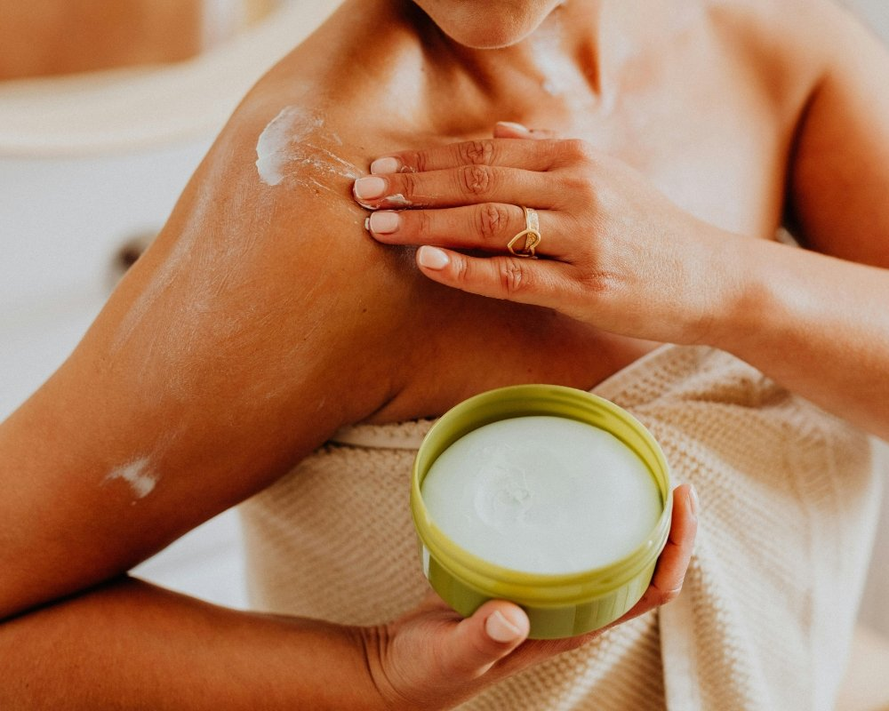
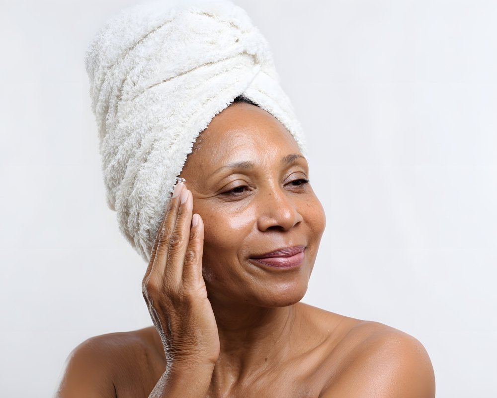

Você já se olhou no espelho e desejou que a oleosidade da sua pele pudesse ser controlada com um simples toque de mágica? A verdade é que, apesar de ser um desafio, cuidar da pele oleosa pode ser uma missão bem-sucedida. Com a rotina certa, você pode conquistar uma cútis mais saudável e radiante.

Neste guia prático, vamos desvendar todos os segredos para montar a melhor rotina de skincare para pele oleosa. Prepare-se para dizer adeus ao brilho excessivo e olá à confiança renovada! Vamos lá?

## Quais as características da pele oleosa?

A pele oleosa é aquela que brilha como uma estrela em um dia ensolarado. Isso acontece devido à produção excessiva de sebo pelas glândulas sebáceas. Se você percebe poros dilatados, cravos e até mesmo espinhas, pode ser um sinal claro de que sua pele está nessa categoria.  
  
Além do brilho característico, a pele oleosa costuma ter uma textura mais grossa e algumas áreas podem parecer pegajosas ao toque. Mas calma! Embora possa parecer desvantajoso, essa oleosidade natural ajuda a manter a hidratação da pele por mais tempo. É tudo uma questão de cuidado adequado!

### Oleosidade faz mal para a pele?

A oleosidade em si não é um vilão, mas pode trazer alguns desafios para a pele. Quando em excesso, o óleo natural produzidas pelas glândulas sebáceas pode obstruir os poros e causar acne. Além disso, ela também atrai impurezas e sujeira que costumam se acumular na superfície da pele.  
  
Mas calma! A solução está em uma rotina de cuidados adequada. Com os produtos certos e hábitos saudáveis, você pode controlar essa oleosidade e manter sua pele equilibrada, radiante e livre de imperfeições.

## Qual é a rotina de skincare para pele oleosa?

Ter uma pele oleosa não precisa ser um desafio! A rotina de skincare ideal começa com a limpeza. Use um sabonete específico para seu tipo de pele, que retire o excesso de óleo sem agredir. Isso prepara sua cútis para os próximos passos.  
  
Depois da limpeza, é hora do tratamento. Pela manhã, aplique um gel ou serum leve com ingredientes como ácido salicílico ou niacinamida. À noite, opte por produtos mais intensivos e hidratantes que ajudem a controlar a oleosidade enquanto você dorme tranquilamente.

### Limpeza

Para uma pele oleosa, a limpeza é o primeiro passo crucial na rotina de skincare. Escolha um sabonete específico que remova impurezas e controle a oleosidade sem ressecar. O ideal é usar um produto em gel ou espuma, que proporciona frescor e leveza.  
  
Lave o rosto duas vezes ao dia: pela manhã para retirar as secreções noturnas e à noite para eliminar a sujeira acumulada durante o dia. Lembre-se de massagear suavemente, permitindo que os ingredientes ativos façam efeito. Essa etapa vai deixar sua pele pronta para receber os próximos cuidados!

### Tratamento pela manhã

Começar o dia com uma boa rotina de skincare é fundamental para a pele oleosa. Após a limpeza, aplique um tônico adstringente para ajudar a controlar a produção de sebo. Isso vai deixar sua pele fresquinha e pronta para encarar os desafios do dia.  
  
Em seguida, use um hidratante oil-free que não obstrua os poros. Procure produtos com ingredientes como ácido hialurônico ou niacinamida. Finalize sempre com um protetor solar leve, pois até mesmo as peles oleosas precisam de proteção contra os raios UV!

### Tratamento à noite

A rotina noturna é como um abraço acolhedor para a sua pele. Após limpar bem o rosto, é hora de aplicar produtos específicos que ajudam a controlar a oleosidade enquanto você dorme. Um gel ou serum com ácido salicílico pode ser seu melhor amigo, combatendo espinhas e prevenindo novas crises.  
  
Não esqueça da hidratação! Mesmo com pele oleosa, um hidratante leve e oil-free é fundamental. Ele mantém a barreira cutânea saudável sem deixar aquele aspecto brilhante indesejado ao amanhecer. Sua pele vai acordar renovada e pronta para brilhar!

## Como escolher os produtos de skincare para pele oleosa?

Escolher os produtos certos para a pele oleosa pode parecer um desafio, mas é mais simples do que você imagina. Opte por fórmulas oil-free e não comedogênicas, que ajudam a controlar a produção de sebo sem obstruir os poros.  
  
Além disso, ingredientes como ácido salicílico e niacinamida são seus melhores amigos! Eles combatem acne e reduzem a aparência dos poros dilatados. Fique sempre atenta ao rótulo e busque produtos suaves, pois sua pele merece carinho na hora da limpeza e hidratação!

## O que é bom para tirar a oleosidade da pele?

Para controlar a oleosidade da pele, use produtos que contenham ingredientes como ácido salicílico e óleo de tea tree. Esses poderosos aliados ajudam a desobstruir os poros e reduzem o brilho excessivo. Além disso, tonificantes com extratos de hamamélis podem ser ótimos para equilibrar a produção de sebo.  
  
Outra dica é investir em máscaras faciais à base de argila, que absorvem o excesso de óleo e purificam a pele. Não esqueça também da esfoliação semanal para renovar as células e evitar cravos! Com essas dicas simples, você poderá manter sua pele linda e saudável.

## O que piora a oleosidade no rosto?

Dentre os vilões da oleosidade, a alimentação é um dos principais. Alimentos ricos em açúcar e gordura saturada podem desencadear uma produção excessiva de sebo. Isso acontece porque essas substâncias aumentam a inflamação no corpo, refletindo diretamente na pele do rosto.  
  
Outro fator que agrava o problema é o estresse. Quando estamos sob pressão, nosso organismo libera hormônios que estimulam as glândulas sebáceas. Além disso, usar produtos inadequados para sua pele também pode piorar a situação ao obstruir os poros e intensificar a oleosidade indesejada.

## Como fazer skincare para pele oleosa?

Cuidar da pele oleosa pode ser uma verdadeira arte! Comece sempre com um bom sabonete facial. Opte por fórmulas que limpam sem agredir, eliminando o excesso de óleo e as impurezas acumuladas ao longo do dia.  
  
Depois, é hora de aplicar tônicos e hidratantes específicos. Escolha produtos oil-free para garantir que sua pele respire livremente. Finalize com protetor solar, mesmo em dias nublados. A proteção é fundamental para evitar manchas e manter a saúde da sua pele radiante e equilibrada!

## O que é o efeito rebote?

O efeito rebote é um verdadeiro vilão para quem tem pele oleosa. Sabe quando você usa produtos super adstringentes, achando que vai controlar a oleosidade? Pois é, isso pode ter o efeito contrário! A pele fica tão seca que começa a produzir ainda mais óleo para compensar.  
  
É como uma gangorra: quanto mais você tenta controlar, mais ela se revolta. Uma rotina equilibrada de cuidados é essencial para evitar esse ciclo maldito e manter sua pele saudável e radiante. Afinal, ninguém merece lutar contra a própria pele!

## Qual é o melhor skincare para pele oleosa?

Quando o assunto é skincare para pele oleosa, a escolha dos produtos certos faz toda a diferença. Comece com um sabonete facial específico que controle a oleosidade sem ressecar demais. Aposte em hidratantes oil-free que mantenham sua pele equilibrada e fresca.  
  
Para potencializar os cuidados, inclua um gel de tratamento com ácido salicílico ou peróxido de benzoíla. E não se esqueça do protetor solar! Opte por fórmulas matificantes, assim você protege sua pele e mantém o brilho sob controle durante todo o dia.

### Sabonete

Escolher o sabonete certo é fundamental na rotina de skincare para pele oleosa. Prefira aqueles com fórmula leve e sem óleo, que ajudam a controlar a produção excessiva de sebo. Os sabonetes em gel são ótimos aliados, pois limpam profundamente sem deixar a pele ressecada.  
  
Além disso, evite produtos com fragrâncias fortes ou ingredientes agressivos. Eles podem irritar ainda mais sua pele. Um bom sabonete deve remover impurezas e maquiagem sem comprometer a barreira natural da pele, deixando-a fresca e pronta para os próximos passos da sua rotina!

### Hidratante

Escolher o hidratante certo para pele oleosa é como encontrar a combinação perfeita! Opte por fórmulas oil-free ou em gel, pois são leves e não obstruem os poros. Esses produtos ajudam a manter a umidade necessária sem deixar aquela sensação pegajosa.  
  
Além disso, ingredientes como ácido hialurônico e niacinamida são verdadeiros aliados. Eles hidratam profundamente, controlando a oleosidade e melhorando a textura da pele. Usar um bom hidratante faz toda diferença na sua rotina de skincare!

### Gel de tratamento

O gel de tratamento é um verdadeiro aliado para quem tem pele oleosa. Com sua textura leve, ele penetra rapidamente na pele, ajudando a controlar a produção excessiva de óleo e prevenindo o aparecimento de espinhas. É como uma mini revolução em cada aplicação!  
  
Além disso, muitos desses géis contêm ingredientes poderosos, como ácido salicílico e extratos naturais que acalmam a pele. A sensação refrescante é quase instantânea! Usar esse produto regularmente pode transformar seu skincare em um momento prazeroso e eficaz.

### Tonificação

A tonificação é uma etapa que muitas vezes é esquecida, mas faz toda a diferença na rotina de skincare. O tônico ajuda a equilibrar o pH da pele e remove qualquer resíduo que sobrou após a limpeza. Além disso, ele dá aquele "up" na absorção dos produtos seguintes.  
  
Escolha um tônico sem álcool para não irritar sua pele oleosa. Fórmulas com ingredientes como hamamélis ou ácido salicílico são ótimas opções. Aplique com um algodão ou até mesmo dando batidinhas suaves com as mãos. Sua pele vai agradecer!

### Higienização

A higienização é o primeiro passo da sua rotina de skincare para pele oleosa e não pode ser negligenciada. Um bom sabonete facial, que controle a oleosidade sem ressecar a pele, faz toda a diferença. Lave o rosto duas vezes ao dia: pela manhã e à noite.  
  
Lembre-se de usar água morna durante a limpeza, pois evita irritações. Massageie suavemente com as pontas dos dedos por cerca de 30 segundos. Isso ajuda a remover impurezas acumuladas e prepara sua pele para os próximos passos do tratamento!

### Hidratação

A hidratação é um passo fundamental na rotina de skincare para pele oleosa. Mesmo que a sua pele já produza óleo, ela precisa de umidade! Opte por hidratantes leves e em gel, que não obstruem os poros e garantem uma sensação fresquinha.  
  
Esses produtos ajudam a equilibrar a produção de sebo, evitando aquele brilho excessivo. Além disso, ingredientes como ácido hialurônico são ótimos aliados. Eles conseguem reter água na pele sem deixar aquela sensação pegajosa. Acredite: sua pele vai agradecer!

### Redução de poros

Os poros dilatados são um desafio para quem tem pele oleosa. Eles podem acumular sujeira e óleo, resultando em cravos e espinhas indesejadas. Mas não se preocupe! Existem truques que ajudam a minimizar essa aparência.  
  
Uma boa rotina de skincare é fundamental. Utilize produtos com ácido salicílico ou niacinamida, que ajudam na redução dos poros ao controlar a oleosidade. Além disso, sempre aplique um protetor solar oil-free diariamente para evitar o aumento da produção de óleo e garantir uma pele mais uniforme e suave.

### Proteção solar para peles oleosas

A proteção solar é um passo essencial na rotina de skincare para pele oleosa, e você não pode negligenciá-la! Muitas pessoas acreditam que usar protetor solar deixará a pele ainda mais oleosa, mas isso é um mito. Existem opções leves e oil-free que mantêm a pele protegida sem pesar.  
  
Escolha um protetor com fator de proteção solar (FPS) adequado ao seu tipo de pele. Além disso, ele deve ser não-comedogênico para evitar obstruir os poros. Sua pele merece esse cuidado extra para manter-se saudável e radiante!

### Vitamina C para pele oleosa

A vitamina C é uma verdadeira aliada para quem tem pele oleosa. Ela ajuda a controlar a produção de sebo, deixando a pele mais equilibrada e com menos brilho excessivo. Além disso, essa vitamina poderosa combate os radicais livres, promovendo um efeito antioxidante incrível.  
  
Usar produtos com vitamina C na rotina de skincare não só ilumina o rosto como também minimiza as manchas causadas pela acne. Aposte em séruns leves e oil-free para um resultado ainda melhor! A sua pele agradece!

## Preciso procurar um dermatologista?

Se você está lutando contra a oleosidade excessiva, espinhas ou cravos teimosos, talvez seja hora de procurar um dermatologista. Esses profissionais são como super-heróis da pele! Eles têm o conhecimento e as ferramentas para ajudar a entender melhor o que está acontecendo com seu rosto.  
  
Além disso, um dermatologista pode indicar produtos específicos e tratamentos personalizados que se adaptam às suas necessidades. Não hesite em buscar ajuda quando necessário; cuidar da sua pele é essencial para manter não só a beleza, mas também a saúde!

## Como evitar espinhas no rosto: dicas de cuidados com a pele acneica

Evitar espinhas no rosto pode parecer um desafio, mas algumas dicas simples fazem toda a diferença. Comece mantendo a pele limpa com um sabonete específico para acne duas vezes ao dia. Não esqueça de esfoliar uma ou duas vezes por semana, removendo as células mortas que podem obstruir os poros.  
  
Outra tática é evitar tocar o rosto. As mãos carregam sujeira e oleosidade que agravam a situação. Além disso, escolher produtos oil-free é fundamental! Ah, e sempre proteja sua pele do sol; isso evita inflamações indesejadas e manchas.

## Pode espremer espinhas? Dermatologista explica cuidados essenciais com a acne

A tentação de espremer espinhas é grande, não é mesmo? Mas cuidado! Os dermatologistas alertam que essa prática pode agravar a inflamação e deixar cicatrizes indesejadas. Ao invés de aliviar, você pode causar mais problemas à sua pele.  
  
Focar na limpeza adequada e usar produtos específicos para acne são as melhores opções. E se você está desesperado por uma solução rápida, consulte um especialista. Eles podem indicar tratamentos eficazes sem arriscar sua beleza natural. Afinal, sua pele merece cuidados especiais!

## Conclusão

A rotina de skincare para pele oleosa pode parecer desafiadora, mas com as dicas certas, você verá como é possível conquistar uma [pele equilibrada e saudável](https://www.nivea.com.br/dicas/pele/como-cuidar-da-pele-do-corpo?utm_source_platform=GoogleAds&utm_source=google&utm_medium=cpc&utm_campaign=T03_000434&utm_term=CUIDADOS-PELE-CORPO2&utm_content=cheil&gad_source=1&gad_campaignid=21226588987&gbraid=0AAAAAoc9XB6yvQvtyeNoGWHDpalI8-1L2&gclid=CjwKCAjwpOfHBhAxEiwAm1SwEsz5xiW7RmSxkGZ7LqIcED1AzbjkvUM8J2pbKXWsXmmiutdT8C8k-RoCJHIQAvD_BwE). Lembre-se sempre da importância de escolher produtos específicos e seguir os passos adequados ao longo do dia.  
  
Adotar hábitos saudáveis também faz toda a diferença: manter uma alimentação balanceada, beber bastante água e dormir bem são aliados na batalha contra a oleosidade. Não esqueça que cada pele é única; o que funciona para um pode não funcionar para outro. Portanto, teste diferentes combinações até encontrar a sua perfeita.  
  
Se persistirem problemas ou dúvidas sobre cuidados específicos, procurar um dermatologista nunca é demais! Cuide-se bem e curta seu novo ritual de beleza!
