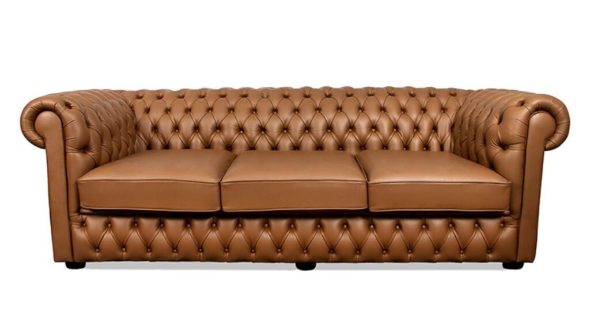

Você já entrou em uma sala e sentiu que um único móvel contava uma história inteira? O **sofá Chesterfield** é exatamente essa peça. Conhecido por seu design imponente e o icônico acabamento em capitonê, ele atravessou séculos como sinônimo de sofisticação.

Aqui no **Irenes**, acreditamos que a paz do lar vem do equilíbrio. E incluir um clássico como este na sua decoração não é apenas sobre estética, é sobre criar um refúgio de conforto e personalidade. Neste guia, vamos te ensinar a escolher, decorar e cuidar do seu Chesterfield, transformando sua sala em um verdadeiro santuário de harmonia.

## **A História por Trás do Ícone: O que é um Sofá Chesterfield?**

A origem do Chesterfield remonta ao século XVIII, na Inglaterra. Diz a lenda que o quarto Conde de Chesterfield encomendou um sofá onde um cavalheiro pudesse se sentar com as costas retas, sem amassar o seu traje, mas com o máximo de conforto.

O resultado foi um design único: braços e encosto na mesma altura e o famoso **trabalho em capitonê** (aqueles botões profundos que formam losangos no estofado). Hoje, ele não é mais exclusividade de clubes ingleses, mas um item de desejo em casas que buscam elegância atemporal.

## **Como Identificar um Chesterfield Autêntico**

Para garantir que você está investindo em uma peça de qualidade para o seu lar, fique atenta a estes detalhes:

1.  **O Capitonê:** No modelo original, os botões são presos manualmente à estrutura, criando dobras profundas e simétricas.
    
2.  **Braços Rolados:** As extremidades do sofá costumam ter um formato arredondado, como um pergaminho.
    
3.  **Pés de Madeira:** Geralmente curtos e torneados, muitas vezes com rodinhas de latão, reforçando o estilo vintage.
    
4.  **Material:** Embora o couro legítimo seja o clássico (que envelhece lindamente), versões em veludo e linho trazem uma suavidade perfeita para quem busca um ambiente mais acolhedor e "soft".

## **Versatilidade na Decoração: Do Clássico ao Industrial**

Muitas pessoas hesitam em comprar um Chesterfield por medo de o ambiente ficar "pesado". Mas a verdade é que ele é um camaleão da decoração.

-   **Estilo Industrial:** Combine um Chesterfield de couro marrom ou preto com paredes de tijolinho e iluminação em trilhos. É a combinação perfeita de força e estilo.
    
-   **Clássico e Sereno:** Se você busca a paz que o nome Irene evoca, opte por um Chesterfield em tons neutros, como bege ou cinza claro, em tecidos como o linho.
    
-   **Toque Boho-Chic:** Já pensou em um Chesterfield de veludo verde ou azul marinho? Com algumas almofadas coloridas e plantas ao redor, sua sala ganha uma energia vibrante e, ao mesmo tempo, relaxante.

## **Dicas Práticas: Couro ou Veludo?**

A escolha do material depende da rotina da sua "Irene" interior:

-   **Couro:** Extremamente durável e fácil de limpar (basta um pano úmido). Ideal para quem tem pets ou crianças. Com o tempo, ele ganha uma pátina que o torna ainda mais bonito.
    
-   **Veludo:** Oferece um toque macio e térmico, sendo muito aconchegante para climas mais frios. Exige um pouco mais de cuidado com aspiração e limpeza de manchas.

## **Conclusão: O Seu Refúgio de Paz**

Escolher um [sofá Chesterfield](https://osvaldoantiguidades.com.br/produto/poltrona-chesterfield/) é um ato de cuidado com o seu espaço. Ele não é apenas um lugar para sentar, mas o centro das atenções de um lar que valoriza a história e o bem-estar. Seja ele de couro envelhecido ou veludo colorido, o importante é que ele reflita a sua personalidade e traga a harmonia que você merece.

**Gostou dessa inspiração?** Continue navegando no **Irenes.com.br** para descobrir mais dicas de como transformar sua casa e sua rotina com leveza e beleza.
