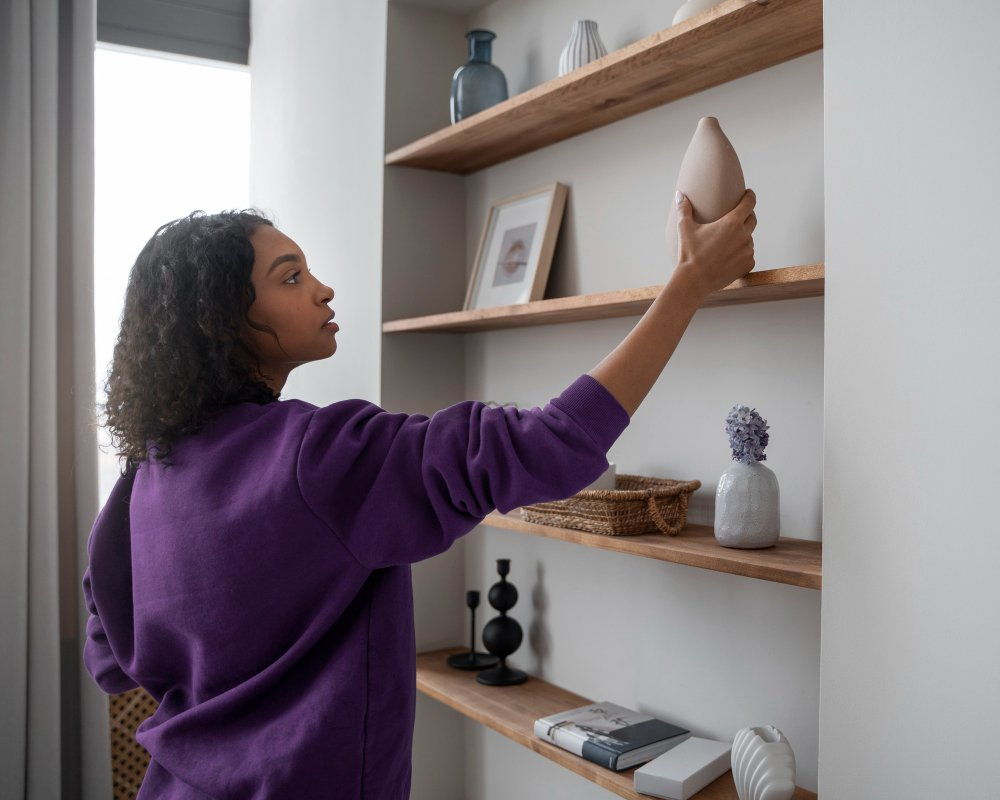
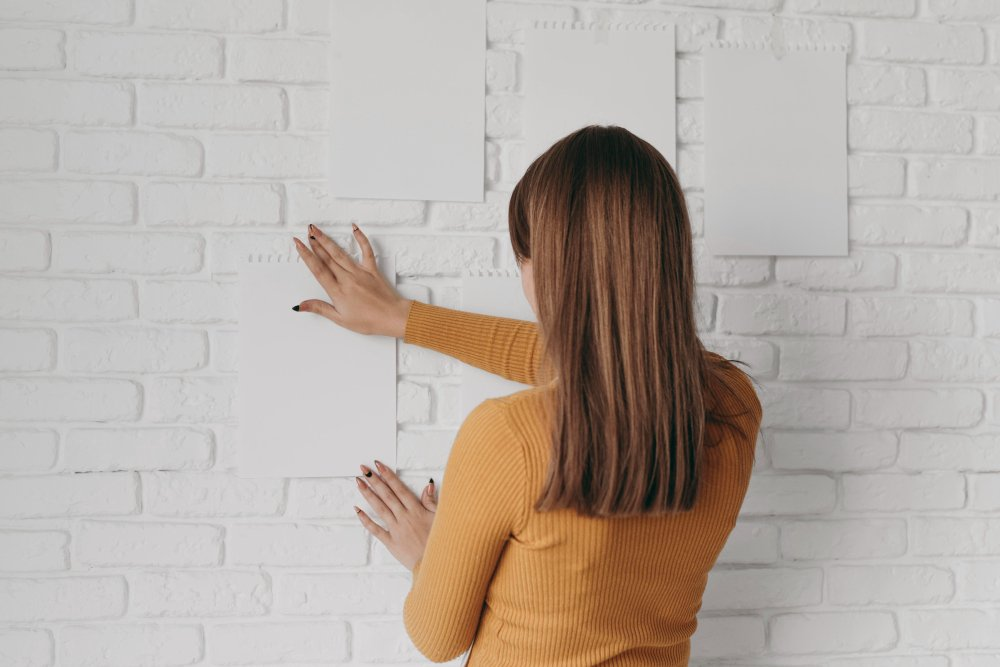

Você já se sentiu apertada em seu apartamento pequeno, cercado por móveis e objetos que parecem dominar o espaço? Não se preocupe! Transformar pequenos ambientes em lugares funcionais e estilosos é possível com algumas soluções de armazenamento inteligentes.

Neste post, vamos explorar ideias criativas que não apenas otimizam o espaço, mas também acrescentam charme à sua casa. Prepare-se para descobrir como cada canto pode ser aproveitado ao máximo! Vamos juntos nessa jornada de organização e estilo?

## Por Onde Começar a Aproveitar Melhor o Espaço

Começar a aproveitar melhor o espaço do seu apartamento pode parecer desafiador, mas é mais simples do que parece. O primeiro passo é olhar ao redor e identificar os locais subutilizados. Um canto esquecido ou uma parede vazia podem se transformar em áreas funcionais com as soluções certas.  
  
Pense fora da caixa! Móveis multifuncionais são seus melhores amigos. Eles oferecem praticidade sem sacrificar estilo e ajudam a liberar espaço para você respirar e curtir seu lar de maneira leve e organizada.

### Invista em Móveis Multifuncionais

Quando o espaço é limitado, os móveis multifuncionais se tornam seus melhores amigos. Eles não apenas economizam espaço, mas também trazem praticidade para o dia a dia. Imagine um sofá que se transforma em cama ou uma mesa de centro que abriga armazenamento interno!  
  
Esses itens são ideais para apartamentos pequenos e ainda adicionam estilo à decoração. A versatilidade deles permite criar ambientes mais dinâmicos e organizados, tornando seu lar mais aconchegante e funcional.

### Opte por Organizadores de Parede

Os organizadores de parede são verdadeiros aliados na luta contra a desordem. Eles transformam paredes vazias em espaços funcionais e cheios de estilo. Pense em prateleiras flutuantes, ganchos criativos e cestos decorativos que podem armazenar tudo, desde livros até utensílios.  
  
Além disso, eles liberam o chão, deixando seu ambiente mais arejado. Com um toque de criatividade, você pode criar uma galeria de itens pessoais ou organizar seus acessórios favoritos à vista. É funcionalidade com charme!

### Aprenda sobre a Otimização de Armários e Espaços de Armazenamento

Otimizar armários é uma arte! Comece retirando tudo e categorize os itens. Isso ajuda a visualizar o que realmente merece espaço. Use caixas organizadoras para separar roupas, sapatos e acessórios de forma prática.  
  
Aposte em ganchos e prateleiras internas. Eles transformam um armário comum em um verdadeiro sistema de armazenamento. Experimente também dobrar as roupas verticalmente; assim, você aproveita cada centímetro livre e encontra o que precisa com facilidade!

### Confie no Poder de Amplitude dos Espelhos

Os espelhos são verdadeiros aliados na hora de otimizar espaços pequenos. Eles têm o poder mágico de refletir a luz e criar uma sensação de amplitude. Em ambientes reduzidos, um bom espelho pode fazer toda a diferença, tornando o espaço mais arejado e convidativo.  
  
Além disso, eles podem ser usados como peças decorativas. Escolha molduras interessantes ou formatos diferentes para dar um toque especial ao seu apartamento. Com criatividade, você transforma até o menor dos cantos em algo surpreendente!

### Invista em Nichos e Prateleiras Suspensas

Nichos e prateleiras suspensas são verdadeiros aliados na decoração de apartamentos pequenos. Eles não apenas economizam espaço, mas também oferecem uma forma criativa de exibir itens que você ama. Imagine suas plantas, livros ou lembranças de viagens ganhando destaque nas paredes!  
  
Além disso, ao optar por essa solução, você cria um visual mais leve e moderno. É como se cada objeto estivesse flutuando no ar! A versatilidade dessas peças permite que você brinque com cores e formas sem medo.

## Soluções Criativas de Armazenamento

Quando se trata de otimizar o espaço, a criatividade é sua melhor amiga. Que tal transformar um banco na entrada em um fantástico local para guardar sapatos ou bolsas? Além de funcional, ele adiciona charme ao ambiente.  
  
Outra ideia divertida é utilizar papel de parede removível. Com isso, você pode mudar a cara do seu espaço sempre que quiser! Os pequenos detalhes fazem toda a diferença e podem ser aliados poderosos nas suas soluções de armazenamento.

### Caracterize um Banco na Entrada

Um banco na entrada é mais do que um mero lugar para sentar. Ele traz charme e funcionalidade ao seu espaço, perfeito para calçar os sapatos ou deixar as chaves em um local estratégico. Escolha um modelo com compartimentos internos ou uma prateleira abaixo, adicionando ainda mais opções de armazenamento.  
  
Além disso, você pode personalizá-lo com almofadas coloridas ou mantas aconchegantes. Isso não só traz conforto, mas também dá aquele toque especial à sua decoração.

### Utilize Papel de Parede Removível

Transformar um espaço pequeno pode ser divertido e prático. O papel de parede removível é uma solução incrível! Ele permite que você mude o visual do seu apartamento sem grandes reformas. Além disso, é fácil de aplicar e retirar.  
  
Escolha estampas vibrantes ou padrões sutis para dar personalidade ao ambiente. E se enjoar? É só remover! Essa versatilidade torna qualquer cômodo mais alegre, mantendo a sua essência sempre renovada. Experimente essa ideia criativa!

### Eleve sua Cama

Elevar sua cama é uma ideia brilhante para quem quer ganhar espaço em apartamentos pequenos. Com um estrado mais alto, você pode criar um verdadeiro compartimento de armazenamento embaixo! Caixas organizadoras ou cestos são perfeitos para guardar roupas de cama, livros ou até sapatos.  
  
Além disso, essa elevação dá uma sensação de amplitude ao ambiente. Sua cama se torna o ponto focal do quarto e ainda libera aquele espaço precioso no chão. Uma solução prática e estilosa!

### Explore Decalques Temporários

Decalques temporários são uma forma divertida e prática de adicionar personalidade ao seu apartamento. Eles podem transformar paredes sem necessidade de tinta ou reforma, permitindo que você brinque com diferentes estilos a qualquer momento.  
  
Você pode escolher designs que refletem sua personalidade ou até mesmo temas sazonais. E o melhor: se enjoar, é só remover e trocar por algo novo! Uma solução ágil para quem adora mudanças frequentes no ambiente.

### Incorpore Pufes

Os pufes são verdadeiros camaleões do décor! Eles servem como assentos extras, mesas de apoio ou até mesmo espaço para guardar objetos. Com tantos estilos e cores disponíveis, é fácil encontrar um que se encaixe na sua decoração.  
  
Além de práticos, os pufes trazem um toque descontraído ao ambiente. Use-os em salas pequenas ou quartos para adicionar personalidade sem ocupar muito espaço. Um detalhe divertido que faz toda a diferença!

### Exponha Arte sem Danificar as Paredes

Expor arte em apartamentos pequenos pode parecer um desafio, mas com criatividade é possível! Utilize fitas adesivas dupla face ou suportes de prateleira que não danificam a parede. Assim, você dá vida ao ambiente e ainda preserva sua estrutura.  
  
Outra opção divertida são os cabides para quadros. Eles permitem mudar a disposição da arte sempre que quiser. O resultado? Um espaço dinâmico e cheio de personalidade sem causar estragos nas paredes. Quem disse que arte e praticidade não podem andar juntas?

### Use um Criado-Mudo como Cômoda

Transformar um criado-mudo em uma cômoda é uma jogada inteligente. Esses móveis compactos podem armazenar muito mais do que você imagina. Com gavetas e prateleiras, eles se tornam aliados no combate à desordem.  
  
Escolha um criado-mudo estiloso e funcional para o seu quarto. Use-o para guardar roupas íntimas, acessórios ou até mesmo livros! Assim, além de otimizar espaço, você ainda dá um toque especial à decoração do ambiente. É prática com charme!

### Empregue Recipientes de Armazenamento

Recipientes de armazenamento são verdadeiros aliados em pequenos apartamentos. Eles podem ser encontrados em diversos formatos e tamanhos, proporcionando soluções práticas e elegantes para manter sua casa organizada. Use caixas coloridas ou cestas estilizadas que se encaixem na decoração.  
  
Além disso, aproveite cada canto! Coloque recipientes sob a cama ou empilhe-os no armário. Essa estratégia não só maximiza o espaço, mas também dá um toque charmoso ao ambiente. Com criatividade, você transforma áreas bagunçadas em espaços funcionais!

### Disponha Armazenamento à Vista

Expor seus itens de armazenamento pode ser uma ótima estratégia! Prateleiras abertas, cestos bonitos e caixas organizadoras ajudam a criar um visual despojado. Ao invés de esconder tudo, mostre suas coleções e objetos favoritos. Isso dá personalidade ao ambiente.  
  
Além disso, quem disse que organização não pode ser estilosa? Use recipientes charmosos para armazenar livros ou utensílios de cozinha. Assim, você transforma o que poderia ser apenas funcional em um verdadeiro item decorativo!

## Dicas Adicionais Inspiradoras

Instalar prateleiras na cozinha é uma ótima forma de expor utensílios e temperos. Além de organizar, elas dão um charme especial ao ambiente. Experimente integrar uma bancada com espaço para refeições. Assim, você otimiza o uso do espaço e ainda cria um cantinho aconchegante.  
  
Adicione uma galeria de arte na parede para dar personalidade ao seu apartamento pequeno. A luz natural também deve ser aproveitada; cortinas leves ajudam a maximizar essa sensação de amplitude!

### Instale Prateleiras na Cozinha

Prateleiras na cozinha são um verdadeiro charme e, de quebra, ajudam a otimizar espaço. Ao invés de deixar os utensílios escondidos nos armários, que tal exibi-los? Panelas coloridas, temperos em frascos bonitos e livros de receitas podem se tornar parte da decoração.  
  
Além disso, prateleiras abertas facilitam o acesso aos itens do dia a dia. Você ganha praticidade e estilo ao mesmo tempo! E quem não ama uma cozinha que parece sempre organizada e aconchegante?

### Integre uma Cozinha com Espaço para Refeição

Integrar uma cozinha com espaço para refeição pode transformar completamente o ambiente. Imagine um cantinho aconchegante onde você possa saborear seu café da manhã ou um jantar romântico. Uma mesa dobrável ou bancada pode ser a solução ideal, aproveitando cada metro quadrado disponível.  
  
Use bancos ou cadeiras empilháveis para não ocupar espaço desnecessário quando não estiverem em uso. A combinação de funcionalidade e estilo é perfeita para criar memórias deliciosas sem abrir mão do conforto no seu lar compacto!

### Adicione uma Galeria de Arte na Parede

Transforme aquela parede sem graça em uma verdadeira galeria de arte. Se você é apaixonado por pintura, fotografia ou até mesmo ilustrações modernas, exibir suas obras favoritas dá vida ao ambiente. Use molduras variadas para um toque criativo e divertido.  
  
Misture tamanhos e estilos para criar uma composição única que reflita sua personalidade. Além disso, isso não ocupa espaço no chão! Uma parede cheia de arte se torna o ponto focal do seu pequeno apartamento.

### Aproveite a Luz Natural

A luz natural é uma aliada poderosa na decoração de pequenos espaços. Janelas amplas e cortinas leves permitem que a luz entre, fazendo o ambiente parecer mais amplo e arejado. Além disso, um espaço bem iluminado transmite aconchego e calor.  
  
Experimente posicionar espelhos estrategicamente para refletir essa luminosidade. Eles ampliam visualmente o espaço e criam um efeito incrível! Não subestime o poder do sol; ele pode transformar seu apartamento em um lar vibrante.

### Pendure Arte de Destaque

Pendurando uma peça de arte de destaque na sua parede, você transforma instantaneamente o ambiente. Escolha uma obra que reflita seu estilo e personalidade. Pode ser um quadro vibrante ou uma escultura intrigante – o importante é que chame a atenção.  
  
Ao criar esse ponto focal, não só embeleza seu espaço, mas também cria um diálogo visual. Assim, cada visita à sua casa se torna uma experiência única e envolvente. Deixe as paredes falarem por você!

### Utilize Cantos Vazios

Os cantos vazios são como uma tela em branco esperando por criatividade. Eles costumam ser ignorados, mas podem se transformar em verdadeiros aliados na hora de otimizar o espaço. Que tal instalar prateleiras ou um pequeno banco? Esses detalhes não apenas aproveitam o ambiente, mas também adicionam charme.  
  
Outra ideia é usar esses espaços para criar um canto de leitura aconchegante ou até mesmo uma mini-estação de trabalho. Os pequenos toques fazem toda a diferença e trazem funcionalidade ao seu lar!

## Conclusão

Aproveitar ao máximo pequenos espaços não precisa ser uma tarefa hercúlea. Com as soluções certas de armazenamento para apartamentos pequenos, você pode transformar cada cantinho em um local funcional e estiloso. [Móveis multifuncionais](https://atuallemoveis.com.br/o-que-sao-moveis-multifuncionais-e-como-incorporar-aos-projetos/), prateleiras criativas e até mesmo a ótima utilização da luz natural podem fazer toda a diferença no seu dia a dia.  
  
Lembre-se: cada detalhe conta! Um banco na entrada ou um criado-mudo que funciona como cômoda pode ser o toque mágico que estava faltando. Explore sua criatividade e busque maneiras inovadoras de armazenar sem abrir mão do estilo.  
  
Seu apartamento pequeno pode se tornar um refúgio prático, confortável e cheio de personalidade. Então, mãos à obra! As grandes ideias estão esperando por você nos pequenos espaços.
