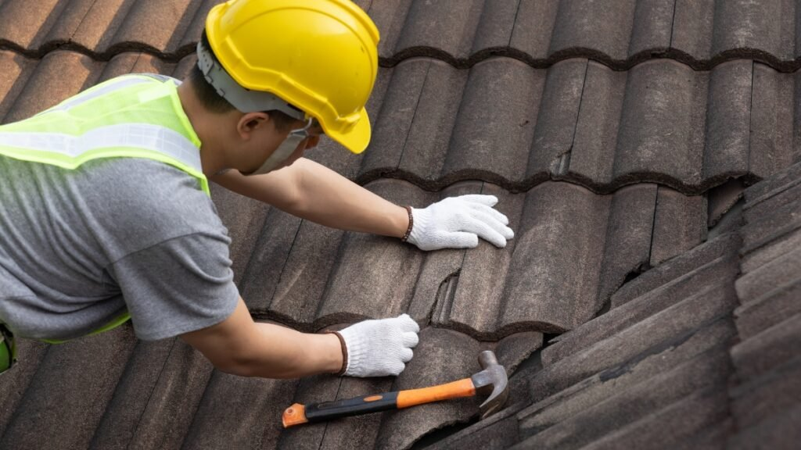

Nada abala mais a harmonia de um lar do que o som de uma goteira inesperada ou a visão de uma mancha de infiltração no teto daquela sala que você decorou com tanto carinho. Aqui no **Irenes**, acreditamos que o verdadeiro bem-estar começa com a tranquilidade de saber que o nosso refúgio está seguro e protegido.

Para garantir que o seu santuário permaneça seco, seguro e acolhedor, o **telhadista** é o profissional indispensável. Neste guia, vamos te ajudar a entender quando chamar esse especialista e como escolher o melhor profissional para cuidar do topo do seu mundo.

## **O que faz um telhadista e por que ele é essencial para sua paz?**

O telhadista é o artesão especializado na construção, manutenção e reforma de telhados. Ele não apenas coloca telhas; ele garante o **isolamento térmico, a vedação e o escoamento correto das águas da chuva**.

Para nós, mulheres que cuidamos de cada detalhe da casa, entender o papel desse profissional é fundamental para evitar gastos excessivos com reformas emergenciais que interrompem nossa rotina e trazem estresse desnecessário.

## **Sinais de que o seu refúgio precisa de atenção profissional**

Muitas vezes, os problemas no telhado são silenciosos até que se tornem urgentes. Fique atenta a estes sinais:

### **Goteiras e manchas no teto**

Se após uma chuva você notar manchas amareladas ou estufamento na pintura (as famosas bolhas), a água já ultrapassou a barreira do telhado. Um telhadista pode identificar se o problema é uma telha porosa ou uma falha na impermeabilização.

### **Telhas deslocadas ou quebradas**

Fortes ventos ou mesmo a passagem de animais podem tirar telhas do lugar. Uma única peça fora do eixo é a porta de entrada para umidade que danifica o madeiramento do telhado.

### **Calhas entupidas ou com vazamento**

As calhas são as "veias" do seu telhado. Se elas estiverem obstruídas por folhas ou sujeira, a água transborda para dentro das paredes ou do forro, comprometendo a estrutura e a estética da sua casa.

## **Como escolher um bom telhadista: Segurança para você e sua casa**

Contratar alguém para trabalhar acima das nossas cabeças exige confiança. Para manter a sua paz de espírito, siga este checklist de **E-E-A-T (Experiência e Confiabilidade)**:

1.  **Peça Referências:** Um bom profissional tem um histórico de clientes satisfeitas. Não hesite em perguntar em grupos de vizinhos ou amigas.
    
2.  **Segurança em Primeiro Lugar:** Verifique se o profissional utiliza Equipamentos de Proteção Individual (EPIs). A paz no lar também passa pela segurança de quem trabalha nele.
    
3.  **Orçamento Detalhado:** Fuja de quem dá preços "de cabeça". Um especialista sério avalia a estrutura, as calhas e o estado das telhas antes de passar um valor.
    
4.  **Especialidade:** Pergunte se ele tem experiência com o seu tipo específico de telha (cerâmica, concreto, fibrocimento ou ecológica).

## **Manutenção Preventiva: O segredo para um lar sempre harmônico**

A filosofia da **Irene** é a prevenção para cultivar a harmonia. Não espere a tempestade chegar para lembrar-se do telhado.

-   **Visitas Semestrais:** Peça uma revisão antes do período das chuvas.
    
-   **Limpeza de Calhas:** Essencial após o outono para remover folhas secas.
    
-   **Impermeabilização:** Pergunte ao seu [telhadista](https://telhadistas.tec.br) sobre produtos que aumentam a vida útil das telhas, evitando a proliferação de fungos e limo.

## **Conclusão**

Cuidar do telhado é um ato de amor pela sua casa e por quem vive nela. Quando o topo da casa está em ordem, você pode focar no que realmente importa: decorar seu espaço, cuidar da sua pele e desfrutar de momentos de silêncio e gratidão.

Lembre-se: ser a guardiã da paz no seu lar também significa saber a hora de contar com mãos especialistas.

**Dica Extra da Irene:** Guarde sempre algumas telhas de reserva do mesmo lote da sua construção. Isso facilita pequenas trocas rápidas e mantém a estética perfeita do seu telhado!
