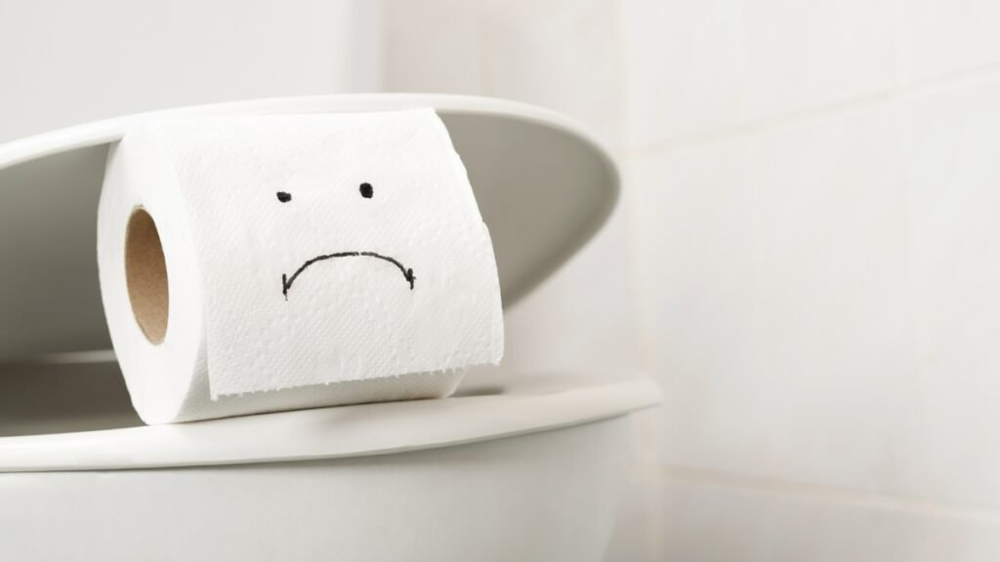

Um dos imprevistos mais desagradáveis em um lar é o **vaso sanitário entupido**. Além do desconforto visual e do odor, essa situação quebra imediatamente a harmonia e o fluxo da casa. No **Irenes**, acreditamos que cuidar da casa é uma forma de autocuidado, e resolver esses pequenos "caos" com serenidade é o segredo para manter um ambiente pacífico.

Se você está passando por isso agora, respire fundo. Antes de chamar um profissional, existem métodos seguros e eficazes que você mesma pode aplicar. Neste guia, vamos te ensinar **como desentupir o vaso sanitário** de forma prática e sem bagunça.

## **O que causa o entupimento?**

Antes de agir, é importante entender o motivo. Geralmente, o problema ocorre por:

-   Excesso de papel higiênico.
    
-   Objetos descartados indevidamente (absorventes, lenços umedecidos).
    
-   Acúmulo de detritos orgânicos.

## **1\. O Clássico: Água Quente e Detergente**

Este método é ideal para entupimentos leves causados por detritos orgânicos ou excesso de papel. O detergente ajuda a lubrificar a tubulação, enquanto a água quente quebra as gorduras.

-   **Como fazer:** Despeje um pouco de detergente líquido no vaso. Em seguida, jogue um balde de água quente (não fervendo, para não danificar a porcelana). Deixe agir por 15 minutos e tente dar a descarga.

## **2\. A Dupla Dinâmica: Bicarbonato de Sódio e Vinagre**

Fiel ao nosso estilo de limpeza natural e menos agressiva, essa mistura química caseira cria uma efervescência que ajuda a desintegrar obstruções.

-   **Como fazer:**
    
    1.  Coloque **1/2 xícara de bicarbonato** no vaso.
        
    2.  Adicione **1/2 xícara de vinagre branco**.
        
    3.  Espere a reação química (a espuma) agir por cerca de 20 minutos.
        
    4.  Finalize com água quente.

## **3\. Pressão com Filme Plástico (O Método do Vácuo)**

Este é um segredo de ouro para quem quer **desentupir o vaso sem sujeira**. Ele utiliza a pressão do ar para empurrar a obstrução.

-   **Como fazer:** Seque bem a borda externa do vaso. Cubra o assento com várias camadas de filme plástico (ou um saco plástico resistente), garantindo que não haja frestas para o ar sair. Feche a tampa e sente-se em cima (ou pressione com as mãos) para garantir a vedação. Dê a descarga. O vácuo criado empurrará o que estiver trancando a passagem.

## **4\. O Desentupidor de Garrafa PET**

Se você não tem um desentupidor de borracha em casa, pode improvisar um com material reciclado. É sustentável e muito eficiente.

-   **Como fazer:** Corte o fundo de uma garrafa PET de 2 litros. Encaixe um cabo de vassoura no bico da garrafa (prenda com fita, se necessário). Use o fundo cortado para fazer movimentos de pressão (sucção) no fundo do vaso.

## **5\. Quando o Problema é Persistente: O Arame**

Se você suspeita que um objeto sólido (como um brinquedo ou um frasco de perfume) caiu no vaso, o ideal é tentar "pescar" ou empurrar com cuidado usando um cabide de arame desdobrado.

**Dica de Ouro da Irene:** Sempre use luvas de borracha e mantenha o ambiente ventilado durante o processo. A sua segurança e bem-estar vêm em primeiro lugar!

## **Quando chamar um profissional?**

Se você tentou todos esses métodos e a água continua subindo ou não desce, pode haver um problema na rede de esgoto principal do prédio ou da casa. Nesse caso, para não estressar a sua rotina, o melhor é contratar uma [**empresa desentupidora especializada**](https://desentupidoraem.com.br/d/).

### **Conclusão: Harmonia Reestabelecida**

Resolver problemas domésticos de forma autônoma nos traz uma sensação de empoderamento e tranquilidade. Esperamos que essas dicas ajudem você a devolver a paz ao seu santuário!

**Gostou dessas dicas?** Compartilhe com uma amiga que também valoriza um lar organizado e em harmonia. E não esqueça de conferir nossa seção de **[**[**Organização da Casa**](/categoria/casa/)**]** para evitar que outros imprevistos aconteçam!
